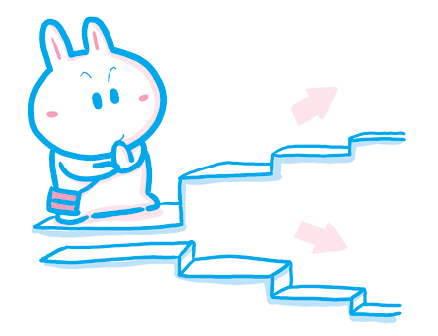
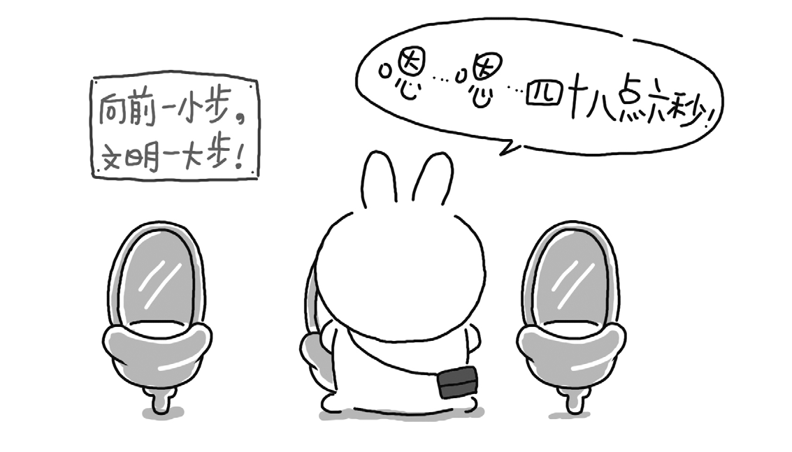
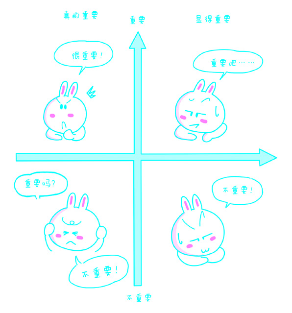
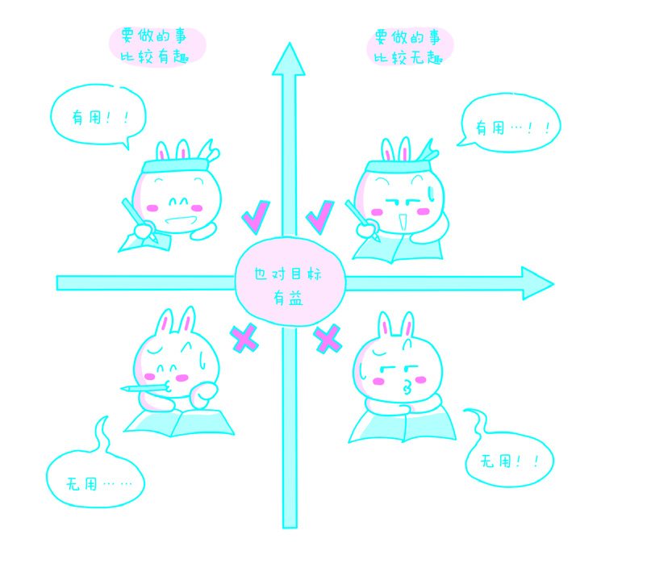
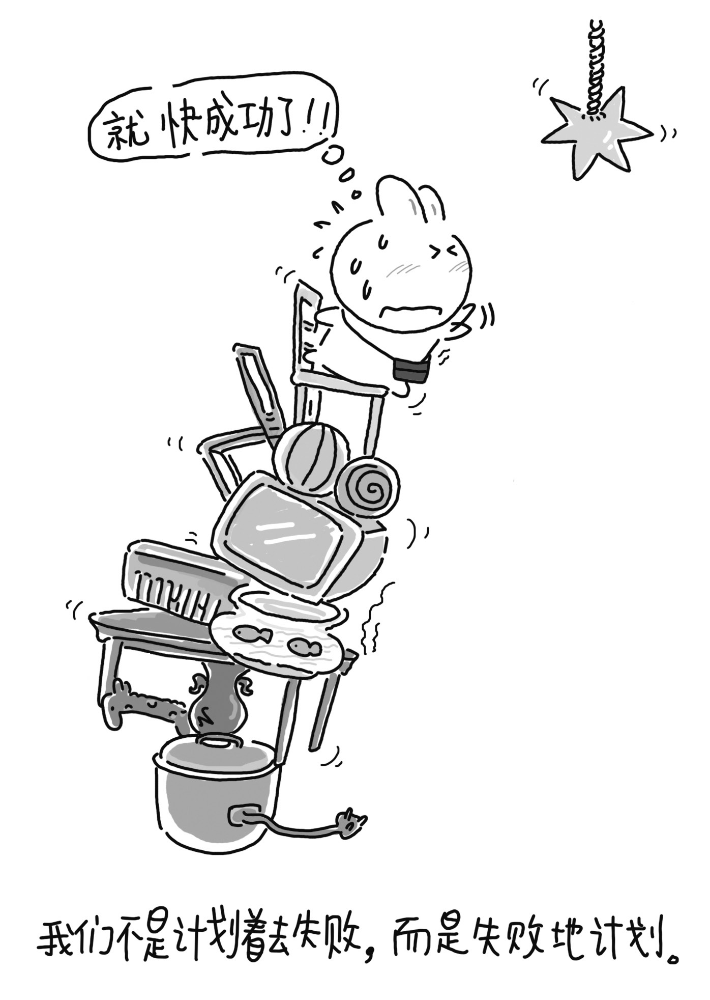
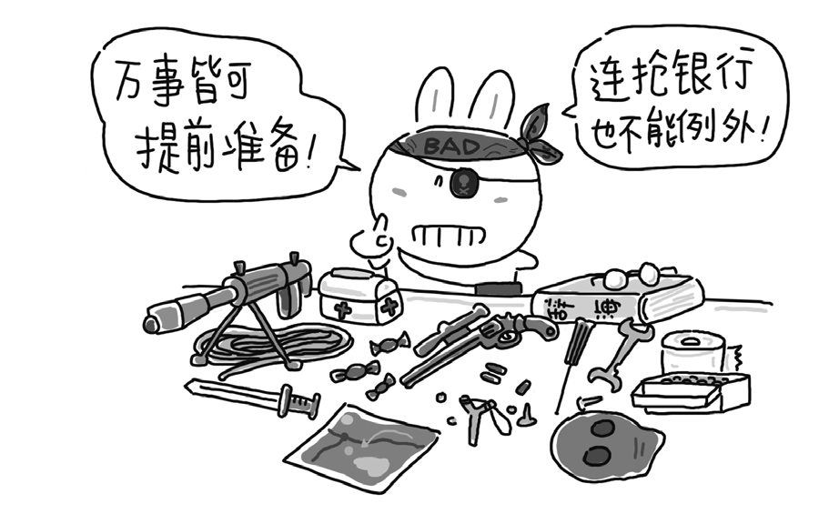

# 第三章：管理

## 1. 估算时间

错误估算任务所需时间，是最常见，也是最致命的错误。在时间领域有一个与[墨菲定律](http://goo.gl/nQBUr)同源、但貌似悖论的[侯世达法则](http://goo.gl/EBC2g)值得牢记：

> 完成一个任务实际花费的时间总会超过计划花费的时间，就算制定计划的时候考虑到本法则，也不能避免这种情况的发生。

为什么完成任务实际花费的时间总会超过预期呢？先来看看生活中执行任务的真实情况。

> 每个学英语的人都遇到过几乎一模一样的尴尬——什么时候是个头啊？！一开始，学习者往往以为自己的问题只是词汇量不够，便买来各种词汇书啃啊啃，可很多人啃着啃着就放弃了……
>
> 背单词书是非常反人类的事情，人类大脑本就不适合大量记忆列表，尤其是列表中的项目毫无逻辑联系的时候。所以，坚持不下去才正常。
>
> 而少数坚持下来的人却痛苦地发现，即便每个单词（好像）都认识，放到一起组成句子之后还是看不懂。他们这才明白，原来“不学语法也能学好英语”纯属扯淡，只好买来语法书狂啃，又有很多人啃着啃着就放弃了……
>
> 少数坚持下来的人再次痛苦地发现，补过词汇，补过语法，依然看不懂文章。他们深入思考才明白，原来是因为自己的逻辑训练不足，文字是搞懂了，可内容却理解反了，只好一边练逻辑一边啃阅读，又有很多人啃着啃着就放弃了……
>
> 少数人又坚持下来了。再过一段时间，他们发现自己单词没问题、语法没问题、逻辑没问题，可还是看不懂文章。最终才明白，这是各种知识积累不够造成的，这些知识包括学科背景、文化背景、历史背景等。于是，他们又要开始“新的”征程……

这就是人们做事时的真实境遇：一旦开始，就会发现“意外”接踵而至。原本做的准备根本不能解决问题，因为“经过准备的就不再是问题”，而真正遇到的问题个个都是之前不曾想象抑或无法想象的，解决一个问题的同时往往会产生新的问题……因此，所谓“渐入佳境”最终只能是少数人的感受，大多数人在此之前早已溃败。

为什么人们总是错误估计完成任务需要的时间呢？因为 大多数人在执行任务之前忽略了一个重要的步骤，那就是分辨任务的属性——它是熟悉的还是陌生的呢？

有些任务是你所熟悉的，即以前曾经做过的。由于已经做过一次（或多次），所以，你清楚地了解该任务的每一个环节，知道应该如何拆解任务、应该怎样分配拆解出来的子任务、每一个子任务有多少个步骤、每一个步骤需要耗费多长时间、哪些步骤需要格外小心……在这种情况下，正确估算完成任务需要的时间是很容易的。

然而，有些任务是你所陌生的，那么在执行过程中就必然会遭遇各种所谓的“意外”。其实它们根本不是意外，只不过是因为你对任务不熟悉，它们才成为了“意外”。实际上，这些“意外”是任何完成该任务的人都必然会经历的事情。 只有完整地执行一次任务，该任务的属性由“陌生”变为“熟悉”之后，才有可能顺利解决这些“意外”。

对学习来说，任务“陌生”的可能性更大，因为学习本身是一个探索未知的过程。完成学习任务常常需要花费比我们想象中多得多的时间。对工作来说，任务“熟悉”的可能性更大。因为工作本身是一个应用已知的过程。当然，不同的工作，情况还是有所不同。例如，有些工作需要更多创新，有些工作可能前所未有……所以，在现实生活中，我们需要完成的任务的真实属性往往是“一部分熟悉，一部分陌生”。这就从根本上解释了为什么前文描述的那个貌似悖论的法则总是应验——我们必须处理未知，而从陌生到熟悉，就需要花费时间去学习，这个过程无法逾越。

多年前，我在网上读到[彼得·诺维格](http://norvig.com)的一篇文章：[《十年学会程序设计》](http://goo.gl/Sn6U)（[*Teach Yourself Programming in Ten Years*](http://goo.gl/Z5Nv)）。在这篇文章中，诺维格表示，人们购买那种名字类似“7天自学Java语言”的书是无知的表现，他认为，用10年时间学习程序设计才真正现实，也非常值当。

> [约翰·海斯](http://goo.gl/EhyNG)的研究（[The Complete Problem Solver](http://goo.gl/VoWFa)）和[本杰明·布鲁姆](http://goo.gl/MVuAU)的研究（[Developing Talent in Young People](http://goo.gl/n3g4k)）表明，几乎在所有领域，培养专业技能大约需要10年。他们研究的领域包括国际象棋、作曲、绘画、钢琴、游泳、网球以及神经心理学、数学拓扑学。似乎没有真正的捷径——即使是在4岁时就展露音乐天赋的[莫扎特](http://goo.gl/Ftsql)，也仍然用了超过13年的时间才谱写出世界级的乐曲。
>
>再看看另一个领域的例子。[披头士乐队](http://goo.gl/cQQTF)似乎是于1964年在[爱德·沙利文秀](http://goo.gl/Jfd9a)登台后突然火爆起来并成为第一乐队的，但他们其实从1957年就开始在利物浦、汉堡等地的小型俱乐部表演了。虽然他们很早就显现出了强大的吸引力，但对他们的成功具有决定意义的作品《佩珀中士（Sgt.Peppers）》也是1967年才发行的。
>
>[塞缪尔·约翰逊](http://goo.gl/yQj9l)甚至认为10年还不够，他说：“任何领域的卓越成就都必须用一生的努力才能取得；稍微低一点代价都无法换来。”[杰弗里·乔叟](http://goo.gl/X9oFM)则感叹：“生命如此短暂，学习技艺需要的时间却如此绵长。”	 

在彼得·诺维格发表这篇文章的数年后，2008年11月，[马尔科姆·格莱德威尔](http://goo.gl/JRH2y)出版了[《异类》](http://goo.gl/YndkQ)一书。在这本书中,格莱德威尔把“10年”换算成了更为精确的“10000小时”——想要出类拔萃，就要努力至少10000小时。

要想提高估算时间的能力，就要从现在开始养成习惯：做任何事情之前先判断其熟悉程度（或陌生程度），再据此判断估算完成任务所需要的时间。通常情况下，“反正比一般人想得长多了”倒是一个屡试不爽的假设。

## 2. 及时行动

接受任务之后，什么时候开始执行才好呢？比“越早开始越好”更切实的答案是“现在就开始”。所谓做事拖延，不是拖延着做事，而是拖延着不开始做事。明知自己拖延的人很痛苦，因为他们不是不知道该做什么，而是不知道为什么“无法进入状态”——这是他们能够想出来的对自己的行为最拿得出手的描述。

明明已经焦虑到不行，拖延的人为什么迟迟不开始行动？一个常见的原因是前文所述的“错误估算任务所需时间”， 总以为可以在最后期限之前完成，心里想着“时间还多的是 嘛！”可这并不是本质原因。本质原因在于恐惧——无论是来自内部的，还是来自外部的。

来自内部的恐惧在于：只要开始做事，一个人就要面临做错、做不好的风险。这原本是任何人都逃不掉的事情，但最终患上“拖延症”的人犯了一个简单的认知性错误，即认为那些能够做对、做好的人都是直接做对、做好的。从表面上看也好像确是如此。那些能够做对、做好的人，总是显得从容不迫、轻车熟路。面对这样的人，那些犯了错、做不好的人根本没办法不自卑、不怀疑自己……

所以，很多人做事拖延的原因不过是“不求有功，但求无过”的想法。没有哪一个拖延的人愿意承认自己是这样想的，但当他们扪心自问的时候，他们都知道这描述一针见血。

只要做事，就一定会出问题。这是现实。无论何人，无论何事。如果在做事的过程中没有出现任何问题，那肯定不是在做事，而是在做梦。

认清并接受这个现实很重要。只有这样，才能心平气和地去做事。说一个人不怕困难，那是假话。谁不想一帆风顺、马到成功？可现实就是如此。做事情的时候，肯定会遇到困难，事情越有价值，困难就越具规模。遇到困难的时候，心平气和地面对就好，因为这只不过是生活常态。有时我们花费了很多时间和精力依然没能解决问题，却眼见别人轻松过关，这确实令人气馁。不过，这也是生活常态——在任何一个特定领域，总有一些人比另一些人表现更好、费力更少。然而，在大多数情况下，有4个字颇具道理并且值得相信——勤能补拙。不过，真正相信这4个字的前提是“接受现实”，否则，这4个字发挥不了任何实际作用。

来自外部的恐惧在于过分在意外界的评价。人是一种很有趣的动物，在自己做对、做好之前，通常已经了解做对、做好是什么样子。于是，无论能否做对、做好，人都觉得自己有能力判断别人是否做对、做好。所以，尽管自己不怎么样，却可以振振有词、理直气壮地评价别人做得对不对、好不好。所以，一个人一旦开始认真做事，被嘲弄、被耻笑的几率将远远高于被夸奖、被鼓励的几率——这几乎是肯定的。也正是由于这个原因，使很多人怀有前文提到的“不求有功，但求无过”的微妙心态。
事实上，那些真正能够做对、做好的人，绝不会随意嘲弄、打击别人，因为他们是做对过、做好过的人，他们一路走过来，心里非常清楚做对、做好有多么不易，所以，他们会不吝一切机会去鼓励那些尝试做事情的人。这甚至可以当作一种测试方法：如果一个人经常嘲弄他人，那只能说明他自己不怎么样；否则，他会像那些极少数已经做对、做好的人一样，给予别人真诚的鼓励而非嘲弄。尽管那些能真正做对、做好的人有时也会给出负面评价，但这些评价通常是“建设性的负面评价”，并不是为了获得优越感而发出的嘲弄。

所以，我们没有必要在意来自他人的、非建设性的负面 评价。没有谁从一开始就能做对、做好。所有做对、做好的 人都是一路磕磕绊绊走过来的，这就是生活常态。而动辄给 出非建设性负面评价的人，往往不是正经做事的人，他们和 那些正经做事的人身处不一样的世界，这也是生活常态。

还有一个微妙的现象需要注意。尽管在一般的环境中，时间的运动是匀速的，但实际上，就人的主观感受来说，时间的运动肯定是加速前进的。对“为什么随着年龄的增长每个人都会觉得时间过得越来越快”这个问题，心理学家有一个简单明了的解释：

对一个5岁的孩子来讲，未来的1年相当于他已经度过的人生的¹⁄₅，即20%；而对一个50岁的成年人来讲，未来的1年只相当于他已经度过的人生的¹⁄₅₀，即2%。所以，随着年龄的增加，人们会觉得时间运动得越来越快。

更重要的是，人在小时候没什么事情可做，就愈发感觉时间过得慢；随着年龄增加，要做的事情越来越多，当然就愈发感觉时间过得飞快，稍纵即逝。由此看来，小孩子的感觉自然是“那时候天总是很蓝，日子总过得太慢”，而“人生犹如白驹过隙，瞬间而已”大都是老年人的慨叹，也是他们的切身感受。

如果能将这种认识纳入自己的心智，你就不会再对“最后期限”有那么荒谬的幻觉了。只要接受了必须完成的任务，你就会有真切的紧迫感，因为你知道，时间必然越走越快。而且，你现在就已经明白：“最后期限”不是固定在将来的某一点，而是朝着你加速扑来。有的时候，也许还没开始就发现自己已经晚了。在这样的情况下，唯一的策略依然是“现在就开始”。否则更待何时？在起步晚了的情况下，问题不是“到时候能不能做好”，而是“到时候能做多好就做多好，总好过什么都不做”。明白了这个道理，不管遇到什么任务，永远不要再问“什么时候开始才好”，因为答案只有一个：“现在”！

## 3. 直面困难

就算没有低估完成任务所需要的时间，就算已经按时开始执行任务，很多人还是没有按时完成任务。为什么有的人好像一直在忙，却总是拿不出成绩、做不出成效？其实，工作中经常会遇到这样的人，读书的时候也不例外——上学时总有一些天天笔不离手、眼不离书、屁股不离板凳，成绩却很差的学生。这种情况的存在往往会使人们不禁怀疑“努力”的可靠性。还好，仔细观察就会发现，他们实际上并不努力，只是做出了努力的样子，或者显得比较努力而已。

无疑，他们的效率低下。而效率低下的根本原因是什么？答案是：回避困难。

任何一个任务都可以划分为两个部分，即相对简单的部分和相对困难的部分。如果世界上的任务都是由简单的部分构成，全无困难之处，那就没有人会遇到挫折或者遭受失败了。可现实明显并非如此。

稍微思考一下就能明白，合理的时间安排应该是这样的：迅速做完简单的部分，把节约出来的时间放在困难部分的处理上。然而，很多人会下意识地回避困难，于是乎，他们的时间安排是这样的：用几乎全部时间处理简单的部分，至于困难的部分，干脆“掩耳盗铃”，视而不见，暗地里希望困难自动消失……

这样的行为与做事的动机有关。人做事的动机往往来自两个截然相反的原因：奖励与惩罚。人都喜欢被奖励，讨厌被惩罚。从最浅的层面上看，尽力做能够获得奖励的事情显然是划算的，回避做可能招致惩罚的事情显然是合理的。然而，从另一个层面上看，接受惩罚往往是积累经验的起点，甚至是唯一的起点。这就是俗话所说的“吃一堑，长一智”。很多时候，为了能够“长一智”，必须先“吃一堑”，西方称之为“挫折教育”。

很多事情并不是一过性的，总会阶段性地有奖有罚。受到奖励之后，原本有两个选项：“再次来过”和“见好就收”。有意思的是，绝大多数人会自动忽视第二个选项（这也是“[庞兹骗局](http://goo.gl/rc8SQ)”生生不息的根本原因）。受到惩罚之后，同样有两个选项：“从此碰都不碰那件事情”和“挣扎着找一个出路”。同样有意思的是，绝大多数人还是会自动忽视第二个选项。

所以，很多人实际上根本不知道自己所谓的“喜欢做某件事情”很可能只是因为那件事情相对简单、容易获得奖励而已。拖延的人并非不做事，他们做事，甚至做很多事。拖延的人也并非不努力，他们会花很长时间去做事，但做的只是很多简单的事。他们每次回避困难的时候，都不是故意的，并且往往已经给自己找了恰当的借口。这借口太强大、太有力，以至他们真诚地相信：“我喜欢做有创意的事情，而现在手上的这些事情太枯燥，我确实提不起兴趣……”

如果不能控制这种逃避的倾向，再多、再好的任务管理技巧都是无效的，因为任务中相当重要的一部分（通常因为重要而困难，也因为困难而重要）永远无法完成。所谓效率，是在任务完成之后才能够衡量的。这样看来，对逃避困难的人来讲，因为没有完整地完成任务，所以无论他们花了多长时间，也都没有效率（相当于分子为零）。

现实中，这种现象无处不在。比如学习上，准备托福考试时只做阅读和听力但不练习口语和写作；比如工作上，做项目计划时只讨论做什么却从不提及怎么做；比如生活上，总是把“我爱你”挂在嘴边却从来不花时间想想恋人真正需要的是什么……这些问题都源自同一个习惯：专做简单的，回避困难的。

所有真正踏实做事的人都知道，任何任务的绝大部分都是枯燥而又无趣的，所谓有创意的部分，可能连1%都不到。对此，我有切身体会。

我的词汇书《TOEFL核心词汇21天突破》这些年一直卖得很好。最初我花了多长时间写这本书呢？9个月。这本书最重要、最核心、最有创意的部分是什么呢？是通过语料库分析统计词频后再反复筛选出来的托福考试中出现2次以上17次以下的核心词汇。完成这些工作需要多长时间呢？收集和处理语料库文本大约花费1个月，词频统计工作由WordSmith软件完成——只用了几十秒。那么，剩下的8个月我在做什么？在做最没有技术含量、最枯燥、最无聊的复制、粘贴、编辑、整理、审阅、修改、回顾……

> 出现次数非常多的单词属于大部分人已经掌握的常见单词，例如sea、stone、sky等，基本都不用特意去背；而出现次数很少的单词，例如那些在20多年的考试当中只出现过一次的，根据概率理论，它们在下一次考试中出现的可能性极低，所以也不用专门投入时间去记忆。

## 4. 关注步骤

所谓“三思而行”在我看来就是指做任何事情之前都要考虑相关的3个方面：内容（What）、原因（Why）、方法（How）。任何任务都起码具备3个属性：何事（What）、何因（Why）、何法（How）。清楚了解一个任务的这些属性，对最终能否完成该任务起着决定性的作用，所以应该多花一点时间去“三思”。

在大多数情况下，这3个方面中最为关键的实际上不是内容，也不是原因，而是方法。因为任务的内容与原因常常不言自明，而方法却并非唾手可得。例如，每个年轻人都可能有发财梦，为什么几十年后做过梦的大多数人依然不富裕？比较合理的解释可能是：大多数人都知道自己究竟想要得到什么，也知道为什么要得到，却始终没弄明白怎样做才能得到。

所以，当我们面对某项任务的时候，内容与原因都已经基本确定了（至少表面上看是如此），需要思考的就剩下方法了。当然，思考方法需要从领悟内容入手，不停地细分、拆解任务，而且越具体越好，直至每个小任务都可以由一个人独立完成。

背英语单词可以作为一个例子。

如果某位学生正在准备托福考试，而且已经意识到他的任务是扩充词汇量，那么他该去背哪些单词？书店里有很多词汇书，他应该选择哪一本？正确答案是：视情况而定。哪怕先假定市面上的托福词汇书都是以合理的方式收录词汇，并且确实科学、准确地涵盖了应对托福考试的必要词汇，这些书也不一定是该考生的选择。如果目前他的基础词汇量很可能相对不完整，那么他应该先想办法搞定基础词汇，再去买托福词汇书中的某一本。

这就是在回答“何事”的问题。这个问题往往不像看上去那么简单。

现在假设这位考生已经搞定了基础词汇，又选择了我写的那本[《TOEFL核心词汇21天突破》](http://goo.gl/9r1Oc)，那么他所面对的任务的“内容”就比较具体了。但是，还可以再具体一点：

> 2007 年我开始着手写另外一本词汇书：《新TOEFL iBT词汇分类突破》。先是在网上公开，历经三年修订，无数学生试用之后，正式出版。
>
> 扩充词汇量→托福词汇→托福核心词汇→21个单元→每个单元大约 100 个单词→一个单元分2次完成……

在这个过程中，对任务的每一次“具体化”与“细分拆解”都要反复询问“原因”。但这还不是很难。

有了这样的结果，就可以开始思考“方法”了。很多人在这个时候会觉得已经没什么可想的了，直接去做就是了，很可能正因如此，他们在其后的实际操作中才会显得那么脆弱、承受力那么差，以至那么容易放弃。

继续讨论上文的例子。假设这位学生根据自己的情况，已经决定将“一个单元分两次完成”，也就是说，21乘以2，总计 42 个阶段。那么，在这42个阶段里他应该具体如何操作呢？

> ▷ 先尝试做一两个阶段，测量一下完成一个阶段需要多长时间。
>
> ▷ 按照测量的结果制作一个时间表，把其余若干个阶段所需要的时间填写完整（最终总是需要做一些调整的）。
>
> ▷ 背单词需要重复，所以，每3个阶段过后要留出与完成1个阶段相等的时间去复习。这就意味着一共需要花费完成56（42+14）个阶段的时间。
>
> ▷ 每完成总任务的1/3，就增加与完成1个阶段相等的再复习时间。这就意味着一共需要花费完成59（56+3）个阶段的时间。
>
> ▷ 学习过程中可能需要多次快速重复记忆，每次可能相当于完成3～5个阶段所需要的时间。由于熟悉程度的不断增加，每次重复记忆所需要的时间会越来越短，所以，预计进行3次重复记忆需要相当于10个阶段的时间。这就意味着一共需要花费完成69（59+10）个阶段的时间。

做出以上规划后，还要认真思考完成每个阶段的具体步骤。当然，越具体越好。

> ▷ 每天早晨腾出一点时间。
>
> ▷ 把前一天背过的单词朗读至少 2 遍。
>
> ▷ 听录音，跟读当天要背的单词3～5遍，主要关注发音、拼写，顺带看看词义，能记多少就记多少，不求速成。
>
> ▷ 上午利用闲暇时间通读词汇列表，并反复阅读例句。
>
> ▷ 下午用专门的时间把当天要背的单词集中背2～3遍。可以一边读，一边抄，一边背，不要只是坐在那里呆呆地盯着词汇看。
>
> ▷ 空闲的时候反复听当天要背的单词，重复次数越多越好。
>
> ▷ 晚上睡觉前复习当天背的单词。

有了这种思考，随后的一切行动会因此变得相当容易。

做任何事情，学会思考方式最为重要。

要学着像一个<u>项目管理者</u>那样思考——他们更多地关注“方法”，他们会花费比别人更多（多出许多倍）的时间去落实每一个步骤，在确认无误之后，他们才会有效地分配任务，团队才能够切实可靠地完成任务。一个学生在背单词的时候，他就是自己的项目主管，只有学会像项目管理者一样思考，他才能给自己分配具体的任务、制定切实可行的计划，最终高效地完成任务。

> 每个人都有必要阅读项目管理方面的经典书籍。也许你并没有“项目经理”之类的头衔，但，实际上，每个人都应该是自己的项目经理——自主、独立，是心智成熟的人必有的素质。

在做任何事情之前，通过关注“方法”去反复拆分任务，最终确认每个子任务都是可完成的，这是一个人不可或缺的功课。这样的习惯，会使一个人变得现实、踏实。这是一种习惯，也是一种后天习得的技能。这种技能无比重要，却常常被忽视，因为掌握这种技能的人总是默默地应用它，而忽视这种技能的人从未看到过它的具体实施过程和巨大好处。

## 5. 并行串行

读中学的时候，我们就在物理课上得知电路有两种基本连接方式：串联和并联。此外，我们还背过一些相关的规律，如<u>“串联分压、并联分流”</u>。在任务管理的过程中，可以运用类似的方式去思考任务与任务之间的关系：这两个任务之间究竟应该是串行关系，还是并行关系？

> 无论学到了什么东西，都可以接着问自己：“那……这个道理还可以运用在什么地方？”反复问自己这种简单问题，能够锻炼自己融会贯通、举一反三的能力。尽管总是有人劝诫“速成没戏”，但还是有人宣扬各种速成的方法，并且信者大有人在，宛若“野火烧不尽，春风吹又生”。为什么呢？上过中学的人都应该明白“省功不省力、省力不省功”的物理原理啊！其实，这些人缺乏的就是这种思 考能力或者说思考习惯。

这个问题非常重要，因为在一般情况下，“提高效率”指的就是“原本只能串行完成的两个任务现在可以并行完成”。有些任务只能串行，例如要先洗手再吃饭。“洗手”和“吃饭”，不仅是串行关系的任务，还是顺序确定的任务。尽管确实有人真的“不洗手先吃饭而后再洗手”，但是大多数人还是能够看到这么做事的明显荒谬之处，而且，我们没办法也没必要“边洗手边吃饭”。

俗话说“一心不可二用”，从某种意义上理解，这句话是正确的。不过我们也确实很难做到一心一意地长期只做一件事，事实上，我们要做的事情随时随刻都可能不少于两件。一些早期的计算机操作系统，如微软的DOS，是单任务操作系统；为了提高效率，程序员们又开发出了多任务操作系统，如现在的 Windows。从某种意义上说，为了提高效率，我们也有必要为自己的大脑打造一个“多任务操作系统”。

最直接的办法是尽量将两个任务并行。比如，在跑步的时候听英语，在写文章的时候听音乐，在等班车的时候看书等。

养成一个习惯——把要做的事情用纸笔写出来，把任务落到纸面上，就可以比较容易地分辨出哪些任务是简单而又机械的，哪些任务是相对复杂而又灵活的（对我个人来讲，需要思考的就是“非机械”的），然后，尝试把一个非机械的任务和一个机械的任务搭配起来完成。

举两个我自己的例子。

跑步是机械的，听有声读物（Audiobook）是非机械的（相对需要集中更多注意力），<u>这两件事情就可以一起做</u>。另一个例子是在我写文章的时候往往同时听着音乐，甚至在另外一块屏幕上放着电影。我可以这么做是有前提的：我的电脑接了两台显示器，并且都是25英寸宽屏。在这种情况下，即使同时播放两部电影，我的屏幕上还是有足够的空间。另一个我可以这么做的原因是我看过的电影太多（这两年是每天至少一部），以至于我对电影的理解能力非常强（就好像文章读多了阅读理解能力就会很强一样），大多数电影我只需要间或扫一下就可以，而且不会错过重要的细节。但是，对一些比较特别的电影，如[《福斯特对话尼克松》](http://goo.gl/7avpp)、[《朗读者》](http://goo.gl/Tyjj0)、[《革命之路》](http://goo.gl/RVe3Th)，还有一位读者推荐给我的[《是，大臣》](http://goo.gl/lSVlZ)等，我就做不到边写文章边看，而是需要停下手中的事情专心地看。

> 现在，几乎所有的健身房都在跑步机前摆放了一台电视，只不过电视节目很无聊而已。

并行两个任务的一个重要前提是执行者足够了解这两个任务，且对自己有足够清楚的认识，即，对执行者来说，这两个任务是“主动并行”的。被动发生的并行任务往往只能使效率变得更为低下。我在生活中生生剔除的一个被动并行任务就是“接电话”。从好多年前开始，我就把自己的手机设定为“静音”状态，从不主动接电话——而是每隔一两个小时查看一下电话，有必要的就打回去。当我有条件给自己安排一间不受人打搅的“工作室”后，终于再一次大幅消减了“被动并行”造成的时间和精力的浪费。

当一个任务比较庞大，需要划分为多个步骤或者多个子任务的时候，对这些子任务之间的关系需要仔细甄别。甄别后，可能会因此产生若干个行动方案，而针对这些方案可能还需要反复衡量才能找到最佳方案。

华罗庚先生曾经用<u>烧水泡茶</u>为例说明过这个问题。

> 烧水泡茶：参见《统筹方法平话及补充》，华罗庚著，中 国工业出版社，1966。
>
> ▷ 办法甲：洗好水壶，灌上凉水，放在火上。在等待水开的时候洗茶壶、洗茶杯、拿茶叶。等到水开，泡茶喝。
>
> ▷ 办法乙：先做好一些准备工作，包括洗水壶、洗壶杯、拿茶叶。一切就绪，灌水、烧水，坐待水开了泡茶喝。
>
> ▷ 办法丙：洗净开壶，灌上凉水，放在火上，坐待水开。水开了之后急急忙忙找茶叶、洗茶壶、茶杯，泡茶喝。

哪一种办法更省时间呢？

谁都能看出第一种办法好。原因很简单：有些任务被并行处理了。可以如此优化的前提是“大任务被划分成足够多又不太多的小任务”。有了这样的前提，你才有能力分辨哪些任务可以并行——所谓的“优化”，其实是很简单的。

如果不做划分——事实上大多数人真的如此——那么就只有一个任务，那就是“喝茶”。然而，如果能粗略划分一下的话，就知道起码可以划分为两个子任务，也就是“烧水”和“泡茶”。但这样还不够，因为划分之后的两个子任务是串行关系，先后顺序明了，没有可以优化的余地。如果再继续划分子任务的话，就得找出有“并行”关系的任务，进而提高效率。

在麦当劳之类的快餐店中排队也会涉及串并行问题。有很多人是轮到自己的时候才抬头看柜台上面的菜单，再花很长时间做出选择，而实际上，完全可以把“排队”和“选菜”并行，这样的话，轮到自己的时候只需几句话就可以端着菜去吃了。有一次我为了观察特意排了个10人长队，结果没有一个人不是在轮到自己的时候才开始选菜。有过这样的经历，我就决定以后除非无须排队或者排队的人很少，否则我绝不在类似的餐馆吃饭，不然会被迫浪费时间。

让自己拥有“多任务操作系统”的另一个方法就是切分自己的时间。从本质上说，我们的大脑与计算机的中央处理器（下文简称为“处理器”）一样，是个一次只能处理一项任务的系统。那么，计算机究竟是如何做到同一时间处理多项任务的呢？（没有多任务处理机制，就无法实现如今人人都习以为常的多视窗操作系统。）

<u>一个处理器在一个时间段内其实只能做一件事</u>，因为它只有一个个体、一个时空。而多任务操作系统把一个长时间段划分成很多短小的时间片，每个时间片只让处理器执行一个进程（Process）——尽管同时可能有多个进程需要处理。在第一个时间片里，操作系统让处理器处理A进程；时间片的时间用完之后，无论A进程处理到什么程度，都要被“挂起”（即，A进程这时不能再占用处理器资源——尽管它还是被允许使用计算机的其他资源，如内存、磁盘、屏幕输出等）；在第二个时间片里，处理器处理的是B进程，时间用完之后，B进程将与A进程一样被中途“挂起”；而后，处理器开始处理下一个进程，比如C进程。把所有任务的一部分依次完成之后，处理器重新循环，从A进程开始顺次处理，直到最后一个进程。循环反复的过程中，有些任务完成了，另一些任务处于尚未完成的状态，如果有新的任务进来，只需要加入循环队列即可。看上去好像是操作系统同时运行着很多进程，而实际上，它靠的是类似视觉暂留现象的机制。

> 现在已有多核的CPU，一个多核的CPU可以看作由多个CPU构成 的“CPU 组”。

在这个机制里，进程不是按照其本质属性被划分为子进程，而是被处理器的时间片硬性划分为进程片。这是关键。

我的健身教练就是一个例子。他非常酷，收取的课时费也很高——因为他就是比其他教练教得好。他的工作方式可以很好地说明上述“关键”。例如，我约他下午三点至四点半之间锻炼，结果有一天我迟到了（四点才到），那么他会一言不发地马上开始上课，四点半（我刚刚上了半小时课）的时候，他会说：“到时间了，下课。”可收取的费用还是一个半小时的费用。这位健身教练是有效率的。因为他的能力强，所以课排得满，所以他必须准时下课才能不耽误下一位客户的时间。之所以说他酷，是因为即便接下来的时间里他没有课，他也不会延长那一个小时。事实上，尽管会有一些人觉得他“不通情理”，但这确实是无可挑剔的做法。这样的做法可以非常有效地减少一种令人恼火的情况——因其他人的错误而耽误自己的时间。

把自己的时间切分成“时间片”是一种很难习得的能力，我花了两三年时间才开始感觉自己可以相对自如地运用这种能力。不过这种能力在大多数时候用不上，只有在任务太多、时间太紧的情况下，我才使用这种能力。应用这种能力时，要先坐下来制定一个工作列表，把任务罗列出来，然后把自己的时间“切片”。我通常把“20分钟工作+5分钟休息”作为一个时间片，然后就开始像处理器一样处理任务。这样做可以保持相对长时间的高效率工作。

尽管说起来很简单，但其实需要反复应用才能把这种简单的思考模式变成习惯。一旦养成精细拆分任务的习惯，效率就会在不知不觉间提高了。

## 6. 感知时间

只有与时间成为朋友，才能真正知道她的宝贵、懂得她的神奇。在这之前，我甚至不知道自己早已把她变成了敌人。挣扎了许多年，还以为自己在与这个世界争斗。突然有一天，我发现自己就像[塞万提斯](http://goo.gl/FYMhi)笔下的那个骑士[堂吉诃德](http://goo.gl/gV5RD)。堂吉诃德有自己的身份标签——“骑士”，于是他有并坚守着符合他那个身份的“骑士精神”。在一次历险中，他把风车当作抗争对象，却无论如何都不明白他的敌人实际上是那看不见的“风”，还有那原本应该隶属于他自己的、却竟然完全不受他控制、反倒成了他的主人的“他的大脑”。

与所有人一样，从小自命不凡的我当然也给自己贴过各种各样的标签。我崇尚公正，向往自由，渴望平等，憧憬希望。在相当长的一段时间里，我跟大多数人一样，观察到的是偏倚，感受到的是枷锁，体会到的是差距，意识到的是失望。我现在猜想，或许所有人都必然要经历这样一个阶段，不过只有少数人能够度过这一阶段。有一次，我在几百人的课堂上说：“很多人都曾不由自主地产生过自杀的念头。曾有过（哪怕瞬间而已）自杀念头的同学，麻烦你们诚实地举手。”当时几乎没有人不举手。然后，我说：“相信我，你并不孤独。”在发现自己竟然只不过是另一个堂吉诃德的那一瞬间，感觉真的是特别诡异：万念俱灰的同时却体会到浴火重生。直接来自感官的认识很容易与他人分享，然而思想上的体验却往往难以用语言表达。但，我想很多人都应该有过与我相同的体验。

重生并不意味着当即脱胎换骨。有着成年人意识的“婴儿”如果能感受更多的欢乐，自然也有相对更大、更多的痛苦。那时我还不知道自己竟然有机会与时间做朋友，只是隐约明白不能再浪费时间而已。当然，现在我不再认为我有能力浪费时间，正如我作为一个人没有什么能力管理时间一样。顶多，我可以因为逃避一些责任而背叛时间——可那又是多么让人有罪恶感的事情？一位朋友读完[米兰·昆德拉](http://goo.gl/dsWH8)的小说[《生命中不能承受之轻》](http://goo.gl/Ua6AN)之后概括：逃避责任就会带来轻松，可那恰恰就是“生命中不能承受之轻”啊！

没有人会不了解自己的朋友。所谓真正的朋友，必然是也只能是那些最终被证明真正为我们所了解的少数人。同样的道理，如果竟然有机会与时间做朋友，也确实有与时间做朋友的愿望，又有什么理由不去耐心地了解关于时间的方方面面？

每个人都有自己的运气。我也一样。我的好运之一是竟然在2005年的某一天在网上闲逛时看到了一本书——[《奇特的一生》](http://goo.gl/71yMb)（作者[格拉宁](http://goo.gl/FfPzs)，1974年第一次发表）。这部被定义为“一部以真人真事为基础的文献性小说”讲述的是：一位苏联昆虫学家[亚历山大·亚历山德罗维奇·柳比歇夫](http://goo.gl/Tj4ti)是如何通过他所独创的“时间统计法”在一生中获得惊人成就的。

在这本书里，作者写道：

> 所有的人，连亚历山大·亚历山德罗维奇·柳比歇夫亲近的人在内，谁都没有想到他留下的遗产有多大。
>
> 他生前发表了七十来部学术著作。其中有分散分析、生物分类学、昆虫学方面的经典著作；这些著作在国外广为翻译出版。
>
> 各种各样的论文和专著，他一共写了五百多印张。五百印张，等于一万二千五百张打字稿。即使以专业作家而论，这也是个庞大的数字。
>
> 科学史上，艾勒、高斯、赫姆戈尔茨、门捷列耶夫都曾留下巨大的遗产。对于这种多产，我老是迷惑不解。这一点很难解释，但也挺自然——古时候，人们写得比较多。至于今日的学者，多卷本的全集是一种罕见的甚至是奇怪的现象。连作家似乎也写得比过去少了。
>
> 柳比歇夫的遗产包括几个部分：有著作，探讨地蚤的分类、科学史、农业、遗传学、植物保护、哲学、昆虫学、动物学、进化论、无神论。此外，他还写过回忆录，追忆许多科学家，谈到他一生的各个阶段以及彼尔姆大学……
>
> 他讲课，当大学教研室主任兼研究所一个室的负责人，还常常到各地考察；（二十世纪）三十年代他跑遍了俄罗斯的欧洲部分，去过许多集体农庄，实地研究果树害虫、玉米害虫、黄鼠……在所谓的业余时间，作为“休息”，他研究地蚤的分类。单单这一项，工作量就颇为可观：到一九五五年，柳比歇夫已搜集了三十五箱地蚤标本。共一万三千只。其中五千只公地蚤做了器官切片。总计三百种。这些地蚤都要鉴定、测量、做切片、制作标本。他收集的材料比动物研究所多五倍。他对跳甲属的分类，研究了一生。这需要特殊的深入钻研的才能，需要对这种工作有深刻的理解，理解其价值及其说不尽的新颖之处。有人问到著名的组织学家聂佛梅瓦基，他怎么能一生都用来研究蠕虫的构造，他很惊奇：“蠕虫那么长，人生可是那么短！”

这是一本很薄的册子，所以我用了不到1小时就读完了。掩卷之后，喟然长叹。于我这种普通人来讲，这种大师的境界，正可谓“仰之弥高，钻之弥坚”。知易行难啊。

很多年前，在我大约20岁的时候，因为读过李敖的一本书，觉得他那种写日记的方法颇有些道理，于是开始学着做每天的“事件日志”（Event Log）。除了自己经历的事件之外，一概不记，而且尽量不记感想，不记感受，只记录事件本身。例如：

> 1995 年 12 月 20 日，延吉市
  1. 主持经销商大会。
  2. 拿到上个月奖金共 ××××× 元。
  3. 李堃请我吃饭，算算有 4 个月没见了。
  …………
  1996 年 5 月 10 日，吉林市
  1. 连续一周，什么正事都没做，只是看了若干 本无聊的小说。
  …………

至今，我还保留着这样的习惯，并因此受益无穷。做这件事其实每天只需要花10分钟左右。后来为了进一步节省时间，我干脆在这个本子上穿了根绳，挂在家里洗手间马桶面对的那面墙上，每天晚上睡觉前坐在马桶上，顺手就写完了。这样简单的日志是有巨大好处的——每年下来，我都知道自己去年都做了些什么，仅仅这一点，就非常宝贵了。到了30岁之后，我才觉得自己做的真正有意义的事情慢慢多了起来。下面这些是整理到一起的、关于我出版的第二本书的一些事件记录。

> 2004 年 9 月 12 日，北京市
  1. 《TOEFL 6 分作文》终稿交给责编窦中川。
  …………
>
> 2005 年 11 月 9 日，成都市
  1. 收到窦中川快递，协助修订《TOEFL 6 分作文》 三审意见。
  …………
>
> 2006 年 1 月 27 日，北京市
  1. 收到徐燕青快递，《TOEFL 6 分作文》，20 本。
  …………
>
> 2006 年 5 月 29 日，北京市
  1. 提交托福作文书第二版的修订稿，更名为
《TOEFL iBT 高分作文》。
  …………
>
> 2006 年 8 月 3 日，北京市
  1. 收到徐燕青快递，《TOEFL iBT 高分作文》 第二版，10 本。
  …………
>
> 2007 年 10 月 16 日，北京市
  1. 收到马宁快递，《TOEFL iBT 高分作文》第 3 版， 第 7 次印刷，10 本。
  …………

可是，有着这种习惯的我，在读过《奇特的一生》之后，却被柳比歇夫的大师境界吓了一跳。过了差不多两年，重新读它的时候，我惊讶地感叹：“啊？我太笨了！这些我早应该明白的啊！”

柳比歇夫的日志，是“事件―时间日志”（Event-time Log）。他的方法要比李敖的方法更高级。李敖的事件日志，往往只能记录事件的名称，是一种基于结果的记录；而柳比歇夫的“事件―时间日志”是一种基于过程的记录。它们的细微差别在于，基于过程的记录要比基于结果的记录更为详尽。

权摘抄《奇特的一生》中柳比歇夫的日志为例。

> 乌里扬诺夫斯克。一九六四年四月七日。分类昆虫学（画两张无名袋蛾的图）——三小时十五分。鉴定袋蛾——二十分（1.0）。
>
> 附加工作：给斯拉瓦写信——二小时四十五分（0.5）。
>
> 社会工作：植物保护小组开会——二小时二十五分。休息：给伊戈尔写信——十分；《乌里扬诺夫斯克真理报》——十分；列夫·托尔斯泰的《塞瓦斯托波尔纪事》——一小时二十五分。
> ___
> 基本工作合计——六小时二十分。
>
>  
>
> 乌里扬诺夫斯克。一九六四年四月八日。分类昆虫学：鉴定袋蛾，结束——二小时二十分。开始写关于袋蛾的报告——一小时五分（1.0）。
>
> 附加工作：给达维陀娃和布里亚赫尔写信，六页——三小时二十分（0.5）。
>
> 路途往返——（0.5）。
>
> 休息——剃胡子。《乌里扬诺夫斯克真理报》——十五分，《消息报》——十分，《文学报》——二十分；阿·托尔斯泰的《吸血鬼》，六十六页——一小时三十分。听里姆斯基—柯萨科夫的《沙皇的未婚妻》。
>
> ___
>
> 基本工作合计——六小时四十五分。

基于过程的记录，不仅更详尽，还有另外一个巨大的好处——结果不好的时候更容易找到缘由。想明白“基于过程的”与“基于结果的”两种记录之间的区别之后，我开始尝试着在自己记录的每个事件后面加上时间。

实践了不到两个星期，我就体会到这种新的记录方法的另一个巨大好处：它会使你对时间的感觉越来越精确。前文讲过，每个人都会感觉“时间越来越快”，以及为什么每个人都会有这样的感觉，而这样的感觉会使我们产生很多不必要的焦虑。焦虑本身没有任何好处，只能带来负面影响。通过实践，我发觉这种基于过程的“事件―时间日志”记录可以调整我对时间的感觉，在估算任何任务的工作量的时候，都更容易确定“真正现实可行的目标”。此外，相对准确的估算又使得目标基本上都可以达成，由此可以算是“战胜了焦虑”。

详细的记录令我获益匪浅，事实上，每个人都多少明白记录的重要性，可做记录的人并不多。举例来说，大部分人听说过“你不理财，财不理你”，可是意识到应该记录账目、管理金钱开销后，仍然只有少数人记账。这是为什么呢？发生这种现象最明显的原因是，记账并不轻松——不仅要在花销的当时记录下来，还要时常整理、分析，这使得许多人觉得记账麻烦，继而放弃。面对实实在在的钱款尚且如此，面对难以触碰的时间就更是随意了。

解决这个问题的一个突破口，是寻找趁手的工具。

2012年的秋天，我遇到了网易的有道产品经理兰天，碰过几次面之后，他利用网易内部的<u>“20%”计划</u>，组织<u>张志彬和王海波</u>成立了一个小团队，着手设计“Mr.Time”——一个用来记录时间开销的应用。Mr.Time用起来很简单：做任何事情之前，拿出手机，打开应用，摇一下，事情做完之后，再摇一下。如此这般确定了时间起点和终点之后，再抽空将具体事务分类、编辑、细化。Mr.Time解决了两个问题：一方面简化记录时间开销的过程，另一方面自动完成记录后的整理、分析、统计工作。有了这个应用，记录时间开销应该不算麻烦了。

> “20%”计划：指网易员工可以用20%的工作时间做自由项目。
>
>  张志彬负责UI设计、iOS开发；王海波负责Android开发。

在第三遍读《奇特的一生》这本书的时候，我才真正注意到这段话。

> 柳比歇夫肯定形成了一种特殊的时间感。在我们机体深处滴答滴答走着的生物表，在他身上已成为一种感觉兼知觉器官。我作出这样推断的根据是：我同他见过两次面，在他日记中都有记载，时间记得十分准确——“一小时三十五分”、“一小时五十分”；然而当时他自然没有看表。我同他一起散步，不慌不忙，我陪着他；他借助于一种内在的注意力，感觉得到时针在表面上移动——对他来说，时间的急流是看得见摸得着的，他仿佛置身于这一急流之中，觉得出来光阴在冷冰冰地流逝。

柳比歇夫这样的人才是时间的朋友。他们了解时间，通过长时间刻意的训练，甚至不需要表就可以感受时间的一切行动——当然，时间的行动只有一个，那就是自顾自地流逝。经过多年的摸索与思考，我终于可以这样说——

我有个朋友叫做时间。她跟我真可算作两小无猜，可她默默陪了我许多年之后，我才开始真正认识她。她原本没有面孔，却由于我总是用文字为她拍照，因此可以时常伴我左右。她原本无情，我却可以把她当作朋友，因为她曾经让我明白，后来也总是经常证明，无论做什么事情，只要我付出耐心，她就会陪我甚至帮我等到结果，并从来都能将结果如实交付与我，从未令我失望。正是因为有了时间作为朋友，我才可能仅仅运用心智就有机会获得解放。

既然管理时间是不可能的，那么解决方法就只能是：想尽一切办法真正了解自己、真正了解时间、精确感知时间，而后再想尽一切办法使自己以及自己的行为与时间“合拍”。按我的话说就是——“与时间做朋友”。

## 7. 记录开销

请准备一个本子和一支笔，随身携带。贵贱无谓，能用就行。

正如理财的时候第一步是弄清楚自己的钱都花在什么地方一样，感知时间的第一步就是要搞清楚自己的时间都用来做了些什么。以下这几组练习可以帮助我们达到这个目的。

### 第一组练习

做这组练习只需要一个下午的时间就够了。

> 一、认真回忆并记录昨天做的事情。逐条记录下来，每条前面写上标号，后面标注出花费的时间。比如：
> 1. 上午去健身房。08:30 从家出发，10:15 离开。花费 105 分钟。
> 2. 回家休息，打几个电话，接几个电话，想收拾一下房间，但是决定下午再说，等于什么都没做。
> 3. 中午与朋友吃饭。12:00 到餐馆，13:45 离开。花费 105 分钟。
> 4. 下午写了一篇文章。15:00 左右开始写，到18:00 左右写完。差不多花费 180 分钟。
> 5. ……
> （哈，我在写上面几行文字的时候，就发现自己期间还做了很多没办法或者不好意思写给别人看但确实没用的事……不过，你反正是写给自己的，不会让别人看到，所以，一定要如实记录。）
>
> 二、认真回忆并记录前天做的事情。同样逐条记录下来。
>
> 三、认真回忆并记录大前天做的事情。同样逐条记录下来。

### 第二组练习

做这组练习也只需要一个下午的时间就够了。

> 一、认真回忆并记录上周做的事情。
>
> 二、认真回忆并记录上个月做的事情。
>
> 三、认真回忆并记录上个季度做的事情。
>
> 四、认真回忆并记录过去的一年里做的事情。

### 第三组练习

> 一、用一个星期的时间，每天晚上回忆并记录当天做的事情。
>
> 二、用一个星期的时间，每天随时记录你刚刚做完的事情花费了多少时间。

这些练习全部做完，如果你觉得筋疲力尽或者看着这些记录就会心惊肉跳，我就要说我最喜欢说的那句话了：

“相信我，你并不孤独。”

## 8. 制订预算

前面的练习可以帮助我们养成一个良好习惯：**每天记录时间开销**。如果这个习惯已经养成，我们还要养成第二个好习惯：**每天制作时间预算**。

在开始一天的活动之前，花费15至30分钟仔细制订当天的时间预算绝对是特别值得的，恰如另一段“陈词滥调”——磨刀不误砍柴工。

最直接的方法就是制作一个列表，把今天要做的事情列出来。为了表述方便，后文把这些列表中的事情称为“任务”。例如：

> ▷ 背单词，另外，还得按照计划把昨天和上周五背的那两
个列表复习一遍。
>
> ▷ 晚上约好要和张三看电影。
>
> ▷ 去图书馆，上网查资料，找出必要信息若干，以便完成 文章写作。
>
> ▷ 下午要和同学踢球。
>
> ▷ ……

当然，在罗列这些任务的时候，你的大脑就要自动开始估算完成每项任务究竟要花费多少时间了。很快，你就会遇到第一个问题：任务太多，无法全部完成。于是，你只好进行选择。

事实上，生活就是选择。

解决这个问题的方法倒也简单，就是给列表中的每项任务标上<u>权重</u>，例如可以用1～5分进行标注。但是请注意，不要像某些书籍建议的那样使用1～10进行标注，因为大多数情况下，人们很难那样精确地分辨事情的重要程度。实际上，我认为对大多数人来讲，用“1、2、3”已经足够，因为这种设计基本上可以代表：

> ▷ 不重要
>
> ▷ 一般
>
> ▷ 重要
>
> 权重：某一指标的权重是指该指标在整体评价中的相对重要程度。

当然，根据个人喜好，你也可以用“1、0、−1”进行标注。同样的事情可以通过很多种方法完成，选择自己喜欢的方法往往就是最优策略。

我甚至建议一开始只要给每个任务非常简单地标注“重要”和“不重要”就行了。这样，标注就会变得相当简单——在那些重要的任务之前加上一个表示重点的符号就可以了。有人喜欢用星号（\*），我个人喜欢一笔就可以画出的五角星（☆）。当然，还有一种更简洁的做法就是把那个任务圈出来或者在前面画个圈（○）。

一旦开始尝试去给要做的事情标注权重，你会发现，这件事并没有那么容易，即便只用最简单的方法——只用“重要”和“不重要”进行标注，因为我们必须分辨“真的重要”和“显得重要”，以及“真的不重要”和“显得不重要”，可对照下图来看。

考虑之后，我们需要重新审视一下已经被标记为“重要”的那些任务，因为其中必然有一些只不过是“显得重要”而已。同时还需要重新审视一下那些被标记为“不重要”的任务，因为其中总有一些实际上只是“显得不重要”。这样一来，某些权重标注一定会被修改。

判断一项任务是否“真的重要”其实只需要一个标准：这项任务的完成是否确实对目标达成有益。可是，作为一个正常的、健全的、拥有七情六欲的普通人来讲，不挣扎一下，就很难完全专注于这个最关键、最根本的决策标准。

每个人都喜欢做有趣的事情，做的时候往往并不关心这件事到底有没有用。可是，有趣的事不见得有用啊！

如果我们能甩甩头，强迫自己理智一些，就会知道：无用的事情，哪怕非常有趣都不应该去做；而有用的事情，哪怕非常无趣，都应该去做。请你认真面对自己想想看：过去一直是这样用理智指导自己行为的吗？（可对照下图检查一下，用阴影标出有用的事情。）

审视一下自己的生活，你就可能痛苦地发现自己经常仅仅因为非常有趣就去做的那些事其实没什么用。比如，你在3月的时候设定了一个目标——6月参加托福考试，可是到了5月底才发现，其实过去的两个月里，做的最多的事情是跟朋友打牌或者泡吧。再比如，你在早上决定白天要背200个单词，可是背到第20个单词的时候，朋友来电话说要请你吃饭，然后你就去了，喝多了回来，直接上床睡觉——甚至连最重要的习惯——记录时间开销都放弃了。

目标不用向任何人学习，每个人都或多或少、或清楚明了或含混模糊地有自己的目标——不管是什么所谓的“理想”或者“痴心妄想”。现在就开始把自己的那些哪怕不切实际的目标作为标准来判断吧——判断每项任务的真实属性，然后选择“真的重要的”或者“显得不重要的”。

相信我，养成任何一个哪怕很小的习惯都需要挣扎。然而，貌似痛苦的挣扎过程，在将来的某个时刻终将变得其乐无穷。

## 9. 计划

套用[莎翁](http://goo.gl/3Bswy)“生存还是毁灭，是个问题（To be, or not to be: that is the question）”的句式，很多时候，我们面临的抉择就是“计划还是率性，是个问题”。在大多数情况下，计划总是必要的。在与计划相关的格言中，我最喜欢的是：“我们不是计划着失败，而是失败地计划 (People don’t plan to fail, they fail to plan)。”

### 计划成功的前提：目标现实可行

字典里说，所谓“成功”就是“获得预期的结果，达到目的”。这是我所见过的对“成功”最简洁、最清楚、最无副作用的定义。有了目标，就可以倒推每个实施步骤，最终自然形成了计划。所有最终真正执行到底的计划，都是因为其目标现实可行。

有一句话令我印象深刻：“失败只有一种，就是半途而废。”但是，另一个事实也同样令人印象深刻——坚持到底不见得一定会成功。如果一个人的目标是制造永动机或者炼制长生不老丹，他无论怎样坚持不懈，理论上都是没有意义的，因为这样的目标不现实。还有一种值得注意的情况是：有些最终通过坚持不懈可以达成的目标对一个寿命有限的人来说依然是不现实的。比如，人类梦想可以像鸟儿一样在空中翱翔，可不是近一二百年才开始出现的念头。事实上，在[莱特兄弟](http://goo.gl/Jczc1)1903年12月17日第一次成功进行试验飞行之前，漫长的人类历史中曾有无数的人用各种各样的方法尝试飞行，但其中很多人都摔死了，活下来的也基本上郁郁而终。

我用上面的例子说明问题，也是事出有因的。曾经有位同学来问我对他出国留学的可能性的看法。在仔细了解了他的现状、目标以及他所拥有的可准备时间之后，我对他说：“你想用半年时间实现这样的飞跃，是不可能的。我告诉你，你的情况，至少还需要两年时间。”我看到他做出了惊讶的表情，但并没有理会我的话，只好接着说：“我看，你还是别浪费时间了，去做些实际的事情吧。”

原本以“事事鼓励他人”为乐的我，这一次泼的肯定是满满一盆冷水。这位同学露出失望的表情，不甘心地说：“没有什么事情是不可能的！几百年前人们都不相信人可以飞上天，到现在不都已经证明他们是愚蠢的了吗？”我只好苦笑：“你能活多少年？你刚刚不还跟我说，你只有六个月时间吗？我让你用两年时间，你却又说不可能……”那位同学突然发作，几乎对我咆哮起来：“我看你根本不配做老师，一点忙都帮不上，没用！”我想，我应该闭嘴了。

我知道那位同学的愤怒本质上并非针对我，只是在那一瞬间，他被现实打击到了失控的地步。我不觉得在这时善意的安慰与鼓励和虚伪的欺骗有什么分别。他生气不是因为我说了实话，而是因为没听到他想要听到的话。现实生活中我们可以看到很多这样活生生的拒绝现实的例子，我想，任何一个冷静的人，都不希望自己有一天变成那个样子。

其实，对大多数人来讲，所要做的几乎都不是什么“前无古人，后无来者”的事。按照正态分布曲线看，仅有不到1%的人有机会追求那些能令所有人仰望的目标。对像我这样的普通人来说，证明我的目标现实可行的方法比较简单：

1. 已经有人做到了。
2. 我与那个人没有太大的差距。

对这两个简单的衡量标准，也需要多少做些说明。

“已经有人做到了”，并不代表我也能做到。他用多长时间做到的？他通过什么方式做到的？我和他的区别究竟在什么地方？哪些是我确实无法超越的？我的相对优势在哪里？我有没有可能通过一些方式弥补我的相对缺陷？也许还要问更多的问题，才能够确定我们的目标确实是现实并且可行的。

事情往往并不像想象中那么简单。我们更常面临的尴尬是：如果不开始行动，根本就无从判断目标是不是确实可行，或者反过来，目标是不是确实不可行。于是，往往只有开始行动之后，才能做出正确的判断。在行动过程中，如果发现既定的目标确实是不现实、不可行的，那么“半途而废”不仅不意味着失败，反而意味着决策者的无比理智。

### 长期计划是需要通过实践才能习得的能力

在某高校开讲座的时候，我曾顺带说起自己跨度颇大的职业生涯：上大学学会计，毕业之后做销售，多年以后竟然跑到新东方教英语，现在是自由工作者……我不知道自己将来会做什么，反正我知道自己今后肯定还会做一些别说身边的人，甚至连我自己都会惊讶的事情。

其实，我个人并不相信什么“职业规划”。也许是我机会不好，大学毕业的时候身边没有什么职业咨询人，自己也迷迷糊糊不知道应该去问谁，而到了现在，身边净是著名的、资深的职业规划大师，竟然也没谁给我在这方面出出主意。

我很小的时候就知道有些人竟然可以制定长达几十年甚至一生的计划，而后一丝不苟地执行下去——当年读[《基督山伯爵》](http://goo.gl/dQE9y)的时候觉得故事中的人物牛就牛在这里。后来，看[斯蒂芬·金](http://goo.gl/BD3rX)的小说改编的电影[《肖申克的救赎》](http://goo.gl/PdsEM)，再次觉得这样的牛人必然存在于这世界的某个角落，不过，反正不是我。

在相当长的一段时间里，我总觉得自己没办法不随波逐流。上大学的时候流行读双学位，于是我也跑到吉林大学混了个什么“国际经济与关系”专业的第二学位……可从毕业到现在，别说这个第二学位的证书，就是原专业的本科毕业证书我也一次都没用过。那个时候，还流行大四学生考驾照，当然我也想办法弄了些钱跑去拿了一个，让班里的同学们很是羡慕，可毕业之后赚到了足够的钱才发现，自己总是在几个城市间穿梭，买车是完全没必要的事情，后来终于安定了，发现还是打车更方便、更有效率，于是我至今没有用过那本驾照，算算已经 10 多年没有年检了……

有人说“计划总是没有变化快”。这话听上去挺现实，却没说到点子上。计划总是被变化打乱的深层次的原因在于：计划过于长远。事实上，无论变化多快，计划总应该是有的，只是在制定计划的时候，应该考虑到变化，应该以自身的情况分析自己究竟适合制定多久的计划。

以我为例。我曾尝试制定年度计划，却无能力完成。于是，在再次平静接受自己天分平平这一事实的同时，我一口气把计划期限缩短到一个星期。通过实践发现：如果一个计划的期限只有一个星期，我是很容易坚持下来，并且往往可以出色完成的。这个发现令我非常开心，因为我发现自己还是可以做一些事情的。而随着时间的推移，我发现自己竟然可以慢慢把计划期限延长，两个星期、一个月，后来甚至可以制定一个季度的计划！

直到近30岁的时候，我才小心翼翼地把自己制定计划的期限延长到一年。直到今天，我也依然以一年作为计划制定的最长期限。依靠这些计划，2000年，我用了半年时间准备各种考试，而后跑到新东方应聘。几经周折终于开始在新东方讲课后，我用了一年时间把自己变成国外部学生评价最好的老师。再三年之后，我用了一年时间准备离开新东方——计划创业。后来，我竟然发现一年时间根本不够，于是又用了一年的时间认真寻找方向……。

在目标现实可行、方向确定的情况下，辅以计划，才能成功。一般来讲，期限越短、内容越清晰，目标就越容易实现。长期目标、人生理想固然要有，但理想这东西往往太遥远，以至我们总是看不清楚。不过，看不清楚也没关系，“千里之行始于足下”，我们实际要做的事情只是一步一步地走，把每一步都走好，走得足够踏实。至于“千里”之外的终点，既然连看都看不清，就不用花时间去想了，因为想了也没用。

在这里，我只是朴素地用自己的经验得出适合自己的结论：没有人能给我做职业规划。其原因除了我固执的个性使我不可能把自己的命运交到别人手里之外，还有一个经验告诉我的硬道理：生活本身充满了意外，并且，总是意外到无以复加的地步。

这并非仅是我个人的观点，斯坦福大学[约翰·克拉姆博兹教授](http://goo.gl/XZKNf)在他的[《运气并非偶然》](http://goo.gl/uXBtq)一书里说：“我的一生以及整个事业都在被不可预期的事件影响着。”而他的调查发现，在35岁时仍然在做自己18岁时最想做的事情的人，在整个样本群体中占的比例小到可以忽略不计。

由此可知：做长期计划显然是正确并且必需的，但是，并非每个人都有制定长期计划的能力。这种能力可跻身最重要的能力之位，拥有它需要挣扎、需要努力、需要从一点一滴做起。不要一上来就制定过长的计划。哪怕制定一个一星期的计划，都不是很容易的事情——实际做一下就知道了。

如果你对你的将来充满迷惑，相信我，你并不孤独。然而，充满迷惑并不意味着你要不知所措。雾里看花，谁都看不清楚，但我相信，只要不停地往前走，早晚可以走到一个鲜花盛开的地方，在那里，无论雾有多大，我们总是可以看到那些“花”，因为距离已经足够近了。

### 有些时候没必要做计划

估计没有人会否认计划的重要性。所有的时间管理书籍都会详细地介绍制定计划、执行计划的基本步骤和技巧。可问题是，为什么很多人买过这种书籍，并且无数次准备听从那些专家的建议，最终却无一例外地不了了之呢？原因很多，一个特别重要的是：计划固然重要，行动更为重要。

如果想做事，当然要行动。行动是改变自己的众多方法中最有效、最直接的方法。很多时候，只要开始行动，哪怕事先并无计划，往往也会有收获。但是反过来，缺乏行动的计划肯定没有任何意义。

有些时候没必要做计划，原因只是任务非常简单。比如，要锻炼身体，那么计划可能一句话就说清楚了：“每天早上慢跑 1 小时。”而没有必要再想：“应该坚持多久呢？”因为答案非常简单：一辈子，或者，能坚持多久就坚持多久。再比如，要背单词，那么计划也非常简单：“每天背50个单词”。这件事更简单，因为没必要坚持一辈子。如果你是一位大二的学生，那么估计30天过后，你就可以通过大学英语四级考试了，因为这种考试没必要、一般也不可能获得满分。如果你是一位大三的学生，那么6个星期之后，估计你已经具备在托福考试中拿高分的实力了，因为你又不是升到大三才开始学习。可实际上呢？两个月过去了，回头一看，你可能只背了 150 个单词……

有些时候计划会稍微复杂一些。比如，想减肥，那么除了每天做慢跑之类的有氧运动之外，可能还有一些其他的要求，类似不要吃油炸食品（可是所有的油炸食品都很香！）、少食多餐（可是饿的感觉很不爽！）、用水果蔬菜替代主食（可是我想吃肉！）、按时睡觉（可是今天凌晨有关键球赛的实况转播！）……两个月过去，回头一看，你可能发现自己因为迷恋睡懒觉而没怎么跑步，瞒着教练偷吃了不少油炸食品，由于饮食不规律所以有些时候总是吃到差点撑死为止，不仅看了奥斯卡颁奖仪式的转播还看了很多的美剧，同时因此不得不熬夜把该做的事儿做完——当然，第二天一定要睡懒觉！

看到了吧，计划无论简单还是复杂，缺乏切实的行动就注定会失败或者失效。我的经验是：有些时候故意不做计划反倒是有益的。几年前我开始去健身房，就没有制定任何目标和计划，因为我觉得没有什么必要，反正锻炼总比不锻炼好，健康最重要。在这种情况下，我只做了一件事——坚持。尽管因为实在抽不出时间和精力，中间也有过几次短期的中断，可一旦忙得脚打后脑勺的阶段过去之后，我会继续定期去健身房。虽然也有过不愿意再去的时候，但我知道那不过是我的大脑的想法，而不应该是我的想法——只要意识到这一点，就不存在什么挣扎，直接往健身房去就是了。

两年后的某一天，我突然觉得有必要给自己制定一个比较专业的健身计划了，因为我想好好利用一下那难能可贵的、能够自由支配的几个月时间（人一过30岁，能够自由支配的时间就越来越少了）。当我拿出纸和笔，不停地罗列细节的时候，我意识到了一个重要事实：其实，我刚开始健身的时候，完全不具备制定有效健身计划的能力！那个时候，我不可能知道自己的哪些肌肉群相对强大，所以只要正常练习就好；我也不知道自己的哪些肌肉群相对薄弱、特别难练，现在必须有意识地加强练习。而几年之后，我已然清楚自己应该如何合理安排有氧训练和无氧训练的比例，也知道在什么时间段自己处于最佳状态……

综上所述，没必要做计划的原因主要有两个，除了前面提到过的“任务其实非常简单”之外，另一个原因是“初始状态下，我们往往并没有能力去制定合理有效的计划”。做任何事情，都可能经历相同的过程：逐步熟悉，小心摸索，失败、失败、再失败，认真反思，卷土重来，直至成功。而最初，在我们对任务连基本的认知都没有的时候，制定出来的计划十有八九只不过是空谈。

在大多数情况下，我的建议是这样的：如果想要改变自己，或者对自己目前的处境不满意，那就一切从简——找一个你觉得应该会带来改变的任务，然后去做就是了。不要怕碰壁，不要怕失败，那是必须经历的过程。失败并不可怕，因为人总是要失败许多次才会有结果，况且全天下又不是只有你会失败，怕什么？达成目标的关键在于每次受到挫折之后能否汲取教训。只要能汲取教训，然后自我调整，那就是进步。我们一生所做的事，大多都是试错（Trial and Error）的过程，对于人生，没有人能像解释数学或物理学原理那样给出普适的公式。永远记住，马上行动是最重要的——尽管这句话已经被无数人说过无数次。

> 当然，有些时候，有些行动必须拖延。比如，决定买个新潮手机的时候，故意拖延三个月，会享受到更低的价格；决定买辆非常中意的高级轿车的时候，故意拖延上一年，也许会意识到当初的审美观其实很有问题。我个人的经验是，对我个人来讲，所有的大额消费活动，乃至其他一切涉及金钱的活动，诸如投资之类，“马上行动”的建议肯定不适用。相反，这种情况下，一定要拖延，拖得越久越好——再次强调，这仅是我个人的经验。

## 10. 列表

列表（List）从来都是最有效的组织工具之一。据说用来组织或 者管理的列表可以分为很多种，如任务列表（Task List）、待处理列表（To-do List）、核对列表（Checklist）等。尽管我个人觉得那么仔细地分辨这些概念没有多大意义，但我确实认为列表本身非常有用，制作列表、运用列表确实是一种需要练习的重要能力。

先说一个列表给我带来好处的例子。很久以前，我发现自己到超市买东西回到家之后经常懊恼：“怎么又有两样东西忘买了呢？！”于是，我便养成了去超市之前做列表的习惯。具体的过程是：如果我决定今天去超市买东西，那么，早上醒来，我会在一张纸上记下要买的东西，然后把这张纸贴在墙上的小白板上，而不是直接去超市。一般来讲，到了上午9点，我可能会突然想起来还有一件东西应该添到这个列表中，到了10点还可能要补充一件，而11点也许又要加上一件……下午2点的时候，我就可以去超市了。每找到一样东西，就在列表相应的位置上打一个勾；确定在超市里找不到的，就在列表相应的位置上画一个叉。这样，我就不会因为忘记买某些东西而懊恼了。

制作这个列表的好处，我已经说清楚了。不过还有个细节需要说明：如果我没有制作这个列表，那么当回到家之后为了自己的粗心懊恼不已时，我所面临的情况可能有两种：我要买的东西超市里确实有，但我忘了去买；我要买的东西超市里根本没有，回去了也没用。可以想象，当我懊恼不已却又不得不重返超市，却发现自己面临的竟然是第二种情况时的反应——被气个半死，却无可奈何。可是，有一点是确定的：时间已经被我浪费了。当然，还有一种情况是当时忘了买，回家之后也记不起来，许多天后才想起自己还没有买那件东西——实际上，这样的人不在少数。

所以，制作一个列表，往往会使自己做事井井有条，并保证自己不会白白浪费时间。在长期使用列表的过程中，我发现有些经验确实值得分享。

### 最方便的列表工具是纸和笔

最好有一个本子，里面夹着一支笔——随身携带。我建议，尽量不要使用安装在台式或便携式计算机上的列表管理软件——尽管那些程序都设计得非常好，但它们却远不如纸和笔来得方便、有效。台式计算机不大可能随身携带，便携式计算机倒是可以随身携带，但远比纸和笔笨重，而且从待机状态恢复到工作状态往往需要等待，更要命的是，万一中途断电还可能造成文件损坏。现在虽然有很多更加精巧的电子产品，如个人数字助理（PDA）、智能手机等，但我依然不建议就此放弃纸和笔，完全依靠它们，因为它们的价格还是相对昂贵，操作系统以及配套软件依然不是非常可靠，电池续航时间问题还没有得到彻底的解决，输入依然不够方便……

纸和笔很难被完全替代的另一个重要原因是：除了它们之外，我们很难再找到可以用来随手写写画画的工具了。很多时候，画比写重要，哪怕可能仅仅是画一个圈或者几个箭头而已。

> 现在已经有了OneNote、EverNote这样的全平台笔记应用，以及Siri、讯飞这样的语音识别应用，随身携带和快速输入的问题已经基本解决，同时纸和笔的重要性也已经下降，但它们仍然不能完全替代纸和笔，毕竟纸和笔出错的可能性比电子产品小得多。就算将来电子产品的软硬件素质有了相当的提升，从墨菲定律的角度考虑，它们也一定会出问题。随身携带纸和笔，至少可以在电子产品出现问题时进行补救。

### 列表没必要工整

列表的读者往往只有我们自己，所以列表只要自己能看懂就够了。用最简便的方式制作列表才最合理：大量的缩写、箭头、线条以及各种各样的符号和圈圈框框……除了极少数情况，一般来说，整理自己的列表、重新誊写自己的列表，或者给自己的列表分类，几乎都是彻头彻尾地浪费时间。每个人都有整洁的习惯，只不过表现的方式不同。比如，我可以忍受房间里稍微乱一点，也常常拖上好一段时间才去理发，但绝对不能忍受书架上的哪怕一点点不规矩，或者自己的计算机桌面上有任何多余的图标。这些整洁的习惯可能有价值，也可能无意义，这只有经过思考才能确定。就像我，曾经突然发现自己着迷于把各种列表做得工工整整，但这对实现列表的价值而言毫无意义，纯粹是在浪费时间。想明白这一点后，我就开始有意识地控制自己，让自己不要去做那些没有实际意义的事情。

### 列表一定要随手可及

如上所述，列表不用太规矩。可以用铅笔、钢笔、圆珠笔、签字笔，或者任何其他可以写出字的笔——当然，不推荐使用毛笔。可以使用任何一个本子上的任意一页纸，可以使用专门的黄色便条纸，也可以使用墙上的白版……方便第一。但有一件事需要有规矩：列表必须随手可及。如果你一整天都在家里，列表记在你一抬头就可以看见的白板上可能会好一些；如果你一整天都在办公室，在办公桌围栏上贴黄色便条纸是不错的选择；如果你能确定今天要做的工作几乎都是在计算机上完成的，操作系统自带的便笺小工具用起来非常方便；如果你今天要在外工作，可能会去好几个地方，智能手机或者随身携带的小笔记本才是合适的选择。顺带说一句，我并不喜欢那些花哨的、标价几十元的、甚至是皮质封面的“高级笔记本”，它们往往中看不中用。搞笑的是，我在一个朋友那里看到他有很多这种高级的本子，但都是新的。我很奇怪，问他为什么不用，他说，这么精美的本子，有点舍不得写东西上去。我晕！对一个笔记本而言，精美与否其实并不重要，实现价值的关键在于随时可以看到，随时可以书写和标记。

### 最重要的任务永远只有一个

我见过很多专家讲解任务的重要和紧急与否之间的关系，以及如何分配任务的优先级。道理是很清楚的：先做既重要又紧急的；不重要又不紧急的当然不用理会；紧急却不重要的，亦可不必理会；可若是重要却不紧急的，反倒得优先处理……然而，我通过观察发现，大多数人面临的真正问题并不是弄不清楚这个道理，而是无从分辨“真的重要”和“显得重要”以及“真的紧急”和“显得紧急”。判断一件事情是否真的重要，标准只有一个：是否对目标（无论是长期还是短期）的实现有益。然而，判断一项任务是否真的紧急，标准却并不好找，因为人总会觉得每一件事都很紧急。事实上，真正紧急的事少之又少，“十万火急”几乎只出现在故事里。如果不信，你可以尝试把所有觉得紧急的事情延迟一段时间再处理，如此坚持一个月左右。现实会让我们明白，那些事情实际上没有那么紧急。所以，评价任务只需要一个判断标准，那就是：它是否真的重要。再往后的道理一目了然：最重要的任务永远只有一个——那个真正对目标的实现有帮助的任务。

### 制作专门的下一阶段任务列表

在按照列表逐一完成任务的过程中，我们会发现自己的创造能力激增。每次完成列表中的一个小项目，我们就会在心情愉悦的同时不由自主地展望未来，然后就有了新鲜的主意，甚至觉得自己太有才了！于是，我们会觉得这个列表的其他部分有修改的必要了……但是，等一下！除非万不得已，否则千万不要在整个任务完成之前中途更改列表中的项目。一旦这么做了，那随之而来的就是发现自己“有必要”不停地更改这个列表中的某个或多个项目，最终甚至会导致整个任务永远无法完成。所以，如果有了什么新鲜的主意，不用放——那太可惜了——只需要启用另一个列表，标题是“下一阶段务列表”，把它们记下来就好。然后，马上回到当前的任务列表，专注在现在应该完成的任务上。如果你又有了新鲜的主意，如法炮制即可。这样做的好处在于：一方面，不会影响当前任务的进度；另一方面，在当前任务完成之后，那个“下一阶段任务列表”上已经有相当数量、非常具体的待处理项目了，这些源于自己的新鲜主意，求之无计，做之欢喜。

### 给每个任务制定一个核对列表

每次我要出门的时候，都要在门口检查自己是否带了手机、钥匙、钱包、水壶……逐一核对过后，才会把门锁上。这就是一个利用核对列表来避免自己因遗漏而浪费时间的例子，前面提到的去超市买东西的例子也是如此。在实施计划、完成任务列表中的每一个项目的时候，都应该提前给每个项目制定一个检查列表，用来保证当前任务确实能如预期一般完成。很多时候，尤其是在完成连续任务的时候，如果遗漏了某个方面，后续任务的执行就很有可能会因此中断，继而退回上一个当时以为完成、现在却必须补充的环节——这种错误往往会导致大规模的时间浪费。有的时候，检查列表不一定要写下来，因为：如果项目不超过7个，检查完全可以在我们的大脑中进行；很多项目已经非常熟悉，故而对应的核对列表你早已深谙于心。

另一些时候，任务的项目相对复杂，为了万无一失，我们需要提前制作一个可以勾画的核对列表，逐一核对，避免缺漏。

### 列表一旦开始运作，就一定要执行到底。

一事无成的最根本原因就是放弃。放弃的方法有很多种，
最常见的是“换一个更好的方向”。如果确实是一个更好的 方向倒也罢了，但事实上更好的方向并不存在，因为照此下去，
“更好的方向”会不断出现。千万不要觉得认为自己能够不停地找到“更好的方向”的人不多，其实大家都会不停地“找到更好的方向”。“方向”“越来越好”，成功的人又有多少？寥寥。我从来都不相信“人人都能成功”之类的话，我顶多相信“其实人人原本都有可能成功”。我觉得，一个人最终成功的关键，并不是因为他曾经精确地计划过自己的成功，而是坚持。走向成功的过程就好比项目的起点是南极，而终点在北极——无论最初往哪走，只要中途不改变方向，早晚会到达终点。但是，如果中途改变过方向，更极端的——经常改变方向，就怎样都无法到达终点，甚至可能返回起点。所以，开始行动之前要先判断列表所代表的任务是否现实。如果确实觉得自己能够也应该完成这个任务，那就着手去做，而且一定要执行到底。

## 11. 流程

无论是学习、工作还是生活，我们面临的任务大都是重复性的。要想加快执行重复性任务的速度，只需在遇到重复性任务时先将其做完一次，然后马上总结、整理，搞清流程，再靠进一步的实践把它变成“闭着眼睛也能做好”的事。这是提高效率、减少失误的根本手段。

在这里，我拿拨打工作电话做为例子，而且我认为，这是最好的一个例子，因为几乎没有人认为自己“不会打电话”——“怎么可能？我怎么可能连打电话都不会？！”

### 场景一

大多数人是在有事的时候抓起电话就拨。可是，等等！你凭什么确定对方现在就可以接电话？每个人的工作习惯、工作时间都不相同。例如，身处管理层的人通常可能需要参与更多的会议，日常工作也更加繁忙，所以，给他们打电话的时候，最好的通话时间很可能是在上班时间的前半个小时，因为他们通常是准时上班的，而半小时之后，他们要么去开会，要么正忙于处理其他事情。而另一些人（尤其是那些从事与设计相关的工作者）往往是夜猫子，上午11点以前给他们打电话很可能会令他们大为光火，而在凌晨给他们打电话他们却不一定会觉得意外。

应对这个问题的一个良好习惯是在电话簿中加上备注，记清此人通常情况下方便接电话的时间。另一个建议是，在无法确定对方是否方便接电话的时候，可以先发一条短信过去：“请问您方便接电话吗？我是×××，有关于×××的事情找您。”其实，最好能在手机里做一条这样的短信模板，以备随时调用。

### 场景二

大多数人在有事的时候抓起电话就拨。等等！你准备好要说什么了吗？你是否很讨厌这种情况：刚刚放下听筒两秒钟，电话铃又响起来，接通后听到对方说：“真不好意思，刚刚忘了……”遇到这种情况，我想很多人都在礼貌地回答“没关系”的同时，默默地在心中把对方划入“不靠谱”的那一类……

应对这个问题的一个好习惯是在电话旁边摆上一个便笺簿和至少一支笔，以便在打电话前罗列通话要点。通话时，每当说完其中一个要点，就在对应位置做个标记。这样可以确保通话逻辑清晰，也可以避免遗漏重要信息。另外，这个便笺簿也可以用于记录通话过程中对方所提供的信息。记笔记很有必要——相信我，大多数人的记忆力是不可靠的。生活中，去超市买东西回来之后发现少了一两样，顶多生一会儿闷气；但是工作中，如果遗漏了一件事情却可能导致你失业，进而连续好几个月都没办法再去超市买东西。

<u>经常使用手机的人同样很有必要随身携带纸和笔</u>。把电话、纸、笔一起放在随身的一个特别的地方可以帮助我们节约很多时间。回忆一下我们见过的这种场景：有人手忙脚乱地翻着包，用耳朵和肩膀夹着手机，嘴里说着“您等一下……对不起……”接下来看到的说不定就是那人好不容易找到纸和笔，却发现笔不能用……

> 很多时候我们都会发现“智能手机”里的笔记软件是无济于事的，因为手机被拿在手中，贴在耳边，并无机会用眼睛看到手机屏幕，更别说在上面记笔记了……

### 场景三

大多数人在有事的时候抓起电话就拨。如果对方没有接电话，就只好暂时作罢，往往到了第二天，才发现自己忘了还有这回事……也许一不小心就已经耽误了大事。如果工作电话没有拨通，那么最好用手机给对方发个短信，简要说明一下事由。尤其是当你用公司的分机电话拨出去却没找到人的时候，对方可能由于种种原因错过了电话，但回拨时却只能找到总机——因为他不知道正确的分机号码。这是一个极其简单的“想办法站在对方的角度思考”的实例，可我经过观察无比惊讶地发现，人们十有八九不知道正确的做法。很多人因为跌入这样简单的陷阱而耽误很多事情、错过很多机会，却不自知。

### 场景四

大多数人在有事的时候抓起电话就拨。电话接通之后直接切入“正题”，而对方犹豫了一下：“不好意思，请问您是？”如果你拨打的是手机号码，不要以为对方的手机里一定存有你的电话号码；如果你拨打的是固定电话号码，不要以为对方一定能一下子听出你的声音——哪怕是再熟悉的同事。对方可能刚刚换过手机，通讯簿正在恢复阶段；也可能正身处嘈杂的环境，无法听清你的声音……打电话时最莫名其妙的开场白就是：“是我……”。更有甚者，有些人自以为是到连这两个字都不说。私人电话也就算了，工作电话切勿如此。另外，给联系不是很频繁的工作伙伴发短信的时候，在末尾加上自己的姓名是一个并不麻烦并能省掉很多麻烦的好习惯。

### 场景五

大多数人在有事的时候抓起电话就拨，而全然不考虑之后要沟通的内容里是否有很多必须要用笔记录的信息，如电话号码、邮件地址、通信地址，甚至一些工作中所必须的复杂参数等。你凭什么确定对方现在手边恰好就有纸和笔，可以随时记录？就算对方手边恰好有纸和笔，在电话中交代这类复杂的信息也经常出错。所以，有经验且善于替对方着想的人会这样说：“……您不用记的，我只是先告诉您。随后我会通过邮件（或者短信）给您发个备忘……”

说到这里，相信大家应该能够理解：其实，真的没有人不会打电话，只不过绝大多数人会的确确实实只是“抓起电话就拨”而已。

有心人拨打工作电话是有技巧的。

> ▷ 确定对方最可能方便接电话的时间（难以确定的时候先 发短信询问）。
>
> ▷ 在拨打电话甚至发短信询问对方是否方便之前准备好一 切计划沟通的内容，作好检查列表放在手边，确保沟通 过程中不会遗漏要点。
>
> ▷ 通话前把重要信息整理成电子文本，在通话中做必要的 更新，通话结束后，马上通过电子邮件将备忘发送给对 方。
>
> ▷ 若对方没有接电话，则给对方发署名短信告知详细事由， 并做好记录，防止自己遗忘此次沟通任务。
>
> ▷ ……

另外，手机丢失是很常见的事情。一部手机的价格并不高，要命的是里面的电话簿。今天，大多数人的手机里都存有上百条联系人信息，离开手机，有些人连家里的电话号码都记不住。电话簿的丢失或者损坏，不仅损失难以估量，还会让人特别尴尬——要不停地这样回短信：“对不起，我的电话簿丢了，请问您是？……”要避免这种窘况，就要养成定期备份电话簿的习惯。挑选一款能够与计算机方便连接的手机很重要，而且尽量不要选用那种必须使用特殊连接线的手机。另外，使用能够与计算机（甚至与云端存储）快捷同步的手机会额外获得的巨大好处是：电话簿中可以方便地保存更多电话号码之外的附加信息。

为常见任务制定流程是一个必须养成的习惯。一个人在梳理流程的过程中，会不由自主地思考个中细节。有些人做事仔细，其实只不过是因为他们很早就养成了这个简单的习惯而已。而另一些人，总感觉自己够聪明，却在实际工作中频繁出错，也只不过是因为他们尚未养成这个简单的习惯而已。这个简单的习惯，日久天长，会让人与人之间产生巨大差异。观察一下身边的人群，你会很容易地找到无数例证。

## 12. 预演

<u>我学编程时用的计算机</u>还很简陋，只有固化的48KB内存，连磁盘都没有。要是电源断了，就什么都剩不下了。所以，写出程序以后，要来回阅读代码，把自己的大脑当计算机，想象每一行语句执行之后的结果……如此反复若干次，再小心翼翼地将程序输入计算机，还要反复审核是否有输入错误，然后才敢运行它。

> 参见第1章“我的案例”一节。

没想到，这种工作模式成了我一生的习惯，我也因此受益无穷。直到现在，我在做任何事情之前，都会尝试把将要做的事情的整个过程在脑子里预演一遍甚至数遍。

有些时候，如果我面临的任务比较复杂，大脑短期记忆容量不够，就只好借助纸和笔（有些人更喜欢使用计算机上的思维导图类软件），用写写画画的方式来辅助自己预演每一个步骤。

需要执行的任务越重要，这种预演就越关键。只有经过大量的预演或者练习，我们才能够在实际执行任务的过程中有出色的表现。这也是良性循环和恶性循环之间的选择和差异。准备充分的人，常常会有出色的表现，最终能够顺利地完成任务，而这样的经验会使他更加坚信提前准备的重要。准备不充分的人，执行任务时必然表现欠佳，但不管表现多差，他也提前做了一点准备（或者自认为做了一点准备），但这样的经验却会让他觉得准备是没什么用的，至少是没什么大用的，于是下一次他还会采取同样的行动，还会面临相同甚至更为严重的尴尬……

我认为，万事皆可提前准备，万事皆需提前准备。只有前期准备充分，才能在实际执行任务的时候有出色的表现。举个例子，我在做新教师培训的时候，经常被新教师夸奖：“李老师，你在台上随机应变的能力太强了！”对此我不敢谦虚——因为他们完全夸错了，我自己太清楚自己的应变能力有多差。

我之所以“显得”游刃有余，是因为之前做过太多的准备。之所以做那么多的准备，就是因为曾经出过丑——想象一下，在台上讲到一半突然发现自己说的某句话有不曾想到的歧义，是多么窘迫的事情？所以，在任何一次讲演的准备阶段，我都会花很多时间认真考虑自己的每个观点、每个事例、甚至每个句子可能引发什么样的理解和反应，然后逐一制定对策。只有这样，我才可以安心上台。

另一个很多人不相信的情况是，我有严重的“课前恐惧症”。每次上课前5分钟，各种症状并发：手心发痒、头皮发麻、眼皮狂跳（有时候左眼，有时候右眼，有时候两只眼）、后背开始冒冷汗（冬天也一样）……我通常要到开始讲课5分钟之后才能彻底摆脱这种恐惧状态。自我2001年第一次上台演讲到现在，从没有一点改善的迹象，只不过我已经比较习惯它了。

我并不能克服恐惧，而是仅仅做到了习惯恐惧。然而，就算是这种退而求其次的“习惯恐惧”，都需要努力和挣扎。努力的方法，就是在课前做很多很多的准备工作。我甚至为此多多少少有了一些强迫症状——准备的内容必须多到实际讲课内容的两倍以上才能踏实。不过，这样的恐惧倒成了动力，它使得我的很多课程和讲演都最终有了多个版本。我还会再把这些版本各自演练很多次。这样的准备使我一旦进入状态，就肯定无所畏惧。因为知道了结果，我也就可以做到在开始的时候任凭恐惧陪伴。

我父亲的一句话帮了我。他说：“相信我，你并不孤独。”我之所以认为自己可以想出办法解决对演讲的恐惧，就是因为我知道很多人都害怕当众演讲。<u>有些人甚至把“害怕当众演讲”与“害怕死亡”相提并论</u>。害怕死亡的理由自然不必说，而害怕当众演说的原因，人们却未必真的了解。其实很简单——准备不足，所以害怕。

> 参见大卫·沃伦金斯基与他人合著的《列表汇集》（1977），以及斯科特·博克顿所著的《演讲之禅》（2009）。电影[《美国黑帮》](http://goo.gl/ewMrU)（2007）里也提到了这件事。

我曾因为觉得自己缺乏急智而自卑过相当长一段时间，直到读了一本前苏联克格勃特工的自传才改变看法。我现在早已找不到那本书，也想不起主人公完整的名字，只隐约记得好像叫“什么什么年科”，姑且就称呼他为“年科同志”吧。

书中提到，“年科同志”有一次被一群美国特工追杀，手中的左轮手枪已经没有子弹，只能靠奔跑摆脱厄运。在这个过程中，他冲下了一段长长的大理石台阶，跑着跑着，突然做出了一个常人无法想象的动作——停步蹲了下来。在这段时间里，追赶他的那些特工因为高度和视角的关系，无法用枪射中他，同时，他因此赢得了宝贵的七八秒，得以从口袋里拿出子弹装进左轮手枪，打得追赶他的那些特工慌忙寻找掩体自保，从而最终成功逃脱。

在“年科同志”后来的回忆里说，当时他之所以能做出一个那么令人震惊的动作，是因为在他脑子里这个动作已经提前演练过不知道多少次，而他也设想过不知道多少种逃跑时可能发生的状况——他从一开始就知道自己早晚有一天会遇到那样的追杀。他说，所有高级特工都明白一个简单的原理：任何动作演练到一定次数，就能准确完成——甚至是在无意识的情况下，而他只不过是把这个原理应用到了极致而已。

## 13. 验收

很多人做事半途而废、不了了之的根本原因在于从未想过要给自己执行任务时的表现设计一个验收机制。最基本的验收机制是针对最终结果的，部分有经验的人因为在做事之前总是更关注步骤，并会按照需求将任务拆分成若干个子任务，所以，他们甚至会为每一个步骤设计相应的验收机制。

其实，我们每个人从小就开始接受这种训练，而可笑的是，这种训练从未达成设计者的目标，并且最终的结果总是恰恰相反。

这种训练就是“考试”。学校对学生学习任务的执行效果不仅有确定的验收机制——考试，还将其细分为很多类别——小测验、期中考试、期末考试。这本是成功完成任务所必须的，而由于种种原因，长达十数年的所谓“正规教育体系”竟然几乎使每一个经历过它的人讨厌考试。

人们几乎无一例外地讨厌考试的原因非常多：很多老师不自觉地用考试刁难学生；有一些老师懒得把测验搞得太难；只要考试，就一定有人作弊，这会让另一些人觉得不公平。更深层次的原因在于，只要是考试，必然只有少数人获得优异的成绩，如果考试题目设计得确实合理的话（可惜这种情况非常少见），这种结果只能说明大多数人之前做得不够好。可是，又有谁愿意承认这样一个结论呢？

人们讨厌考试的另外一个原因在于，考试不仅是验收机制，还常被当作选拔机制。相应的，问题又来了：总是有人在考试时作弊，总是有人在考试结果出来之后搞暗箱操作。若是考得不好，必然失去机会；可即便考得好，也不见得能获得机会，因为考试成绩往往并非唯一的考量因素（这不是借口，很多时候事实确实如此）……

更难办的是，某一考试究竟是验收还是选拔，在很多时候难以区分。因为选拔是那么重要——无论是对选拔者来说，还是对被选拔者来说——所以最终连整个教育体制都本末倒置地变成了“应试教育”……

正是考试的种种弊端使人们憎恨考试——尽管人们从来离不开考试，也不曾离开考试。事实上，连整个人生都可能是一场考试。然而，对考试的这些纠结，导致很多人在学校之外绝不肯自己考自己。

有趣的是，电子游戏（这同样算是一种“考试”）的设计者却身谙个中之道。他们为游戏者设计了详尽的即时回报系统，包括经验值、等级、宝物等。不仅有正面的回报系统，还有负面的回报系统，如一段时间不登录就会减少经验值等。这种回报系统其实就是设计精良的验收机制。<u>在这种验收机制的“监督”下，每个游戏者都不由自主地“加油干活”，并且乐不思蜀</u>。

> 有时，我们会发现自己玩某个游戏上瘾了——明知道它占用了很多时间（这是客气的说法，不客气的说法是浪费了很多生命）却忍不住继续……摆脱这种沉迷的方法是找个作弊器。使用作弊器，实际上等同于打破游戏设计者所设计的“验收机制”，使其无效，勾人上瘾的因素也就减轻了。

由此可见，验收机制相当重要。从这个角度讲，我们不管遇到什么任务，都应该对其认真审视，同时向自己提出一个问题并要想办法回答清楚：“怎样才算‘做好’？”如果能把任务拆分成若干个子任务，那么确定“做好”的标准可能更容易一些，因为每个子任务的验收标准可能已经自然存在，起码有这么一条：“如果这个做不好，那么下一个就没法开始……”

为了能将验收机制落到实处，我们应该在做一件事情之前，拿出纸和笔写下每一个预定的验收标准。经过第2章的讨论，我们已经不会再选择去做那种脆弱而又不现实的“完美主义者”，所以我们也不会设置过高的标准（也就是设置恰当的标准）。走到另一个极端——完全没有标准显然是愚蠢的。而在任务（或子任务）完成时，拿出之前写下的标准对照一下，我们就会发现，这种简单的做法有着不可思议的神奇力量——它会让我们注意更多的细节、进行更多的思考，并不由自主地更为专注。

从更高的层面上说，设计验收机制也是任何一个领导者必须拥有的基本能力。哪怕你领导的只是一个很小的团队，你也都必然要向团队成员指派各种各样的任务。在这种情况下，如果你没有设计验收机制，最终的结果肯定会让你非常失望，因为缺少验收机制会使团队成员对自己的工作质量毫不介意，长此以往，团队的执行力将等于零，作为团队领导者的你也必须承担失败的责任。
