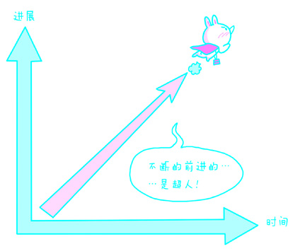
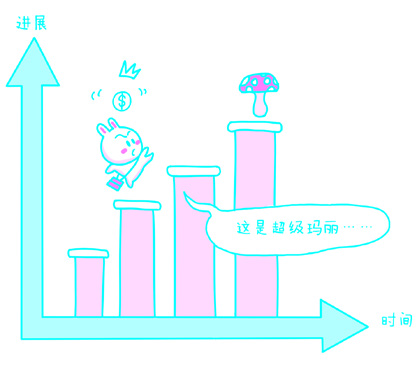
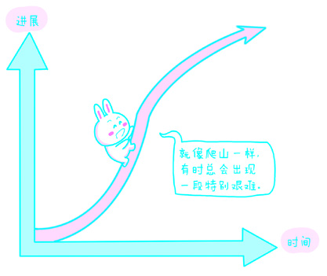
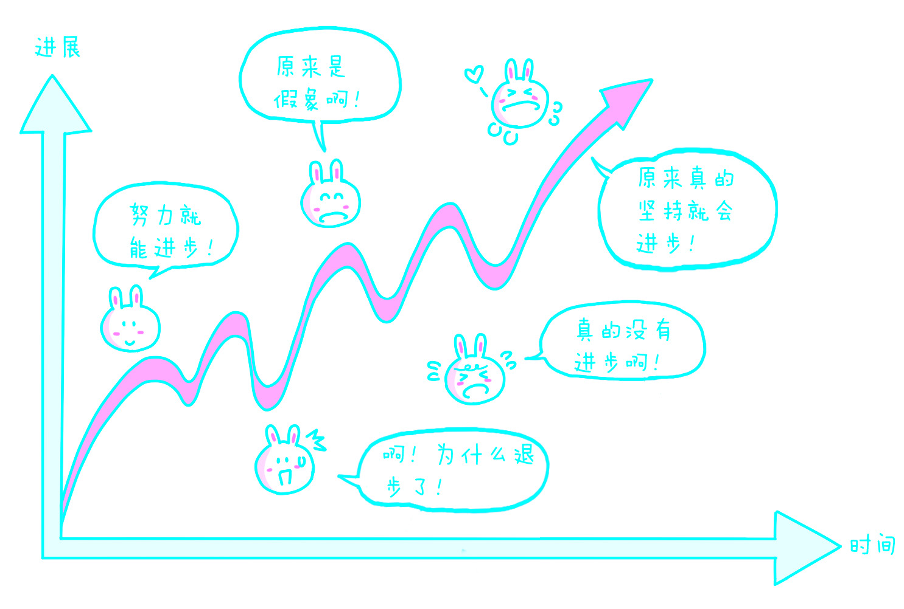

# 第四章：学习

## 1. 效率本质

在第1章“我的案例”一节，我曾提到过我因运气而学习了一些简单的编程知识、因愚蠢而拒绝学习盲打的经历。很多人常常拒绝学习，他们拒绝学习的理由和那些痴迷学习的人一样——不知道它有什么用。

如果说，车是人类腿脚的延伸——使人们走得更遥远，望远镜是人类眼睛的延伸——使人们看得更清晰，计算机是人类大脑的延伸——使人们算得更迅速……那么，学习就是人类所有能力的延伸使人们拥有更多能力，并且往往主要取决于你花费的时间与精力。需要注意的是，这只不过是成本而已，尚未考虑收益。事实上，学习是投资回报率最高的行为。

我见过很多“拒绝学习”的人。举几个例子。我曾经多次劝我的一个朋友花20分钟学习命令行下的批处理方法，未果。他拒绝的理由是：“现在谁还用命令行啊？早就是可视化操作系统的时代了！”我曾经多次劝我的另一个朋友花10分钟学习一下Google通配符的使用，未果。她说：“不用那东西也一样能找到自己想要的啊！”我曾替他们着急过，可是后来却发现这是个“死结”。为什么呢？第一，拒绝学习就不可能有机会知道学习之后的收获；第二，由于不知道学习之后的收获是什么，也就不可能知道那收获有多好、多大；第三，既然对学习的好处无从了解，自然就没有学习的动力……

任何一个人如果曾经有最终习得某种技能的经验，就会知道在习得的那一瞬间，整个世界都会为之改变。换一种说法：因为有能力做更多的事情了，他也就不再存在于原本的世界里；因为所习得的技能，他让自己拥有了另一个完全不同的世界。比如，一个人若最终可以熟练使用一门外语，那他原本生存的世界就多了一扇门，跨过那个门槛，就是另一个世界——他比那些只能讲母语的人多拥有一个世界。选择痴迷于学习的人，正是基于这样的体会：每掌握了一项新的技能（是否足够精通或者是否比别人强实际上根本不重要），就感觉自己像重生了一次。如此看来，其实每个人原本可以拥有的都并非只有一辈子，只不过是大多数人放弃了而已。以我来说，很多年前当我学会BASIC程序语言时，并不知道它会给我这一生带来无穷的好处，甚至不知道自己已然脱胎换骨；当我学会了当众演讲时，我的世界也跟着变了，我打开了一扇新的门；当我真正学会了如何教书时，我发现自己已身处另一个世界……回顾往昔，我早已重生无数回。

事实上，有些人比其他人更有机会体验这种“一生经历许多辈子”的“诡异”感受。比如说，演员。那些从影几十年的演员，往往演技过人（所以才没有被淘汰）；而他们过人的演技更多来自勤奋而非天赋——在每一出戏中他们都会用尽一切方法去了解他们所饰演的角色。[罗伯特·德尼罗](http://goo.gl/ZQbRi)为了演好一名拳击手（[《愤怒的公牛》](http://goo.gl/2BdLh)），先在几个月内增重30千克，而后在几个月内又减重30千克。[梅尔·吉布森](http://goo.gl/K4cmR)为了拍好[《勇敢的心》](http://goo.gl/Iu2Dc)，曾经花费几年时间去图书馆“做功课”。[艾德·哈里斯](http://goo.gl/6x63s)为了演好贝多芬（[《复制贝多芬](http://goo.gl/7srDR)》），花了好几年时间打磨自己的琴艺，揣摩贝多芬的心迹。[刘德华](http://goo.gl/1YuSc)为了演好[《阿虎》](http://goo.gl/AI7Kz)，只在能自然地流露出虎落平阳的神态这一点上，就自愿挨了许多顿打……将这些演员20年前的照片和现在的照片对比，我们就会发现，他们最明显的变化其实不是年龄，而是眼神——愈加深邃。我个人的理解是，他们演一出戏就等于活了“一辈子”，如此，他们早已经活过不知道多少辈子了，眼神太难不深邃、不透彻。

> 另外一个演艺圈里无人不服的演员是[克里斯汀·贝尔](http://goo.gl/MA4c4)，他为《机械师》减重，为《蝙蝠侠：开战时刻》增重，后来又为《斗士》减重 。

“学习”最关键的一点是：任何知识的获取，都是不可逆的。在知道它的那一瞬间，它就已经改变了一切，生活因它而变，却无法还原。我们再也不可能对它视而不见、听而不闻、置之不理，它瞬间就能根深蒂固，无法铲除。比如说，那些学过概率统计的人，在一般情况下是没办法掏钱买彩票的……因为买彩票这种行为在他们眼里是对自己智商的侮辱。但与此同时，彩票是地球上最畅销的商品（没有之一），可见有多少人一生都未曾有机会了解那些重要的知识。

“学习”的重要起点是：起码学会一种技能。无论这种技能多简单、多普通，学会之后总是可以让学习者了解习得带来的大不同。一旦拥有了一个起点，学习欲望就会像发了芽的种子，无论多大的石头都压不住——它会越来越茁壮，越来越坚强。其实，那些拒绝学习或者一不小心受了影响而把“学习”两个字妖魔化了的人真的非常可怜，他们每天都在挣扎着想要“管理时间”、“珍惜生命”、“提高效率”，却不知道他们因为当初不肯花十几分钟学习而导致其后少做了很多事情、错过了很多机会，并且连只有一次的人生都没有过好。

千万不要拒绝学习。

## 2. 基本途径

获取更多知识几乎是我们开拓自身心智的唯一手段。对绝大多数人来讲，“学习能力”也许是一生中最重要的能力。让我们先从获取知识的基本途径开始说起吧。

所有人获取知识最基础的手段就是“体验”。

所谓“体验”，通俗地说就是来自五官的感觉——视觉、听觉、嗅觉、味觉、触觉。当我们看某一事物的时候，“看到”本身就是一种体验。由此，我们知道长城是宏伟的、《欢乐颂》是悦耳的、氨水是刺鼻的、川菜（或其他著名菜系）是可口的，石头是坚硬的……人类就这样依靠五感来初步认识世界。可以想象，人类从茹毛饮血到彻底了解熟食对肠胃消化以及身体健康的好处，需要跨越怎样的时空——火的获得和使用是最大的限制，而对火的认识，从恐惧到驾驭的时间又无比漫长。

比“体验”再高级一点的获取知识的手段，就是“试错”。

我的一位大学同学，曾在一次聚会上，令所有人大吃一惊。她为了证明自己会做菜，主动提议给大家炒个宫保鸡丁吃。大家当然都非常高兴。她进了厨房，几分钟后，发出了一声尖叫。大家马上围过去，只见她眼里噙着泪，把手指含在嘴里呻吟。大家都很奇怪，谁也不知道究竟发生了什么。问了半天才弄明白：她把油倒进锅里，然后点燃煤气灶，过了一会儿，因为搞不清楚锅里的油是否已经热了，就把一根手指探进去试了试……我们集体目瞪口呆。

我猜，这位同学这辈子都不会再用手指来试探油是否已经热了。这就是“试错”。试过之后，知道错了，以后就不再犯了。当然，也许在试过之后，发现不仅没错，而且很正确，那么，我们就获得了一项新的知识或者技能。

“试错”是如此重要，以至在人类最古老的年代，“教育”是要靠鞭子的——做对了，可能会有奖励，但做错了，一定要受到惩罚。直到今天，还是有很多的父母把惩罚当作主要的教育手段。

“试错”往往需要勇气。鲁迅先生曾说，<u>“第一次吃螃蟹的人是很可佩服的”，“不是勇士谁敢去吃它呢？”“螃蟹有人吃，蜘蛛也一定有人吃过，不过不好吃，所以后人不吃了。”</u>

 > 参见《今春的两种感想》（《鲁迅全集·第七卷·集 外集拾遗》）。

在“试错”这个手段的基础上，另一个聪明一点，但重要得多的获取知识的手段是“观察”。

我在上文讲述的那个故事还有后续。当那位女同学把手指烫坏，大家目瞪口呆之时，屋子里的另一个女同学喃喃地说：“哦，原来是不可以用手指头的哦……”大家又愣了一下，继而哄堂大笑。

“观察”扩展了我们的学习范围。我们依靠观察常常可以从他人的经历中获得经验或者教训，进而将其转化为自身拥有的知识。正所谓“他人亡羊我补牢”。然而，“体验”、“试错”和“观察”，都有局限。首先，大量知识无法通过（个人亲身）“体验”获得。例如：地球的构造究竟是怎样的？没有人有能力去体验。太阳的温度究竟是多少？没有人有能力去亲测。其次，有些知识很难通过“试错”获得。例如，一位股票投资者，一般不会通过“试错”进行决策，因为一旦犯错，其后果他往往无法承担。最后，许多知识不能通过观察获得。例如，历史研究者无法目睹几百年前的历史，最贴近的“第一手资料”也不过是遗物；人类在数千年文明发展的过程中观察太空都只能靠肉眼，望远镜发明以后才稍强了一点，但即便如此，很多东西（黑洞等）仍然无法直接看到。

对“体验”、“试错”和“观察”进行补充的，就是“阅读”。阅读是人们获取知识的更加重要的手段，当然也是相对更加需要运用心智能力的手段。

让我们观察一下周围。由于没有“阅读”能力，人类之外的物种只能依赖最落后但很神奇的方式积累经验——基因遗传。特里·伯纳姆和杰·费伦在[《本能》](http://goo.gl/rL7I4)一书中提到，啄木鸟可以本能地采用最优算法获取食物，而一位麻省理工大学的数学博士面对同样的问题却不见得可以迅速解决。啄木鸟的小脑袋在没有接受过高等教育的情况下，是从何得知觅食方法的呢？答案是：通过基因遗传。

人类原本也是通过基因遗传积累经验的。这些经验现在还能观察得到：没有见过蛇的婴儿只要见到蛇就会嚎啕大哭，但没有见过枪的婴儿却不怕这个比蛇要恐怖无数倍的东西——人类在演化过程中不知道被蛇咬过多少次；可人类认识到枪的危险至今不过几百年而已，在这么短的时间段里无法形成可以通过基因遗传的“天生”恐惧。

但文字的出现改变了这一切。文字的出现，使得人类的经验积累不再仅仅依赖基因遗传，人类开始使用文字记录并存储信息、获得知识、传播经验……现在我们已处于人类历史上进步速度最为惊人的时代，“日新月异”这个词已经不够——“分新秒异”都不过分。

人类拥有文字之后，并没有马上因此获得应有的“实惠”。知识的传播与积累在很长一段时间里依旧困难。从结绳记事到刻石颂德，从宣纸录史到革皮藏图，文字的载体在其发展历程中几乎从未易于保存、便于传播。小说《西游记》就生动地讲述了这样一个故事：在文字传播极为困难的时代，获取知识（取经）有多么艰辛。

然而今天，文字的传播已经前所未有地方便、容易。可以说，是互联网改变了一切：文字处理软件、网志程序(Blog Engine)、搜索引擎……无数新技术使文字、经验和知识的记录、传播、共享、检索变得非常容易。今天，任何人只要稍有常识，就可以“出版”自己“体验”、“试错”、“观察”的文字记录。搜索引擎简单而又清爽的界面背后几乎是[宇宙量级](http://goo.gl/RtmG)（用“海量”这个词已经不够）的信息。知识共享的精神被前所未有地发扬光大，其最直接的也是意义最重大的产物当是免费的[维基百科](http://goo.gl/sBwdN)。今天，只要拥有足够的阅读能力，任何人都可以获得过去难以获得的“博士”级的知识量。

> 宇宙量级：
按照Google于2008年公布的数字，当时他们已经索引了1 000 000 000 000 个网页，比银河系的星体还多出一倍。

所有用过“饭统网”或者“大众点评网”的互联网用户都可以体会到使用文字共享信息和经验的好处。以前，一个人即便从小就生活在大城市，也没有办法详知所住城市所有吃吃喝喝的好去处。没有今天这种文字的共享，人们就不得不退回“石器时代”，失去很多享受生活的机会。

在这样的时代，“阅读”突破了个人“体验”或者“试错”的种种局限——“体验”往往只局限于自己，“试错”也受限于自己的阅历，而通过“阅读”，我们可以得知他人“体验”和“试错”的结果（即所谓的“经验”），可以跨越时间、空间，跨越种族和国度——翻译工具越来越先进，而掌握两种或者两种以上语言的人，数量也在不断增加。

“阅读”的前提是使用文字记载的前人经验已经存在。阅读也使快速的经验积累成为可能——“对蛇（爬行动物）的恐惧”可能需要几百代才能通过基因遗传变成“天生的知识”，但有了文字之后，一代之间，人类就可能获得千百年来积累的知识。现代人只需要小学、中学、大学总计16年左右的时间，就有机会在学校里把哥白尼、伽利略、牛顿，或者达尔文、门捷列夫，甚至爱因斯坦等历史上的巨人们所拥有的全部知识收入脑中。

这里，我还想援引电影[《新基督山伯爵》](http://goo.gl/LWwi5)中的一个我看过无数遍的片段来讲讲文字的重要：

> 身陷大牢的爱德蒙·唐太斯（Edmond Dantes）终于见到挖了 6 年 却不幸挖到另外一个牢房的法利亚神甫（Abbé Faria）。
>
> 见面后，法利亚神甫要求爱德蒙帮他挖地道：“为了报答你的帮助，我将提供给你一样无价的东西……”
>
> “我的自由？”爱德蒙的眼睛一下子亮了。“自由是可以被剥夺的。”法利亚神甫颇有些不屑，接着说道，“我会将我知道的一切知识教给你；我会教你经济学、数学、哲学、科学……”
>
> 爱德蒙忽然又发现了值得自己兴奋的东西：“读 书、写字？”
>
> 法利亚神甫愣了一下，发现爱德蒙是个大字不识的家伙，颇有些无奈：“……当然。”
>
> 爱德蒙根本无法拒绝：“我们什么时候开始？”

神甫认为知识最宝贵，大字不识的爱德蒙却只知道自由最可贵。可是没有知识，精神怎么会自由呢？精神不自由，肉体的自由又算得了什么呢？精神的自由是谁也夺不走的。爱德蒙的重生从这里开始。他开始识字，他开始深刻地思考，他不再只是一个杂食动物，而是个可以天马行空的人——尤其在他重获肉体自由之后。

## 3. 主要手段

除了“试错”、“观察”、“阅读”之外，“思考”，准确地说，“正确地思考”，才是获取真正意义上的知识的主要手段。文字出现以前，人类已经能够思考，但局限于已掌握知识的数量，当时的人类很难正确地思考。

很容易想象，远古时代人们对因果关系的认识非常狭隘，而一切现实生活经验都能让他们体会“万事必有因果”。当时的人们看到树上的枝叶被风吹动的时候，当然可以理解为风是枝叶飘动的原因，但他们并不了解现代人小学时就能从教科书里学到的知识——空气流动形成了风。于是他们自然地这样思考“肯定是有什么力量形成了风，可究竟是什么呢？”在没任何“合理解释”的情况下，他们会接着认为，“那只能是神力量”，因为“万事必有因果”。

“万事必有因果”本身并没有错误，问题出在人们不一定能够做到看到“因”就想到正确的“果”，也做不到为所有的“果”找到正确的“因”。有时我们必须接受这样的事实：某件事（果）发生了，可是我们难以确定它的原因究竟是什么；或者反过来：某件事（因）发生了，可是我们并不确定它的结果究竟是什么。思考、求知的过程，某种意义上就是探求因果关系的过程。在这个方面，达尔文的工作几乎可以称作奇迹。[托马斯·叟](http://goo.gl/5gUus)曾经这样慨叹：“<u>达尔文不仅是生物学上的，更是人类思想发展史上的一个界标。</u>”[达尔文](http://goo.gl/zEy6D)之所以伟大，是因为他几乎是我们所能知道的第一个可以跨越几百万年的时间，并彻底摆脱“个体感知”局限去“正确地思考”问题的人。他也使得后来无数的人可以在此基础上建立并完善一种突破人类个体局限的系统的思考方法——科学方法。

> 参见《学问与决策》（*Knowledge and decision*，1980），第98页。

但是，达尔文正确思考的结论没能迅速成为人类的共识，《物种起源》和[演化论](http://goo.gl/kwMpq)所走过的历程，足以让我们了解“正确地思考”有多么不容易——

> 1859年11月24日，在20年谨慎的准备之后，达尔文出版了《物种起源》。据记载，这本书的第1版印了1250本，在1天之内销售一空，随即在科学、文化、社会等领域引起巨大反响。然而，这并不意味着达尔文“胜利”了，宗教“失败”了。
>
> 1925年，即达尔文逝世后的第43年，《物种起源》问世后的第66年，美国田纳西州的一位中学教师[约翰·斯科普斯](http://goo.gl/GwYwJ)，因在课堂上讲解达尔文的演化论而被告上了法庭，最后被处以90美元的罚款。这就是历史上著名的“[猿猴诉讼案](http://goo.gl/SI8a3)” 。
>
> 尽管“猿猴诉讼案”的判决只限于田纳西州，但直到1968年，美国高等法院才根据《美国宪法第一修正案》作出判决：学校可以讲授演化论，因为这是科学。
>
> 1987年，一宗来自路易斯安那州的案件使得争议再起。最终，美国高等法院判决，“要求学校在讲授演化论的同时必须允许讲授神创论”是违宪的。
>
> 1999年，堪萨斯州教育委员会投票决定从标准化考试中剔除作为考试科目的演化论。有些专家认为，	 
>
> 这是一个非常有效的阻止教师讲授演化论的方法。阿拉巴马州的一些教科书上印着这样的声明：“演化论是某些科学家相信的学说，而非事实。”
>
> 在明尼苏达州，一位认为神创论是确凿科学的老师因在课堂上发表对演化论的批评而被劝退。这位老师将学校告上了法庭。
>
> 2005年12月20日，美国宾夕法尼亚州联邦法院做出裁决，认为生物由某种高智能设计师设计而成的“智慧设计论”系宗教理念，在公立学校科学课上讲授该内容违反《美国宪法第一修正案》。

大多数讨论这个话题的文章，总是从宗教和科学相互对立的前提出发，力图用这些事件证明宗教影响的强大。对于宗教，我有自己的理解和看法，但即便我是一个所谓“没有信仰的人”，我也不会反对“信仰自由”，同时不应该、也无法强迫任何人放弃自己的信仰。

事实上，宗教和科学不一定对立。如果宗教和科学彻底对立，那么就无法合理地解释这样一个事实：哥白尼、伽利略、牛顿等众多科学巨人都有坚定的宗教信仰。直到今天，地球上还有很多科学家依然有着坚定的宗教信仰——尽管我们很难获得一个确切的统计数字。

与科学一样，宗教也是人们用来“思考”、“解释”这个世界的工具，只不过，在解释物理世界方面（如生命起源的根由、天体运转的机理），现代科学已经逐步代替了宗教。当今宗教的重心已经转移到另外一个更需要它的方面——人文领域。在“演化论”、“神创论”以及“神创论”的变体“智慧设计论”（又称“神力设计论”）持续至今的争议中，争论双方都对自己的看法确信无疑。关键的区别在于：达尔文的支持者，如果确实是在透彻理解其观点之后坚定地支持的话，都是能够运用心智力量摆脱自身感知的局限的人；而达尔文的反对者，是那些心智力量尚未发展到可以用来摆脱自身感知局限的人，他们无法正确理解并完整运用新的思考工具——科学方法论——去思考问题，甚至并未意识到自己恰恰是由于这个原因而拒绝科学的。

今天，与“创世说”的观点相反，严肃的科学杂志上没发表过否定演化论的消息。1997年，美国华盛顿大学的[乔治·吉尔克里斯特](http://goo.gl/ha8Wq)[调查了](http://goo.gl/ydLB3)列入原始文献的数千种期刊，想要找到关于“神力设计”或“创世说”的文章。他检索了数十万篇科学报告，结果一无所获。后来，东南路易斯大学的[芭芭拉·弗瑞斯特](http://goo.gl/QCbTG)和凯斯西部保留地大学的[劳伦斯·克劳斯](http://goo.gl/vzdUh)用了几年的时间分别独立进行了同样的调查，结果与吉尔克里斯特的调查结果如出一辙。可以说，今天所有严肃的科学家都应该是相信并能够理解演化论的——尽管他们同样可能有自己严肃的宗教信仰。

我们知道，每个人内心都充满了恐惧，而所有的恐惧其实都源于我们害怕未知。这样看来，恐惧是永恒的，因为我们不可能无所不知。对此，托马斯·叟的类比特别精巧：“[在茫茫而又无限的未知空间里，我们的‘知识’只不过像其中的星球一样，而星球与星球之间的空隙比那些星球本身不知道大出多少倍。](http://goo.gl/YgeUL)”所以，我们需要“信仰”、“希望”、“爱”、“奇迹”，甚至“怪力乱神”等被学者们称为“必要之幻觉(Necessary Fiction)”的东西去填补这些空隙才能心安。

由此可见，讨论很多人热衷的“爱因斯坦的宗教信仰究竟是怎样的”或者“爱因斯坦究竟有没有宗教信仰”之类问题的意义不大。因为，爱因斯坦也是人，他也一样会心存恐惧或者敬畏，他也一样要面对未知——即便他知道得比与他同时代的所有其他人都多得多，可他已知的一切与未知的一切相比，不过是沧海一粟而已。所以，就算他有信仰，也并不令人惊讶；就算他有信仰，他信奉的也肯定不是那些拒绝科学的人所信奉的神。从这个角度上说，开启心智、正确思考，更值得我们投入时间与精力。

## 4. 经验局限

人类如果不会阅读、不会记录、不会表达、不会思考，会是什么样子呢？[下面这个故事流传颇广](http://goo.gl/XmGRC)：

> 这个故事经查证，应该只是一个寓言而已。大卫·加德纳（David Gardner）在[愚人网](http://fool.com)上的评价颇有意味：丹最近听说了一个来自“心理学101”的实验故事“，心理学101”的故事都相当有趣、发人深省，而且得出了重要的结论。我和丹都无法确证这个故事的真实性，然而，即使它从未发生过（我更乐于认为它曾经发生过），它仍然包含了精神上的真理。我与其他亲爱的愚人网友们一样，将这种精神上的真理视为更深层次的东西，相对于科学真理来说，它有属于自己的轨道。
>
> 把五只猴子关在一个笼子里，笼子顶上挂着一串香蕉。实验人员准备了冰水，一旦有猴子碰到香蕉，马上就会有冰水浇向所有猴子。首先有只猴子想去拿香蕉，导致所有猴子都被冰水浇，之后每只猴子经历过几次同样的尝试后，发现莫不如此。于是，猴子们不再试图去拿香蕉了。
>
> 然后，实验人员把其中的一只猴子换出，换进一只新猴子。这只新猴子看到香蕉，自然马上想要去拿。结果还没等浇水，其他四只猴子就对那只新来的猴子一顿暴打。新猴子挨了几次打之后，也不再试图去拿香蕉了——怕挨打。
>
> 如此，实验人员再把第一次实验中留下的四只猴子中的一只换出，换进另一只新猴子。这只新猴子看到香蕉，也是迫不及待想要去拿，当然，一切如前，等待它的是其他四只猴子的一顿暴打。最后，这只新来的猴子也不敢去碰香蕉了。
>
> 最有趣的是，上次挨打的猴子，这次出手最重——其他猴子也许是出于自卫，但这只猴子肯定是出于报复，因为它并没有被水浇过。
>
> 一段时间后，最初的五只猴子都被换走了，剩下的五只猴子并不知道冰水的存在，它们只知道一件事情——谁要敢碰那串香蕉，就要遭到一顿暴打。当然，它们的行为与自卫无关，全都是出于报复！

这个故事据说是用来说明传统是如何形成的。其实，这个实验只能部分说明某些荒谬的传统是如何形成的。很多今天看起来没什么道理的传统，当初确实曾经正确或者曾经最接近正确。这个故事真正让我们看到的是，在知识正确传播的过程中，语言、文字以及逻辑思维有多么重要。

让我们就着这个故事继续联想：如果猴子们可以讲话，那么它们就不用打架；如果猴子们能够写字，那么无论换多少次、多少只，新来的猴子都不用挨打（更不会无辜地被打）；如果猴子们能完整地使用逻辑，或许它们最终会想出办法躲避冰水并吃掉香蕉，进而可能对那些做实验的人心存鄙视。

因为没有足够精巧的语言，也没有可以使用的文字，那些猴子无法进行有效的交流和讨论，也不大可能有机会发展出完整的逻辑思维能力，更不用说“正确地思考”了，所以，猴子们最终都不可能搞清楚香蕉和冰水是什么关系，只是得到了一个结论——香蕉是不能碰的——至于为什么不能碰，却被完全曲解了。只看结果，不究原因，或者乱解原因，是一种多么危险的想法和做法啊！正所谓“经验主义害死人”。

谈到这里，我们已经触及所有学习过程（或者说知识传递过程）中最大的障碍——经验主义。所有的人或多或少都是经验主义者，原因就是前文已经提到的：所有的人获取知识最为基础的手段就是“体验”。“经验”在一定的层面上是适用的，不能否定它的重要价值，但与此同时，必须认清“经验主义”的局限。

### 个体的经验有限

一个特别能说明问题的例子是“[强光喷嚏反射](http://goo.gl/YXTuQ)”。现在人们已经知道这是一种通过基因遗传的特征，大约有17%到35%的人有这种症状。目前对这一症状可信度较高的说法是：眼睛和鼻子的知觉受同一条三叉神经的支配，强烈刺激引发的防御反应混淆在一起导致人打喷嚏。具体一点说，从眼睛进入的强烈阳光产生的信号令鼻腔误以为这是对自己的刺激，故欲以喷嚏的形式将异物驱逐出去。[亚里士多德](http://goo.gl/CY5B2)在[《论问题》](http://goo.gl/Kup1m)第33卷中就曾提到过这个现象，可在当时，尽管他有这种体验，也无法正确作出解释，更大的难题是，读到亚里士多德著作的人，至少有65%无法用自己的经验理解那段文字所记录的现象。

1794年，英国化学家、物理学家[约翰·道尔顿](http://goo.gl/xDicD)发表了著名的《关于色彩视觉的离奇事实》。从此，科学家们才开始对“[色盲](http://goo.gl/3Gpr3)”现象展开研究，以对其做出更为全面、科学的解释。从统计数据来看，至少有3%以上的人在色彩辨认上存在障碍。很容易想象，在此之前，色盲的人无法获得来自其他正常人的任何理解，能够获得的可能只是嘲弄。

另外还有些时候，无法突破个人有限的经验，以此去理解周遭的事物和人，总是会带来惊人的灾难。同性恋人群在社会上的种种遭遇就是很典型的例子。2004年12月1日，中国官方首次公开发布《同性恋白皮书》，称中国目前处于性活跃期的男同性恋者超过1000万人。在一些开放的西方国家，大约有5%至7%的男性承认自己是同性恋或者有同性恋倾向，女性的数字略低。目前，世界公认的数据是：同性恋人口占人口总数的2%到5%，且这个比例相对固定，同性恋人口不因社会的压制或宽松而减少或增多，只有隐蔽与显露的区别。

同性恋现象不只是在当代存在，历史上早已有之，而现在也没有任何证据表明同性恋人口比例在增加。但是，仅仅因为大部分人无法突破自我经验的局限，同性恋人群遭遇的惨剧是难以想象的（比如命运多舛的[艾伦·图灵](http://goo.gl/DgGJ6)）。

这些情况就可以解释“为什么人们总是异常痛苦于不被理解，并且在那么强烈地认同‘理解万岁’之类口号的同时又常常无法理解他人”——每个人都或多或少受到自我经验的局限，而这也是经验主义局限的根源所在。摆脱自我经验局限的难度有时是无穷大的，前面的3个例子可以很好地说明这个问题，即很多时候我们根据自身经验完全无法想象他人的体验究竟是什么样的。

### 群体的经验有限

群体经验局限的根源是人类的寿命有限。目前还没有发现哪一个人的寿命可以超过200岁。可是，哪怕是长达200年的时间，其对知识的积累和消化而言，也实在微不足道。从公元前 3 世纪希腊天文学家[阿里斯塔克斯](http://goo.gl/EYuYg)猜想太阳应该是世界的中心到[哥白尼](http://goo.gl/FKzhA)提出“[日心说](http://goo.gl/JUoWM)”，大约经过了1800年；从亚里士多德在《论问题》第33卷中记录“强光可能导致喷嚏”到现代科学家们提出相对可信的解释，已经过去了2300多年。

达尔文的演化论，到今天也只不过是为少数人真正理解并坚信的科学学说。发生这种现象的真正原因在于，这是一个无法仅仅通过个人体验而获得的知识，甚至是整个人类群体的经验无法涵盖的知识。人类中有谁可以亲身体验从我们与猴子的共同祖先一直进化到今天的整个过程？如果有人真的可以全程经历，他就会看到，他的某些亲戚到今天还是猴子，而另外一些亲戚慢慢变成了大猩猩，大猩猩的某些亲戚慢慢变成了黑猩猩，黑猩猩的某些亲戚后来变成了猩猩，猩猩的某些亲戚最终变成了今天的人……说起来并不复杂，可事实上，这个人需要至少活200万岁才有机会看到某些大猩猩进化成黑猩猩。

个人面对无法亲身体验的知识，其表现往往会为恐惧；而群体面对无法亲身体验的知识，其表现往往为疯狂。有句话非常精辟：“很多时候，人们的善良出自于软弱，而他们的残暴只不过来自于恐惧。”哥白尼深知这一点，所以他直到临终时才敢正式出版《天体运行论》。哥白尼的支持者布鲁诺就“嫩”了一点，或者说，表现得勇敢了一点，结果就被烧死了。

### 不仅存在无法通过个体或者群体经验获得的知识，还存在与现有经验相悖的知识

人们常说“经验宝贵”，然而在某些时候，所谓的“经验”恰恰就是我们前进道路上的绊脚石，甚至是我们进步时可能遇到的、稍稍出点差错就无法逾越的鸿沟。

人们在理解新知识的时候，往往依赖过往的经验，所以，在教育学中，“类比”是很多学者和专家相当推崇的教学方法。小学教师用煮熟的鸡蛋类比地球的构造，使得小学生一下子理解了他们不可能亲自体验的知识——谁有能力劈开地球看看呢？中学教师用太阳系的构造类比原子的内部构造，使得中学生一下子理解了他们不可能亲自体验的知识——在相当长的一段时间里，不是每个学校都能拥有足以观察原子内部构造的场离子显微镜的。更为神奇的是，中学生对这一知识的理解依赖于一个无法通过个体体验来获得的经验知识——太阳系的构造。

然而，使用类比理解新知识的前提是，这个新知识与某个“现存经验”接近或者类似。可在某种程度上，<u>有时候连“类比”这个神奇的工具都无能为力</u>，因为我们总是会碰到面对并尝试理解的知识与现有经验相悖的情况。

> 使用Twitter的读者若有兴趣的话，不妨尝试一下向那些不知道Twitter的人讲解一下Twitter究竟是什么。即便是在Twitter已经流行若干年之后的今天，我们还是会发现讲解仍是很困难的。对方会不停地拿一些八杆子打不着的“类似物”打断你的讲解，令你干着急没办法。

观察一下就会发现，日常生活中主要的“沟通障碍”本质上几乎都是由于沟通双方无法让对方理解与他们的经验相悖的知识或信息造成的。不夸张地讲，目前几乎所有关于沟通技巧的书籍中提供的解决方案都没有真正说到点子上。这种知识和信息传递中的问题，不是仅仅通过“站在对方的立场上考虑问题”就可以轻松、彻底地解决的。尽管“站在对方的立场上考虑问题”确实是很有用也很难掌握的技巧，可当我们面对（或者说“背对”可能更准确一些）“站在双方立场都无法考虑到的问题”时呢？尽管这时我们甚至可能不知道问题究竟是什么，但有一点是确定无疑的——这种问题不仅确实存在，往往至关重要。

美国前第一夫人[罗莎琳·卡特](http://goo.gl/25wtJ)就观察到了这样一个现象：“<u>优秀的领导，能够把人们带到他们想去的地方；而卓越的领导，能够把人们带到他们应该去但是没想过要去的地方。</u>”这样的思考和表述，说明罗萨琳·卡特不仅智商过人，心智也足够强大，强大到可以理解那些“卓越的领导”的地步。

> A leader takes people where they want to go. A great leader takes people where they don’t necessarily want to go, but ought to be.

在我看来，所有教育失败的症结也在于此。在人们探索未知、寻求真理的时候，困难几乎都来自如何正确地理解“与现有经验相悖的知识”。从这个角度看，宗教已经没有能力承担这份工作，其必须让道于少数人已经掌握，并且正在使用也正在完善的方法——科学。科学方法是一个远远超出本书讨论范围的话题。我的建议是：人在学生时期应该认真阅读至少3本关于科学史和科学方法的书籍。

这样看来，人类也许是地球上最尴尬的物种：长期的进化使人类到达了今天这个高度，但是每个人在出生的那一刹那，居然与其他动物站在几乎同样的起点上，心智要从零开始进化。

一个人在此后的一生中，要用相当长的时间通过枯燥的学习和反复的实践来获得文字运用能力（有些人通过努力能够使用多种语言和文字）。有了文字能力，才可以通过阅读摆脱种种局限、获得更多知识。此外，人还要学会逻辑，并用科学的方法思考问题，才可能成长（或者干脆用“进化”作为类比更好一些）为真正意义上的“人”——当然，一定有相当比例的、绝对超过半数的“人”在这条路上只走了一半就自以为是去了。

一不小心看穿了教育本质的人如若再稍微脆弱一点，就会无比失望，甚至绝望。我们无法想象这样一幅画面：一只大猴子在卖力地“教”一群小猴子——要是一只大猩猩教一群小猴子倒还强一点。可以想象，那些最终进化成人的小猴子，一路上要经历多少残酷的磨难？！

这个类比貌似过于尖刻，且让人非常难以接受，但是不得不承认，这个类比不仅生动，而且准确，还没有冒犯任何人。当然，估计也没有谁愿意对号入座。

《圣经》上说，上帝为了阻止人建造通天塔，变乱了人的语言。但事实上，语言障碍从来都不是不可逾越的，顶多只是难以逾越罢了。700多年前，马可·波罗在没有金山词霸、不懂艾宾浩斯遗忘曲线、既不“逆向”也不“疯狂”的情况下，学会了地球上最无从捉摸、容易忘记、难以研习的语言——汉语。今天，地球上掌握多种语言的人越来越多，而在这种情况下，建造通天塔的另一个障碍终于浮现出来，那就是很多“人”可能一辈子都无法摆脱的“经验主义”局限。

在这一点上，“类比”依然有着神奇的力量。关键的第一步是：记住并理解以上的例子，牢记在这世界上确实存在“与现有经验相悖的知识”，再把这句话变成经验，用它去类比未知，而后投入大量的时间和精力去学习和掌握“科学方法论”，挣扎着进化成为真正意义上的“人”。当然，必须申明：无论是谁，都有放弃进化的权利。

## 5. 自学能力

我常常暗骂现在的大学本科教育。不夸张地讲，今天的本科教育很大程度上已经忘了“本”。本科教育之“本”在于培养学生的自学能力。从理论上讲，一个人本科毕业之后，应该有能力自学他所需要的任何知识。

可是，今天所谓的本科教育由于种种原因，或明显、或隐晦、或有意、或无意地使大多数毕业生在毕业的时候依然不具备基本的自学能力。更要命的是，本科教育不仅没能让相当数量的学生学好本专业，甚至令他们对自己的专业产生了憎恨。

面对这种情况，单纯抱怨是没有用的，在偶尔骂骂，证明自己还是个有七情六欲正常的人之后，还是应该花时间弄清楚自学能力究竟是什么、应该如何掌握自学能力以及如何运用自学能力才对。

### 自学能力的基础是阅读理解能力

从初中毕业之后，大多数人都会拒绝承认自己阅读能力低下，可这仅仅是幻觉。很多人根本不具备基本的阅读能力，顶多是“识字”而已（弄不好识字量也很有限）。“阅读理解”这件事说起来简单，做起来其实难得很。阅读是能够识别文字的人接收信息的过程，故在阅读之前就肯定要有一个甄别所接收的信息是否可靠、有效的过程——这显然要依赖长期培养的甄别能力。输入完成之后，信息要经过大脑进一步处理：需要记忆的，就要记住，并且可能还要依赖复习才能真正记住；不需要全部记忆而又有用的，就要用文字存档，并且还要想办法保证将来能够找到；新输入的信息与曾输入的信息如果类似却并不完全相同，就要花时间仔细分辨，以免将来使用的时候出差错；新输入的信息与曾输入的信息如果有关联，就要想办法研究清楚，要知道，大脑中存储的信息要多到一定程度才能“融会贯通”……对“人类的大脑是如何存放装载信息的”这个问题，科学家们研究了很久也没有答案。而我们可以想象，那肯定要比受过专业训练的图书馆管理员所做的事复杂许多倍，但很多人却想当然地以为自己不经训练就完全可以胜任——真是不自量力。

### 检索能力建立在相当熟练的阅读理解能力的基础之上

文字是人类区别于其他动物的根本标准之一，但是，大多数人往往并不重视文字。这也难怪，就好像上一节提到的“人类也许是地球上最尴尬的物种”。不过，人类最终还是拥有了文字，从某种程度上摆脱了这种尴尬，可这并不意味着所有人都可以获得足够的文字理解能力。事实上，大多数人都有严重的阅读障碍：不少人高中毕业之后就不再读任何书籍，偶尔看看报纸杂志上的短文（或者互联网上的帖子）也常常断章取义——他们不是故意的，而是无法认真、仔细地把每个字都看清楚，更不用说揣摩字里行间的逻辑关系了。那些突破了阅读障碍的人，随着自身知识的不断积累（不停地阅读、观察、理解、交流、沉淀、筛选），终究会发现图书馆的好处。当然，在图书馆体系尚未真正有效建立的地方，互联网几乎成了最后的救命稻草。从这个意义上说，搜索引擎就是互联网价值的终极体现（这样看来，某些搜索引擎让结果页面被商业利益所左右的做法是多么令人憎恨）。当我看到很多本科毕业生甚至研究生仅仅因为不善于利用图书馆资源和搜索引擎而无法找到实际上唾手可得的有效信息的时候，无法不深深地感到悲哀。

### 写作能力在自学能力中占据重要位置

这里提到的“写作能力”，不是写小说的能力，不是写诗歌的能力，不是写剧本的能力，也不是写散文的能力，只是写作能力中的最基本的一种—写出简洁、有效、准确、朴素、具体的说明性和说理性文章的能力。我国的教育把语文和文学过分紧密地联系在一起，以至有时忘了文字本身最重要的意义。文学，只是文字应用众多领域中的一个而已。

这个事实也许很多人不愿意接受，但静下心来想想，在我们的文化中，如果真的少了一部《红楼梦》或者《西游记》，实际上并不会影响今天人们坐飞机出行、用互联网查资料、饿了吃饭、病了吃药、困了睡觉。日本没有[渡边淳一](http://goo.gl/vjKqc)、[大江健三郎](http://goo.gl/9hFvB)也一样可以有[索尼](http://goo.gl/uQnSQ)这种超级企业；美国没有[梭罗](http://goo.gl/pHAlc)和[海明威](http://goo.gl/MQ32H)，一样可以打赢第二次世界大战，成为超级大国；英语今天主宰全球的原因并不是英国有莎士比亚、[培根](http://goo.gl/mI2LH)、[狄更斯](http://goo.gl/JVHLu)和[柯南·道尔](http://goo.gl/feg4B)。我国的语文教育忘记教会学生如何用简洁、有效、准确、朴素、具体的文字记录自己的知识和经验，以便将来通过共享获得更多的知识和经验。所以，中国人做不出[Linux](http://goo.gl/NBLzB)，做不出维基百科，写出来的网志大多是无病呻吟的心情日记。请注意，我并没有任何鼓吹“文学无用”的意思，我只想说：从人类的整体发展情况来看，除了“文学”，文字还有更多其他的责任，如传递信息、积累经验、共享知识等，而且对大多数普通人来说，后者可能更为重要。	 	

### 实践能力是自学能力最终转化为真正价值的根本

我看到过一句令人非常震撼的话：很多人正是因为没有目标才不停地“学习”。许多人都曾慨叹：工作之后才知道什么真正有用，可“书到用时方恨少”。如果一个人不是很懒惰，那么什么时候开始学都不晚！知道自己需要的是什么之后，真正的学习才算开始。比如学英语：很多人天天在学却从来不用。背单词坚决不造句，却去练习什么词根词缀记忆法或联想记忆法；背了那么多单词，却从不读英文文档，从不写英文文章。当然，偶尔还是要说英语的，但仅限于“Hello! How are you? I’m fine, thank you, and you?”之类。其实，掌握2000个基础词汇、了解基本语法规则之后，就应该去“用”英语了。举个例子，看本专业的英文原版资料就是很好的使用英语的机会。有不认识的单词，查字典嘛。每个单词都认识，但整句话就是看不懂，查语法书嘛。查过一圈还是搞不明白（其实发生这种情况的概率并不高），问老师嘛。可是，我所见到的绝大多数学生英语水平没有进步的本质原因只是懒惰，他们在第一步就已经放弃实践了。我经常遇到问老师“这个单词是什么意思”的学生——这样的学生，连字典都不愿意查（别说查不到，今天的辞典种类很多，另外还有互联网，查不到的概率实在极其微小），更别说查语法书了。有时候，我甚至觉得我能在新东方做英语教师仅仅是因为我会查字典、翻语法书，再加上一个<u>尽量搞清楚一切</u>的心态而已。可为什么有那么多人连这种最基本的实践都不愿意去尝试呢？

> 当然，我更清楚“未知永远存在”。

看清了这些，我们就应该认真思考一下自学能力了。自学能力的打造就是从我们认真对待它开始的。它就像恋人一样，你对它好，它才对你好。完全靠自己学一样东西吧——管它是什么，并且一定要学好，学到比相当数量的人都好。如果真的做到这个地步，那你就不仅是一个完整的人了，还是一个相当优秀的人。这时，你足可以对自己说：“你太有才了！”我个人的建议是去自学一门计算机程序语言，因为计算机程序语言的相关资源在互联网上分布广泛、极易获得，而且优秀的资源使用的语言往往是英语，这又顺带练习了英文阅读理解能力——想想吧，肯定不仅是一举两得。

### 永远保持开放的心态

我们的大脑有一个运行机制叫“选择性输入”，其具体表征在很多人身上都有体现：他们只能听到自己喜欢听的，只能看到自己想要看的。其实，这个机制算不上缺陷，很多时候，它对我们来说属于“自我保护功能”。然而，对一个挣扎着发展自己心智的人来讲，“选择性输入”就是一个可怕的敌人。对抗“选择性输入”的最好办法就是借助我们最好的记录工具——纸和笔——有条件的话，最好固定一段时间来把那些目前暂时无法理解的、支持的、反对的、无所谓的论点和观点记录下来。对无法理解的，写下自己当时的疑惑何在；对支持的，记录几个理由或者实例；对反对的，同样记录几个理由或者实例；甚至对那些无所谓的，也记录其原因。一个有着这样良好记录习惯的人会获得他人无法拥有的处理信息和知识的能力——“反刍”。这种“反刍”能力是我们避免成为“选择性输入”受害者的重要保障。

### 了解学习的进程

所有的学习过程从进展方式上来看都是类似的，但它并不为所有人了解。一个说不上太蠢但也足够蠢的幻想是：只要努力，就可以不断地进步。实际上，在学习的时候，进展和时间的关系肯定不是线性的：所谓“一分耕耘，一分收获”。这个关系曲线更可能是阶梯状的：学习过程中有很长时间一点进展都没有，但从某一刻开始突飞猛进，而后又是长长的一段所谓的“平台期”。事实上，这个阶梯可能没有上图显示得那么陡峭。如果放大一点，阶梯的每一级可能是这样的：在学习的任何一个阶段，都会有一段时间进展缓慢。只有经历积累的过程，“量变到质变”的效果才会出现，才有可能突飞猛进。

但许多人往往在只行进了一小段时间后，就因为觉得进展“过分”缓慢而开始动摇，以至从来不曾体会“突飞猛进”的感觉。然而，这样慢慢动摇直至最终放弃的人，在其漫长的一生中总是会遇到身边的某些人正在“突飞猛进”。在不愿意承认自己曾经犯下错误的情况下，那些最终放弃的人会给自己一个貌似“最合理”的解释：“呀，他肯定有什么诀窍！”当然，更现实地说，这个曲线应该是一个并不规则，上下起伏，但总趋势上升的曲线，类似右页图。打个比方，有点像跳华尔兹——先进两步，再退一步。

说到这里，我们可以看到，若把学习中时间和进展的关系理解为纯粹的线性关系，那我们最终根本不可能收获满意的进展。其实，没有哪个人可以长时间忍受失望。这样看来，曾经的放弃，往往不是因为没有毅力，只是因为对时间和进展的关系理解错误——在频繁失望甚至绝望的情况下居然坚持了那么久，我们原来是这么地有毅力啊！

