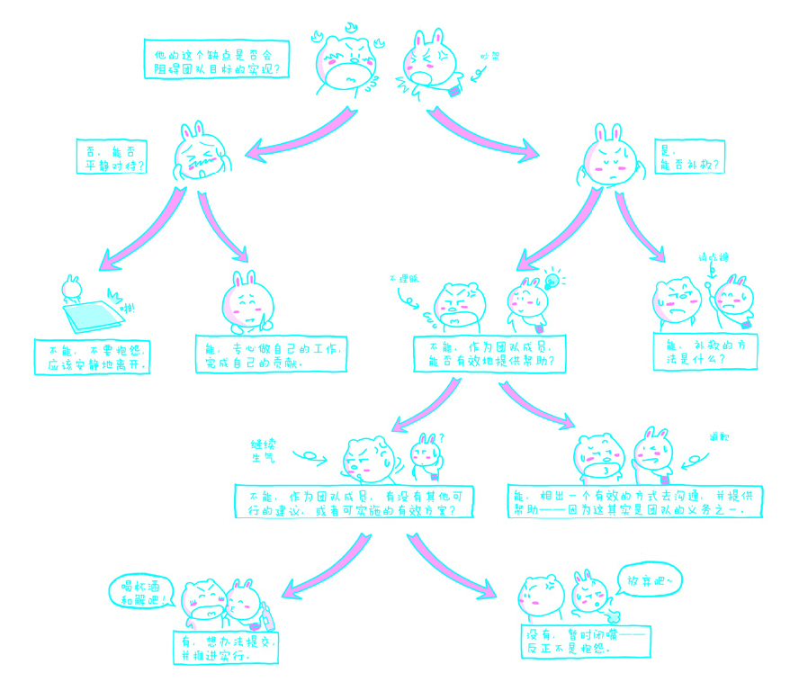
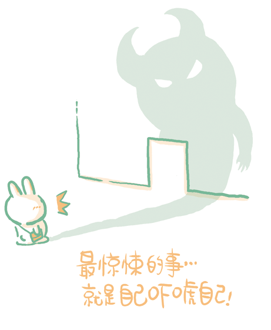

# 第五章：思考

## 1. 勤于思考

遇到问题动脑子想一想其实是根本不费力气的事情，可偏偏很多人最常说的一句话是“想那么多累不累啊？”这话相当古怪，特别是从一个“人”——作为地球上唯一拥有庞大大脑额叶的物种的成员——的口中说出来。

谁也说不清，为什么会有那么高比例的人懒得思考、不愿思考、害怕思考、厌恶思考——这个比例保守估计不会低于80%，而且，剩下的20%中甚至又有80%常常用错误的方法思考。综合来说，在全人类中能用简单且清楚的方式把问题想明白的人几乎不到4%。这4%的人，绝大多数最终选择了沉默或者成为负面力量的帮凶。从这个角度看待历史，可能会得到令人胆寒的结论：人类发展史就是极少数想明白了的人不停挣扎的同时，被绝大多数想不明白的人谩骂、侮辱、陷害、谋杀的历史。人都有大脑，闲置还是使用，是个问题。有脑子却不用等于没脑子。如果用，那么应该怎么用就是一个更重要的问题。这是一个人的选择，这是一个人的[奥德赛](http://goo.gl/wKk0E)。[海妖](http://goo.gl/57q3C)的歌声无孔不入——而我们除了耐心之外却没有任何其他抵御工具，“路漫漫其修远兮，吾将上下而求索”。

思考，更准确地说，<u>独立思考</u>，只不过是从别人那里知道一个结论的时候，自己动脑重新推演一遍，看看得出结论的过程有没有漏洞，有没有不合理的地方，衡量一下结论到底有多少道理的过程。这个过程没那么复杂，也没什么玄妙，
不过是一个正常的有脑子的人应该做的事情而已。

> 我个人一直坚持把“Critical Thinking”理解为“独立思考”，而不是“批判性思考”或“批判性思维”。“批判”在中文语境中有着不少与“Critical Thinking”并不相干甚至相左的含意。在中文语境里，“批判”这个词，从新文化运动开始直至今日，总是与“阶级”、“立场”这类的词有着紧密联系，而与“思考”、“思维”或者“思考方式”、“思维方式”并无关联，偶尔有关联也常常是对思考和思维起着负面的作用。

一旦开始尝试独立思考，我们就会发现，陷阱无处不在。这些陷阱直接导致无数人放弃思考——因为在很多时候，思考虽然不费力气，但实在是太麻烦了。为了避免麻烦而把思考推给别人是一种常见的解脱手段，由此，大多数人身上出现了大量“迷信权威”的现象，只不过是程度不同。“迷信权威”本身就是一个典型的陷阱：权威的意见可能更加准确，可是，权威也好、专家也罢，滥竽充数的实在不少。为此我们不得不常常采取“求人不如求己”策略。这也展现了一个无奈的事实——我们生活在一个信任成本极高的社会。

在深入探究思维陷阱之前，先让我们多花一点时间讨论一下“迷信权威”这个问题。在常见的思维谬误中，“诉诸权威”与“诉诸情感”一样被列为有逻辑错误嫌疑的辩论方式。首先，权威不一定正确；其次，对正确的权威信息很多人的理解并不正确；再次，权威可能别有用心；最后，权威可能并不存在。由此可见，迷信权威诚然不对，但鄙视一切权威无疑也有偏颇——总是有真正负责任的专家、权威存在。现在的问题是：我们应该在多大程度上相信权威？

诉诸权威，本质上源自人们对确定的渴求。面对未知，我们希望有人能够清晰解答；面对争议，我们希望有人能够一锤定音。可我们总是无法如愿。其实这也没什么可抱怨的，因为我们就生活在一个不确定的世界里。然而，没有几人愿意最终面对不确定的答案、不确定的结果。这样看来，“固执己见”和“六神无主”应该是近义词。

正确对待权威并非易事，但是很多人不能正确对待常识就真的令人非常震惊。观察一下生活，观察一下人群，我们会发现很多人对权威迷信到漠视常识、遗忘常识的地步。我们的思维误区中有一个盲点被称为“一厢情愿”，这个东西再加上源自无知、恐惧、懒惰的“迷信权威”，就几乎必然会出现漠视常识、遗忘常识的结果。

[钱理群](http://goo.gl/PTWNO)先生曾<u>回忆</u>道：

> 参见《话说周氏兄弟：北大演讲录》，钱理群著，第185～187页。
>
> 一九五八年……当时《中国青年报》报道：贵州省金沙县（中国最穷的地方）一个社创造了单季亩产水稻三千零二十五斤的纪录。几天之后，《人民日报》报道：甘肃省某社在二分五的山地上，一青年突击队创造了亩产马铃薯一万七千四百一十斤的全国高额丰产纪录。紧接着，《人民日报》报道：河北省静海县陈官屯用五天时间建成一个水利发电站。《浙江日报》报道：浙江省一个多月发展的民办学校达八千五百一十六所。新华社报道：河南省遂平县卫星农业社五亩小麦产二千一百零五斤。一天后，湖北省谷城县东尼社宣布：亩产二千三百五十七斤，创了新纪录。两天后河南卫星社又放第二颗卫星：亩产三千五百三十斤。四天后，河北省临漳县红光社又宣布亩产高达三千六百五十斤。同一天，同属湖北谷城县的星光社宣布创四千三百五十三斤新记录。二十天后，河南省西平县和平社又宣布，达到亩产七千三百二十斤。一个月之内神奇般地上升，各路诸侯都是“各领风骚三五天”。到九月一日一颗特大卫星把全国人都惊得目瞪口呆：河北省徐水县宣布，亩产山药蛋一百二十万斤，要创造一棵白菜五百斤，小麦亩产十二万斤，皮棉亩产五千斤，全县粮食亩产二千斤的高产卫星。《人民日报》报道，徐水人民公社将在不远的将来把社员们带入人类历史上最高的仙境，这就是各尽所能，各取所需的自由王国的时代，跑步进入共产主义。毛泽东非常兴奋地跑到徐水，问：粮食产这么多放到哪儿去？肉产那么多，怎么吃呀？
>
> 这一句话使全国都疯了。中国人的想象力就充分发挥了。由全国大炼钢铁，全民大产粮食到全民写诗。到处是赛诗会，异想天开，奇思狂想。吉林省八积垒赛诗会上，一人朗诵：“今年是个丰收年，秋后粮食堆成山。不知粮食打多少，压得地球乱转圈”。又有一个高声叫道：这不算啥，听我的——社里麦穗插云间，麦芒刺破玉皇殿。麦根扎到龙王庙，吓得东海波浪翻。掌声刚起，又有人喊道：听我的——深耕细作产量高，一棵玉米穿云霄。彩云拴着玉米腰，吓得月亮弯弯腰。做梦到了登峰造极的地步。
>
> 我当时在北大读书，也卷入了这样的狂潮。订计划一天要写几百首诗，整夜不睡地写，比谁大胆，谁善于狂想、做梦。

千万不要以为这只是历史，不会再次发生。这不仅是历史，还是人性的弱点——再过千万年都不见得单凭基因遗传和突变可以淘汰的人性弱点。人们对逻辑学习的忽视，以及对自己在逻辑上的欠缺少有自知之明，并非是今天才如此，而是千百年来一直如此。很多很多年前，有人嘲弄“东施效颦”。究竟是因为西施漂亮，所以她的一举一动，哪怕皱眉捂胸，都妩媚动人呢？还是因为西施身体太差，经常皱眉捂胸，所以才显得漂亮呢？这是东施一生都没有想明白的事情。2000多年后，我们还是能看到东施“转世”人间，化身无数——不分男女老少，甚至不分种族。

权威不是用来迷信的，权威在更多时候本应该是我们认识世界的辅助工具，而且我们在某些方面需要权威的同时，自己也会尽量成为某个方面的权威，这是社会大分工的基本意义。但权威却被很多人滥用，更有甚者，在滥用权威的同时沦为权威（无论是不是真正可靠、可信的权威）的奴隶。这还是本末倒置，东施附体。

独立思考的一把钥匙是这样的——

首先要了解：权威不一定等于正确。进一步要明白：就算权威正确，也只是权威表达了正确，而非正确属于权威。最后要清楚：准确地说，权威只是权威、正确就是正确，它们俩什么时候都不是一回事。

从另一个角度看，拒绝独立思考、把思考的工作交给别人，不仅不省时间，恰恰相反，非常浪费时间——甚至浪费一生的时间。

举例来说，在工作岗位上，有些人像顶着一颗榆木脑袋一样，只做领导要求做的事情，但往往连被要求做的事情都做不好。很多时候，这些人并不是偷懒，而是长期养成的习惯（回避思考的思维模式）造就了他们的行为模式——他们根本想不出该干的是什么，所以只求把领导交代的任务完成以保饭碗。可是，他们甚至连该怎么干好那些被交代的任务都想不清楚，因为他们的脑袋从未“用进”、只曾“废退”，早就退化成了实心的榆木疙瘩，没什么用处。

而另外一些人（肯定是少数），在接到任何任务之后，都勤于琢磨，思考该任务的目标、实质、意义，再据此思考完成该任务的方法。于是，他们会为了完成任务、实现目标，去做很多领导原本未曾交代的事情，最终，他们不仅能完成任务，还常常有很多意外收获……

这就是差别。前者往往在一个工作岗位上“兢兢业业”、“勤勤恳恳”，却“一无是处”、“碌碌无为”，后者却在同样的时间里“一步一个脚印”，“步步高升”……后者逐渐会拥有更多的机会，占据更大的平台，最终与前者成为两个完全不同世界的人。

很多人就是这样，坚持拒绝思考，然后用天下最累的方式生活而不自知。大哲学家[罗素](http://goo.gl/LZd6T)曾观察到这个现象，他为之奇怪并慨叹，“<u>很多人宁愿死也不愿思考</u>”，然后戏谑道，“<u>实际上，他们确实死得很快</u>。”

> Most people would die sooner than think — in fact they do so.
  — Bertrand Russell，*In The ABC of Relativity*，1925，P.166

## 2. 思维陷阱

维基百科上有一个[专门的页面](http://goo.gl/OAZb)，上面罗列了常见的形式逻辑错误和非形式逻辑错误。但实际上，导致人们犯这些逻辑错误最重要的原因只有两个——概念不清和拒绝接受不确定性。

### 概念不清

人们为了能够认知、思考、交流，必须不停地创造新的概念。可以想见，最初人类只有一些很具体的实义概念，比如肉、水、火、牛、蛇等。随着对周遭的认知程度越来越广泛、越来越深入，人类开始创造一些概念以指称那些看不见、摸不着却又确实存在的东西，比如毒、气、智等。有些概念一直沿用到今天，是因为那些认知从一开始就是正确的，或者到现在也没发现有必要丢弃。然而，更多的概念（准确地说，无数的概念），则在人们不停地修正认知、追求真理的过程中被更正或者丢弃。

比如，“[燃素](http://goo.gl/Viyyy)”就是这样一个概念。这一概念出现在17世纪，当时人们尚不了解燃烧的机理，也不了解空气的成分，只有一个笼统的“空气”的概念，没有氧气、氮气之类的概念，更不用提“氧化作用”了。但是，人们需要对某些现象做出解释。于是，有化学家提出了“燃素”概念，对应的理论是：可燃烧的物体中含有一种物质，即“燃素”，所以它们才能燃烧。当然，今天这个概念已被彻底弃用，与此相关的理论也早已被证明是错误的。

在相当长的一段时间里，那些今天已经被弃用的概念并非一无是处。哪怕是那些今天已经被证明为错误的东西，在人类的求知过程中依然扮演着不可或缺的角色——因为进步过程从本质上看其实就是不断地“试错”。然而，如果一些概念在早就可以证明其无效、无用，甚至在只能造成曲解和误导的情况下依然被坚持使用，就是非常荒唐的事情了。中国历史上五行、八卦、风水之类的概念就是如此，即便它们早已不是具备“适用性”的概念，依然有很多人基于种种目的、种种原因、种种诉求，把它们死死抱住，让它们一次又一次地死灰复燃。

我们对这个世界的认知充满了困难。我们不停地修订和增补一些必要的（或至少是暂时必要的）概念，证伪和丢弃那些错误的、不必要的概念，就是为了能把这个世界看得更清楚。我们与我们所生存的世界之间就好像有一层毛玻璃一样，我们把所应用的概念打磨得越准确，就相当于把那层毛玻璃打磨得越透明，把这世界看得越清楚。但是，如果让一些错误的、不必要的概念死灰复燃，就会把那层毛玻璃弄得更厚、更不透明——所谓“混淆视听”。

其实我们说某个人“脑子清楚”，就是指那个人的脑子里没有那些乱七八糟的、毫无必要的、不讲根据的、混淆视听的概念。或者说，他可以清楚地了解哪些概念是什么样的，以至一切在他的脑子里都非常清楚。

学习任何知识最重要的一点，就是搞清楚它所有的基础概念。不夸张地讲，任何一个学科的所有知识，都是由这些概念一点一点搭建起来的。一般人看见房子，不会觉得砖头有多么重要；但是对建筑师来说，砖头分为好多种，每种功用都不同——这就是内行和外行的区别。我年纪很小的时候，母亲教我：“读教科书，要先把所有概念都记下来，暂时不懂的就死记硬背。把概念牢记于心，就可以通过以后的学习和实践反复审视它，并形成透彻理解。”这一教诲对我的帮助非常大，以至我上学期间从未觉得哪个科目太难。后来做了老师，有机会大量观察，才发现几乎所有的学习困难和思维困境，都是因为之前在学习基础概念的时候不加重视造成的——没有例外。

所谓“脑子混乱”的人，其主要特点就是把根本不是一回事的东西当作一回事。因为他们构造世界的概念是粗糙、混乱、未经细分与整理的，所以他们的世界也只能是粗糙、混乱、无法理顺的。比如，“不恰当比较”、“无关类比”是很常见的逻辑错误，可是很多人犯这类错误，往往是无心的，只不过因为他们的概念太乱、太含混，才会把迥然相异的东西当作差不多的东西，甚至干脆当作同一个东西。这样的人看问题永远只能看到表面，有时甚至连表面都看不清楚，当然谈不上“穿过表象看到实质”了——

> 不知道“目标”与“计划”之间区别的人，意识不到自己可能会因为死守计划而最终无法达成目标……
>
> 不知道“政府”与“国家”之间区别的人，往往难于沟通——轻易不要与之交流，否则你可能会因此麻烦不断、祸患无穷……
>
> 不知道“科学”、“科普”与“科普作者”之间区别的人，会相互骂来骂去，全然不顾逻辑的存在……不知道“上学”与“学习”之间区别的人，其中一些可能会因为自己有博士学位就瞧不起中专毕业的人，另外一些可能会因为自己只有中专文凭而憎恨那些有博士学位的人……
>
> 不知道“一个人”与“一个人的看法”之间的区别的人，要么可能迷信权威，要么可能把自己当作绝对权威……
>
> 很多学生讨厌历史课，其实只是没弄明白<u>“历史”与“历史书”之间的重要差异</u>……
>
> 学习任何一门学科，都最好先去读一下该学科的发展史，这是最好的起点。可惜，大多数人一直讨厌历史……

反过来，永远都是那些能把概念理解透彻、区分清楚的人才能清楚地思考，进而改变整个世界——		

> 华盛顿等人想明白了“三权”是可以分开的，造就了今天的美国；
>
> 邓小平弄清楚了“政治”与“经济”是可以分开的，造就了今天的中国；
>
> 有程序员琢磨出“内容”与“表现形式”是可以分开的，于是，在“[超文本标记语言](http://goo.gl/LyhqY)”之外有了“[层叠样式表](http://goo.gl/ue2HA)”，整个互联网随之改变……

所以，本书强调“时间不可管理”、“我们只能管理自己”，并非咬文嚼字。“时间管理”和“自我管理”是完全不同的概念——焦点不同，方法不同，效果不同……但是，很多人没想过这事，在他们的世界里，这两个概念从来没有被仔细定义、认真区分过，故而他们的思考和判断在这方面都是模糊的，据此做出的决定即便是对的，也不过是撞大运得来的而已。而“撞大运”的特点是：这次运气好，会导致将来运气必然不好，因为运气好的概率不可能很高——根据“运气”的定义，概率高了，就用不着运气了。

### 拒绝接受不确定性

前文曾经讨论过，远古时代的人遇到问题后，<u>因为笃信“万事必有因果”，所以会在没有任何“合理解释”的情况下认为问题产生的原因“只能是神的力量”</u>。不夸张地说，神与怪，都只是人们基于种种原因坚决“拒绝接受不确定性”而产生的“应景解释”而已。前文也曾经提到过一个我们必须接受的现实：未知永远存在。从本质上来看，不确定性和未知是一回事。

> 参见第4章“3.主要手段”一节。

拒绝接受不确定性的一个根源在于害怕复杂、奢望简单。<u>谁不希望一切都是简单的呢？</u>可现实往往就是复杂的。

> 有些人非常可笑，他们一方面害怕复杂，同时又迷信复杂。有时候道理简单明了，他们不相信，非要相信玄的东西；有时候方法既简单又有效，他们不相信，以为只有复杂的手段才能解决问题……

不接受，或者不勇于接受不确定性，会直接导致很多认知上和逻辑上的错误。由此引起的逻辑错误实际上是心理问题，而并非只是欠缺逻辑学训练。很多人接受过逻辑训练，也依然常常掉进逻辑错误的陷阱，原因就在于他们从本质上就是不现实的人。所有“仓促的结论（hasty conclusion）”、“仓促的概括（hasty generalization）”、“过分简单化（over simplification）”，从根源上来看，都是由拒绝接受不确定性造成的。所有的粗暴二分法（false dichotomy）也是拒绝接受不确定性所造成的结果，犯这种逻辑错误的人，往往暗自希望自己的二分法能够概括一切情况，却在不知不觉间把不确定的因素排除在外。

## 3. 因果关系

人类的思考离不开对因果关系的分析。人们根深蒂固地认为因果关系无所不在，而大多情况下事实也确实如此。可问题在于，因果关系分析往往并不像看上去那么简单，人们也常常由于[因果关系分析错误](http://goo.gl/QDF5F)而得出错误的结论且不自知，进而莫名其妙地做出错误的决定，走上错误的路。走在错误的路上，时间越久，效率越高，结果越可怕。

### 基础

分析任何因果关系，比如针对“因为A，所以B”，基本上只需要从3个层面去审视：

> ▷ <u>A不一定是B的理由</u>。
>
> ▷ A不一定是B唯一的理由。
>
> ▷ A不一定是B最重要的理由。
>
> 请参考后面的两个小节：“双盲测试”和“自证预言”。

举个例子，有些人认为<u>“电视破坏了人与人之间的沟通”</u>。

> 这也是一道托福考试作文题目：
 Do you agree or disagree with the following statement? Television has destroyed communication among friends and family. Use specific reasons and examples to support your opinion.

他们之所以如此认为，基本上是因为他们观察到了一个现象，即现在的人看电视的时间越来越长（A）——这是一个确实存在的真实现象；与此同时，他们观察到了另一个现象，即现在人与人之间相互沟通的时间越来越少（B）——这也是一个确实存在的真实现象。而这两个现象又好像明显有一定的联系：每天只有24小时，花在这里的时间越多，花在那里的时间就越少……于是，这些人就用“因果”逻辑关系把这两个现象联系了起来，得到结论：B之所以发生，就是因为A……

可事实上，

> ▷ 的确有些人因为电视看得太多，导致不与他人沟通，但另一些人即使不看电视也不会与他人沟通，他们可能会酗酒、吸毒……
> ▷ 就算电视是沟通被破坏的原因，也不见得是唯一的。比如，某个人白天丢了工作，回家之后有气却不愿意告诉家人，于是一声不吭地坐在那里看电视，这时，“不沟通”的表面原因是“看电视”，而深层次原因是“失业的烦恼”。
> ▷ 既然电视不见得是沟通被破坏的唯一理由，那它也不一定是最重要的理由。事实上，人与人之间不沟通的根本原因可能在于人们普遍缺乏基本的沟通技巧。

如此看来，“电视破坏了人与人之间的沟通”这种观点，或者说这种观点之后的因果关系，是无法被大多数人接受的和站不住脚的。

另一个需要注意的非常重要的情况是，有些时候，相关联的两者间是“互为因果”的。

我能想到的最夸张、最误导人的把互为因果的关系谬解成因果关系的例子，是教科书中的一个观点：<u>外因通过内因起作用</u>。它的意思是，如果有什么东西发生了变化，那么根本原因只有一个，就是内因。即使外因有作用，也是通过内因引发的，所以，根本原因还是内因……

> 参见第2章“5.现状无法马上摆脱”一节。

可事实上根本不是这样。外因会影响内因，内因同样会影响外因。它们相互影响，互为因果。

举一个特别好玩的现象为例：在某种意义上，学生的水平决定教师的水平。

这话并没有说反。师生之间的有效沟通，肯定不仅是教师单方面的灌输。越是用心的教师，越关注学生的反馈；越是用心的学生，越关注教师对他的反馈的反馈。显然，这种沟通不仅是双向的，还随着双方的用心程度而不断增强。

这和下棋是一样的道理。据说，棋艺到了一定程度，棋手就会不由自主地挑选对手，因为跟高手下棋就会进步，但反过来，与“臭手”交手多了，自己的手也会变“臭”……优质的学生，对他们的教师来说，不仅是令人愉悦的教学对象（学生一点就透，老师没有不开心的），更重要的，他们还是对教师的挑战——这些学生有着长期而且优秀的学习经验，也因此拥有相对良好的判断能力，随时可能提出一般教师无法回答的问题。经过一段时间的积累，双方都会因为教学和沟通发生巨大的进步——只要双方都足够优秀，足够用心。

不过，大多数人是不用心的。所以，现实常常是这样的：

> ▷ 教师并不用心。
>
> ▷ 教师“不用心”本质上就是“怠慢优秀学生”。
>
> ▷ 优秀学生都离他而去。
>
> ▷ 留下的都是缺乏判断力的学生。
>
> ▷ 这样的学生很好“对付”，他们甚至依然给教师足够的“尊重”。其实，越差的学生越可能产生“崇拜”心理，而这个看起来很吊诡的现象其实非常正常。
>
> ▷ 在这种情况下，教师的境遇本质上来看竟然是“越差越好”。当然，不能差到平均水平以下，那样的话，“连傻子都会看出来”。
> ▷ 教师很爽，学生很爽……大家一起爽，各自毫无进步，甚至退步了也不自知……

光阴似箭，日月如梭，一晃几年过去，这样的教师在能力上就被“固化”了。固化之后再想转变（如若有足够心智觉醒的话），不仅痛苦，而且艰难。当然，我观察到的更多情况是：这些人会为自己的尴尬找出一种可以让自己心安的解释，就好像某些不招人待见的丑女对自己从未收到过情书的解释是“我才不像她（某个美女）那样作风不正派呢”一样。

所以，环境会“非常智能地”对身处其中的每一个人做出与其行动相应的反馈——大多数人都没仔细想过这件事。这样说来，不管我们用心与否，我们都在对周遭的环境不停地发出相应的信号，而构成环境的人们会接收到这个信号并做出相应的反馈——不管是有意的还是无意的，不管是有针对性的还是无针对性的……从另一个角度讲，作为一个活生生的人，我们当然也会不停地接收各种各样的信号——尽管我们可能并非意识清楚地了解这些信号之中的大多数是在回应自己先前发出的信号——不管愿意还是不愿意，有意识还是无意识，我们都会或多或少地根据它们做出自己的进一步回应……无形之间，我们就在被环境塑造。可是，与此同时，正在塑造我们的这个环境，也是我们自己（参与）塑造的……

以上的简单分析告诉了我们一个深刻却又清楚的道理：要做一个用心的人，要用心做事，因为这世界其实也是有“心”的。

### 双盲测试

没有哪一个领域可以像医学领域那样处处存在“人命关天”的决策。所以，开发、研制、应用各种医药和医疗手段都需要小心翼翼，研究和实践随时随刻都是如履薄冰。不管是中国的扁鹊、李时珍，还是古希腊的希波克拉底，从本质上来看，都是因为在实践中分辨因果关系的能力异于常人才成为“神医”的。然而，即便是这种“神医”，也极大程度地受到自身以及自身经验的局限。而从现代医学的角度来看，他们绝称不上“神”，他们对疾病的各种理解以及治疗手段甚至可能不及格。

在医学发展的过程中，对“安慰剂效应”的认识有着很重要的影响。现代医学对安慰剂的认识是从[亨利·诺尔斯·比彻](http://goo.gl/z4myK)开始的。1955年，他在[《行之有效的安慰剂》](http://goo.gl/2fahF)一文中分析了涉及1082个患者的15个临床试验，得出的结论是，平均35.2±2.2%的治疗效果来自安慰剂。安慰剂效应的一个比较		

好的通俗解释版本是电影[《火柴人》](http://goo.gl/NTLUA)，有兴趣的读者不妨找来看看。

为了消除安慰剂效应的影响，鉴定医疗方法是否真正有效，人们进一步发明了“双盲测试”检验方法。在“双盲测试”出现之前，可以说，医学和医疗领域基本还处在“黑暗时代”。毫不夸张地说，“双盲测试”的出现标志着现代医学文明的开始。这里用以下的例子简单说明一下“双盲测试”的操作方法。

> 一种新的药物研制出来后，需要测试并明确其真实效果才能投入使用。研究人员会招募一群病人作为被测试者。被测试者分为两组，一组服用新研制出来的药物，而另外一组服用看起来一模一样但没有任何药力的安慰剂。他们无从知晓自己服用的是药物还是安慰剂——事实上，他们都认为自己服用的是药物。此为“一盲”。不同于测试者，发放药品的工作人员是知道测试者中一定有服用安慰剂的，但这些工作人员也不知道自己手中的药片哪些是新药、哪些是安慰剂。他们的工作只是把标记着号码的药盒发给相应编号的测试者。此为另“一盲”。研究人员则要在“局外”观察、记录、监视被测试者（病人）的治疗效果。
>
> 服用新药的被测试者中可能会有一部分人病情好转，而服用安慰剂的被测试者中也可能会有一部分人病情好转——这是可以观察到的。将服用安慰剂后病情好转的比例与服用新药后病情好转的比例进行比较，就可以了解新药的实际效果。如果两个比例相当（比如均为30%），就说明新药几乎是无用的，它的作用与没有任何药力的安慰剂差不多。

可是，服用“安慰剂”的被测试者病情怎么可能会好转呢？他们服用的不是没有任何药力的安慰剂吗？问题就在这里。尽管服用的是安慰剂，但被测试者自己却以为是新药，也会因此积极配合“治疗”（例如按时进餐、按时睡觉），同时，被测试者的心理状态会因服用“药物”（其实是安慰剂）发生改变，而“药物”会影响他的生理状态——起码一个人的心情会影响他的免疫系统的状态。事实上，很多疾病都可能不治而愈（最明显的例子是轻度感冒和轻度过敏）。而实际的调查结果也显示：人群中也有差不多⅓的人更易受到（来自他人或来自自身的）心理暗示的影响。也就是说，他们更可能在服用安慰剂后病情真正好转。

举一个例子。2000年之前，约有6500名病人接受了称作“激光心肌血运重建术”的心脏手术。简单地说，该手术就是通过使用激光在心脏上面烧灼一系列小孔或通道，来试图减轻心绞痛造成的严重胸痛。然而，纽约[雷诺克斯—希尔心血管研究院](http://goo.gl/ZdiXp)的心脏病学专家马丁·莱昂怀疑这种手术的实际功效。于是，莱昂与同事设计出了一种技术性伪装，前后为25个医疗中心的500名病人分别给予激光心肌血运重建术治疗或模拟疗法治疗。经过一系列研究，莱昂在2000年经导管心血管治疗大会上发表了他的相关报告，得出结论：“两种治疗效果完全没有差别”。长达6个月的研究表明，治疗组和安慰组在运动能力改善方面显示出相同的效果，两组表现出的改善水平也相同，“这种激光疗法，曾经被吹捧为改善心绞痛和提高运动能力的新手段，但它其实只是一种有效的安慰剂。”

现代人很难想象过去的人是怎么活过来的——中国人得了痨病要吃人血馒头（鲁迅的小说《药》里就有详细的刻画），美国人不管是什么病，只要严重了就使用放血疗法（据说美国总统[华盛顿](http://goo.gl/EYoVi)就是被放血疗法弄死的）。这些事现在几乎不会发生了，但我们今天所生存的世界其实依然没有想象中那么光明。观察一下教育领域：有多少教师真心宣扬的方法能够通过“双盲测试”？理论上的比例应该低得惊人。这种情况没有引起重视只不过是因为在教育领域中很难应用“双盲测试”作为检验手段罢了，如是，“鱼龙混杂”的现象自然无法避免，我们也便只能“见怪不怪”。
尽管很难用“双盲测试”检验教学手段，但这种思考模式仍然可以给我们提供一种审视教学手段和学习方法的理论依据。由此我们可以想到，无论是什么学习方法，都可能有⅓的人由于安慰剂效应而宣称自己确实受益（注意，他们无意欺骗，他们是真诚的）。很多人宣称某种学习方法神奇，可能只是因为他们确实看到了很多的“成功案例”，却没看到或者忽略了更多的“失败案例”（他们同样并非故意）。

现在的问题是，既然总有⅓的人的学习会受到“安慰剂效应”的影响，最终学习效果出现之前我们又无法确定究竟是哪⅓的人会受到这种影响，那我们要不要提前告诉他们真相呢？如果我们告诉他们，也就意味着我们实际上在使那⅓的人（尽管我们并不知道那⅓的人究竟是哪些人）失去获得奇迹的机会；如果我们不告诉他们，也就意味着我们将浪费⅔的人的时间和精力。考虑到学习是大部分年轻人最主要的日常行为，正在学习的人群中又以年轻人居多，浪费的就不仅仅是时间和精力了，还有青春，甚至生命。

### 自证预言

[罗伯特·莫顿](http://goo.gl/iuz03)教授发现了这种现象，并将其命名为“[自证预言](http://goo.gl/RyWB)”，即如果人们相信某件事情会发生（事实上其原本并不见得一定会发生），那么这件事情最终真的会发生。
希腊神话中就有[这样的故事](http://goo.gl/4d9W)：

> 底比斯国王拉伊奥斯与王后约卡斯塔生下俄狄浦斯之后得到神谕。神谕中说这个孩子终究会弑父娶母。为了躲避厄运，拉伊奥斯刺穿了新生儿的脚踝，令牧人将孩子丢弃在野外等死。
>
> 可是，执行命令的牧人于心不忍，把孩子偷偷送给了柯林斯的国王波吕波斯。波吕波斯很喜欢这个孩子，把他当作亲生孩子抚养。俄狄浦斯长大以后，得知了神谕，也就了解了自己将会弑父娶母的命运。为了避免神谕成真，他便在不知道国王波吕波斯与王后并非自己的亲生父母的情况下，离开了柯林斯，并且发誓永远不再回去。
>
> 离开柯林斯的俄狄浦斯一路流浪。当他走到底比斯附近的一个岔路口时，与一群陌生人发生了冲突，失手杀了人，其中就有他的亲生父亲拉伊奥斯。
>
> 当时的底比斯被狮身人面兽斯芬克斯所困。斯芬克斯抓住每个路过的人，要求他们解答自己提出的谜题，如果解不出，斯芬克斯就会将对方撕裂吞食。
>
> 底比斯为了脱困对外宣布：能解开谜题者，可获得底比斯的王位并娶前任国王的遗孀约卡斯塔为妻。俄狄浦斯解开了斯芬克斯的谜题，继承了底比斯的王位，亦在不知情的情况下娶了自己的亲生母亲为妻，生了两男两女。
>
> 俄狄浦斯登上王位之后，底比斯不断发生灾祸与瘟疫。于是，俄狄浦斯向神祇请示。最后，在先知提瑞西阿斯的揭示下，俄狄浦斯才知道他是拉伊奥斯的儿子，弑父娶母的不幸命运最终应验。震惊不已的约卡斯塔羞愧地上吊自杀，而悲愤不已的俄狄浦斯则刺瞎了自己的双眼。

莫顿教授用银行挤兑的例子说明了自证预言的作用机理：

> 一家银行本来运作得很正常，但不知什么原因，出现了“这家银行要倒闭”的流言。流言越传越广，导致越来越多的人信以为真，有人为防意外而跑到银行把自己的存款提走。恐慌情绪蔓延，并且变得愈加真实，更多的人冲进银行提走自己的存款……最终，挤兑发生了，银行真的倒闭了。

自证预言的运作机理颇有些令人迷惑：好事很少心想事成，坏事往往无中生有。但这也不是不能解释：或许这与人类大脑中根深蒂固的“恐惧情绪”有关——喜悦会使一个人停下行动去享受喜悦，而恐惧却恰恰相反，会引发一个人马上采取行动去避免危险。事实上，这种出于恐惧的决策几乎总是事与愿违。

自证预言几乎无所不在，它也使因果分析变得更为复杂：自证预言实现的那一瞬间，一个原本并不存在的原因竟然“无中生有”变成了真正的原因。

这些年我见证过的惊人最甚、范围最广、影响最深的自证预言实现发生在学生群体中：大多数中国学生之所以最终未能掌握英语，其实就是自证预言的实现。

最近几年，国内考[托福](http://goo.gl/TpIMv)的中学生渐渐增多。与此同时，出现了一个有趣的现象：中学生的托福平均成绩比大学生高出许多。在国内的大学校园里，托福成绩超过100分就算是高分了，110分以上的少之又少。可是，在国内的中学校园里，托福成绩超过100分不足挂齿，超过110分也不稀罕，甚至连115分以上的成绩都相当常见。

两代学生之间为什么会出现这种惊人的差异？一个比较恰当的解释是，上一代学生实现了自证预言。现在正在国内大学校园里学习的学生，大多从未相信自己可以很好地掌握一门外语。以英语为例，在小学6年、初中3年、高中3年、大学4年，总计16年的时间里，他们被要求掌握约4500个词汇，而这个要求翻译一下就是：

> 约4500个词汇：即相当于大学英语四级词汇大纲的词汇量总数。
>
> 学英语很难的！16年掌握4500个单词，你就很了不起了！

再翻译一下：

> 每年你能掌握的单词不到300个，平均每天不到1个……你很笨！学英语很难！

这样的信息被悄悄植入大多数学生的脑海，他们不明就里地相信了。相信的结果就是自证预言的实现。不止这些学生，之前的许多代人，都是“一辈子学不好，一辈子很努力”，而结果则是越学越差……

在《把时间当作朋友》出版一年半以后，我撰写了另一本书：《人人都能用英语》。我试图通过一本书的篇幅，论述过往失败的英语学习者是怎样被植入的想法左右了一生，最终又是如何实现那个自证预言的；再进一步论述，与此同时，有多少新一代的学生摆脱了那个自证预言的诅咒，而后竟然可以把外语学得比母语还好……《人人都能用英语》从本质上来说，是《把时间当作朋友》的英语学习应用版本。《把时间当作朋友》主张用正确的方法做正确的事情，而《人人都能用英语》主张正确的事情是“习得”英语、正确的方法是<u>“用”英语</u>。

> 注意，是“‘用’英语”，而不是“‘学’英语”。

### 小结

分析因果关系，是我们在决定是否接受某个观点之前必做的功课。所谓的思维缜密，其实并非常人想象得那么高不可攀，事实上可能恰恰相反——做到并不难。很多人做不到的原因无非两个：第一，习惯性拒绝思考；第二，不懂得如何思考。而前者往往是由后者长期作用造成的。想做到“思维缜密”其实很容易——从现在开始，在相当长的一段时间里（比如6个月），时时刻刻注意自己的、或被灌输的每一个念头，甄别其中的因果关系，逐一应用以上提到的种种原则。用不了多久，我们就会发现，自己的甄别能力突飞猛进。从我得到的反馈可以看出，实践这个方法的读者常常收获惊喜。其实，那就是重生的感觉。

# 4. 逆命题

这个话题要从我遇到的一件小事说起。我曾经有一位教GRE课程的同事，他是一个非常自信的人，可偏偏英语发音很差。其实，这本来没什么，发音差对第二语言习得者来说很正常，不丢人，可偏偏他自己很在意这一点。

有一次，我听到一位学生与他的谈话——

> 学生：……老师，不知道我该不该说……
>
> 老师：你说！
>
> 学生：你说的英文我听不懂……
>
> 老师：……那老外讲的英文你听得懂吗？
>
> 学生：呃……听不懂……老师：那不就得了！

学生哑口无言，红着脸低着头走了。

可事实上，这位老师明显强词夺理、诡辩连篇。他的意思是：

> 既然老外讲英文你听不懂，那么你听不懂我讲的英文不是再正常不过的了吗？

再翻译一下：

> 老外讲的英文是标准的，你听不懂；
>
> 所以，反过来，你听不懂的不是不标准的，简化一下，你听不懂的就是标准的；
>
> 所以，你听不懂我讲的英文，因为我讲的就是标准的……

翻译过后，反应再慢的人也看得出来这肯定没道理，肯定有哪里不对。其实，这是<u>原命题与逆命题的关系问题</u>，中学的数学课本上就有：原命题为真，它的逆命题不一定为真。

> 四种命题及其关系：原命题：若p，则q它的逆命题：若q，则p它的否命题：若¬p，则¬q它的逆否命题：若¬q，则¬p原命题为真，其逆命题不一定为真，其否命题不一定为真，其逆否命题一定为真。（符号“¬”指“非”。）

然而，在生活中，许多人不知不觉地就把原命题和它的逆命题等同起来。有心理学家曾经做了调查，经过几年统计得出的结论是：<u>有70%以上的人分不清楚原命题和逆命题之间的区别</u>。

> 参见《认知心理学》（*Cognitive Psychology: A Student's Handbook*，2000），迈克尔·艾森克（Michael W. Eysenck）、马克·基恩（Mark T. Keane）合著。

**反过来不一定成立。**

发生在我身上的另一件事也格外能说明问题——[有一天，我在Twitter上随口说了一句](http://goo.gl/RAhJp)：

> 脑残者最好玩的地方在于他们认为别人才是脑残呢。

多少出乎我意料的是，很快就有人这样回复：

> 这很明显将陷入悖论：假如笑来不认为别人是脑残如何得出以上结论；如果认为别人是脑残，根据其理论，他自己才是脑残。

我实在没办法在Twitter那140个字的空间里讲清楚原逆否命题的道理，[只能补充](http://goo.gl/brXWP)说：

> “脑残者最好玩的地方在于他们认为别人才是脑残呢”这句话本身并不意味着“认为别人脑残的人才是脑残”。

《异类》的作者马尔科姆·格莱德威尔在其成名作《引爆点中提到了一个现象：禁烟运动往往带来反效果，越禁越吸引未成年人，因为突破禁忌总会带来一些微妙的快感。很多未成年人开始吸烟，并非因为吸烟很酷，而是因为他们看到吸烟的人很酷——比如隔壁那个很酷的姐姐。

实际上，这种认知也是因为分不清原命题和逆命题之间的关系造成的——

> 原命题：吸烟的人都很酷。
>
> 逆命题：很酷的人都吸烟。
>
> 我也想酷，所以，我要吸烟。

事实上，每天有无数的人因为分不清原命题和逆命题而被他人左右。混淆原命题和逆命题，抹杀两者之间的差别，是广告设计者最常用、最舍不得放弃的手段——因为它很有效，正如之前的统计数字所表明的，至少对70%的人有效！

## 5. 举证责任

也许你曾遇到过这类对话——

> 甲：我要……
>
> 乙：那么做有什么好处？
>
> 甲：呃……那你说，有什么坏处？
>
> 乙：……
>
> 甲：那就这么定了！
>
> （甲究竟要做什么在这里并不重要，重要的是，在甲的眼里，乙“哑口无言”就是甲的胜利。）

另一个本质上一样的例子是——

> 甲：有人能活200岁以上！
>
> 乙：……扯淡，我还真没见过活过200岁的！
>
> 甲：你没见过就没有啊？你必须找遍全世界才能证明确实没有！
>
> （不要误解，这确实是发生在21世纪的对话。）

这两个例子的共通之处在哪里呢？

在第一个例子中，甲声称要做某事，那么，“证明那么做是有好处的”这个责任应该由甲来承担，而不是由乙去“证明那么做有什么坏处”，或者“证明那么做确实一点坏处都没有”。即便乙真的证明了“那么做确实一点坏处都没有”，也并不能证明“那么做真的有什么具体的好处”。

在第二个例子中，乙反驳的是甲声称的“有人能活200岁以上”，而“乙不能证明地球上绝对没有活过200岁以上的人”本身，并不能反过来证明“有人能活200岁以上”。“找出一个超过200岁的人”，是甲的责任，而不是乙的责任。

“谁主张谁举证”不仅是一个法律术语，它涉及生活的方方面面。可惜，大多数人并未在意。<u>事实上，不懂“举证责任”就是一个思考时“误入歧途”的常见原因</u>。

> 当然，各种原因基本上都能归结于知识的困乏。不懂统计学，所以不知道统计样本有效性的核定；不懂概率，所以常常害怕不确定性；不懂科学方法论，所以从未听说过双盲测试……

不明白“举证责任”的人，逻辑没办法明晰，脑子没办法清楚。这几个字看上去似乎没什么了不起，但有人因此落榜（迷信了某种诡异的学习方法），有人因此离婚（胡乱猜疑直至搞毁一切），有人因此破产（采取了错误的策略进而陷入不可逆转的困境），有人因此出家（原因请自行揣摩）……他们的共同点是——至死都想不明白问题究竟出在哪里>

说理之时，针对某一论点，对立双方的举证难度并非总是对称的——事实上，几乎总是不对称的。

首先，举证难度受举证人能力的影响，因为每个人的学识和专业不同。比如，在争论转基因食品是否安全时，那些常年专注于该领域的人，比另外那些从未认真考察过该领域的人更容易拿出有力的证据。尽管专家不见得永远正确，但这并不能改变另外一个显而易见的事实：每个人的能力是不同的，无论是理解能力、观察能力，还是获得有效信息的能力。

其次，举证难度受当时所在社会的整体知识水平（甚至文化）的影响。今天，我们可以轻易地从互联网上找到在太空中拍摄的地球照片，并进一步证明地球是圆的。证据太容易获得，以至结论被认为“没必要证明”——因为结论早已被认为是事实了。然而，在2000年前，想证明同样的一件事情，类似的证据可没有那么容易获得。

除此之外，举证难度还受需要证明的结论与当时社会普遍接受的知识相符程度的影响。比如——

2000年前人们认为：

> 大地是平的
>
> 大地可能是个球体
>
> 大地应该是个球体
>
> 大地就是个球体
>
> （命题后面的柱状图表示难度，下同。）

今天人们认为：

> 地球是圆的
>
> 地球不是圆的

发生这种改变是因为我们今天已经有了确凿的证据证明地球是圆的。然而，有另外一些事实却不见得被普遍接受。比如，世界上究竟有没有鬼魂？尽管对科学家来说，这是显而易见的、无可争议的问题，但对相当多数的人来说却未必。于是，普遍来看，证明以下结论的难度各不相同。

> 鬼魂存在
>
> 鬼魂也许存在
>
> 我不知道鬼魂是否存在
>
> 鬼魂可能不存在
>
> 鬼魂根本不存在

当然，你还可以想象，对某些人来说，如果证明鬼魂根本不存在的难度是10，那么证明鬼魂存在的难度为0。

由于举证难度的不同，所以，争论双方的境况常常处于这种状态：

> ▷ 其中一方肩负沉重的举证责任（burden of proof）
>
> ▷ 另外一方则享有来自假设的恩惠（benefit of assumption）

举例来说，2000多年以前，如果一个人观察到船出海之后，并不是一下子消失在视野中，而是逐渐变小；更为重要的是，先是船身消失在水平线之下，而后是船帆一点一点地消失……于是，他断定，大地肯定不是平的……它也许是圆的。

可是，这与当时普遍为人们所接受的“知识”并不相符，甚至完全相反——那时几乎所有的人都认为大地是平的。在这种情况下，当这个人参与讨论，并且提出自己的看法时，就负有沉重的举证责任，而不相信他的人则享有来自假设的恩惠。

那么到了今天，我们是不是就自动享有来自假设的恩惠了呢？也不一定。因为我们总是可以遇到一些“固执”的人。[事实上，现在地球上依然有一个社团相信地球是平的。](http://goo.gl/tKom)

当有一方（有意或无意地）拒绝承担举证责任的时候，讨论就没法正常进行下去了。拒绝承担举证责任的方法很简单，连那些不懂举证责任的人都可以自然而然地运用：提出一个观点之后，要求对方进行反证。

他们的逻辑是：既然你无法证明我是错的，那么我就是对的。这是一种典型的逻辑错误，即“[诉诸无知](http://goo.gl/xrAFN)”。

这里的逻辑漏洞来自“他的对”与“他的错”其实并非是像“对”与“错”那么简单的“非此即彼”的关系。比如，对任何一个现象来说，错误的解释可能有无数个。即便我们无法证明其中某一个解释是错的，它事实上依然是错的。

而与此同时，证明肯定论断(positiveclaim)的难度与证明否定论断(negativeclaim)的难度也相差巨大。在多数情况下，证明否定论断要比证明肯定论断难得多。

比如，相比证明“你欠我10万元”来看，“你没欠我10万元”的举证难度要高出许多——甚至没有办法证明。

所以，要求对方证明“你没欠我10万元”，如若无法证明，就认定“你欠我10万元”——这是纯粹的无理取闹。

因此，尽管很多人连“举证责任”这个概念都没听说过，却可以仅凭潜意识就知道其中的难易之分，进而将其运用到狡辩之中。更可怜的是那些已经开始狡辩却并不自知的人——他们已经误入歧途，却以为自己在“上下求索”。

## 6. 案例局限

用案例说理的方法，估计源自20世纪80年代中期[哈佛商学院](http://goo.gl/EODfL)首创的“[案例教学法](http://goo.gl/1ZgDe)”。

在哈佛商学院刚刚起步的时候，教授们就发现根本找不到合适的教材。他们首先想到的解决方案是去采访那些顶尖的商人，详细地记录这些卓越的领导者正在做的事情和做事情的方法，也就是所谓“个案”。经过一番努力和分析，这些教授发现他们不可能拿着这些“个案”照本宣科，因为事实上根本就不存在既定的“标准”来衡量“为什么会成功”、“为什么会失败”。在这种情况下，教授们采取了不同以往的方法来指导学生：让学生们先去认真阅读这些“个案”，然后认真准备课堂讨论，并提出进一步的行动方案。基本上，到今天为止，这种“教学模型”依然还是这样运用的。

“案例教学法”固然相对先进，但跟其他教学方法一样，它也有自己的局限，很容易陷入一些常见的谬误。可是，很多书籍都把商学院“承认有缺陷但不得不使用”的“案例教学法”当作天经地义的方法，导致各种各样的逻辑错误随处可见。

其中最为常见的逻辑错误就是“以偏概全”——某种经验在某个人身上应验了，并不意味着该经验在所有人身上都会起作用。比如，不少书籍曾这样用[爱迪生](http://goo.gl/QaKyv)举例说理：

> 爱迪生活了84岁，一生的发明有1100多项，对自己成功的原因，他曾这么说：“有些人以为我之所以在许多事情上有成就是因为我有什么‘天才’，这是不正确的。无论哪个头脑清楚的人，如果他肯努力行动，都能像我一样有成就。”爱迪生的名言是：
“[天才是1%的灵感，99%的汗水。](http://goo.gl/WsSnw)”
>
> 曾有传言称这句话是断章取义，原话是“天才就是99%的汗水再加1%的灵感，但这1%的灵感远远比99%的汗水重要”，但事实上，爱迪生仅说过“天才是1%的灵感，99%的汗水。”

“努力行动”并不是成功的唯一原因。比如，显而易见、至关紧要，但并不经常被提及的是，爱迪生有幸出生在一个“知识产权保护体系相对完善”的国度。如果再深入追溯的话，爱迪生的巨大成功有一个相当重要的原因——他运气好，有一位伟大的母亲。爱迪生8岁上学，但仅仅读了3个月的书，就被老师斥为“低能儿”而撵出校门——在任何一个地方，闲着没事儿跑到鸡舍用自己的身体孵鸡蛋的小孩儿都可能被大多数老师认为是“低能儿”。从此以后，他的母亲成了他的“家庭教师”。母亲良好的教育方法，使得爱迪生对读书产生了浓厚的兴趣，不仅博览群书，而且一目十行、过目成诵。不妨假设一下，爱迪生若是出生在19世纪末的中国……

事实上，这个世界上也有另外一些人，采取了与“努力行动”恰恰相反的行为模式，同样获得了成就或者取得了成功，尽管其表现形式有所不同。比如，沃伦·巴菲特买入他认为值得持有的股票后，就只采取一个等同于“不努力、不行动”的策略——等待卖出时机。对像可口可乐公司这样的股票，巴菲特甚至干脆在买入之后不采取任何动作。[莫罕达斯·卡拉姆昌德·甘地](http://goo.gl/4lASo)的“非暴力、不合作”策略，也与“努力行动”恰好相反。

注意，我并不是说“不应该努力行动”——我是一个相信“应当努力”的人。我认为，巴菲特在买入可口可乐股票之后“永远持有”也是需要努力才能坚持的行动，而甘地的“非暴力、不合作”更是需要更多的心智力量才可以实践的行动。

我要说的是，爱迪生的“案例”只能告诉我们：爱迪生非常努力、非常勤奋、热爱工作、热爱生活。但是，这个“案例”无法证明：一个人只要跟爱迪生一样“非常努力、非常勤奋、热爱工作、热爱生活”，就可以获得与他一样的成就——明显还需要很多其他因素。其实，爱迪生是不是一个特别努力的人，本质上与我们没什么关系，我们该努力还得努力，不应该仅仅因为别人努力或者不努力，我们就放弃努力。

尽管很多时候我们只能利用案例来说明道理，就像本书第1章第3节里那样。可是，在使用案例说明道理的时候，要时时刻刻注意案例和结论之间的实际逻辑关系，尽量避免以偏概全。

## 7. 对立论证

在第1章第3节，我们讨论过这样一种情况：人们可能基于一模一样的原因做出截然相反的决定。换句话说，用同样的论据证明截然相反的论点。生活中，我们常常遇到这种情况，只不过表现形式多少有些不同。比如，有些时候，我们遇到的是“同样的现象，截然相反的解释”。

一个很常见的例子是，工作中总有一些人抱怨老板或者上司愚蠢。可是，上司真的愚蠢吗？我们并不排除在有些情况下，上司确实很愚蠢的可能性——没有人十全十美。然而，另外一个解释可能更合理：

在大多数情况下，一个人如果不做事，是不会暴露自己的缺点的，因为人只有在做事的时候才会暴露缺点。这也是大多数人并不自知的一个重要原因——他们正在做的事情往往是别人要求他们做的。在任何一个部门或团队里，上司做的事情全都是显性的，是所有下属或者成员都看得见的；而下属之间、成员之间往往并不清楚对方正在做什么。于是，下属们更容易“共同”看到上司的缺点。钱钟书先生有一段很有趣的<u>描述</u>：“事实上，一个人的缺点正像猴子的尾巴，猴子蹲在地面的时候，尾巴是看不见的，直到他向树上爬，就把后部供大众瞻仰，可是这红臀长尾巴本来就有，并非地位爬高了的新标识。”

> 参见《围城》，钱钟书著，生活·读书·新知三联书店，2002.5，第233页。

抱怨上司“愚蠢”的人和能够发觉“上司的愚蠢可能有另外的解释”的人，得到的结论和采取的行动往往截然相反。因此，时间在他们接下来的经历中所产生的伴随作用也截然相反。这里，时间再一次选择与心智强大的人做朋友，他们会这样考虑这个问题：

仔细观察一下就会发现，那些不停抱怨“上司的愚蠢”的人基本上有一个共同点：他们不过是把“上司很愚蠢”作为自己偷懒的借口。他们并不清楚自己的可笑与可悲：既然上司那么“愚蠢”，自己又为什么要用宝贵生命中的大部分时间为这个“愚蠢”的上司打工？那些少数能够提出建设性意见的人是不会抱怨“上司很愚蠢”的，他们要么想办法帮助上司解决问题，要么在爱莫能助的时候自行离开。

实际上，所谓的“情商”，朴素地从根源上来看，还是思考能力问题。举个例子，所谓的“积极心理学”主张“凡事要从积极的一面去理解”。事实上，这种观点失之偏颇。有些结论有对立的论据，有些现象有对立的解释。许多数人意识不到对立论证的存在，只不过是因为心智未被开启，不懂得运用恰当的思考工具而已。一旦意识到对立论证的存在，应该“哪一个更合理、更现实就接受哪一个”，而非“哪一个更积极就接受哪一个”，因为后者只是自我欺骗而已。积极的并不总是好的，哪一个极端理想主义者（以及他们的想法、理念）不是积极的呢？

## 8. 张冠李戴

有时候，论点和论据之间尽管全无逻辑联系，却可以用一种“显然合理”的姿态绑在一起——好像还有那么一批人热衷于如此操作，因为他们发现这样张冠李戴、胡搅蛮缠竟然非常奏效。例如下面这个令人哭笑不得却流传颇广的故事：

> 一个星期六的早上，牧师正在准备第二天布道的讲稿。他的妻子有事出去了，小儿子在一边吵闹不休，严重干扰了他的思路。心烦意乱之中，牧师随手拿起一本旧杂志，从里面挑出一幅色彩鲜艳的世界地图，撕成碎片，丢在地上，对儿子说：“约翰，如果你能拼好这张地图，我就给你2角5分钱。”牧师以为这件事会花掉儿子整整一个上午，但没过10分钟，儿子就拿着拼得完完整整的地图敲响了他的房门。牧师对此十分惊奇，他问道：“孩子，你怎么这么快就拼好了？”“啊，”小约翰说，“这很容易。地图的另一面有一个人的照片，我试着把这个人的照片拼到一起，然后把它翻过来。我想如果这个人是正确的，那么，这个世界也就是正确的。”牧师笑了，爽快地付给儿子2角5分钱，对他说：“谢谢你！你替我准备了明天布道的题目——如果一个人是正确的，他的世界就会是正确的。”

那些讲完这个故事的人跟着会意味深长地说：

> “这则故事给我们的启示是——如果你想改变你的世界，改变你的生活，首先应改变自己。如果你的心理状态是积极的，你的生活就会是快乐的；如果你的心理状态是消极的，你的生活就会是忧伤的。”

这个解释的逻辑完全是混乱的。就算结论正确，有思考能力的人也应该拒绝那些逻辑混乱的论证过程。这个故事能符合逻辑地告诉我们的道理是：换一个角度，也许能找到很简单的方法来解决复杂的问题。而牧师的结论，也是讲述这个故事的“成功学大师”们转述的结论是：如果一个人是正确的，他的世界就会是正确的。其实，这不过是偷换概念，连“类比说理”都算不上。

要命的是这种混乱的逻辑竟然真的可以带来理解上的惊喜。于是，无数人不由自主、不加分辨地将其接受。可是，愚蠢地接受正确的结论有什么用呢？这确实是一个意味深长的故事，也确实可以得出很多有趣、有益的结论。但是，拜托，能不能先做一个有逻辑能力的人再说呢？

另一个关于“态度改变一切”的例子也给我留下了深刻印象。我知道也相信“有些时候，仅仅态度上的改变真的可以带来不同的结果”。然而，我认为用以下的逻辑让我接受，或者让任何人接受，都是行不通的——

> 将字母A到Z分别编上1到26的分数（A=1,B=2,…,Z=26），然后比较不同单词的分值：
>
> ▷ Knowledge（知识）得到96分
>
> （11+14+15+23+12+5+4+7+5=96）；
>
> ▷ Hardwork（努力）也只得到98分
>
> （8+1+18+4+23+15+18+11=98）；
>
> ▷ Attitude（态度）才能左右你生命的全部，
>
> 因为它能得到100分
>
> （1+20+20+9+20+21+4+5=100）——满分。
>
> 得出结论：“态度改变一切”。

拜托，讲点逻辑好不好？事实上，用这种方法计算，结果等于100的单词多的是：

> ▷ Alienation（疏远）
>
> ▷ Apoplectic（中风患者）
>
> ▷ Boycott（联合抵制）
>
> ▷ Cacophony（杂音、刺耳的音调）
>
> ▷ Chimpanzee（黑猩猩）
>
> ▷ Connivance（纵容）
>
> ▷ Coyness（羞怯）
>
> ▷ Flurry（慌张）
>
> ▷ Frisson（颤抖）
>
> ▷ Impotence（阳痿）
>
> ▷ Inflation（通货膨胀）
>
> ▷ Pussy（小猫/阴户）
>
> ▷ Socialism（社会主义）
>
> ▷ Status（身份、地位）
>
> ▷ Stress（压力）
>
> ▷ Surcharge（超载，追加罚款，额外费）
>
> ▷ Syndicate（财团）
>
> ▷ Tuppence（微不足道的东西）
>
> ▷ Turkey（火鸡，无用的东西）
>
> ▷ Wednesday（星期三）
>
> ▷ Wholesale（批发）

以上罗列的只是我在大不列颠语料库英文词汇表中找到
的1000多个词中的一小部分名词而已。形容词useless（无效的）
如果按照这种算法，结果也等于100。网上有个作者不客气地这样写道：“So, it stands to reason that hard work and knowledge will get you close, attitude will get you there, but bullshit will put you over the top.”（所以说，勤奋工作与知识会让你靠近顶峰，态度则可以让你到达顶峰，而“胡说八道”却可以让你超过顶峰，这个论断是顺理成章的。）——因为bullshit（胡说八道）这个单词按照这种算法得到的数字是大于100的103！

## 9. 感悟与道理

反思能力是人类独有的能力之一，尽管如此，我们还是常说“<u>光想是没用的</u>”，因为反思的结果并不一定有价值，很可能顶多是“感悟”，离“道理”还差十万八千里。

> “光想是没用的”对应的英文大概是“Ideasarecheap.”

生活中这样的现象俯首皆是。举例来说，有个女人怀孕了。消息一传出，她就将开始获得来自四面八方各种各样的“忠告”、“建议”或者“指导”。她很是慌张，毕竟这是第一次，尽管之前她也曾想尽一切办法学习、准备，但还是无法避免慌张。而那些忠告、建议和指导都听起来很有道理，起码至少有一定的道理，可要命的是，这其中还有一些实际上相互冲突但也各自都好像有些道理……最终，是否听取了那些忠告，是否落实了那些建议，是否接受了那些指导，都不重要——无论有没有这些东西，孩子终究是要出生的——他可不管妈妈慌还是不慌，懂还是不懂……而孩子出生的那一瞬间，母亲会突然意识到，之前那些令她无所适从的各种忠告、建议、指导的绝大部分在她身上并不灵验。这是为什么呢？

很简单，这位母亲之前所听到的大多数消息其实不是“道理”，而只是“感悟”。并非只有科学家才要遵循“大胆假设、小心求证”的原则，也并非只有专家级别的新闻工作者才要分清“看法与事实之间的区别”，<u>其实每个人都需要清楚地认识“道理”和“感悟”之间的巨大差异</u>。

> 这一节所讲，与本章“6.案例局限”一节非常类似。它们的区别在于，“案例”往往来自别人的经历，“感悟”往往基于自己的经历。如此，人们在分析自己的感悟时，更难排除“安慰剂效应”——请参考本章“3.因果关系”一节中关于“双盲测试”的内容。

并非所有的“感悟”都不是“道理”，但确实在更多时候，“个体经验”往往存在着这样或那样的偏差。分不清“感悟”和“道理”是很危险的，不仅误己，还可能误人。好心办坏事的，往往都是那些分不清“感悟”和“道理”的人。

然而，分清“道理”和“感悟”却并不那么容易，尽管原则相当简单明确：“道理”应该是普适的，而“感悟”只来自个体经验。请不要误会，我并不是说“感悟”都是没用的，我是在说，“感悟”不一定是普适的，非普适的“感悟”与普适的“道理”不一样，很多的“感悟”是有局限的，甚至可能是有很大误导性的。

举一个常见的例子。每个人都渴望成功。基于某种原因，所有被认为成功的人也都乐于分享他们成功的经验。当那些衣着光鲜的人站在台上侃侃而谈的时候，哪怕他们事实上相貌平平，也会让听众觉得光彩照人。他们说的每句话、每个词，甚至每个字，都仿佛饱含着无数的深意，掷地有声、字字珠玑。台下的人，尽管脑子里浮想联翩，但还是有意挣扎着聚精会神，恨不得把每个字都记下来回去“反刍”。

可是，听众应该有自己的智慧。只有了解了沟通的基本原理，才能不至沦落到“人家说什么就信什么”的境地。一方面，我们倾听任何人讲话的时候，都不应该带着防备、质疑的心态，那样可能会让我们遗漏重要的信息，因为心态会成为有色眼镜，使得我们只能收到过滤之后的信息。但另一方面，我们最终若是对所获得的全部信息不加分析、不加思考地全盘接受，也同样是危险的、有害的。

首先，成功者其实没有必要、没有义务，也往往没有足够的时间去讲述所有的细节。相信我，如果仅仅用财富、权力、地位来衡量成功（即世俗意义上的成功），那么所有的成功背后都有数不尽的磨难，同时，也往往充斥着大量不可告人的细节。比如，国内某大企业的老板肯定不会对所有人说他在受到各个方面的巨大压力后才做出某些决定。追求巨大财富的人是如此，追求巨大权力和至高无上地位的人更是如此。

在某些事情上，每个人都应该有沉默权。那些正在分享所谓“成功经验”的人，也应该享有这样的权利。就好像美国警察经常说的那样：“[你有权保持沉默。你所说的一切都将作为呈堂证供。](http://goo.gl/Tz4yb)”只要不是在特殊的极端情况下，任何人都没有权利要求其他人讲述事情的全部细节。但是，如果某个人把他们说的当作全部，把他们没说的当作没有，那么这个人的智商就跟寓言中那个掩耳盗铃的家伙属于同一个水平了。

其次，几乎所有的成功者，在讲述自己成功经历的时候，都会有意无意地夸大自己为成功所付出的代价，夸大曾经面临和战胜的困境，夸大自己最终成功的难度。他们不是故意的，只是因为他们也是人，他们和所有的普通人一样，都有不同程度的虚荣心需要获得满足。他们现在的成功是已经确定的了，所以，这成功荣耀的程度就取决于其难度，即：起点条件越差，成功显示出的难度就越高；难度越高，获得的掌声就越多，被其他人认可的程度就越强烈。最终的目的，就是让尽可能多的人对他们佩服得五体投地。

他们这么做，还有一个潜在的原因：保护自己。每个获得巨大成功的人，最为紧迫的任务就是保护自己的既得利益。这跟下棋没什么区别，不仅要不断地“进攻”，还要稳固地“防守”。他们如此夸大自己为成功所付出的代价，想表达的潜在含义是：要知道，成功可不是说来就来的，是需要付出很大代价的，你还是好好想想吧。这是另外一种形式的“恐吓”，和“欲练神功，必先自宫”的警告在本质上没有什么区别。

他们这么做的原因，还有来自观众或者听众的支持。大多数人喜欢听成功者讲述他们的艰苦经历——越艰苦越好，越“苦大仇深”越喜闻乐见。绝大多数人的一生都是平平淡淡的，甚至包括那些成功者中的很大一部分——如果我没猜错的话。电影之所以精彩，有两个原因：首先是艺术加工，其次是压缩时间——把一生的故事用一两个小时讲出来，不波澜起伏、惊险刺激才怪。然而，真实的生活却不可能天天波澜壮阔、起起落落、惊天动地。事实上，没有谁的心脏可以承受得了这样的生活。

一方面，大多数人一生都不会领悟“平平淡淡才是真”的道理。另一方面，很多人在潜意识里希望所有的成功者都是通过艰苦奋斗才获得成功的，因为他们觉得只有这样才能解释自己的“不成功”，才能更为自然地接受自己的“不成功”。他们潜意识里的想法如果表达出来可能是这样的：“看，成功多难呀！要付出那么多代价才可以呢！我还没付出那么多代价，没成功很正常嘛……”事实上，对那些渴望成功而又尚未成功的人来说，成功人士“苦大仇深”、“血泪斑斑”的经历是一种多大的安慰啊！

另外，更为重要的是，就算那些成功者并非有意隐瞒或者有意夸大，他们在讲述自己的真实经历时，依然可能产生种种偏差。成功者，或者那些被认为成功的人，依然是人，不是神。既然他们还是人，就很可能有<u>认知偏差</u>。比如人类大脑具有的一个自我保护功能——遗忘痛苦。

> 认知偏差：
CognitiveBiases，一个心理学上经常提到的概念，这一点，后文还将细加论述。

所以，成功者在给他人讲述自己的成功经历的时候，往往会有意无意地掩盖那些令他们追悔莫及的错误。因为那些经历太痛苦了，以至于他们的大脑自动把那些记忆抹掉了——如果他们的大脑功能健全的话。对于“掩盖错误”这件事更为合理的解释是：他们不是故意的，只是不知道每个人固有的认知偏差给他们造成了怎样的影响而已。他们当然会讲述自己曾经遇到的困境，但你有没有注意到这样一个有趣的现象：在他们的讲述中，他们最终会用无比顽强的精神摆脱那些看似不可逆转的困境——这样的讲述换来的当然是热烈的掌声。那么，他们有没有到现在都无法解决的困难呢？我不相信他们没有，除非他们活在另外一个世界。

还有，一定要了解这样一个事实：有些时候，“成功者”的经验没什么用，因为那些经验根本就是错误的，关键在于“成功者”自己可能也并不了解。比如，他们遇到了一个经济飞速增长的时代，无论做什么都赚钱，并且赚得很多，所以从宏观上来看，根本就不是他们自己所认为的宝贵经验在起作用，而是宏观经济给了他们这样的机会。但是，有谁愿意承认自己的成功跟自己的经验没有关系呢？人类普遍拥有的一个认知偏差就是：把成功揽到自己身上，把失败归咎于别人或者坏运气。（这在心理学上有个术语，叫做“自利性偏差(Self-servingBias)”。）从这里我们就可以知道，那些“成功者”这么做的时候，往往并不是有意欺骗——他们甚至出于好意。

最后，要知道有些“宝贵经验”就算正确，放到别人身上也可能并不那么灵验。最可能让一个人误入歧途的，就是他对自己的了解。长辈们总对我们说“人贵自知”，他们忘了说的、甚至可能完全不知道他们真正应该说的其实是“人贵自知——难哪！”回想一下上一次听完成功故事不由得心潮澎湃的状态，你就知道有自知之明是多么难能可贵了。当然，没必要为自己那么容易心潮澎湃感到自卑，所有的人都会这样——只不过程度不同罢了。

比如，成功者们常说，他们并不在意钱，他们知道人格的可贵。但是，大部分听众和他们不一样。大部分听众现在没有足够的钱！相信我，绝大多数人，在没有钱的时候，对“人格可贵”的理解很难非常深刻。人活着是要吃饭的，一个人的家眷是不应该被饿着的，在基本条件都不能保障的时候，“人格有个屁用”就成了很多人的选择。崔健是这样描述的：“<u>若是为了爱情，歌曲算个屁；若是为了生命，爱情算个屁。</u>”这是大实话，而大实话往往不可能动听。其实，这并不是玩世不恭或者愤世嫉俗的说法，只是有勇气接受现实的人对生活的平静描述。

> 参见崔健2005年专辑《给你一点颜色》中的《红先生》。

这里提供一个很实用的建议：与其关注成功者，不妨反其道而行之——努力从失败者身上汲取经验。

不要说模仿成功者，就算观察成功者也很困难。成功者很多，但是，我们身边真正的成功者却很少。成功背后的东西很难看清楚，所谓成功的真实性也很难判断，而成功者们又会有意无意地美化和包装他们的经验，而这一切，都在干扰我们的判断。不过，观察失败者却相对容易得多，因为失败者的失败往往是显然的、确定的，失败的真正原因也往往很容易查实（尽管失败者会找各种各样的借口）。并且，我们身边失败者的数量，显然要多于成功者的数量。如此，我们也就有了更多的观察机会。

有了这样的认识，我们就会经常碰到所谓的幸运——当你马上就要犯错误的时候，有人先犯了同样的错误。不过，仅仅“专注于汲取教训，而不是幸灾乐祸”这件事本身都不容易做到。

经过这些分析，可以知道，有一句话值得牢记：人家说什么你就信什么，挺傻的。

只有经过自己的仔细分辨，真正成功者的宝贵经验才是无价的。需要额外注意的是，一方面要多花心思分辨，另一方面要多花时间真正了解自己，以便能够避开“一概而论、生搬硬套”可能带来的灾难。

## 10. 克服恐惧

“道理都明白，可就做不到”也许是无数人在生命中无数次遭遇的尴尬。日常生活中，那些原本是讨论者，后来却变成了为争而争的争辩者的人，常常并非故意。他们只是像醒过来后最终还是要咬农夫的蛇一样，展现出了他们难移的本性而已。

人性中究竟有什么东西如此“邪恶”（这里并非贬义，只表示负面），如此顽固，如此普遍，如此让我们无可奈何呢？答案很简单——恐惧。恐惧又会带来另一个更有杀伤力的品性——懦弱。

思考训练书籍里总是提到阻碍人们正确思考的诸多障碍，比如我的更好(Mine-is-better)、死要面子(Face-saving)、拒绝改变(Resistance to Change)、顺从多数(Conformity)、简单粗暴的分类(Stereotyping)、自我欺骗(Self-Deception)……所有这些最终都可以归结于人性中根深蒂固的恐惧以及恐惧带来的懦弱。

人们总是喜欢用善恶区分一切，但这其实是一件很无聊的事情，没有什么实际意义。更有意义的区分是“强”与“弱”。在很多时候，所谓的善良，只不过是懦弱的表现。人们说[高耀洁](http://goo.gl/E8pO6)很善良，肯帮助那些“艾滋病村”村民，我却宁愿说，高耀洁老奶奶是个很坚强的人，因为她的坚强，使得她有真正善良的资本。有人说那些“赚了黑心钱”的人捐出大量金钱给慈善机构是伪善，我却宁愿说，不得不承认这样的人实际上也确实很“强”，于是他们有资本做出“伪善”的事情。“强”与“弱”才是自然界中真正存在的本质，“善”与“恶”往往只是弱者一厢情愿的定义。

人类作为注定会老死的物种之一，天生就充满了恐惧。因为害怕自己的死亡，所以人们宁愿相信存在某个叫做天堂的地方；因为害怕失去亲人的痛苦，所以人们宁愿相信转世投胎、轮回再生；因为害怕强者无疆而又不能面对自己的懦弱与无能，所以人们宁愿相信“恶有恶报、善有善报”。成功者害怕自己的既得利益受到损害，于是在“分享”成功经验时着了魔一样地夸大自己遇到的各种障碍，同时却对起着决定性作用的“运气”绝口不提；碌碌无为者如饥似渴地享受成功者的“分享”，在听到成功者遇到难以逾越的困难九死一生的时候潜意识里暗暗欢喜——原来我没成功是有原因的啊！

小时候我很奇怪为什么《圣经》里反复提到“七宗罪”（贪婪、淫欲、饕餮、嫉妒、懒惰、傲慢、暴怒），却绝口不提人生最大的敌人“恐惧”，以及“恐惧”这个恶魔的小鬼“懦弱”？那根深蒂固的恐惧可是一切“恶”的根源，那懦弱才是“原罪”啊！后来我明白了，宗教最需要的实际上是“恐惧”。为了让人们向往天堂，便设计了一个令人生畏的地狱。没有令人恐惧的地狱存在，天堂又如何令人向往？

人人都有弱点，因为人人都有恐惧。恐惧需要克服，勇气需要培养。事实上，“勇气需要培养”这句话里面的“培养”不如换成一个更朴素的词——积累。勇气与智慧一样，是依靠积累获得的。当一个人还只有一点点勇气的时候，就期望他可以“除暴安良”、“替天行道”、“匡扶正义”是非常幼稚且不现实的想法。一个人的强与弱，实际上就相当于他的勇气减去他的恐惧之后的分值——如果是正数，那么他是强的；如果是负数，那么他是弱的。所有人的起点都是负数。但凡人类，都要经过很多的挣扎才能使这个算式的结果变成正数。并且无论是谁、无论这个人有多强，都不可能完全消除恐惧。勇气可能等于零，恐惧却永远大于零。

古人说，人贵自知。摆脱“自以为是”陷阱的一个重要前提就是正视自己的恐惧，因为恐惧永远存在。现今的自然界中，绝少有动物以人为主食，但还是经常出现人被其他动物咬伤或吃掉的事情，这主要是因为那些动物被惊着了、害怕了，才会主动出击。同理，那些突然放弃讨论，转而“变”得不理性的人，只不过是因为在那一瞬间让恐惧占了上风，而勇气消耗殆尽。不要以为自己拥有无比的勇气，不要以为自己没有恐惧，总有那么一个时刻，我们的勇气不能抵御我们的恐惧。所以，我们有什么理由不能理解别人的恐惧呢？

## 11. 辅助工具

尽管我们使用语言表达我们的思维，可是，思考和表达并不总是一前一后的过程。有些时候，我们的思维会因我们所使用的语言（表达手段之一）而受到各种各样的影响。恰当而又正确地使用语言，可以帮助修复思维漏洞。一旦明白个中道理，我们就会发现，语言就是一个便宜（甚至免费）而又有效的辅助工具。
在我的成长过程中，父亲常常帮助我纠正不良的语言习惯。比如，有一次，他看到七八岁的我指责别人说脏话，就告诉我：“其实有时候有些话‘话糙理不糙’……其实不说脏话的人不一定不脏；偶尔说点脏话有助心理健康。”这事我就不多作解释了，相信读者很容易明白这是多么真实而又健康的教育。

这些纠正中令我印象最为深刻的，是父亲禁止我在任何情况下说类似这样的句子：

> ……本来（原本）就是嘛！

现在想来，真的要感激父亲，他就那样简单而又“粗暴”地用几个星期的时间使我一生不再使用这样的句式。这种句式在生活中只有一个用处——找（最后的）借口。

长大之后，我曾在一部关于某重大新闻事件的电影里看到报社老板这样呵斥一位刚入行的记者：

> 永远不要再跟我说“我认为……”了！你的看法关我屁事？我要的是事实……

从那之后，那个毛头小伙就刻意让自己写的句子都用“事实上”作为开头，而为了配得上这个开头，在后面的陈述中他不知不觉真的剔除了很多“偏见”。直到被电影里的这个小细节触动，我才明白，原来在很多领域，有些“思维训练”其实只是需要更改语言习惯。想明白这些，我再次在心里狠狠地感激了一下父亲。

以下一些句式最好经常使用，因为它们特别有助于独立思考习惯的养成，并且也有刺激思考的作用：

> ▷ ……是一回事，而……是另外一回事。
>
> ▷ ……和……其实根本不是一回事。
>
> ▷ ……不一定……
>
> ▷ ……。可是，这并不意味着……
>
> ▷ ……也许还有另外一种可能性（解释）。
>
> ▷ ……看起来像……，可是……
>
> ▷ ……。而事实却可能远比看起来的更为复杂（简单）。
>
> ▷ ……。然而，（这个论断）反过来（陈述）却不一定成立……
>
> ▷ ……其实很可能与……根本就没有任何关系。
>
> ▷ ……和……之间不一定是单纯的因果关系，它们也可能互为因果。
>
> ▷ ……和……之间的比较也许没有任何意义。
>
> ▷ ……其实不过是表面现象，其背后的本质是……
>
> ▷ ……有一个通常被忽略的前提。
>
> ▷ ……尽管听起来很有道理，然而却完全不现实。
>
> ▷ ……也许有人会说……，但是这种质疑却……

这些句式看起来简单，却往往能带来不同凡响的思考结果。平时遇到任何问题的时候，都不妨把这些句式套进去填空——就当想着玩了——要不了多久你就能体会这种游戏的有趣之处。不出意外的话，我们会发现自己的思维因为这些句式的运用而不由自主地发生了巨大转变。例如，“……和……其实根本不是一回事”这个句式往往瞬间就能使一个人的脑子更加清楚。

而另外一些句式，则要刻意回避。比如这句话：

> ……难道就没有一点可取之处吗？

当我们试图批判一个错误立场的时候，即便是在完全正确地批判的情况下，也总是会遇到这样的抵抗（往往来自那些不知其所以然的所谓“同情者”）：“……难道就没有一点可取之处吗？”

这样的“诘问”常常奏效，只不过奏效的方向并不是驳倒批评错误立场和观点的人，而是让发出这样诘问的人自己据谬而喜，让被批评的人错上加错（很多人分不清“自己的观点被批评”与“自己被批评”之间的重大差异），让更多不明就里的人受到更严重的误导。

几乎没有什么立场和观点能像单细胞动物一样纯粹——每个立场和观点都是由许多其他的立场和观点构成的，或者是被许多其他的立场和观点影响的，就像“多细胞有机体”。哪怕由10000个对的立场和观点拼成的立场和观点，也不见得整体上是对的，更何况“确实有一点可取之处，但其他地方千疮百孔”的立场和观点呢？

要是“……还是有一些可取之处”可以成为我们必须拥护，或者不得反对某个立场或观点的可成立的理由的话，我们几乎就必须拥护所有立场、不得反对任何立场了。比如说，法轮功声称自己是弘扬“真善忍”的，在这一点上，它的大多数信徒都是真心认同的，但仅仅因为它也有一些可取之处就不能批判它，就一定要拥护它，或者反过来说，就可以纵容它去误导更多的人吗？（当然，是否要用现行的方式打击它，是另一个需要严肃讨论的问题。）

再比如说，已经被废除的一夫多妻制就真的一点可取之处都没有吗？从某种意义上讲，无论从经济学还是从生物学上来看，允许一夫多妻可能比强制性地一夫一妻更有利于资源有效分配，但是，就是因为一夫多妻制也有这样的可取之处我们就要拥护它吗？就要退回去而取消现在的一夫一妻制吗？

“……难道就没有一点可取之处吗？”这个常见的句子还有一个变体：“我发现……还是很有一些道理的！”唉，那不是废话吗？就算是在希特勒的《我的奋斗》里也有很多相当有道理、甚至相当精辟的观点。但为什么全世界都要禁掉这本书呢？就算跳大神的也有可能说中那么一两次，但为什么我们一次都不能信呢？闭上眼睛蒙对一次一点也不难——即便是一只坏掉不走的表，一天之中起码还能对两次呢。

“我发现……还是很有一些道理的！”常常成为很多人把垃圾当宝贝的唯一理由。可是何必呢？那些真正有道理的部分，不一定只在那里存在啊！垃圾里当然也可能有些宝贝，但是在宝贝已在眼前、用都用不完的时候，为什么还一定要跑到臭气熏天的垃圾堆里“淘宝”呢？这道理尽管简单，但总是被很多人忽视，小则误导自己，大则误导别人，巨则误导至少一代人。三叹。

再看一个最浪费时间的，也因此必须回避的句型：“要是
……就好了！”这个句型是用来表达后悔情绪的，而“后悔”是最浪费时间的——无论如何，这种情绪都于事无补。当人们遇到生活的尴尬时，脑子里将不由自主地冒出用这个句型所表述的念头：

> ▷ 我要是孙悟空就好了！
>
> ▷ 我要是有钱就好了！
>
> ▷ 我要是没结婚就好了！
>
> ▷ 我要是当初多读点书就好了！
>
> ▷ 我要是在美国就好了！

之所以在遇到尴尬时会冒出这样的念头，是因为大多数人早就朴素地明白一个简单的道理：我们所面临的今天很大程度上取决于我们的过去。可是，时间的固有属性决定了被它穿透的一切都将凝固成历史，无法更改。无论后悔的程度多么强烈，都无济于事。

冒出这种念头的另一个原因是我们无法接受自身的现实局限。每个人来到这个世界上的时候，都不是完美无缺的，并且，无论怎么努力，也注定不会有完美的人生。于是，个子矮的人希望自己高一些，丑陋的男人希望自己帅一些，难看的女人希望自己漂亮一些，老去的人希望自己（起码显得）年轻一些，肥胖的人希望自己苗条一些，骨瘦如柴的人希望自己健壮一些……当然，我们还是需要努力，因为努力可以使我们达到相对完美或者接近完美。

过去的事情是无法更改的，现在的烦恼是无济于事的。所以，只要我们是一个旁观者，就会无比容易地看出这些想法是多么不现实。把这些不现实的句子转换成现实的版本，就是这样的：

> ▷ “我要是孙悟空就好了！”——可是你不是孙悟空。所以，你没有72根毫毛变出72个你帮你写作业，你也没有金箍棒，不能招惹面前的这个大块头。
>
> ▷ “我要是有钱就好了！”——可是你没有钱。所以，用钱能解决的问题不是你能解决的问题。
>
> ▷ “我要是没结婚就好了！”——可是你已经结婚了。所以，无论你多么喜欢面前这个女人，只要你开始采取行动，麻烦就会接踵而至。
>
> ▷ “我要是当初多读点书就好了！”——可是你当初没有多读书。所以，现在你追悔莫及也没什么用。
>
> ▷ “我要是在美国就好了！”——可是你还在中国。所以，美国的那些好事大多跟你没有一丁点关系。

过去的事情是无法更改的，现在的烦恼是无济于事的，但是将来的尴尬也许是可以避免的——如果现在的行动没有出错的话。换句话讲，为了避免将来的尴尬，必须在今天采取正确的行动。所以：

> ▷ 改掉直到交作业期限的前一天晚上才写作业的偷懒习惯，先做完作业，再去使劲地玩。如果你确定对方不是一个好人，那就趁早离他远一点，最好不要让他知道你的存在。
>
> ▷ 不要为现在没钱而烦恼。打起精神来，从今天开始想办法赚更多的钱。如果赚更多的钱很难，少花一点、多省一点，也是一个很好的途径。
>
> ▷ 想想看，离婚是不是一件可行并且容易的事情。如果不是的话，就算你顺利离婚了，将来万一又要与对面这个女人离婚，可能仍然非常不容易、不可行。
>
> ▷ 从今天开始多读一点书，多学一点东西。尽管学东西对任何人来讲都不容易，但只要坚持，大多数技能都可能比较熟练地掌握。
>
> ▷ 先解决目前的麻烦。而后，如果真的觉得美国更好，那就从今天开始准备移民——需要做的事情非常多，努力吧！很多时候，一个人不现实就是因为他的想法不现实。而
这个人的想法不现实，往往是由他所使用的句型决定的——
无论怎么替换都只能造出不现实的句子。另外，“要是……就好了！”这种念头不仅无益，甚至可能是有害的，因为这个句型会衍生出一个很恐怖的句型：“要是……就好了！但，
……！”
>
> ▷ “我要是孙悟空就好了！”——可是我不是孙悟空。但，我可以耍赖不交作业！我也没有金箍棒。但，我可以弄一把刀……
>
> ▷ “我要是有钱就好了！”——可是我没有钱。但，我可以去借，借不着还可以骗，实在不行就去偷、去抢……
>
> ▷ “我要是没结婚就好了！”——可是我已经结婚了。但，管它呢，反正对面这女人也不知道……
>
> ▷ “我要是当初多读点书就好了！”——可是我当初没有。但，我可以去弄个假毕业证，反正现在用假证的人多了去了，要不然那些卖假证的怎么赚那么多钱啊……
>
> ▷ “我要是在美国就好了！”——可是我还在中国。但，我可以想办法偷渡；或者做点什么事，然后去美国使馆寻求庇护，说不定还能混张绿卡……

所以，当脑子里闪出类似“要是……就好了！”的念头时，
要马上提醒自己“停！这个念头最耽误事了！”或“停！这个念头最没用了！”要想知道类似“要是……就好了！”的念头有多么可笑，不妨想想我们常常听到的一句话：

> 要是我不浪费那么多时间就好了！

可是，我们已经浪费了那么多时间，现在竟然还在浪费时间！
