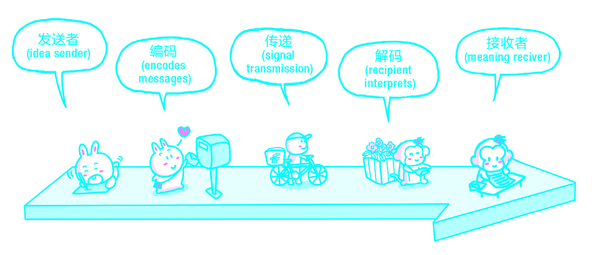
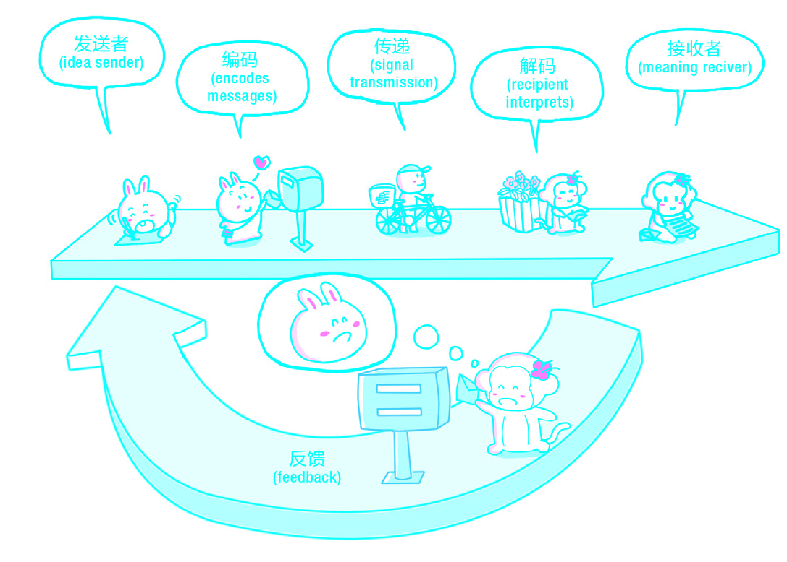
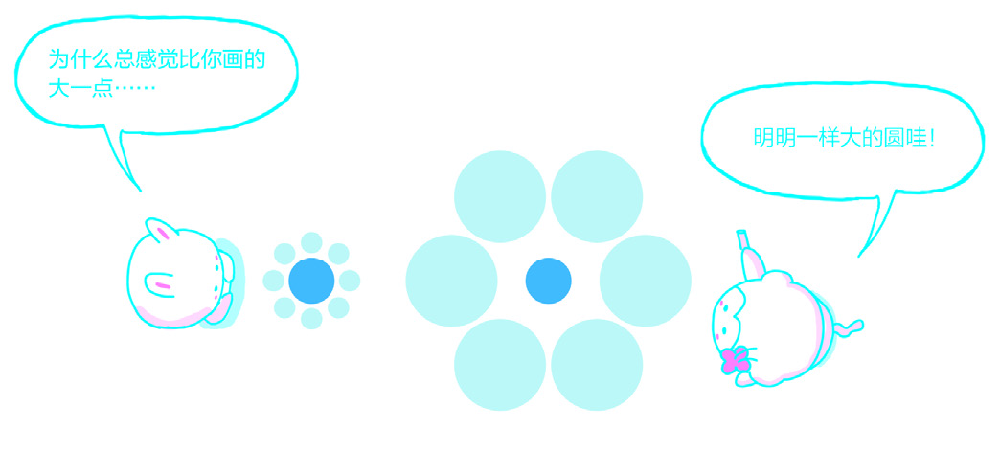

# 第六章：交流

## 1. 学会倾听

正如没有人认为自己不会说一样，几乎没有人认为自己不会听。可事实上，大多数人并不懂得应该如何有效地倾听。从某种意义上讲，交流的有效与否往往更取决于听者而非说者，反过来说，失败的交流往往源自听者的疏忽。不夸张地讲，倾听能力的强弱，几乎能够决定一个人的命运，因为绝大部分时间里，任何一个人的生存和发展都依赖听某些人的话，或者，反过来，依赖某些人听他的话。

人们总以为倾听能力是与生俱来的，并且自然而然地认为阅读能力比倾听能力更难养成（当然也就更想当然地认为阅读比倾听重要）。这种认识导致正规教育体系在长达10多年的教育过程中，从未有过针对母语的“听力”课程。教师在课堂上对一届又一届的学生重复教授同样的内容，而台下的学生居然永远只有少数能够全面把握教师所讲述的信息——倾听能力的巨大差异也许是这种永恒尴尬的最好解释之一。

人类讲话的速度往往远低于思考的速度，所以我们在倾听的过程中常常会出现走神的现象。刚开始走神的时候，持续时间不会太久，也许只有几分之一秒，但就在这一瞬间，大脑也能处理许多信号。因此，当大脑“神游”归来时，我们往往发现自己并未错过什么重要的东西。于是，大脑又开始自动走神，这一次可能要比之前更久，因为大脑早已“证明”过自己“游刃有余”。而再次归来之时，大脑也许还会“印证”自己并未错过什么……于是，走神的次数越来越多，时间越来越长……

如此这般下去，终究会出现真正错过重要信息的情况。另一方面，说者为了讲解清楚来龙去脉，往往不得不把重要的信息，比如重要的事实、迂回的说理、意味深远的结论，放在后面。从总体上来看，说者发出的信息越来越重要，可是听者接收的信息却越来越少、越来越零散。

经过一次又一次的走神，听者“印证自己并未错过有效信息”的判断就很可能只是幻觉。我们的大脑有一种模式拼接能力：在处理零散信息的时候，会不由自主地将它们按照某种之前曾经遇到过的模式拼接起来——并总是以一种我们自以为有意义的模式。[九一一袭击事件](http://goo.gl/5rZC7)发生的时候，人们在双塔烟雾中看到的“魔鬼面孔”就是一个典型的例子。

双塔烟雾中的“魔鬼面孔”。

这也可以解释生活中经常出现的这种情况：

甲向乙提起“你当初不是说……？”的时候，乙大惊失色地喊道：“天哪，我什么时候说过……！”不能排除乙记忆力差的情况，连自己说过的话都不记得，但是另一种情况更可能发生——甲把乙所说的话完全理解成了另外一个样子，甚至可能与原意相反。这也就导致另一种让人无奈的现象产生：人们只能听到自己想听到的，只能看到自己想看到的。

然而，模式拼接能力也不是全然无用的东西，否则我们的大脑就不会进化出这种能力了。但是，它也有相当大的副作用：很多人并不是“不懂装懂”，而是“真诚地相信”自己确实懂了——托模式拼接能力的福。

另外，并非每个人都需要同等的倾听能力。如果我需要获得更多信息甚至更多知识，倾听能力就非常重要，对未来的影响也相当大。而如果我是“独行侠”，那么就算我是聋子又如何呢？反正我连话都不用说。但是，一旦我需要与他人协作，无论是作为团队成员还是团队领导，都马上会极度依赖倾听能力——自己的和他人的。

人并不是天生就有模式拼接能力的，这种能力依赖一定程度的已知信息。如果一个人从未在什么地方见过所谓的“魔鬼面孔”，那么他就不会在浓浓的烟雾中“识别”出那张“魔鬼面孔”。某种意义上说，模式拼接能力是学习的副产品，它会随着已有信息的增多而越来越强大，马尔科姆·格莱德威尔说的“[闪念](http://goo.gl/8Am3Q)”其实指的就是这个东西。

尽管这种模式拼接能力与世间万物一样有固有的局限，但它也跟世间万物一样，能够被“有心人”主动利用、主动控制。对“有心人”来说，几乎一切问题的解决方案都源于“自知”。因为摆脱局限首先要去了解局限、了解它的根源；而除了时间之外，人生中的局限大多来自自身。

以“自知”为起点审视模式拼接能力的运作机理，我们很容易得出结论：必须想办法获得一种或者一些能够用于鉴定已知信息有效性的知识。我把这类知识称为判定类知识，以区别于其他知识（我将其称为概念类知识）。生活中，有些人比另外一些人更懂得“眼见不一定为实”的道理——这就属于判定类知识。20世纪50年代之前，人们还不懂得双盲测试的重要性，所以也基本上不具备鉴定一些特定信息的有效性的能力。

不得不慨叹的是，从某一个领域中诞生的重要理念传播扩散到生活中其他领域所需要的时间，往往长得超乎人们的想象。比如，计算机领域的“[面向对象程序设计](http://goo.gl/zgxPY)”是一个革命性的概念，尽管目前各个领域的精英们都已经渐渐开始使用这个概念（比如，[《无间道》](http://goo.gl/OCLXT)这种剧情复杂的电影，就是运用这种理念才拍出来的），但所有公众都能理解这个概念的那一天还遥遥无期，若是等，都不知道要等到哪辈子（亚里士多德2300多年前提出的[三段论](http://goo.gl/i94Vk)到今天也不是所有人都理解的）。再比如，双盲测试目前普遍被认为是一个医学概念，可事实上，这个概念可以应用到几乎所有涉及认知的领域——教师群体中普遍存在的各种各样的（甚至相互矛盾的）教育方法、秘诀，甚至所谓的“理念”，大多经不起双盲测试的考验，可是这个群体中的大部分人根本就没听说过双盲测试的概念，更不消理解它的重要性了。

有了一些判定类知识后，我们在日积月累的过程中，要尽量用这些知识可靠地鉴定自己大脑中所存储的已知信息（大多是概念类知识）的有效性。这并不是要在交流的时候做的事情，但是在交流进行的每时每刻，这些已知信息都在起作用，而这些信息的有效性决定了交流过程中“理解”的质量。因为人在理解一样东西的时候，都会不由自主地调动一切已知信息去和它进行匹配。

这个提升倾听能力、改善交流状况的解决方案并不直观，也因此往往被拒绝，或者干脆被忽略。人类就是不喜欢不直观的东西，因为不喜欢，也就自然不接受，反过来，对不能接受的东西，也自然越来越不喜欢。这种倾向究竟有多严重，从一件事情就可窥见一斑：直到大学阶段，学校才开始正式教导学生写论文之前要做研究，可是最终大多数学生还是反过来写论文——先随便弄出个结论，而后再去做能够印证那个结论的研究工作。

然而，对“有心人”来讲，这是一场正常的、必须的、不可回避的、旷日持久的，甚至最终是有趣的、一个人的战斗。不断收集、整理、修正自己的判定类知识，就好像是为自己编织一张“滤网”，以阻止无效的概念类知识的进入。同时，这张“滤网”也应该是双向的，可以把概念类知识中有效的部分留下，而把无效的部分排除。所谓“有心”，其实就是指有这张“滤网”。人与人“滤网”质量的区别，很可能就是人们所说的思考能力的区别。

听者走神更重要的原因在于他们并不知道听的时候可以用多余的脑力做些什么——不知道正确的是什么，而同时又会不由自主地去做些什么，最终的结果当然就是做错。

在了解“应该做什么”之前，有必要先了解一下“最不应该做的是什么”。

为了真正做到有效倾听，最需要克制的就是“过早质疑”。尽管我们都知道不应该不假思索地全盘接受对方所说的一切，人们总在提倡的“质疑精神”也是非常可贵的，但是，在倾听的过程中不善于控制自己、随性发出质疑，是最妨碍有效倾听的行为和心理。

说者不可能一下子把所有的必要信息讲完，尤其是在说者必须展示一个复杂的说理过程及其烦琐但又重要的细节、事实、证据之时。打断对方的讲述，提出自己的质疑，不仅提高了说者有效表达的难度，更增加了自己获得对方讲述全貌的难度。这并不是偶然的：不成熟的人、思维简单的人更倾向于频繁地插话，并且他们总是认为“我已经了解你要说什么了……”

没有人从一开始就成熟、强大，但只要有一两次能够真正忍住自己发出质疑欲望的经历，就可以得到足够的教训，并进一步养成耐心等待到最后再发出疑问的习惯。事实上，如果真的能把这种欲望克制住，人们往往会惊讶地发现：听到最后一刻的时候，自己对讲者论述内容的理解发生了变化，自己的疑问也发生了本质上的变化——不管是好还是坏。

“过早质疑”同样也会造成幻觉——觉得对方的论证不堪一击。可事实总是与此相反。道理很简单，讲者刚刚开始自己的论述时，驳斥他的难度是最低的，于是“过早质疑”的人总会产生自以为是的幻觉，进而落入自我设置的陷阱，同时自我感觉良好。

“过早质疑”的另一个副作用是它会让听者不由自主地进入排斥状态。尽管我们并不能像闭上眼睛一样合上耳朵，但我们确实可以像“视而不见”一样做到“听而不闻”。大多数人在未经训练的情况下，在听的过程中只有两种状态——接收和排斥。总有一些人更易盲从，那是因为他们在听的过程中更多地处于接收状态；而总有另一些人更加顽固，那是因为他们在听的过程中更多地处于排斥状态。

稍加思考就会发现，排斥状态更应该被提防。接收状态本身并不一定有害——除非“接受”一切“接收”进来的东西。但是，排斥状态会使一个人处于永无进步的状态，因为拒绝接收，所以无法接受——“接收”并不等于“接受”的道理并不是每个人都懂。（这也是一个简单而又实用的判定类知识。）

为了让自己听得更有效率，我们要牢牢记住这个简单而又实用的原则：就算需要质疑，也一定要等到对方把话说完。

那么，应该做的是什么呢？在倾听的过程中，我们可以利用多余的脑力处理两个方向的信息：“回顾”与“预期”。所谓“回顾”，即使说复杂了听起来也很简单：说者刚刚都讲了些什么？

可是，相对于阅读过程，倾听过程中的记忆难度要高出许多，因为在阅读过程中可以随时返回重读，而在倾听过程中往往需要打断说者才能“回顾”。而问题在于，打断说者几乎总是“不好”的——要么不礼貌，要么不恰当，要么不可能……遇到“长篇大论”（不含贬义）的时候，随着倾听时间的延长，记忆的难度将会不断增加。

“发现自己遗忘了太多信息以至于无法理解”会造成巨大而又无法解决的压力。这种情况出现的时候，几乎所有人都会产生“见鬼去吧”的情绪——这是唯一看起来“无害”的出路。

大多数人会对自己的记忆力过分高估。这个幻觉来自每时每刻都有一些确实可以记得住的东西，而记不住的东西恰恰则因为没有被记住所以看上去“并不存在”。换言之，每时每刻都有“我记得住”的证据，而“我记不住”的证据基本上难觅其踪。这也就是为什么总有那么多人真诚地相信自己考试成绩差是因为“没发挥好”。

相信自己的记忆力比自己估计得差（甚至差很多）是一个去除这一幻觉的行之有效的方法，因为只有相信这个事实，才能够在倾听的时候有意识地为了真正记住而反复（认真）回顾。在一些重要场合（课堂、会议等），也会因此真诚地借助辅助工具（笔记、照片、录音等）来帮助记忆。很多人从小就对老师“一定要记笔记”的建议置若罔闻，准确地讲，这种行为并非出自对老师的忽视或者鄙视，而是出自对自己记忆力“幻觉”的信任。

只有记得住要点，才能够理顺要点之间的逻辑关系。但更多的时候，理顺逻辑关系本身并不难，因为说者总是会用“因为……”“所以……”“其次……”等语言线索来组织自己的内容。可是，有效倾听、有效理解的关键在于那些隐含的信息。准确地讲，那些隐含的信息不是“听”到的，而是“想”到的——动用自己“多余”的脑力想到的。

说者的语篇内容可以分为两类：事实和看法。如果是事实，那么我们就要花时间想想“他所陈述的内容真实性如何”。如果是看法，那么我们就要花时间想想“他的这个看法/意见的根源在哪”。再讲下去好像就应该是“逻辑课”的内容了，可是绝大多数人之所以逻辑混乱，并不是因为逻辑这东西太难学，而是因为他们根本就不愿意去“想”——觉得“想”太麻烦。

其实，只要肯去花费时间和精力去“想”（不过是用上文的两个“提问”作为起点而已），很多原本不可能“听”到的内容就会“自动”浮现，而这样做的人最终几乎都会发现自己“逻辑能力超强”——起码比自己想象得强。人真是奇怪的存在，要么错误地高估自己，要么错误地低估自己——也许这恰恰是“估”这个动作的必然结果。

如果能够记住要点，并肯花时间和精力搜寻隐含的信息，
听者便有能力做下一件更重要的事情：预期。

所谓“预期”，其实只不过是猜想“讲者下一步可能会讲什么”，但这个运用“多余”脑力做出的动作却有诸多好处。首先，它将自动增强听者的注意力；其次，它有助于正确把握和组织说者论述的内容；最后，它能使听者“听到”更多原本“听不到”的信息。

最后，我们还要养成一个重要的习惯：一旦决定倾听，就要主动帮助说者进入“倾诉”状态。

在课堂上、会议中，打断说者往往不礼貌且没有必要，甚至会浪费他人的时间、破坏他人的注意力。不过，作为听者，尤其是能被说者看到的听者，给予说者鼓励性的信号会使说者更容易地进入“倾诉”状态。尽管我个人极端反对欺骗，但是，我发现哪怕遇到不喜欢的说者和内容（人们往往会因为讨厌内容而讨厌说者，或者反过来，因为讨厌说者而讨厌内容），适度控制自己的反感情绪对获取信息也会有极大的正面作用——既然坐在那里，“听而不闻”就是浪费自己的时间。

然而，当面对面交流的时候，听者的反应会在很大程度上影响说者的状态。尽管人们讨厌自己讲话时被打断，但是也没有人喜欢对没有任何反应的听众讲话。从本质上来看，倾诉其实只有两种：第一种是不顾一切地说出来（比如在教堂里隔着纱窗向神父忏悔），第二种是讲给喜欢听的人。所以，给予说者适当的反应，是听者为了有效倾听必须做的事情。

在自己状态不佳、心不在焉的时候，“马上停止谈话”是对双方都有利的事情。一旦听者决定倾听某人的话，就要想办法调动自己的所有感官去感受说者的一切表达方式，包括他的眼神、姿态、动作等，随时随刻尽可能地去想象说者正在经历的情绪状态。一旦听者开始有意识地做这些事，就会不由自主地真正进入“倾听”状态。而后，更为重要的是，由于听者的专注，说者也将不由自主地进入更深的“倾诉”状态。

有些读者可能会觉得以上描述不知所云，这是正常的，因为绝大多数人都误以为“听”是一个被动的动作，而“说”是一个主动的动作。而事实并非总是如此。善于倾听的人往往会付出很大的努力——因为他们早已习惯，所以并不觉得也不可能觉得辛苦。另外，在很多时候，说者尽管在说，但他们的这个动作也许是被动的。回想一下，我们曾有多少次听到一个人在一口气说了很多话之后慨叹：“我怎么会说这些？”

除了情绪上的反应，我们在更多时候需要通过逻辑上的反应来实现有效倾听。如果读者足够敏感的话，就能体会出“那你的意思是……喽？”和“那你的意思是不是……？”之间的微妙区别——前者多少有些武断，容易导致误解；后者却只是清楚的确认，没有任何副作用。为了能够做到清楚的确认，那些善于沟通的人往往在恰当的时候使用这样的句式：“那你看我这么理解对不对？……”说者这时会自然而然地想尽一切办法表述清楚，甚至在这个过程中会突然发觉自己的疏忽之处，进而没有压力地进行自我纠正。

仔细观察一下就会知道，生活中有多少原本认真的交谈最终变成了激烈的争吵。发生这种情况固然有说者的问题，但更常被忽略却又更为重要的是，听者没有给出恰当的反应——该确认的时候却武断地下了定论，该回应的时候却示以沉默，说者兴高采烈的时候听者却意兴阑珊，说者努力论证的时候听者却过早开始反驳……

## 2. 说与不说

有一个极为常见却又几乎总是被忽略的现象：明明是同样的话，自己说出来就不像那么回事。

每一句话，其实都是有归属的。“赶紧睡觉！”通常只有父母对不太听话的小孩子说。“好好干！”一般是长辈或领导说给新人听的。“亲爱的”一般不是普通朋友之间的招呼方式……

在更细微的地方，这种归属造成的扭曲感会更严重。比如，如果不是班里学习最好的学生在大讲特讲学习方法，很多同学会不屑于听。再比如，如果不是公认最冷静、最善于思考的人，那么他说出来的话就算是对的，也很可能会被低估。

一般来说，我们可能获得的建议是这样的：得知道什么话能说，什么话不能说。这个建议的意思是，要根据自己的情况选择能说的话、该说的话、说出来别人能听的话。

然而，更为有效的建议尽管看起来与上面的建议差不多，实际上却有着天壤之别：通过努力、通过积累成为能说更多话的人。说这个建议更有效，是因为它相比前者更为主动，更为长远。没有人从一开始就拥有一切，生活中的绝大多数东西，都要靠努力争取才能获得。

在我年纪很小的时候，父亲就告诉我：一定要想办法不时做出令人敬佩的事情，这样就会有人主动找你做朋友。我当时并不懂得其中的道理，直到自己过了30岁才意识到一直按他说的去做所带来的巨大好处。“赢得尊重”是最不能急于求成的，也绝对不可能靠临时抱佛脚实现。因为每个人都有足够的观察能力，而且这些人还会相互交流、互通有无——群众的眼睛是雪亮的。尊重只能靠积累获得，这是铁律。

有时，我们知道自己说的是对的，可还是没有人听得进去。绝大多数人面对这种情况会多少有些失落，甚至愤怒，可事实上，这往往只说明一个问题——还没有赢得足够的重视。

没有人会像我们自己一样了解自己，也没有人会像我们自己一样关注自己。所以，每个人其实都多多少少会高估他人对自己的重视程度，又因为这个结论，进而低估他人的评估能力。要知道，重视和尊重来得往往比我们自己想象的晚很久。绝大多数人因为不懂这个道理，所以总处在“等不及”的状态，反而弄巧成拙，一辈子不可能获得哪怕是一点点的重视，更不用提什么尊重。

对于那些能够听得进去并肯认真思考这个看似简单的道理的人来说，“话说出来之后有没有人听”是一个极为有效的自我评估标准。有人听，就说明自己所处的状态；话说了，别人却“听而不闻”，甚至有（对自己来说意外的）异常反应，就说明自己积累得还不够。积累得不够就接着攒罢。我一直觉得“攒人品”的说法不仅是有趣的，还是相当精巧的。

对很多人来说，“知无不言，言无不尽”在大部分情况下是最浪费时间和精力的做法。其实，[苏洵](http://goo.gl/vmOSL)在说这句话的时候，并非到此为止，还是有下文的：“知无不言，言无不尽，百人誉之不加密，百人毁之不加疏。”当一个人不被认为是“能说那话的人”时，一般不大可能“百人誉之”，不是“百人毁之”就很好了。不被理解、不被合理评估对任何人来说都必然会带来巨大的烦恼和痛苦。情绪的波动必然会干扰理智，进而影响表现——无论是学习上、工作上，还是生活上。[《论语》](http://goo.gl/ya6Nd)里有一句话：“可与言而不与言，失人。不可与言而与之言，失言。”这是说要分辨谈话的对象。可事实上，在分辨谈话对象之前很可能要先分辨自己，所以，“<u>可言而不言，失人，不可言而言，失言</u>”。

> 我个人认为，在分享知识的时候，“知无不言，言无不尽”是正确的；而在日常交流中，这个原则的适用性非常差。
>
> “可与言而不与言，失人。不可与言而与之言，失言。”语出《论语·卫灵公第十五》。

## 3. 共生状态

以下言论普遍存在于我们的生活之中：

> ▷ 每个人都有自己的真理。(Everyone makes his or
her own truth.)
>
> ▷ 一个人的真理在另一个人那里就可能是谬误。(One person’s truth is another person’s error.)
>
> ▷ 真理是相对的。(Truth is relative.)
>
> ▷ 真理总是在不停地变化。（或者：真理并非一成不变。）(Truth is constantly changing.)
>
> ▷ 任何观念都是平等的。(All ideas are equal.)

从这些观点里可以看出，不同的人对相同事情的看法多少都有些差异，然而，一个人并不是天生就知道这种情况的。一个刚出生的婴儿并不知道自己是谁，它甚至无法把自己与周遭的世界从意识上分离开来。它会以为自己就是一切，一切都是自己。它饿了就哭，哭了就有吃的。于是，它会觉得自己饿的时候全世界都饿，自己痛的时候全世界都痛，自己动的时候全世界都在动。心理学称这种状态为“共生”。据说这种状态大约会存在5个月左右，过了这个阶段，婴儿就可以逐渐把自己和这个世界分离开来。比如，它可以意识到妈妈与自己并非同一，也开始慢慢知道什么是自己的手、什么是自己的脚……

脱离共生状态的过程非常痛苦。摆脱这种共生状态实际上完全是不得已的，如若可能，每个人都有随时返回共生状态的欲望，因为在那种共生状态下，一切都好像由自己掌控。最无能的状态被理解成为最自由的状态——这是多么可怕、可悲、扭曲的错觉？

然而，几乎没有人在意那种感觉是不是错觉，只是知道那种感觉棒极了。所以，人们在年少时会为了遇到同生共死的“朋友”而甘愿赴汤蹈火，在青春期会为了“爱情”而不惜飞蛾扑火，在成年之后也依然会为了遇到“知己”而热泪盈眶、激动万分。“粉丝”的狂热表现也出自共生状态。如果看到对立球队的球迷吵架甚至大打出手，我们就能很清楚地观察他们的具体状态。<u>他们原本都是理智的人</u>，可在那一瞬间，他们分不清自己和他们迷恋的对象之间的区别——对他们来说没有区别，他们和他们的迷恋对象是一体的、荣辱与共的。也因为如此，才可能出现亲人竟然因为一个“外人”而反目的情况。

> 在足球（准确地讲是“看球”）这方面他们一直处于共生状态，只不过，在剧烈冲突出现之前，那共生状态对他们的影响处于“潜伏期”而已。

所以，如果不经教化、不经训练，或者不经自我挣扎，人有可能一生都无法从思想上摆脱共生状态。而在现实中，我们也确实可以看到很多人在思想上一生都处于共生状态。

我们必须让自己脱离思想上的共生状态。为了达到这个目的，我们需要不断寻求真相，而寻求真相离不开讨论。很多时候，我们必须与人交流、讨论。为了避免在讨论过程中出现不必要的麻烦，<u>浪费不必要的时间</u>，我们必须深刻理解以下三个讨论原则。

> 有时，这种麻烦所造成的时间浪费是不可想象的。比如，你可能会因此得罪某个小人，他怀恨在心，在将来的某一时刻做出不利于你的事情，至于后果有多严重，不可估计……

### 第一个原则：有意义的讨论的前提是双方不仅要“相互竞争”，更要“相互合作”

我们有句歇后语：秀才遇见兵——有理说不清。为什么呢？因为讲道理是需要前提的。双方想要进行有意义的讨论，最基本的要求就是双方必须共同遵守“<u>理性讨论基本原则</u>”。比如：没有确凿证据之前不能随意做出判断；有了确凿的证据，结论就算令人难以接受也必须接受；错了就要承认并进行改正；对了也好，错了也罢，不许向对方进行人身攻击，对事不对人；谁有道理就听谁的；如果双方都有一定的道理，那就要看谁的理由更站得住脚，谁的结论更实际；如果双方的提案都不好，那么只好“两害相权取其轻”……可是，“兵”手里有枪，“兵”随时都可以不守原则，拒绝与“秀才”合作，哪怕“秀才”再有道理也没用。

>亦可参见瓦茨拉夫·哈维尔先生制定的《对话守则》：
>
> 1. 对话的目的是寻求真理，不是为了斗争。
>
> 2. 不做人身攻击。
>
> 3. 保持主题。
>
> 4. 辩论时要用证据。
>
> 5. 不要坚持错误不改。
>
> 6. 要分清对话与只准自己讲话的区别。
>
> 7. 对话要有记录。
>
> 8. 尽量理解对方。

日常生活中，我们很少看到有意义的讨论。大多数人由于种种原因并不重视“共同遵守理性讨论基本原则”，动不动就忽视、放弃、违背这些原则。有多少次，我们会听到这样的话：“本来就是这样的！”“就算道理是那样，我也无法接受！”“滚！”“放屁！”“傻屄！”“你自己看着办吧！”“行行行，就你最聪明！”“我不管了！”……

我很小的时候并不知道，某个基本原则被忽视、被放弃、被违背时都是有明显信号的，就好像上面罗列出的那样。等我有能力把这些原则想清楚并分类之后，我还在相当长的一段时间内天真地以为自己可以向那些忽视、放弃、违背基本原则的人解释清楚我们的现状，再把讨论拉回正轨——当然，许多年的挣扎被证明为徒劳。

如果我们作为讨论的一方，发现对方已经不再“遵守理性讨论基本原则”，那么就马上停止讨论吧，因为我们已经失去了讨论的对象。就算对方不依不饶，我们也应该回避回避再回避，因为任何接下去的过程都已经不再是“讨论”，而更可能是仅仅为争而争的“争论”了。这种争论的害处很多，比如浪费时间，比如影响情绪，比如把对方变成敌人，比如失去更多朋友……

如果我们作为讨论的一方，突然意识到自己竟然已经不再“遵守理性讨论基本原则”，那么就马上停止讨论吧，因为我们也已经不再是“讨论者”，而更可能只不过是一个为争而争的“争辩者”罢了。这并不说明我们傻，也不说明我们笨，只说明我们的提升余地还很大。每个人最终拥有的能力都是依靠积累获得的。积累是一个过程，不是结果。想明白这件事，就很容易做到心平气和，不至于像挨了打却又无能为力的孩子一样生自己的闷气然后开始仇视社会。这样的结果能说明的是对方确实更强大（至少在目前这个特定的方面），但想明白了就知道，这也没有什么，因为他的强大同样是并且只能是依靠积累获得的——没什么可不服气的，回去继续修炼就好。

### 第二个原则：真理是独立存在的，它从来不会依附于任何个人或者集体

一旦有人认为自己掌握着<u>真理</u>，或者自己代表着真理，甚至自己干脆就是真理本身，他就可能已经陷入思维混乱的困境。不仅如此，他还会让身边的人遭受许多苦难。有人开玩笑说：地球上最虚伪的群体分别是神职人员、政客、律师和教师。这种揶揄事实上基于非常准确的观察——这几个群体中最不缺少的就是“经常认为自己掌握着真理，或者自己代表着真理，甚至自己干脆就是真理本身”的那些人。

> 真理：此处指英文中的“truth”。“Truth”所表达含义的外延大于“真理”，亦有“事实”、“真相”之意。下文使用“真理”一词指代“truth”。

我们经常用“自以为是”来形容上面提到的那些人。那种自以为是的人并不仅限于刚刚提到的几个群体——他们几乎无所不在；他们每时每刻造成的灾难无法估量；更可怕的是，对这种情况，他们并不自知。《圣经》里提到这些人时只能这样慨叹：“<u>父啊，赦免他们。因为他们所做的，他们不晓得。</u>”

> 语出《圣经·新约全书·路加福音23:34》，原文为“Father, forgive them, for they do not know what they are doing.”

其实，“自以为是”是每个人成长过程中必须经历的阶段，因为每个人生来都以无知为起点，而成长之路原本就是求知之路。个中辛苦，世世代代都有人慨叹。庄子有云：“<u>吾生也有涯，而知也无涯，以有涯随无涯，殆已。</u>”牛顿悲鸣：“<u>要学的东西太多，学会任何一样东西需要的时间又太长，等我学完了，我就该死了……</u>”求知的路不仅很长，而且很苦，走下去既需要心智的努力，还需要勇气。所以，绝大多数人中途就会停下来，不再前行。他们安慰自己的方法是告诉自己：“我知道的已经够多了。”很多时候，很多人只需要再向前跨一小步，就可以超越“自以为是”的窘境，只可惜，由于种种原因，他们一生都没能意识到自己原本可以跨出的那一步。

> 语出《庄子·养生主》
>
> 参见《引爆点》（*The Tipping Point*，2000），马尔科姆·格莱德威尔著。

难以跨越“自以为是”的一个可能的原因是整个过程充满了曲折。<u>我们为了变得“有知”而挣扎；然而，挣扎的结果是我们将面临更多“无知”。</u>这种绝望就像希腊神话中的[西西弗斯](http://goo.gl/tfnp3)所面对的那样：他因为太过狡猾和机智而得罪了众神，（我唯一知道的，是我一无所知。）在死后遭到审判，被罚将一块巨石推至山顶，但由于石头到达山顶后便会自行滚下，西西弗斯只能永远地重复推巨石上山的动作。但是，如果用自己的“有知”去平静地接受自己的“无知”，我们就不会像西西弗斯那么倒霉了——一个人只要能够平静接受自己的“无知”，他的水平就已经接近苏格拉底了。

> 苏格拉底也说过类似的话：“As for me, all I know is that I know nothing.”

虽然这个过程无比曲折，但历史上所有伟大的教育者本质上都在为这件事情奋斗、挣扎，希求能够教会下一代跨越“自以为是”。苏格拉底的挣扎引发了恐慌：雅典法庭以“不信神”和“腐蚀雅典青年思想”的罪名判他死刑，令其最终饮下毒堇汁而死。尼采所说的“超人”指的也应该是跨越了“自以为是”这道障碍的人。托马斯·叟注意到大多数人不经教化是很难跨越这个障碍的，但他同时也意识到，人如若无法超越这个障碍会有怎样的后果，所以他发出了这样的慨叹：“<u>每一代的出生，从效果上看，都相当于野蛮对文明的侵略，我们必须在积重难返之前教化他们。</u>”

> Each new generation born is in effect an invasion of civilization by little barbarians, who must be civilized before it is too late.
  — Thomas Sowell，*A Conflict of Visions: Idealogical Origins of Political Struggles, Revised Edition*，Basic Books，2007，P. 167

看清了这件事，我们就可以得出这样的推论：如果我们在任何讨论中发现参与者里面有“自以为是”者存在，那么最好的选择只有一个：退出讨论。因为，只要他们存在，讨论就不再是讨论，也不会得出任何有意义的结果，继续下去只会浪费自己的时间。而我们千万不要自以为是到认为自己有能力、有时间、有责任、有义务教会他们“想明白”的本领，甚至带他们跨越那道难倒大多数人的障碍，这任务几近不可能完成。首先，在绝大多数情况下，心智成长都是自己的事情，并且只是自己的事情；其次，这是几乎每个社会都想系统地完成却从来没有成功完成的事情（因为每个社会中总是存在着另外一股强大的阻挠力量）；最后，我们也应该考虑自身的安全，即不要被“吸血鬼”咬到，甚至最好都不要被他们看到。

### 第三个原则：真理不变，也不会因任何人而变；不停变化的只是人们对真理的解释或者理解

在交流的过程中，如果有一方抛出这样的话：“每个人都（应当）有自己的看法，不是吗？”对话就应该结束了，因为说这句话的人已经把自己的脑壳闭掉了，或者干脆是毙掉了。

我们在讨论（甚至争论）的时候，原本的焦点在于“事实”，而非“看法”，因为“看法”无法争论——“看法”只是对事实的“理解”而已，“理解”本身又不一定可靠。尽管讨论都是从交流双方的“看法”开始的，但讨论的最终目的是剔除“看法”、萃取“事实”、把理解中不可靠的因素过滤掉。

一方若是用“我要保留我的看法”作为最后的挡箭牌，他的意思其实是：“去你的，别再入侵我的领域了……”事实上，如果交流从一开始就以“看法”为焦点，那么就没必要讨论甚至争论了——我把我的看法告诉你，你把你的看法告诉我，我们各自弄清楚对方的看法，然后各自考虑哪个更有道理，或者这两种看法为什么可能共存……

对任何事实，每个人都有看法，这话不假，但“每个人都有自己的看法”这句话就是非常扯淡的了——对很多人来说，那看法究竟是不是他的，他自己也不知道。大多数人根本不思考，而少数肯思考的人的大部分又不懂得如何思考，所以，绝大多数人只不过是环境的产物而已。很多时候，所谓的“主流”观点并非因为“正确”才成为“主流”，而是因为它恰好适合（或者迎合）那些不善思考、不愿思考的人的感觉。

大多数人的大多数看法，基本上都是被灌输的，只不过对他们来说，那些“想当然”的看法早已与他们共生多年，不分你我。
我们每天都在不知不觉地接受很多看法。这些看法，越是隐蔽，就越是稳固。最终，它们会形成一个缜密的筛子，使我们只接受符合这个筛子的看法，而筛掉不符合这个筛子的一切。一个人经历这个过程越久，就越分不清楚那些“已接受的看法”究竟是被灌输的，还是自己的。

当有人以“每个人都（应当）有自己的看法，不是吗？”来维护自己的“看法”的时候，他其实早就坚定地相信自己的这种手段是有效的，而事实又会证明这种手段确实是有效的：如果对方不是一个脑子清楚的人，他就会尝试进一步说服对方，最终导致不欢而散；如果对方是一个脑子清楚的人，他就会偃旗息鼓，因为他明白接下去的对话是没有任何意义的。无论是在哪一种情况下，这种维护手段都好像是成功的、达到了最终目的的。于是，使用“每个人都（应当）有自己的看法，不是吗？”这种手段的人，对这种手段的看法将得到进一步巩固——这就是真理，这就是<u>保护自己已有看法</u>的最佳手段。可惜的是，连这个想法本身都是他们的枷锁，而非他们的工具。

> 他们误以为很多想法是自己的，殊不知他们是隶属于那些想法的。

### 小结

上面的推理可以解释为什么逻辑书籍、哲学书籍甚至心理学书籍从来都对“人总是倾向于忽略第三个原则”这一问题无能为力，所有来自外界的教化与训练通常也不了了之。解决这个问题，几乎只有一个手段——自我挣扎。解决这个问题的力量若非完全来自自我，就根本不可能强大到能够忍受那种把自己与外界分离开来的痛苦。也正因为如此，我们才会说：心智成长是自己的事情，是一个人的奥德赛。这不过是一个选择。是要做快乐的猪，还是痛苦的苏格拉底？是甘愿享受虚假的欢乐，还是用长期的痛苦换取哪怕片刻的真正的幸福？子曰：“<u>朝闻道，夕死可矣。</u>”大抵上就是因为他选择了沧桑的正道、体会了磨难，才肯为那“道”付出如此的代价吧？

> 语出《论语·里仁第四》。

可是，从另一个角度来看，真正跨出那一步其实很简单。如果你有一天终于跨出了那一步，就会理解为什么大多数在那一步之外的人从来都没觉得跨出那一步有什么痛苦，而且你也能很快体会那一步之外的欢乐是怎样的欢乐。如何跨出这一步，没有人能帮得上你，你只能依靠自己。并且，要牢牢记住：正如没有人能帮得上你一样，估计你也帮不上别人。你可以为之努力，就好像我现在做的这样，但，效果如何，不在于你。因为，你或许已经能够明白：很多的时候，好的意图不一定带来好的结果……

## 4. 正确复述

沟通在很多时候并不像看起来那么容易。事实上，在这个过程中，人们常常会因为某个参与者而导致“有效沟通根本不可能达成”。更具体一点说，如果甲与乙两个人需要沟通，过程是：甲将他的想法用他的语言表达出来（即“编码”），乙用自己的方式去理解甲的语言（即“解码”），然后反过来再次进行。此过程可能重复数次。

但是，不同人的“编码/解码”机制常常也不相同。每个人的“编码/解码”机制都是依靠长期积累获得的，而且深受环境的影响。比如，在一些地域，人们普遍认为“慷慨大方”是褒义词，“精于算计”是贬义词；而在另一些地域，人们普遍认为“精于算计”才是真本领，“慷慨大方”可能往往是智商不够的表现。如果分别来自这两个地域的两个人在相互沟通的过程中没有意识到这样的差异，就算他们使用的语言相同，沟通的结果也难免扭曲。

况且，发送者生成他的想法——所谓“想明白”——本身就不见得是一件容易的事情，“编码/传递/解码”这3个过程也不一定能够协调无误地实现。再加上即便接收者“解码”正确，他还要把结果与自己的现有知识体系融合，而这也不一定能顺利完成。正确、顺利、有效的沟通到底有多难？这样一说，就很容易理解了。

在这里，我们需要再着重讨论一下“接收者”。假设我们扮演的是沟通中的“接收者”，并且除了我们的“解码”过程外，其他的环节都没有问题。在这种情况下，无论如何我们都可以这样想：我们的“解码”结果不见得正确。所以，为了保证沟通顺利，往往需要添加一个验证机制，或者说反馈机制。

在沟通的过程中，当我们听对方（这里仅限于面对面沟通，不讨论书面沟通）说完之后，应该自觉避免自以为是地认为自己肯定理解对了。我们不妨套用以下句式进行验证、反馈：

> “你的意思是……，是吗？”

或者

> “你的意思是……，我理解得对吗？”

如果对方表示没有问题，就说明讨论可以进行下去；如果对方有异议，就要等待对方的重新表述或者我们的重新理解，直至在这一点上没有异议。当然，这需要耐心，有的时候，甚至是无限的耐心。

我们常常可以看到沟通中的“接收者”使用的句型与刚刚使用的略微不同，他们说的是：

> “那你的意思是……喽？！”

而后不等对方有所反应，就（群）起而攻之。这样的“接收者”——或者出于无心，因为他们不曾仔细研究沟通的过程，不知道还应该有一个“验证机制”存在才可以保证沟通的有效；或者居心叵测，利用对方表述的漏洞；更有甚者，干脆用“莫须有”的手段（这是一种逻辑谬误，叫做“[稻草人谬误](http://goo.gl/ExnSk)”）。

日常生活中，如果遇到这样的<u>“讨论者”</u>，还是干脆避开为好。就算他只是出于无心，也相当难办，因为我们没义务更重要的是估计也没能力去改变他。进而，如若此人干脆就是居心叵测，我们哪里有时间继续与他纠缠下去呢？

> 英文中有个描述这种人的表达法，特别生动：“impossible person”。

## 5. 勤于反思

在讨论问题的时候，我们常常会被对方的“固执己见”挫败，但在对方眼里，我们可能也是“固执己见”的，只不过是程度不同而已。事实上，每个人都有来自各个方向的局限，比如认知上的、经验上的。

举个简单的例子。下面两个深色的圆哪一个更大呢？

[艾宾浩斯错觉](http://goo.gl/wZdVe)

答案是：它们的大小一样。读者有兴趣的话，可以到[www.brainbasher.com](http://www.brainbasher.com)上看看，这个网站列举了100多幅这类可以证明我们的视觉不可靠的图片。当然，除了视觉，我们的听觉、嗅觉、味觉、触觉等各种知觉都并不可靠。

再举一例。有一次我和一个朋友到一个商场里的餐厅吃饭，酒足饭饱之后，闲逛出来，站在路边打车。那条街上出租车不多，等了好一会儿，才看到马路对面右手边驶来一辆空车，我们招手示意司机掉头，那司机看到了，便准备掉头过来。

随着出租车的路线，我注意到我左手边站着母子两人（显然他们刚刚从商场里出来，这之前路边只有我们两个人），也在向那辆出租车招手，而那出租车转过弯来之后，停在了我们前面。朋友根本没看到后面的那些人，直接打开车门坐了进去，随后我也上了车。在朋友坐上车的时候，我听到那小孩说：“咦？他们怎么抢我们的车？”当我跨上车那一瞬间，听到那母亲对孩子说：“他们有病！”

这样的经历告诉我们，每个人都可能出现“<u>只看到部分事实</u>”的情况。而“把部分事实当作所有事实”在生活中比比皆是，它们也往往是各种冲突的根源。

> 其实盲人摸象的故事天天都在发生。

所以，我们需要反思，并且要常常反思。下面列出几个反思的要点。其实，以下的部分内容在之前的文字中也陆续提到过。

### 深刻了解经验的局限

摆脱经验主义的第一个技巧就是“了解经验的局限”。

尽管比例很难确定，但是很多重要的知识都具备这样的属性：了解本身已经基本等同于掌握。“经验存在局限”就是这样的知识。但是，许多人常常会因为恐惧而放弃这种知识，转而不顾准确与否，再次依赖“现有的、明知道并不完整的经验”。

举例来说，尽管从道理上每个人都能明白“在游泳池里如果抽筋了的话，只需要仰在水中不动就肯定不会沉下去”，可最终几乎没有谁会那么做，因为那一瞬间的巨大恐惧会打败绝大多数人。同样，<u>股票投资的道理</u>无论由多少人讲解过多少遍，无论受众听的时候点了多少次头，当股市大跌的时候，绝大多数投资者会选择“割肉”而不是“补仓”。所以，摆脱经验主义，不仅需要对道理本身的了解，还需要勇气。其实，求知的路走到一定程度后就必须依靠勇气，而非更高的智商。

> 这个例子显然会引起争议。看不出道理在何处的读者请自行忽略这个例子。

### 时时刻刻保持警惕

深刻认识了经验的局限之后，我们要做的就是时时刻刻保持警惕。一般来说，每个人都会无比珍爱自己好不容易
“归纳”而来的经验，以至很多人常常是“[手里只有一把锤子，看什么问题都像钉子](http://goo.gl/NmnjP)”。

经验需要归纳，更需要经过演绎来论证。很多时候，不仅归纳经验需要很长时间，通过演绎论证归纳出来的经验可能需要更长的时间。在未经演绎论证确定之前，最好意识到每次运用经验都可能存在风险。实际上，“确定”常常是永远也做不到的，所以，在运用已有经验的时候，怎么小心都不过分。俗语“小心驶得万年船”说的就是这个道理，只可惜，大多数人并没有真正理解这句话。

### 使用记录，使自己能够记住更多的经验

做记录是一个很好的习惯。

我在26岁之后才真正习得做记录的方法和习惯。而在随后的10多年里，我也日益体会做记录的重要性。我原本以为，如果能够保持良好的记录习惯，自己就不会再犯同样的错误，可我最终发现，有些错误是因习性甚至人性本身而生的，所以，即便保持做记录的习惯，也不可能完全避免，但毫无疑问的是，我依靠做记录的方法避免了很多次犯同样错误的危险。举个例子，在海上求索的探险家们，不仅要详细书写航海日志，还会将日志公开分享，这是他们避免在未来遇到危险的最重要的手段。<u>今天，所谓的网志，在一些人的手里也具备同样的功用。</u>

> 其实大多数人的网志只不过是记录一下心情，发布一下自恋的照片而已（我个人认为自恋并不见得是缺点），但即便如此，他们的网志也有文中所述的这种功用。

### 通过观察和阅读汲取他人的经验

观察和阅读，是扩充有限的自我经验的最好手段。

每个人每时每刻都有观察的机会，但绝大多数人仅仅因为自己的态度问题就失去了积累、成长的可能。要解决这个态度问题，只需要在平时多琢磨一下“他们为什么那么想？”“他们为什么那么做？”“他们为什么那么看？”避免用“傻屄！”来评价那些与自己的想法、做法、看法不一样的人，就可以了。读书，其实不见得一定要有目的，随意闲翻同样有益——有用的知识经常是偶然获得的。时间久了，我们就会发现，读书偶得的知识不仅多，而且非常重要，只不过很多人因为片面而又肤浅地理解“人生应该有目标”而失去了这些机会。

### 经常试用类比来跨越未知与已知的障碍

类比思考几乎是跨越已知与未知之间鸿沟的唯一手段。第4章“4.经验局限”一节里举过这样两个例子：小学老师说“其实地球的构造跟煮熟的鸡蛋差不多”，就是用类比的方式让学生从已知（煮熟的鸡蛋）跨越到未知（地球的构造）；中学老师说“原子的内部构造跟太阳系差不多”，学生们能瞬间理解，也是同样的道理。所以，我经常鼓励学生只要有时间就去看杂书——越杂越好，多多益善。为什么呢？因为读杂书会大大提高一个人接受新事物的能力（这种能力也是理解能力的一种）。阅历丰富、博览群书的人，肯定拥有更强的理解能力，因为他们在遇到未知的时候，更有可能迅速地在自己已有的知识中找到可以用来类比的信息。

### 耐心等待以获得不能跨越时间的经验

遇到不理解的问题，遇到不确定的想法，最好马上记录下来。不一定非要急着获得答案——马上获得解答往往是不可能的。

上文曾经提到过，“很多时候，不仅归纳经验需要很长时间，通过演绎论证归纳出来的经验可能需要更长的时间。”所以，一定要保持足够的耐心。要知道，有些阶段无法跨越。一个比较生动的类比是，“十月怀胎”就是需要40周左右，这事谁也改不了——再聪明的人也需要40周左右才能把孩子生下来，再有力气的人也肯定不能提前生下孩子。很多人不懂等待的必要性，最终的结局是：同样也等了，因为不等也得等，时间才不管你究竟是谁，但等来的结果却是另外一个，反正不是通过耐心等待应该获得的那个。

