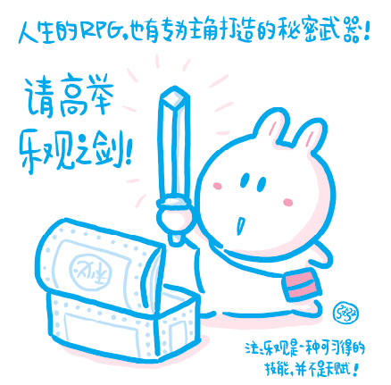
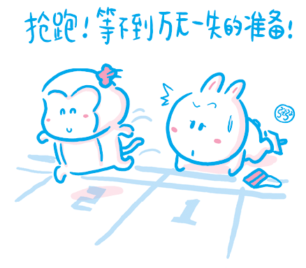
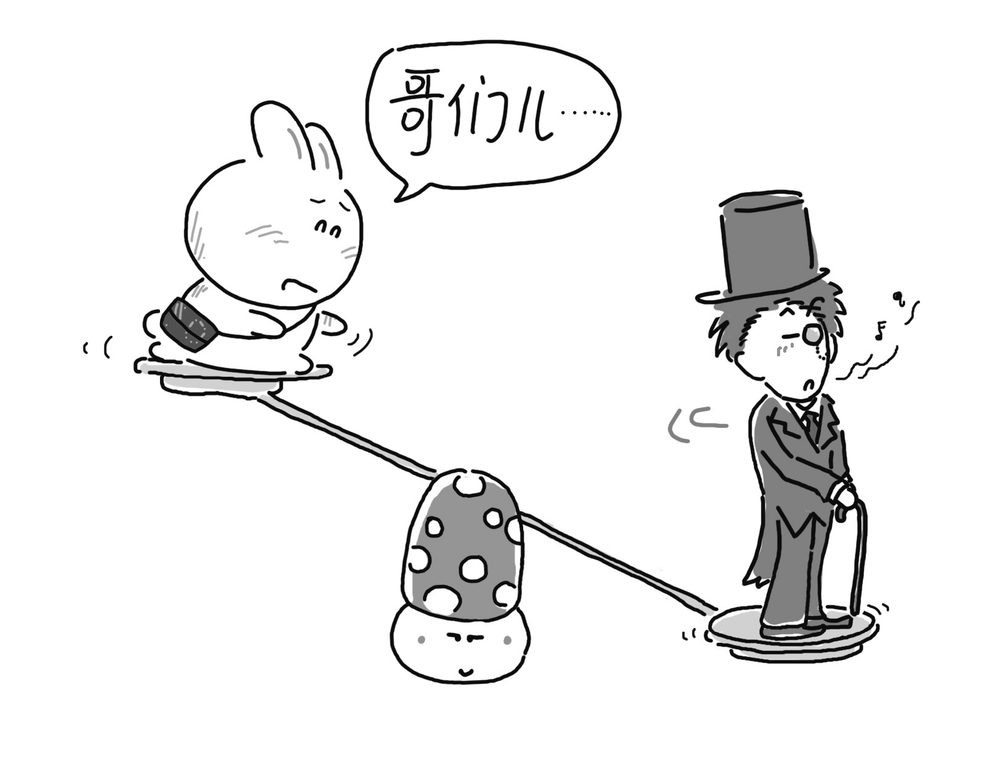
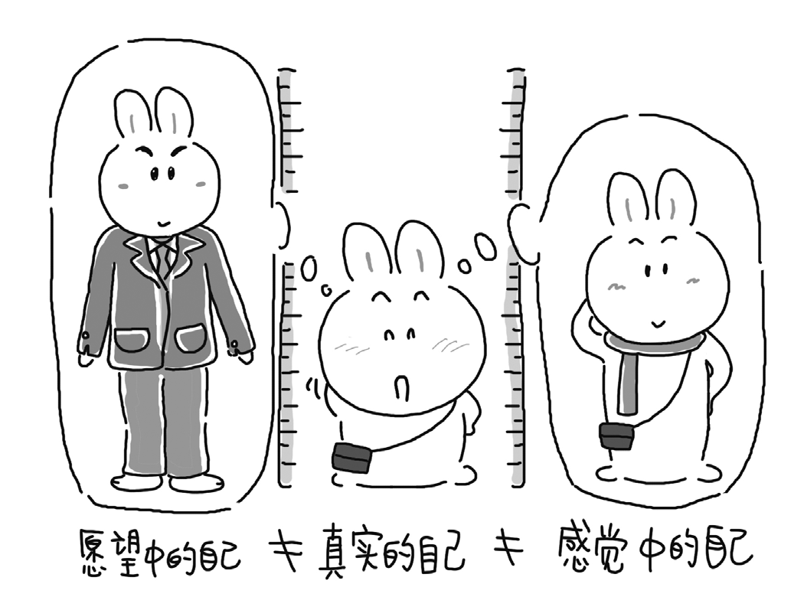
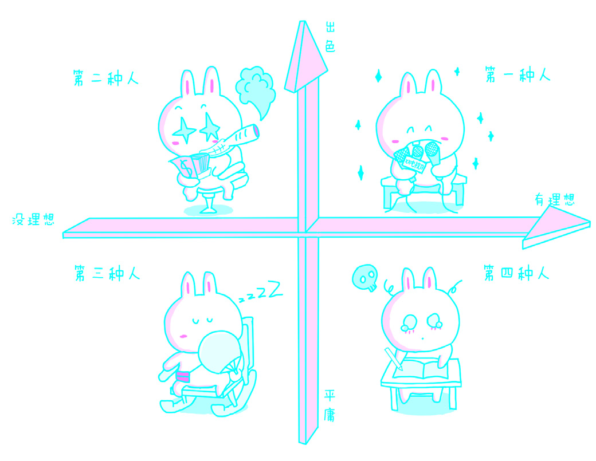
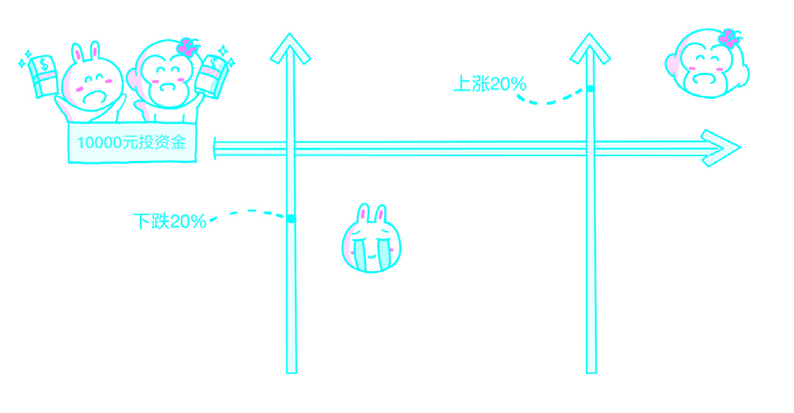

# 第七章：应用

## 1. 兴趣

经常有学生向我表示他对目前的专业没兴趣——他真正感兴趣的是某某专业。看得出来，这些人常常不快乐，因为他们（觉得）自己正在做自己不喜欢做的事情。

然而，事实果真这样吗？不客气地说，在99%的情况下，并非如此。

首先，这些人其实并不是对自己正在做的事情没有兴趣，而是没有能力把目前正在做的事情做好。几乎没有人会喜欢做自己做不好的事情，每个人都会不自觉地尽量回避自己的短处：跑调的人通常不大喜欢与朋友一块去唱歌；牌技差的人往往不情愿被叫去补缺；不擅交往的人通常开会的时候选择坐在角落……当然，有少数人例外，这只是因为他们并不自知：跑调的却居然是麦霸；牌技很差的总是组织牌局又无牌品；不擅交往的又爱出风头招人厌烦。但不管整体怎样，对一个人来说，一定要问自己这个问题：我不喜欢做某件事情，是不是仅仅因为这件事我没有做好？若是因为自己没有做好而不喜欢，就要考虑另一个问题：做好这件事情究竟对自己有没有意义？如果有，那就要努力做，直到做好为止，没有其他选择。反过来，自己做得挺好，但就是不喜欢，纯粹因为那件事对自己确实没有什么吸引力——事实上这种情况少之又少——那就直接换一件事情做吧。谁能逼你去做一件你确实不喜欢做的事情呢？退一步说，如果你被逼着去做自己能做好的事情，应该也会有些兴趣的。

其次，人们总说他们真正感兴趣的是其他事情。可事实上，出现这种感觉应该仅仅是因为他们还没有开始做那件事，也还没有在那件事上遭受挫折而已。其实，很多人真的放弃原来做的事情，转去做新的“真正感兴趣的”事情的时候，往往会发现，这件事想要做好同样困难重重，挫折不断。没过多久，这些人又会因为做不好这件事情而对其失去兴趣，然后开始幻想做另外的事情，并且将这一行为“合理化”：“我（才知道）自己真正感兴趣的并不是这个……”

> 这种做法在心理学上有个专门的概念，称为“[Rationalization](http://http://goo.gl/3Zfek)”。

综上所述，我觉得兴趣并不是很重要，至少没有我们想象得那么重要。对一个人来说，某件事情只要能做好，并且做到比大多数人好，他就不会对那件事情没兴趣。我有时候会看到，某些父母打着“培养孩子兴趣”的旗号教育孩子，面对这种情况，我能做的只有赶紧闭上眼睛——不愿意看到孩子就这样被害。但是，闭上眼睛却看得更清楚，因为我太容易想象出那需要很多年才能最终显现的，且由于早已逝去多年而遗忘了原因的最终结果。培养孩子的兴趣，不是买来一架钢琴或者一本书就可以的。正确的做法是：根据孩子的情况，选出孩子最可能做得比别人好的事情（这很可能已经是极其耗时费力的了）；然后还要绞尽脑汁让孩子学得会、做得好、做得比一般人好、做得比谁都好——兴趣就自然出现了。

说来说去，是顺序出了问题：往往并不是有兴趣才能做好，而是做好了才有兴趣。
人们总是搞错顺序，并对这样的错误毫不知晓。虽然并非绝对，但完成大多数事情，确实都需要熟能生巧。做得多了，自然就能擅长；擅长了，自然就做得比别人好；做得比别人好了，兴趣就浓起来了，而后就更喜欢做、更擅长……进入良性循环。可同样的，做得多，就需要大量的时间投入，所谓“没兴趣”，往往不过是结果，如果将它当作“不去做好”的理由，最终的惩罚就是大量时间白白流逝。

## 2. 方法

经常有学生提出这样的问题：“老师，这个方法真的有用吗？”其实，学生的问题不止如此，他们还有更进一步的问题。当然，关心方法没什么不对，只有聪明的人才会关心方法。可是，学生们总是过分关心自己正在用的方法是不是正确；仅仅正确还不够，还要考虑这方法够不够巧妙；更进一步，除了正确与巧妙之外，还要有效率——人生苦短，如果成功太慢，那么幸福必然减半。

可是，这些貌似出于“理智”的想法还是有局限的，否则，有一种现象就根本无法得到解释：很多人通过非常笨拙且低效的方法实现了自己的追求。这样的人很多，我的父亲就是一个。父亲是20世纪60年代黑龙江大学俄语系的毕业生，文革期间，在五七干校开始自学英语。在那个时代，收听[美国之音](http://goo.gl/jRjYk)不叫“收听”，而叫“偷听敌台”，是可以被定罪的。文革结束后，国家落实政策，他获得平反，自20世纪80年代初开始在东北的一所高校任教，担任英语系系主任，直至退休。他那个时候没有多少参考书，学习方法也没有什么特别之处。我曾经特意问过他很多细节，可以确定的是，他是从我的嘴里才知道这世上还有个什么“艾宾浩斯遗忘曲线”的。我常常惊讶于父亲没有“金山词霸”，没有真人发音的《韦氏字典》电子版，没有“我爱背单词”之类的软件，更没有什么超炫的秘籍，怎么就能把英语学得那么好！

另外一个相当能说明问题的例子涉及一位我所敬重的教授钟道隆先生。钟先生以他的<u>“逆向法”</u>著称。请读者注意，后文的描述没有任何冒犯的意思，我只是尝试述说事实。钟先生的方法不仅不新（其中的精髓——“听抄”或者“听写”，几乎是所有大学的外语系里最常用的基础训练手段），也并不特别高效。但是，不仅钟先生本人通过这种方法把英语学得很好——据说他从45岁开始学习英语，一年后成为高级翻译，很多使用逆向法的学生同样也获得了很好的学习效果。这是为什么呢？

> 参见《逆向法巧学英语》，钟道隆著，清华大学出版社，2001。

最夸张的例子则涉及另外一个人——大名鼎鼎的、“疯狂”的李阳。他操着一口让人折服的漂亮发音，用“疯狂”到让很多人为之震惊的态度，征服了大江南北无数的学生。无论有多少争议，有一点是可以确定的：在他自己通过“疯狂”获得成功的同时，确实也有很多学生因为使用了他的方法真正提高了英语水平。这又是怎么回事呢？

还有，我一度打工的地方叫新东方学校。那所学校的创办人俞敏洪，是从他的托福和[美国研究生入学考试](http://goo.gl/dqrFo)培训开始发迹的。他讲授的背单词的方法，就是目前最为流行的“词根词缀记忆法”。其实这个方法也不是什么灵丹妙药，只是一个辅助手段而已。但可以确定的是，俞敏洪本人确实有很大的词汇量，他的学生也确实用他的方法记住了单词并考出了好成绩。经过多年发展，新东方学校已经成长为“新东方教育科技集团”——一个国内英语培训领域的巨无霸。同时，它也成功地在美国纽约证券交易所上市，其中获益学生的口碑起了决定性的作用（新东方是很少拿钱在媒体上做广告的）。可是，俞敏洪起家的方法并不新鲜。

不知道别人怎么样，据我所知，我的父亲就不太欣赏“词根词缀记忆法”。有一次我跟他大谈特谈“词根词缀”，他听完之后的反应是：“你是用偏旁部首背下所有汉字的吗？你忘了在学会常用的3000个汉字之后再遇到不认识的字还是只好去查字典吗？不查字典非要用偏旁部首猜测的话，难道不是一猜一个错吗？甚至中文里有个专门的词告诫人们切莫‘望文生义’，难道你忘了吗？”我不知道李阳或俞敏洪当年在自己学习的时候，是不是也运用了钟先生逆向法里面的精髓——“听抄”，就算用了，估计也不是跟钟先生学的。但我确定地知道一件事：钟先生和俞敏洪校长都不“疯狂”，却十分成功。

这是一个不争的事实：他们都很成功，更准确地说，他们自己都很成功。但是，他们用的方法却并不相同，甚至可能相左。不过，如果仔细观察，我们就会发现至少有一点是完全相同的——他们都是非常用功的人。其实，我一直想说的是：方法固然重要，但是比起“用功”来说，方法几乎可以忽略不计。说清楚一件事不容易，说清楚这件事尤其不容易。直到有一天，在跟健身教练闲聊的时候，我突然获得了灵感，才有能力把这事说清楚。

我的教练臂围是43厘米，几乎和常人的大腿一样粗。有一次，他告诉了我他练习的诀窍——握哑铃的时候，一定要把手掌边缘贴到靠体侧的那一个哑铃片上。这样的话，哑铃的另一端将自然地向外翻转一个很小的角度，手臂屈伸的时候恰好可以使肌肉获得最大的曲张刺激。他介绍了这些心得后得意而灿烂地笑着说：“多简单啊！”而我却突然明白了另一件事：他的成功其实并非来自这个“简单而神秘的技巧”，因为我认识的另一位健身教练的臂围是45厘米，我却从来没看到他用这种方法握哑铃。

超出常人的臂围是这样练出来的：二头肌的常用练习动作只有那么三五个，每周专门针对二头肌练习一次，每次3个动作，每个动作至少要做5组，每组要重复做8至12次，哑铃的重量要计算到恰好再也做不动了为止，这样的练习要持续54周以上。至于如何握哑铃，关系并不大。最重要的只不过是——重复，不间断地重复，重复54周以上。

由此可见，所有学习上的成功，都只依靠两件事——策略和坚持，而坚持本身就是最重要的策略。坚持，其实就是重复；而重复，说到底就是时间的投入，准确地说，是大量时间的投入。据我的母亲讲，我的父亲学任何东西的时候都可以做到在并不“废寝”也不“忘食”的情况下利用所有的时间。<u>钟道隆先生很坦率地说</u>：“为了学会英语，我下的功夫是很大的。下面举几个具体的例子：坚持每天听写A4的纸20页，不达目的决不罢休，晚上开会晚了　也要补上。从1980年1月31日到1983年2月我调离沈阳为止，三年内写了一柜子的听写记录，用去了圆珠笔芯一把，听坏电子管收音机9部，半导体收录机3部，单放机4部，翻坏词典2本（因为我不断地在上面写和画）。”俞敏洪也是一个做他想做的事的时候超常用功的人。他是怎么学英语的我并不知道，但是我知道他为了把新东方做大，要提前一年安排下一年的时间表，如果把他的Outlook日程表打印出来，每天都是满满一页纸。即便是李阳，我相信，他的漂亮发音并不仅仅来自天分或者所谓的“疯狂”，而来自他“疯狂”了太多太多年。

> 参见《逆向法巧学英语》第三版1—7页。

相对于坚持，方法有多重要呢？很多时候，哪怕说“方法不重要到几乎可以忽略不计的地步”，其实也不是特别过分。更何况，所谓的“好方法”实际上是因人而异的。适合这个人的方法，放到那个人身上，很可能适得其反。换言之，适合所有人的方法很可能根本不存在。所以，有那么多的人将宝贵的时光虚掷在不停地寻找方法上，是一件非常可笑却又不得不令人扼腕叹息的事情。

与其不停地寻找“更好的方法”，还不如马上开始行动。

## 3. 痛苦

尽管情绪有很多种，但最需要控制的大概只有一种——痛苦。无论是谁，他的一生中都会充满各种各样的痛苦，包括肉体上的、精神上的，甚至同时来自两个方向的，还可能是莫名其妙的，逃之不脱，挥之不去。从小时候害怕打针的痛苦，到被小朋友们孤立的痛苦；从欲望无法得到满足的痛苦，到精神上不被理解的痛苦；包括但不限于自己躺在病床上承受痛苦的同时还要忍受被护士们的欢声笑语放大的痛苦……

对痛苦的深刻感受，会扭曲或者抹杀人们感知其他事物的能力。当一个人身处极大痛苦之中时，甚至可能完全丧失对外界的感受。如果孟姜女真的将长城哭倒，那么我猜，在那个她面对长城痛哭流涕的时候，用针去扎她，她都可能压根体会不到皮肤上的刺痛，因为她所有的心智都在用来把那长城哭倒呢。

即便是在正常情况下，我们对自身的痛苦也往往并不十分了解。最常见的误解就是：当我们觉得痛苦的时候，总是不自觉地把自己想象成全世界最痛苦的人。这是非常自然的，因为我们的痛苦我们已经体悟，而别人的痛苦我们又很难真正做到感同身受。所以，如果不去努力分辨的话，我们当然会认为“自己最痛苦”。

了解这种关系的好处在于，如果我们真的明白自己所面临的痛苦其实并没有自己感受到的那么强烈，我们就很容易——或者起码是比较容易——忍受那些痛苦。我经常这样提醒自己：即使我再痛苦，在目前这种状况下，我肯定还不是最痛苦的人。我会想到几个人，然后再问自己：“你比他还痛苦吗？”在这里，可以举两个例子。

> 有这么一个人，也许你知道他。1818年，他的母亲过世，那年他才9岁。1831年，他失去了工作，这显然使他很伤心。他下决心要当政治家，但糟糕的是，1832年，他竞选州议员失败了。他着手经商，可一年不到就难以为继。1834年，他再一次参选州议员。这一次，他实现了理想。可在紧跟着的1835年，他的女友就不幸去世。1838年，他尝试成为州议会议长，可惜失败了。直到1860年，在历经了更多的起伏与磨难之后，他当选了美国总统。他的名字是[亚伯拉罕·林肯](http://goo.gl/bqGvD)。可是，[他的噩运并没有结束](http://goo.gl/AXhbb)。1865年，他被暗杀了。

还有更夸张的。心理学家[斯科特·派克](http://goo.gl/8ubqE)有过<u>这样的记录</u>：		
> 最富戏剧性的案例之一是我曾经接触过的一个14岁男孩。在他8岁那年的11月，他的母亲突然去世；在他9岁那年的11月，他从梯子上掉下来，摔断了胳膊；在他10岁那年的11月，他骑自行车时发生车祸，造成头骨断裂，还伴有严重的脑震荡；在他11岁那年的11月，他从天窗上跌了下来，造成臀部骨折；在他12岁那年的11月，他从滑板上摔下来，导致手腕骨骨折；在他13岁那年的11月，他被汽车撞伤，造成骨盆断裂。
>
> 参见《少有人走的路》（*The Road Less Traveled*，1978）。

当我觉得痛苦的时候，我总是从笔记本里翻出这两条记录读一遍。到现在为止，我也从没像那个男孩一样不幸——他太不幸了，甚至有规律地不幸！有一年冬天，我患了重感冒，躺在床上，突然有点心烦，就把笔记翻出来看。在翻阅的过程中，我尽管知道自己这么想有点不厚道，还是不由自主地看了一下墙上刚刚翻到11月的挂历，心想，那男孩这时也躺在病床上吧……

痛苦就是这样。一旦我们能学会在痛苦出现的时候运用心智把自己的注意力转移到其他地方去，痛苦就会几近自动消失，而且在它被我们重新注意之前绝不会回来。

我们不必过分害怕痛苦的原因在于，心理学研究发现，人类的大脑有一种自我保护功能——遗忘痛苦。如果想要对这个结论进行确认的话，做一个简单的实验就行：拿出纸和笔，罗列一下那些昨天曾使自己觉得痛苦的事情、前天曾使自己觉得痛苦的事情、上周曾使自己觉得痛苦的事情、上个月曾使自己觉得痛苦的事情、去年曾使自己觉得痛苦的事情……一步步写下来就会发现，能列出来的内容越来越少。如果我们不努力回忆的话，10年前的痛苦是几乎想不起来的。更有趣的是，就算我们想起来了，说不定都会觉得不好意思——因为我们现在无论如何也想不明白，自己当初怎么就为那么一件小事痛苦到那个地步？

其实，我们的大脑需要遗忘痛苦。想想看，如果一个人的大脑不具备这个功能，他的生活将会多么凄惨！正因为人类大脑的这个功能，上了岁数的人往往会产生怀旧情绪，往往会慨叹“世风日下”，可这明显不是事实。因为，在过去的几千年间，每一代老年人都觉得世风日下，这种感觉如果是真实的，我们现在应该活在地狱中才对——但是，我们现在生活的这个世界，就算不怎么样，也没有那么差吧！狄更斯说得好：“[这是最好的时代，这是最坏的时代。](http://goo.gl/RbIjs)”

上了岁数的人遥望过去的时候，那些曾经让他们痛苦万分的事情早就被他们忘干净了，或者，他们早已无所谓了，然而，那些美好的事情他们却都能记得清清楚楚——他们当然会怀旧！所以说，怀旧是一种错觉，甚至更可能只是幻觉。曾有人这样比喻：“如果说记忆本身是葡萄，那么回忆的过程就是发酵。每个人都有努力使自己的历史变得更加清白、更加美好的倾向，所以，人往往会不自觉地给自己的记忆进行各种形式的修补、甚至进一步精加工，然后才会觉得心满意足。”

再举一个例子。统计表明，一个人不幸做了截肢手术之后，往往内心会极度痛苦。我们可以在脑海中体会一下：闭上眼睛，

想象一下自己的胳膊被切掉……在手术后的6个月之内，被截肢者会不停地产生轻生的念头。但是，如果经过6个月这个人还没有成功地自杀，那么他轻生的可能性已经不大了——痛苦正被渐渐遗忘，取而代之的是更多的希望。18个月之后，被截肢者自杀的案例少之又少——就算有，原因也往往不是截肢的痛苦。

大脑拥有遗忘痛苦的功能，这对整个人类顺利繁衍具有重大意义。可以想见，生育分娩是一个女人一生中可能面临的最大的肉体痛苦——只要她不是那么不幸地生活在刘胡兰或张志新所处的时代。然而，在体会如此惊人的痛苦经历后不到两年，她就会萌发生育下一个子女的愿望。人们往往对自己大脑的运转机制并无认识，所以，如果你有机会遇到这样一位女性，可以试着好奇地问她：“你不记得那有多疼了吗？”她保准会愣一下（因为她突然意识到那时确实疼得要死，但现在却无所谓了，可是也没仔细想过为什么），然后在下意识的慌乱中给你一个莫名其妙的答案：“你又没生过孩子，你不懂啦！”

作为一个可以运用自己心智的人，在了解了我们的大脑所拥有的这种遗忘痛苦的机制后，就可以解决另外一类因为反复出现而无法被遗忘的痛苦。

这类痛苦的一种很常见的表述就是：“怎么道理全明白，但就是不行呢？”谁都不愿意犯同样的错误，也很容易想明白发生这类事情是非常愚蠢的，但是，很多人怎么又在同样的地方跌倒了呢？无数人为此痛苦，夜不成寐，一遍一遍地骂自己。可是，大多数人经历了深刻的反思，却在第二天一觉醒来（其实只不过是几个小时）之后，再次回到从前的状态，没有任何变化。这些人甚至再度经历了“在深夜里暗骂自己许多遍”之后才会想起，不久之前自己也这样骂过自己。一旦他们意识到这种情况，往往会不禁长叹：“怎么就这么没出息，怎么会好了伤疤就忘了疼呢！”

我在教书的时候也曾观察到一个令我非常惊讶的现象：

> 为了真正解决学生的问题，我不得不重复其实已经有无数老师早就前仆后继地给他们讲过的道理。在这个过程中最要命的是，我的重复在被部分学生认为是有必要的同时，再次被更多的学生视而不见、听而不闻。我有时会禁不住绝望地想象，这些学生将来某一天还是会遇到同样的尴尬：他们会交钱去读另一个什么学习班，然后由另一个可能和我一样绝望的老师重复一遍我们都重复过的道理，而他们却根本没有意识到自己其实只不过是再一次浪费时间——因为他们还是听不进去，或者干脆“没听到”。

现在你可以明白，为什么许多人总那么“没记性”了吧？因为在他们遇到挫折或者面对那些由自己曾经的错误决定带来的惩罚的时候，他们会非常痛苦。而这种程度的痛苦，必然被他们的大脑自动列入“遗忘”的序列，并在他们的大脑里彻底消失。大脑的这种自我保护功能在每个人身上所表现出来的强度不同。有些人比另一些人更难遗忘痛苦，甚至有些民族比另一些民族更有能力记住痛苦。第二次世界大战过后，犹太人全球追捕甚至追杀纳粹成员就是一个很好的例证，他们甚至有一套牢记痛苦的办法。

通过前文的论述，我们可以看出，这种自我保护功能是很有意义的。但是，如果不对这种功能加以控制，我们就会遇到尴尬——“反复重犯以往错误”的尴尬。所以，虽然我们不是犹太人，但我们也要想办法，尤其是当我们意识到自己遗忘痛苦的能力特别强的时候。一个人遗忘痛苦的能力特别强的一个具体表现就是：这个人会很轻易地原谅自己。

要解决这个问题，有两个很简单却非常有效的办法。

一个办法是，在面临尴尬的时候，一定要用文字、图画等形式把自己所遇到的尴尬记录下来——当然，最好是记录在同一个地方。这样的记录是非常有意义的，因为它会提醒我们：这是你曾经遇到过的尴尬。如果不做这样的记录，那么“遗忘”肯定会发生。记录之后还要养成习惯，定期拿出这些记录回顾一下。这个习惯往往会使我们非常有成就感，因为它会让我们知道，甚至可以清楚地看到，自己已经进步了——因为以前记录过的很多错误我们都不再犯了——当然，不再犯那些错误的原因是我们在不停地提醒自己！

另一个办法是，面临尴尬的时候，尽量弱化痛苦，控制自己的情绪，不要被大脑的直接反应所左右。客观地说，我们面临的所有尴尬，肯定有一部分原因是自己造成的，所以，没必要找借口，没必要抱怨别人，没必要认为这世界就对自己一个人不公平，要记得“你并不孤独”——肯定还有其他人在不同的地方、不同的时间遭遇过同样的尴尬和痛苦。但是，有多少人能平静地对待痛苦，而又清楚地意识到自己不能被大脑的直接反应所左右呢？这样一想，我们也就释然了。只要我们认为这个事件没那么值得痛苦，大脑就很难主动遗忘这个事件——更何况我们早就把这个事件和经验记录在案了！想象一下吧，这两个简单的方法会在未来帮我们减少多少麻烦、节省多少时间！

另外，尽管“遗忘痛苦”是大脑的自我保护功能，但是这种“善意”的功能也同样会有副作用。在生活中，有些时候我们肯定需要牢记某些信息，甚至牢记大量信息。举一个背单词的例子。一个人准备留学美国，就要参加TOEFL、SAT、GRE或GMAT之类的考试（英联邦国家可能需要相当于TOEFL的IELTS考试成绩），而这意味着，他要牢记起码12000个英文单词——这是很多人一辈子也不可能完成的任务。

很多人并不了解自己大脑的机制，所以，他们不由自主地被自己的感觉所控制。他们把背单词当作一件特别痛苦的事情，以至于书店里总是有一大堆乱七八糟的、年年改头换面的所谓“趣味记忆法”的书来满足他们想要摆脱痛苦的需求。实际上，他们不知道，正因为他们把背单词当作痛苦的经历去处理，所以他们对每个单词的记忆都包含痛苦，而大脑为了保护自己，最直接的方法就是把这些单词遗忘！

因此，背单词的时候，或者更一般地说，在做任何一种必须记住大量信息的工作的时候，一定要想办法由衷地把这件事情当作一件快乐的事情来做。我的一个朋友曾跟我分享过他的做法。在当他终于搞明白自己要拿到奖学金就得有GRE高分的时候，他被单词量要求吓了一跳。他说，他用了两天时间才想出办法说服了自己：这应该是件快乐的事情。

他是这么算的——一共要搞定20000个单词，而因此可能获得的奖学金是每年40000美元左右，并且连续5年没有失业的可能；当时美元兑换人民币的汇率差不多是1比8，所以，这就大约相当于每年320000元人民币；如果一年的税后收入是320000元人民币的话，就相当于税前赚了差不多400000元人民币；这样一来，每个单词大约值20元人民币——这只不过算了一年的收入而已。

想出来这些，他终于让自己明白：背单词是非常快乐的。他每天强迫自己背下200个单词，在晚上验收成果，每当在确定自己已经记住的单词前面画上一个勾的时候，他就想象自己又拿到了两张10元人民币的钞票。他每天睡觉的时候总感觉心满意足，因为今天又赚了4000元！

我的这位朋友显然是一个有能力运用心智的力量控制自己的人。尽管在许多人眼里，他的想法简直天真可笑，但这恰恰是他最终比别人获得更多成就的根本原因。他不仅是个有能力自律的人，还是个有能力控制自己情绪的人。他用自己心智的力量给抽象的目标赋予了实际的意义，并从此拥有了比那些无法感知抽象事物的人更多的动力。坚持不懈是什么来着？策略加上重复。他的策略使他比别人重复得更轻松、更愉快，所以，最终他属于那些成功的少数派。

## 4. 比较

在很多人眼里，所谓的成功，不过是比较的产物，归根结底就四个字：“高人一等”，也即市井语言中的“牛屄”。不能做到比谁都牛，那么最好是“一人之下万人之上”，再退一步，也起码是比大部分人或者很多人更“牛”。容貌再好一点，能力再强一点，积蓄再多一点，粉丝再广一点，权利再大一点，地位再高一点，人脉再厚一点……欲望是无限的，现实却是残酷的，可人们“想要拥有未曾拥有过的物质或者资源”的强烈愿望，从未减少过哪怕一点点。

用这样的方法定义“成功”，从一开始就注定了尴尬的结局。财富也好，权力也好，地位也好，用这些东西去定义成功，只不过是说法不同而已，绝大多数人的追求不过如此。要是“比谁都牛”就是成功的话，这世界上就不会有成功者了——上帝最“牛”——如果祂真的存在的话，而且上帝还不是人，是神。然而，大多数人从来不觉得他们的定义有什么问题，不然怎么会有人为了做奴才甚至连阳具都肯放弃呢？这种例子古今中外到处都有，随手一抓，从指缝里都能漏出无数个。

事实上，被基督教定义为“七宗罪”之一的“嫉妒”也是这样产生的。嫉妒源于对自己和他人之间差异的扭曲理解。大多数人一生无法摆脱由比较而产生的情绪——不管是正面的，还是负面的。有人说：幸福是一种比较。更有人开玩笑说：对一个男人来讲，幸福就是自己的收入总是比妹夫的收入多20%。有句广告词颇为流行，其实上也是基于一模一样的心理：没有最好，只有更好。

但比较是相对的，相对是永远没有尽头的。

由此，我们可以轻松地想象：对那些把自己的幸福建立在与他人比较的结果之上的人来说，幸福和快乐永生永世难以获得，就算偶尔产生了幸福和快乐的感觉，也必然昙花一现，因为总有人会比他们更加年轻貌美、英俊潇洒，收入更高、权力更大，地位更尊贵、财富更雄厚。

很多时候，比较是一个坑，大坑。再干脆点说，比较就是陷阱。

有些人看透了这一切，却选择了逃避。这些人认为“万事皆空”，一切都是幻觉而已。他们声称自己可以跳出红尘，远离喧嚣。其实，这也不过是心智力量太弱的表现而已。

另一些人也看透了这一切，却没有选择逃避，而是坦然接受。他们运用自己的心智力量去分辨哪些快乐或者幸福是必须建立在比较的基础之上的，而哪些快乐或者幸福是无须比较同样可以获得的。接着，他们把时间花在寻找甚至制造那些无须比较就可以获得的快乐与幸福上——当然，这同样要付出很多代价——然后无怨无悔地生活，尽情地欢乐，平静地痛苦。

一位外科大夫感觉很快乐、很幸福，因为他刚刚从死神手里抢回了一个年轻的生命。一位中学老师感觉很快乐、很幸福，因为他刚刚给一群15岁左右的孩子讲清楚了感性与理性之间的微妙关系。一位生物所的研究员感觉很快乐、很幸福，因为她认为最近每天从床上爬起来一路小跑冲进实验室，观察记录她所培养的菌体，这实在是太美妙、太神奇了。一位母亲感觉很快乐、很幸福，因为她正坐在孩子的床边，孩子睡梦中的脸庞是那么安静，那么明亮，那么惹人爱怜……

生活无法彻底回避比较，但是，无须比较就可以获得的快乐和幸福也同样很多，只不过它们常常被人们忽略。于是，无数人花费大量的时间去追求必须通过比较才能获得的快乐和幸福，而他们最终获得的，只有更多的痛苦。可是，时间却不会仅仅因为结果无法被人们承受而倒流，时间的属性决定了每个人都不可能真正拥有从头再来的机会。有些人仅仅因为这样就开始寄希望于来生来世，这是相当可悲的。当然，还有更可悲的——有些人寄希望于下一代，而不顾自己的经验完全是“错误的经验”，只是单纯而又愚蠢地认为自己的经验毕竟是“多年的经验”……

其实，比成功更重要的是成长。如果“成功”是与他人比较的话，那么“成长”则是与自己比较——今天的我和昨天的我、明天的我和今天的我之间的比较。后一种比较显然比前一种对个体来说意义更大，也能够带来更加踏实的幸福感。

常常问自己一些这样的简单问题对成长很有帮助：我做完这件事之后所获得的快乐和幸福是不是一定要建立在比较的基础上？想清楚后，标记并优先实施那些无须比较就可以获得快乐和幸福的行动方案。时间会一如既往地流逝，但采取了这个方案的人会惊讶于自己生活的变化。每一秒、每一分、每一天、每一年，时间的质量由于对幸福的追求和感知的差异，竟然会如此不同。

## 5. 运气

运气究竟是什么？这是一个特别值得认真考虑的问题。如果我们不能把这个问题彻底想清楚，就很可能会因为错误的认知而不停地浪费时间。因此竟然浪费了一辈子的例子随处可见，无论古、今、中、外。

首先，运气是确实存在的。有人可以安全飞行二三十年然后光荣退役，可是也有人竟然第一次坐飞机就因事故丧生。当年泰坦尼克号离港的时候，有的人在临行时突然因为其他事情改变了行程，躲过一次大劫，可是竟然有人是偷着混上船的，最终难逃一死。有的人买了一辈子的六合彩，中奖了之后却发现那张彩票竟然丢了，可是怎么就会有人一辈子第一次买彩票就中了头奖——那可是¹⁄₁₈₀₀₀₀₀₀的概率！
并且，运气有好坏之分。如果六合彩中头奖的概率是¹⁄₁₈₀₀₀₀₀₀，而张三竟然中了，那么他一定会“觉得”自己非常幸运。反过来，如果李四买下了全部18000000张六合彩彩票，竟然恰好不小心弄丢了中了头奖的那张，那么他必然会“觉得”自己非常不幸。

为什么同样是¹⁄₁₈₀₀₀₀₀₀的概率，却让两个人的感觉天差地别呢？概率是一样的，不一样的是人的欲望。一个人觉得“幸运”，是因为他的欲望得到了满足；而一个人觉得“不幸”，是因为他的欲望落空了。

从理性角度出发，我们能体会的所谓的运气，只不过是因小概率事件发生而产生的感受而已。虽然概率有些时候是可以计算出来的，但肯定不是一个普通人能控制的。欲望尽管不可能总是得到满足，却是我们能够控制，甚至可能完全控制的。浪费时间、虚度年华的人，有一个共同的特征——拼命想控制自己完全不能控制的事物，却在自己真正能掌控的地方彻底失控。

一定要想清楚并牢牢记住：相信运气其实是缺乏自制力的表现。

我一直觉得，自己在大学期间不小心认真学习了概率论和统计学，是使我一生受益无穷的偶然。在那期间的阅读和思考，使我确定并且坦然接受一个现实：概率是独立于任何人存在的，因此绝对不会仅因为我的期望就发生任何变化。李宗盛在《凡人歌》里唱：“问你何时曾看见这世界为了人们改变？”听得我心惊胆颤。我认识到，从本质上来看，运气不过是与我完全无关的一种现实存在。换句话讲，尽管运气确实存在，但我不能相信运气，或者完整地说，我不能相信运气与我有关。

这样的认知会使人变得越来越理性。看到足球场上裁判投硬币决定谁先开球的时候，我们知道这是公平的；而瞥见双方队员中的一些人竟然闭目祈祷的时候，我们知道其实他们的行为是可笑的、无效的，并且压根无关紧要。得到了这样认知的人，一定会永远清楚地记得那个时刻：那一瞬间，他第一次意识到原来自己可以仅仅通过接受现实、控制自己就比大多数人更为强大。他开始理解为什么那么多的人迷信血型、星座，翻查黄历决定自己的运程，偷偷献祭求吉兆，或者背地里诅咒自己或讨厌或憎恨的人不得好死。以上行为无一例外，不过是人们在面对自己完全无法控制的现实时所表现出的软弱和无奈而已。

有些人不喜欢甚至害怕自己控制不了的事情，而且，越脆弱的人越希望获得控制权。同时，他们越是意识到自己没有控制权的时候就越害怕。<u>电影里最好玩的相关场景是一个胆小如鼠的人哆哆嗦嗦地拿着枪，却对同伴大声喊道：“谁说的？我能搞定！”</u>所以，[爱默生](http://goo.gl/ogxWg)说：“弱者相信运气，强者只究因果。”与此相关的一个有趣现象是，真正的“赌王”都不相信运气。他们不是因为“运气好”而常胜，他们之所以赢多输少，只是因为他们花了更多的时间和精力去研究并且计算概率。他们只想办法赢，从来不赌。反过来，那些相信运气又好赌的人，却永远得不到善终。

>> 电影[《低俗小说》](http://goo.gl/D3KF)（*Pulp Fiction*, 1994）的片尾就有这样的桥段。
>
> 原文为“Shallow men believe in luck. Strong men believe in cause and effect.”

当好运气发生在自己身上时，我们确应该非常开心；而当坏运气降临在自己身上时，我们也应该平静接受。无论怎样，我们都要继续生活，当然也要继续面对我们不能控制的事物。其实，这是苏轼早就总结的生活态度：“卒然临之而不惊，无故加之而不怒。”

用这样的认知去观察身边的人，我们很可能会马上达成共识：那些相信“好运气”存在的人，其实往往是为了逃避尴尬的现状，才寄希望于所谓“奇迹”的出现，以求轻而易举地“<u>咸鱼翻生</u>”；而那些相信“坏运气”存在的人，常常是为了逃避过往的责任。如果一个人面对现有的尴尬，不愿意承担责任，他最方便的做法之一就是去抱怨坏运气。相信我，如果一个人肯坦然面对真实的自我，他最终会发现，他今天面临的所有尴尬或多或少都有自己的责任。相信运气存在的理由非常多，法国作家兼制片人[让·谷克多](http://goo.gl/tRl1B)就戏谑道：<u>“我们必须相信运气。要不然怎么去解释我们不喜欢的人竟然会成功呢？”</u>

> 咸鱼翻生：来源于粤语想象词咸鱼返生（是死过返生的想象，由于死过读起来不吉利，所以用咸鱼代替以避免直接说），由于读音问题返通常写作翻或番。
>
>原文为“We must believe in luck. For how else can we explain the success of those we don’t like? ”

另外还有一个非常有趣的心理学现象：如果一个人相信好运气，那么他的生活并不会因此变得更好或者更差；可是，反过来，如果一个人觉得自己是个倒霉蛋，那他的生活一定会因此变得更糟。所以，尽管生活不应该盲目乐观，但一定不能失望悲观。神奇的是，乐观生活、坚持努力，往往真的会改变一个人的运气。大约2500年前，[塞内卡](http://goo.gl/iLM3F)就把这件事说得非常清楚：“所谓幸运就是当你准备好了的时候机会来了。”

世间所有骗子下手的时候，第一步就是想尽一切办法让受骗者相信“机不可失，时不再来”；而受骗者一旦相信这是一个“不可多得、不容错过”的机会，就会在这种想法带来的压力下做出非理性的选择。所以，千万不要相信“机不可失，时不再来”。当一个人没有准备好的时候，对他来讲，不存在任何机会。机会时时刻刻都会出现在我们身边，关键在于，我们有没有足够努力，做到“万事俱备，只欠东风”。而当一个人准备好了的时候，随处都是机会，而且所有的机会都是切实的、可以把握的。

我们也恰恰因此而崇尚努力。尽管[法兰克·奈特](http://goo.gl/rE3tC)曾提出一个相当正确的观点：<u>“努力”相对于另外两个因素——出身和运气——是最无足轻重的。</u>但是，我们仍然可以看到很多现实的例子：有相当数量的人都确实通过“努力”改变了他们自己的“运气”，进而改变了他们后代的“出身”。

> 原文为“Ownership of personal or material productive capacity is based upon a complex mixture of inheritance, luck and effort, probably in that order of relative importance.”

## 6. 人脉

有一次在北大举办讲座的时候，我遇到了一位学生，他问我：“老师，你说是认真学习重要，还是经营人脉重要？”看着他一脸大杂烩的样子，我先拿出本子记下了这个问题，然后对他说，这是一个比较大的话题，我会仔细写篇文章放在网上的，跟着给了他我的网志地址。最后，我又补了一句：“相信我，所谓的人脉就算重要，也根本没他们说的那么重要。”

到书店里看看吧！在某个专柜或者专区里，有多少书的书名中有“人脉”二字？太多了。《人脉：关键性关系的力量》、《人脉圈：人脉决定输赢，人脉决定命运》、《人脉是设计出来的》、《赢在人脉》、《打造黄金人脉》、《90秒建立职场人脉》……书名中有“人际关系”的就更多了。我写这段话的时候，在“当当网”上搜索“人脉”，可以找到521个结果，搜索“人际关系”，可以找到4949个结果，而搜索“成功”，可以找到53879个结果……

随处可见的胡说八道基本上都没有什么区别，反正都是胡说。以下从某本书里摘录的文字是还不算最过分的：

> 中国，最奇妙的现实问题是讲“面子”，这种典型的例子不但在政治界经常可以看到，在商业界更是多见。比如说，你想把商品推销给客户时，另外一家公司也在作同样的竞争，估计胜负情势是四比六，对我方不利，在这种情况下，如果你有一位支持者，而其“面子”能够通达客户的高层，那么只需凭此人的一句话就可转败为胜了。我们再举个例子，假如你想向公司提出一个方案，而意见是不是能够被采纳，就要看公司里有多少人愿意帮你的忙，愿意支持你，即可大致估算出结果。这就是人类社会的现实面。如此看来，“由支持者的多寡可以判定其是否为能干的生意人”的说法并不为过。事实上，被称为“办事高手”或是“能干”的人都具备一个条件，就是在公司内外有许多人事“通道”，也就是说，他的人脉很广，“面子”很大。

而在一小段文字里面可以做到谬误连连，其实也不是很容易。

> ……如果你有一位支持者，而其“面子”能够通达客户的高层，那么只需凭此人的一句话就可转败为胜了。

除了“腐败”之外，在正常的世界里，这种情况可能发生吗？

>……假如你想向公司提出一个方案，而意见是不是能够被采纳，就要看公司里有多少人愿意帮你的忙，愿意支持你，即可大致估算出结果。

意见是否会被采纳，在正常的世界里，关注点应该是那个意见本身的道理吧！如果那个意见考虑得非常周全、有明显的好处，会有那么多人反对吗？

用“面子”就可以获得一切，想得美！

让我们从头细说。先动脑思考一下：我们愿意与什么样的人成为朋友？

从幼儿园开始，每个人就都已经有了一些选择朋友的原则——尽管并不自知。事实上，资源分布的不均匀，必然造成人与人之间的某种依附关系。观察一下就可以发现：幼儿园里玩具多的孩子更容易被其他孩子当作朋友。那么，玩具最多的孩子朋友最多吗？答案并非肯定。

我曾经有机会、也恰好愿意多花一点心思与我遇到的那个“玩具最多的孩子”交谈。我没过多久就发现，在他的心目中，与所有成年人一样，“朋友”被划分为“真正的朋友”和“一般的朋友”。

为了行文方便，以下我姑且把那个玩具最多的孩子叫做“小强”。

我发出询问后很好奇，但也耐住性子等待小强告诉我谁是他“真正的朋友”。最终，他告诉我，他真正的朋友只有两个。一个是男孩，一个是女孩。之后我问他：“为什么你认为那个男孩是你真正的朋友？”小强一秒钟都没犹豫：“他从来都不抢我的玩具，他跟我换。”我又问他：“那，为什么你认为那女孩是你真正的朋友？”这次小强踌躇了好一阵子，在确定我会给他保密之后，磕磕巴巴地说：“她好看。我把新玩具全都先给她……”我笑。过了一会儿我问他：“她觉得你好看吗？”小强愣了一下，满眼的无辜：“不知道……”我又问：“那她现在手里的玩具是谁的？”小强突然显得很紧张：“不是我的。”我决定不去问那小女孩什么问题了。

基于种种原因，生活中广受欢迎的人总是少数。但同样基于种种原因，大多数人并不知道那些少数派们是如何理解他们的行为的，从小强的这个事例里就可见一斑。刚才小强说他那个“真正的朋友”从来都不“抢”他的玩具，而是跟他“换”。注意这两个词。

我们暂且不讨论所谓的“心计”。确实有些人有很深的城府，他们可以用常人想不出的，或者常人就算想得出来也做不到的手段，达到自己的目的。在这里，我们只讨论最普遍的情况。

所有的人都喜欢并重视甚至偏爱一种交换——公平交换。小强也许并没有意识到，他所拥有的玩具数量使他从概率的角度出发很难遇到可以和他“公平交换”的人，因为绝大多数孩子没有多少玩具，甚至干脆没有玩具，那些孩子实际上没有机会也没有能力与他进行“公平交换”。对他来讲，不公平的交换，等同于“抢”，没有人喜欢“被抢”。而与他换玩具的那个男孩，让小强感受到公平。小强也有自己想要但手里没有的玩具，所以，他也愿意去“换”，而不会去“抢”，因为他自己就不喜欢“被抢”——然后，把最新的玩具都给那女孩先玩……

尽管绝大多数人不愿意承认，但他们的所谓“友谊”实际上只不过是某种意义上的“交换关系”。可如果某人自己拥有的资源不够多、不够好，那么他就更可能变成“索取方”，做不到“公平交换”，最终成为其他人的负担。这个时候，所谓的“友谊”也就会慢慢无疾而终。当然也有持续下去的情况，但与其说这是由于另外一方珍视友谊，还不如说这是另外一方在耐心等待下一次交换，以实现“公平”。电影[《教父》](http://goo.gl/8Yurm)里就有这样的桥段：棺材铺的老板亚美利哥·勃纳瑟拉决心找教父柯里昂替他出气并为自己的女儿讨回公道的时候，亚美利哥就是“索取方”。许多年后，教父柯里昂终于在一个深夜敲开了亚美利哥的门……

可以想见，资源多的人更喜欢也更可能与另外一个资源数量或者质量对等的人进行交换，因为在这种情况下“公平交易”更容易产生。生活里随处可见这样的例子，哪怕是在校园这个“交换”本质体现得不是那么明显的地方，同样性质的行为也并不鲜见。比如，某系公认的才子与其他系公认的另一个才子会“机缘巧合”地邂逅并成为“死党”，俗话说的“英雄所见略同”可能就是他们一见如故的原因。如此，他们之间的谈话以及任何其他活动，往往都会让他们觉得相互非常“投机”。仅举一例。

> 在1982年第一届全国中学生计算机竞赛上，[沈南鹏](http://goo.gl/zZV1q)和[梁建章](http://goo.gl/iYo99)这两个“数学神童”同时获奖。当他们第一次相识时，这两个懵懂少年绝不会意识到，17年后他们会联手创造一个中国互联网产业的奇迹。

不是因为他们要好才各自变得优秀，而是因为他们都很优秀才会非常要好，进而碰撞出绚丽的火花。

反过来说，这些被公认为优秀的人，往往并不“低调”，也不“平易近人”。他们不是故意这样做的。他们无意去惹恼身边那些在他们看来“平庸”的人，只不过他们无形中有这样的体会：与这些人交流，沟通成本太高。这些人当中不多见的那些心态平和者，一般都是经历了波折，才终于意识到自己应该保护自己。他们发现，有些误解根本没机会解释。于是，他们开始“谦虚”，他们学会“低调”，他们显得“平易近人”。

许多年前我就注意到了一个现象：我会在别人求助于我，而我内心其实非常抵触的时候，因为怕别人说我是“不够意思的人”，硬着头皮去做自己不想做的事情。我在一次深感受伤的时候有了一个闪念：原来这种尴尬并非来自我没有“乐于助人”的品性，其原因是我的精力并不足够旺盛，无法在将自己的事情处理得井井有条的同时，拿出大把的时间和精力帮别人做事——事实上，我自己根本已经是个正在“过河”的“泥菩萨”了。想多了之后，我甚至开始怀疑雷锋的领导是否太白痴，因为他没有给自己的下属分配足够的工作——这是那天晚上于我来讲非常惊喜的一件事——我发现我正在独立思考。

承认自己能力有限，是保持心理健康的前提。从我重新思考“雷锋的领导”那天开始，我就主动挣扎着去学习如何做事量力而行了。说起来好笑，我自己的智商实在是有限，有限到过去竟然没想过“量力而行”是如此高难度的行为模式：第一，承认自己能力有限；第二，不怕在别人面前露怯；第三，敢于不去证明自己是“好人”……

从这个层面上讲，的确往往只有优秀的人，才会拥有有效的人脉。而且，正因为这些人随时随地都可能要回避“不公平交换”的企图，他们会更加注重自身的质量，知道“不给他人制造麻烦”、“独善其身”是美德，这也体现了常言说的“事多故人离”。而那些不优秀的人，往往并不知道这样貌似简单的道理，他们甚至没有意识到，他们的状况使他们只能扮演“索取者”的角色，进而把每一次“交换”都变成“不公平交换”，发展到最后，极有可能导致交换落空，因为谁都不喜欢“不公平交换”。他们每次落空的交换都会进一步给自己造成损失，使他们拥有的资源不是数量减少，就是质量下降，继而使他们沦为“索取者”的可能性更高——恶性循环。

还有一些人，过分急于建立所谓的人脉，甚至全然不顾自己的实际情况。人们常用一些专门的词来描述这样的人，例如“谄媚”、“巴结”、“欺下媚上”甚至“结党营私”等。这		样的人，往往也不是他们自己故意非要如此不可，他们只是朦胧地意识到，一个人的力量过于渺小，所以才希望借助其他力量。而一个人的能力越是渺小，他的欲望就会显得越发强烈。这些人的特征非常明显，其中之一是：他们会在生活中经常有意无意地用亲密的方式提及大家仰望的人物，无论他们与这些“大人物”是否真的存在私交密往。在中文语境里，他们就会只说名字而不说姓氏：[李开复](http://goo.gl/tKvO3)不叫“李开复”，在他们嘴里是“开复”；[李彦宏](http://goo.gl/ePcz1)不叫“李彦宏”，在他们嘴里是“彦宏”；沈南鹏不叫“沈南鹏”，在他们嘴里是“南鹏”；最近我听到更恐怖、更令人毛骨悚然的是，“小俞”（[俞敏洪](http://goo.gl/48Z9p)）、“小邓”（邓峰）、“大想”（[李想](http://goo.gl/2cltv)）……

从整体上看，人脉当然很重要。不过，针对某个个体来说，比人脉更重要的是他所拥有的资源。有些资源很难靠白手起家获得，比如金钱、地位、名誉。然而，有些资源却可以轻易从零开始积累，比如一个人的才华与学识。才华与学识，是一定可以通过努力获得的。一个人的心智能力一旦正常开启，他就会发现，自己在这个信息唾手可得的世界里，只要正常地努力，并且有耐心和时间做朋友，很容易就能成为至少一个领域的专家。努力并不像传说中的那么辛苦，说出来只不过是——每天至少专心学习、工作6小时。可是，努力需要的耐心，却远比多数人想象中来得巨大，“要与时间相伴短则5年，长则20年”。

经过长时间的观察，我又发现了另外一个多年前智商平平的我不是很容易能想明白或者轻易预见的事情：如果一个人的身边都是优秀的人，就往往会出现没有人求他帮忙的景况，因为优秀的人几乎无一例外都以耽误别人的时间为耻，同时，这些人恰恰因为能够独立解决遇到的问题才被其他认为是优秀者。

如果有一天，某个人经过长期的积累，真正成为某个领域的专家，他必会惊喜于真正意义上的、有价值的、所谓“高效”的人脉居然会破门而入。他所遇到的人将来自与以往完全不同的层面和意想不到的方向，而他自己也不再是过去一无是处的“索取者”，他扮演的将是“乐于助人”的角色——很少有人讨厌善意的帮助，更何况这个人是被我们找来提供帮助的。

甚至，这些优秀的人会获得意外的帮助。一个优秀而有价值的人，自会引来很多其他的优秀而有价值的人主动为其提供帮助，而这时候的帮助往往是“无私”的。正如没有哪个医生会在救死扶伤之后仅仅因为酬劳太少而恼羞成怒一样，那些品质磨炼到一定地步、境界豁达到一定层次的人，往往真的可以做到“施恩不图报”，因为对他们来讲，能够有机会“验证自己的想法”就已经足够重要、可以令人身心愉悦了。同时，被帮助的一方也正因为并非寻常之辈，所以一定懂得“滴水之恩，涌泉相报”的道理，最终的结果自然是皆大欢喜；又因为“沟通成本几近于零”，整体效果自然是“交流收益相对无穷放大”——良性循环。个中生活智慧在于：集中精力改变那些自己能够改变的事情，暂时忽略那些自己不能改变的事情。专心打造自己，让自己成为一个优秀的人、一个有用的人、一个独立的人，比什么都重要。打造自己，就等于打造自己的人脉——如果人脉真像传说中那么重要的话。其实，我总觉得关于人脉导致成功的传说虚无缥缈，不过是些不明真相的人臆造出的幻象罢了。

特别澄清一下，我并不是说，我们从此就不用关心自己身边的任何人了，或者说从此就无须与任何人打交道了。与人交往也是一种需要学习，并且也需要耗费大量时间实践的技能。我只想提醒读者：别高估自己，误以为自己有足够的时间可以妥善地处理与身边所有人的关系。浏览一下手机通讯簿里的名字吧！有多少人我们已经很久没有联系了？我至今只听两三个人这样回答我：“最长时间没联系的，也不超过两个星期。”而这些人中还有一个是特别固执且特殊的人——他的手机通讯簿里总共才有22个名字。

[毕淑敏](http://goo.gl/8Q2yz)在小说《女心理师》的自序中曾经提到：

> ……我学心理学课程一事，纯属偶然。朋友XX摔断了腰椎骨，打了石膏裤，瘫躺床上三月。我在自家墙上的挂历上写了一行字：“每周给XX打个电话。”我当医生出身，知道卧床不起的病人非常寂寞，希望能躺着聊聊天。后来我就按照挂历上的提示，每周都给这个人打电话，有一句没一句地闲聊。尽管我很忙，还是会多磨蹭一点时间，让她开心。后来有一次，她随口说香港中文大学心理学教授林孟平到北师大带学生……我问，我能跟她学习吗？朋友说，那可不知道。后来感谢那位朋友说，我能学心理学，多亏你摔断了腰。

我由此领悟，真正的关心最终只有一种表现：为某人某事心甘情愿地花费时间，哪怕“浪费”时间。

这也很容易理解。当我们把时间花到一个人身上的时候，相当于在他身上倾注了自己生命的一段——不管最终的结果如何，那个人和那件事都已经成为我们生命中的一部分。每个人的时间都是有限的，所以，“真正的好朋友”谁都只有几个而已。

这实在是一个大到足以写两本书的话题。碍于篇幅，我只能提供两个简单但实践起来并不那么容易的建议了：

> ▷ 专心做可以提升自己的事情，学习并拥有更多、更好的技能，成为一个值得他人交往的人。
>
> ▷ 学会独善其身，以不给他人制造麻烦为美德，用自己的独立赢得尊重。

## 7. 自卑

每个人都有一个“愿望中的自己”，同时还有一个“感觉中的自己”。

最佳状态貌似是：

> 愿望中的自己 = 真实的自己 = 感觉中的自己

然而，通常的情况远非如此。其实，很多时候，一个人如果处于这种状态：

> 愿望中的自己 ≠ 真实的自己 = 感觉中的自己

已经是相对非常幸福和快乐的了。许多人在某些方面更可能处于这种状态：

> 愿望中的自己 ≠ 真实的自己 ≠ 感觉中的自己

就充满了这样或那样的扭曲。这些扭曲，往往会使我们做出莫名其妙的、违背理性的决定或者选择。而时间才不管谁的选择或者决定是否理性，无论怎样，它都一如既往地流逝。

所有可能的扭曲，几乎全部来自那个实际上最不可靠的，但是我们又必须依赖的“感觉”。我们的“感觉”是非常不准确的，并且是特别容易受到影响的，甚至还是最可能被误导的。最明显的例子就是魔术。所有的魔术，都是通过并利用我们感觉的缺陷或者盲区达到神奇效果的。

一个人的外表，即相貌与身材，是其最容易产生感知扭曲的方面。其原因也简单——人与人之间最容易分辨的差别就是外表。可是，通过感觉却没那么容易获得关于外表的真实信息。因为，在外表审美的过程中，每个人或多或少都会受到“补偿心理”的影响。比如，一个胖男人往往更喜欢所谓的骨感美女，一个瘦女人也常常更容易对体格粗壮的男人产生好感。这种扭曲直接产生的一个有趣现象是，在明星圈子里，那些被普遍认为相貌出众的人之间所谓“美”与“丑”的差异，并不比普通人之间的小，甚至可能更大。

简单分类讨论一下。如果一个人真的帅，而他又觉得自己帅，那么当他“感觉中的自己”等于（或者误差很小地约等于）“真实的自己”的时候，人们很可能会认为他很自信，他也会“觉得”自己非常自信。然而，当他“感觉中的自己”远远超过“真实的自己”的时候，人们会评价他“自负”，而他则可能因为这种感觉上的误差，在其他地方或多或少地付出一些他想不到的代价。

如果一个人的相貌超出平均水准，那么他通常不太容易因此自卑，而他“愿望中的自己”就算可能超出“真实的自己”，一般也并不会差于“感觉中的自己”。

但是，如果一个人的相貌低于平均水准，那么他就很可能因此自卑，因为他“愿望中的自己”有可能远远超出“真实的自己”，而“真实的自己”总是会通过各种方式纠正“感觉中的自己”——尽管他自己可能会有意无意地拒绝这种纠正。

于是，“感觉中的自己”是有限的，“愿望中的自己”是“没有最好，只有更好”的，二者之间的差是一个非常大的负值——自卑形成了。

问题不止这么简单。

首先，作为整个社会的一员，大多数人并没有意识到，有时候，整个社会向他灌输的观念可能是错误的。道理也很简单：每个人都是通过自己的感觉感知这个世界的，而“感觉”本身非常不准确，且特别容易受影响，甚至被误导。显而易见，整个社会的观念不过是绝大多数人的观念的组合，其中必然包含未矫正的、粗糙并扭曲的所谓“真实的感觉”。

在几乎所有的社会中，来自整个群体的、对每一个个体的心理健康最不利的，也许就是“自卑”的定义了。古今中外，几乎在任何一个人类组织系统当中，“自卑”都被定义为负面的，“自负”也是负面的，只有“自信”才是健康的。其实这种定义并没有什么价值。假想一下，我们若能生活在一个“感觉”可以准确反映现实的社会中，那么所有类似“自卑”、“自信”、“自负”的概念就都没有存在的必要。但是，这样的社会并不存在，现实是，人们生活在一个由于“感觉”的偏差而自然扭曲的社会中。“感觉”本已不准确，再在其上进行价值定义，以图进一步改变感觉，更是大谬。

为了自己的心理健康，我们其实有必要选择性地漠视甚至忽略整个社会灌输给我们的观念——很多时候，那不过是“整个社会的扭曲的感觉”而已。所以，自卑不是缺点。该自卑的时候就要自卑，这才是正常的。如果谁在所有该自卑的
时候竟然从不自卑，那他就真正扭曲了自己。

其次，我在与学生的大量交流中反复发现这样一个现象：优秀的人更容易自卑。

我们往往认为一个人的优秀与自信成正比，可事实上并非如此。让我们假设某人（姑且称他为“甲”）非常优秀。那么，有一点是很容易想象的：甲与所有的人一样，不大可能是完美的。更有可能的是：甲在某方面非常优秀，而在其他方面的水平只是一般而已，甚至低于平均水平。但是，优秀的人往往会给自己制定过高的标准，甚至想当然地认为自己在各个方面都应该相当优秀。于是，甲所拥有的非常优秀的那些方面——假设可以打99分（100分制，下同）——相对于他所拥有的水平一般的那些方面——65分——差距太大——高达34分。

而另外一个没那么优秀的人（姑且称他为“乙”）所拥有的还算优秀的那些方面——80分——相对于他所拥有的那些水平一般的方面——60分——差距仅有20分。这样一来，从自我满意度的角度来看，优秀的甲要比平凡的乙承受更大的落差。如果只考虑落差本身，那么甲明显会感受更多的痛苦——尽管他实际上无论在哪个方面都比乙优秀。

从这个角度出发，反倒是那些资质在各方面都处于平均水平的人更不容易自卑。通常，一个人差也差不到哪里去，因为差到极致的难度绝不亚于好到极致的难度。所以，资质处于平均水平附近的人，从概率的角度来看，几乎不会遇到极大的落差。

从这里就可以看出：完全从自我感受的角度出发，芙蓉姐姐是完全没有理由自卑的，而从客观的角度出发，芙蓉姐姐的自信甚或自负，其实与其他人也完全没有任何关系。而她的行为竟然引来了愤怒。被芙蓉姐姐激怒的人们心里可能是这么想的：我都没怎么样呢（我自认要比你强多了），你凭什么跳出来？！

症结就在这里：自信和自卑的衡量标准是在自己身上，还是要以别人为参照物呢？事实上，既不该在自己身上，也不该以别人为参照物。美与丑的分别、强与弱的不同、慧与痴的差异，并不依附个人观点而存在，也不会因为任何人的看法而改变。

分析清楚后，我们就要着手解决问题了。想做到“不以物喜，不以己悲”的健康状态，要迈出的第一步就是——**停止嘲弄他人**。生活中我们很少真的遇到他人的“弱”影响了我们的“强”的情况。嘲弄别人“弱”往往只是为了证明自己的“强”，而真的“强”是不需要证明的，需要证明的“强”其实是清楚自证的“弱”。通过嘲弄他人而获得的“强”的感觉，必然是远离“真实的自己”的，在别人眼中，这种做法通常也只会被看作嘲弄者本身“自负”而已，而嘲弄者所体会的“自信”亦不过是扭曲严重的幻觉。从独立第三方的角度认真观察就会发现，结局总是：嘲弄他人最终收获的只能是对自己的伤害——常常是来自各个角度的全方位的伤害。

嘲弄者必被嘲弄——这简直就是一个恶毒的魔咒。我就有过一段与此类似的经历。我上大学的时候，也不知道为什么，男生宿舍里流行一种低级的游戏——扒裤衩。动不动就有一群人用莫名其妙的理由对某个男生群起而攻之，最终令被攻击的男生下身赤裸，羞愧难当。那个时候（20世纪90年代初），我们宿舍一共住了12个人，其中只有我从来没有参加过任何一次这种游戏。甚至在他们所有的人——包括那个被扒掉裤衩的——嬉笑一片的时候，我都笑不出来。也许是我实在看不出这件事好玩在哪里吧。大学毕业之后，有一天我突然想到：整个宿舍里，只有我从来没有被扒过裤衩，也从来没有谁对我有过这种企图。我们宿舍的老三因为身体最壮，4年内从未“失身”。然而，他在大学生活的最后一天，却“晚节不保”——10个人集体把他围了起来。10秒之后，他说：“我自己来还不行吗？”结果听到的回答是：“当然不行！”5分钟之后，他被扒得精光，锁在宿舍门外。这段经历让我终生受益。没有什么比这段经历更能清楚地让我明白“己所不欲，勿施于人”的道理。

另外一个比较“技术”一点的手段是“**忘记自己的优点**”。

这是一个多少有点夸张的说法，因为自己的优点实在很难被自己“忘记”。然而，这不仅是有道理的，还是有必要的。克服自卑的正确方式往往被认为起码应该是“克服缺点”，但有很多所谓的缺点是不可能被克服的。如果“相貌丑陋”勉强还可以花上一些钱整容的话，“五短身材”又该怎么办呢？在任何竞技活动中，如果准备不足，而心肌不够强大、肺活量相对较差，又怎么可能仅仅通过“深呼吸”就可以改善运动机能呢？所以，那些“如何克服缺点”的说辞不仅愚蠢，甚至可笑。

其实，更准确地说，克服自卑只需要“尽量漠视自己的优点”就好了。在一个“自卑”、“自信”、“自负”几乎全部被扭曲定义的社会里，一个人“尽量漠视自己的优点”带来的最直接的好处就是他会被赞誉淹没，因为他太“谦虚”、太“低调”了。其实，他也没做什么，只是做了一件所有成熟的人都善于去做的事情——让别人舒服。很多时候，所谓“谦虚”和“低调”其实是一种自我保护的优化策略。

“尽量漠视自己的优点”这一方案的意义并不仅限于此。如果一个人可以控制自己的感受，刻意做到“尽量漠视自己的优点”，那么他必会发现自身的一个重要变化：他的优点与缺点之间的落差被他人为地却同时自然地减少了，而这是一个貌似矛盾却非常合理的结果。这种落差的减小，必然会减缓他的不必要的痛苦。

还有一个相当不错的手段，是我的一位朋友告诉我的。她的方法是：**在自己的语言中，把“优点”和“缺点”这两个词替换成“特点”**。

我在讲作文课的时候经常说：“我们所使用的语言限制了我们的思维。”比如，在股票市场上，经常有人因为在思考的时候用词不当而损失大笔财富——当投资者所持有的股票价格下跌的时候，他们去描述缩水的市值时原本应该用的词是“账面损失”，而不是“损失”或者“实际损失”，但是，有些人没有经过思考训练，在描述缩水的市值时所使用的词是“损失”或者“实际损失”，于是，一些投资者承受不了心理压力（其实是自己吓唬自己），把手中的股票卖了出去，“账面损失”就真的变成了“实际损失”。反过来，在另外一些情况下，有些人因为误把“实际损失”当成“账面损失”而错失了减少损失的机会。所以，我认为这位朋友的方法是我见过的非常精巧却又能从根本上解决问题的方法之一。因为用“特点”这个中性词取代“优点”、“缺点”这种明显带有褒贬含义的词，她就能很容易地做到平静对待自己的各种特点，也平静对待他人的各种特点了。而这一方法背后还有更深的思考。其实，人们口中的“优点”和“缺点”往往是相对的。“调皮”的小孩子就算不被老师喜欢，也不能否认他们更有创造性；勇于冒险的人，在战场或者商场上可能成为英雄，也可能成为烈士；被称为“话痨”的人，也许平时挺讨人厌的，但是当老师就相对更有天分。

最后一个方法是“**适当地放纵一下自己**”。

承认自己是一个有缺点的人，是让心智获得解放的重要前提。前面说过，自卑原本只是正常的感受，不过是被定义成了负面的而已。与此相似，如果认真思考，我们会发现所谓的“虚荣”也是每个人再自然不过的愿望，却同样被定义为负面。其实，只要在不伤害他人情感、减损他人利益的情况下，对自己身上的缺点大可不必苛求。“自卑”一下能怎么样？“自负”一下能怎么样？“虚荣”一下又能怎么样？如果仅仅因为一个人“自卑”了一下、“自负”了一下或者“虚荣”了一下，他身边的人就受伤了，那么有问题的其实不是他，是他身边的人——他们太脆弱了。

所有的方法都需要花上一点时间和精力才能正确操作。拿出一张纸、一支笔，罗列一下吧。在左面罗列你的优点，在右面罗列你的缺点——花上一天时间也不过分，因为我们需要分辨“这个真的是我的优点吗”以及“这个真的是我的缺点吗”。完成这一步后，再试着猜想一下别人是如何看待我们的优点或者缺点的。我们甚至可以旁敲侧击地去了解一下——我相信，你会和每个人一样，屡屡吃惊，甚至目瞪口呆。在这个过程中，你会了解“真实的自己”和“感觉中的自己”二者之间的差异，甚至还有“他人眼中的自己”。在这些了解的基础上，再仔细分析一下：自己的缺点当中有没有可能会给其他人造成伤害的？如果有，请想办法克服。每个人都一定会有一些“无伤大雅的缺点”，适当地在这些方面放纵一下吧，相信我，这种“适当的放纵”对我们克服那些“可能会给其他人造成伤害的缺点”有巨大的帮助。

## 8. 灵感

我在读书的过程中经历的一个特别有趣的现象是，当我意识到自己需要找关于某个特定领域的书的时候，好书会自动出现——或者是朋友送的，或者是在书店、图书馆里随手翻到的，或者是在网上闲逛时看到不知道谁写的帖子里提到的，甚至可能是早就放在自己的书架上却一直没时间看的……

我最近遇到这种情况的次数相当多。在整理这本书稿期间，我在朋友的书架上发现了一本连他都不知道从哪里搞来却从来没打开看过的、借到手之后给了我许多启发的托马斯·叟的《学问与决策》英文原版；我在自己书架上的早就看过好几遍的《引爆点》、《本能》等书中，也“发现”了许多特别恰当的例子；我在书店闲逛时随手买了其中几乎随处都有内容可以验证我过去很多想法的《少有人走的路》；我在机场书店里看到了包装和设计都很差，但仅凭作者名气就可以保证读完不会后悔的毕淑敏的小说《女心理师》，里面有一个特别好的类比……

我这样一说，好像例子和灵感随手可得，但在前些年我讲作文课的时候，总有学生向我抱怨：“老师，我找不到例子，怎么办？”遇到这种情况，我总是耐心地告诉学生：“例子这东西，跟钱一样，是攒出来的，不是想出来的。”还有学生问：
“老师，我怎么找不到像你上课时举的那样精彩的例子呢？”我当时的回答是：“继续找。凡事都不过是靠积累。”

今天想来，这样的回答未免过分简单了，但这个认识我是在讲了好几年作文课之后才得到的。记得那天，我在讲一道GRE作文题时，提到了这样一句话：“我们的社会倾向于遗忘那些重要的人物——事实上，所有的社会都可能如此。”要讲清楚这个问题，我就必须向学生举例说明“哪些重要的人物被遗忘了”。我问：“有没有人可以说出3个对我们的社会来说非常重要却被遗忘了的人物呢？”课堂里几百人，只有几个学生犹豫了一下，举起了手，听我强调要“说出3个”，他们又慌忙把手放下了。

举例说明“哪些重要的人物被遗忘了”岂止不容易，甚至几近不可能。想想看，任何人都是整个社会的一分子，整个社会都把这些人遗忘了，其中的一分子又如何得知呢？就算在互联网上搜索，也很难想出从哪个关键字开始。随后，我就一口气举了[陈寅恪](http://goo.gl/oozI0)、[张志新](http://goo.gl/pkPJk)、[蒋彦永](http://goo.gl/zbiAQ)、高耀洁等一串名字。每提一个名字，我就要请所有没听过这个名字或者听过也不知道那是什么人的同学举手，结果每次举手的都是绝大部分同学。

当即就有同学发问：“老师，那你是怎么知道的呢？”我告诉他们：“原本我也不知道，甚至我也不可能知道。但是，我有一点不一样。这些题目和刚刚那个句子，‘我们的社会倾向于遗忘那些重要的人物——事实上，所有的社会都可能如此’，是我很久以前记到我的笔记本上的。所以，在记下这句话后的某一天，当我读到关于刚才那些人的文章时，就算当时的阅读基于其他的原因或者目的，与写GRE作文无关，我也会一下子想到那个曾经记在笔记本上的句子。于是，那个句子旁边就又多了一个‘被整个社会遗忘的重要人物’的例子。”

我记得小时候读那些博学之人的书时，常常深感自卑。在很长一段时间内，我都很纳闷：他们究竟是如何做到连这个都知道的呢？！比如，有人提到那个说过“我自横刀向天笑，去留肝胆两昆仑”的[谭嗣同](http://goo.gl/FrXpq)在100多年前还写过这样的文字：		

“<u>详考交媾时筋络肌肉如何动法，涎液质点如何情状，绘图列说，毕尽无余，兼范蜡肖人形体，可拆卸谛辨，多开考察淫学之馆，广布阐明淫理之书，使人人皆悉其所以然</u>”。		

> 参见谭嗣同《仁学·仁学上·十》

另外一个例子来自[约翰·萨瑟兰](http://goo.gl/dEQB3)，他在[《小说家生平：在294位小说家生平中的小说史》](http://goo.gl/R5KU2)中写道——以[《了不起的盖茨比》](http://goo.gl/wkRbE)享誉美国的小说家[斯科特·菲茨杰拉德](http://goo.gl/lrPpx)因为妻子抱怨自己的阳具尺码“太小”而苦恼。他跟自己的好友[海明威](http://goo.gl/iy8EQ)在巴黎吃午饭的时候把这事说了，海明威一听，拽着菲茨杰拉德到男厕所检验，得出结论“不算太小”。之后又带他去参观[卢浮宫](http://goo.gl/j8QZU)，两个当时最杰出的美国小说家在那花了一下午时间严肃地测量古希腊男性雕塑的性器官尺寸，这才打消了菲茨杰拉德的顾虑。

现在看来，这些博学之人不见得是在“什么都知道”之后才将其写出来的，他们很可能是为了写出来才去搜索、积累，并发现了那些令我们惊奇的内容。当然，如果我没猜错的话，他们自己也会经常被自己的发现吓一跳，要不怎么会有“文章本天成，妙手偶得之”这样的慨叹呢？

所以，素材的积累固然重要，但是，如果提前确定一个方向或者目标，就可以积累很多原本甚至想象不到的素材——惊喜连连。我就有一段极富戏剧性的经历：在写现在这段文字前一个星期左右的一个下午，我闲来无事，拿出过去的读书笔记翻来翻去，突然发现里面有这么一则：

> 我们都可能有过这样的经历。在鸡尾酒会中，所有的人都在用差不多的音量三五成群地谈话。你正在与某个或者某些人交谈，在你们谈话过程的相当长一段时间里，除了与你交谈的人们所说的话，以及你自己对那些人所说的话之外，其他的声音事实上都被你忽略，等同于并不存在。但是，如果另外一群人的谈话中突然出现你的名字，甚至可能是在他们离你并不是很近的情况下，你都会瞬间捕捉到那个声音，就好像它突然冲进了你的耳朵一样。奇怪的是，在之前相当长的一段时间里，那些人一直在以同样的音量、在同样的距离外交谈，但是你却完全不知道他们在说些什么，在你听到那个声音之前的部分全部被过滤了。这就是所谓的“[鸡尾酒会效应](http://goo.gl/1iv0V)”，该效应是由[柯林·奇瑞](http://goo.gl/NiHiA)于1953年第一次注意到之后命名的。当时，科学家们正在想办法为机场解决空中交通控制面临的各种问题。那个时候，控制员要从控制塔通过大喇叭获取飞行员的声音信息，并从众多飞行员嘈杂的声音中分辨出特定飞行员的声音，这种情况使空中交通控制中的通讯问题非常棘手。

我终于有了对这个问题的更清楚的解释。“对特定信息的注意力”会使我们拥有神奇的能力——在哪怕是非常嘈杂的“噪音”中一下子挑出我们所需要的“被关注的信息”。

我索性在维基百科和Google上做了更多的功课。这下我才知道，原来现在科学家们对所谓的“潜意识”也有了更多简单明了的科学解释。人类大脑中的灰质所储存的各种信息里只有很少的一部分（很难超过12%）是有序存储的，这部分被人们称作是“有意识的”。而更多的信息或者信息碎片是无序储存的，甚至是很难通过意识直接调出的，这些往往就是被人们称作“无意识”或者“潜意识”的部分。梦境就是潜意识存在的最基本的证据。

随着信息输入量的增加，大脑会因为需要而主动生成新的灰质细胞。科学家们已经发现，使用两种或者两种以上语言的人的大脑拥有更多的灰质细胞。而由于颅腔的大小是有限的，于是，灰质细胞的增加最终会导致灰质的密度越来越高，这亦会令灰质细胞之间由神经元连接起来的可能性越来越大，人们所说的“融会贯通”现象也就有可能出现——那些原本貌似毫不相干的信息现在有机会被联系在一起了。所以，所谓知识渊博的人，就是那些大脑中存储的信息量超常地多的人。这些人总是可以“融会贯通”，看上去也就超常地充满“智慧”。

这样看来，很多人讨厌死记硬背的想法是肤浅的。[埃斯库罗斯](http://goo.gl/J3Wz8)曾经说过“所谓智慧就是记忆力”，我相信，这应该来自他在当时无法全面解释却又朴素而自然的体验。有些知识领域就是相对更需要所谓的“死记硬背”，比如历史、地理、外语等。其实，“死记硬背”有另外一个令人印象截然相反的同义词——博闻强识。

我认为，以下这种情况是完全有可能出现的。每天我们都会有意无意地接收并在大脑的灰质细胞中储存大量的信息，尽管这些信息中很大的一部分以潜意识的形态存在，我们甚至无法用意识将其调出，但它们就好像鸡尾酒会中无序而又嘈杂的“噪音”一样，有时“对特定信息的注意力”会使我们“神奇地”捕捉到那些与“我们所关注的信息”相关的某些信息——这很可能就是人们常说的“灵感乍现”。

所以，不要无谓地相信什么“突然闪现的灵感”的存在。灵感这东西，就算存在，也不会是平白无故出现的，肯定是有来历的。灵感的出现，只不过是“量变到质变”的那一瞬间突然绽放的铁树之花。

可能出于同样的感受，李敖曾戏谑道：<u>妓女不需要靠性欲来接客，作家不应该靠灵感来写作。</u>尽管李敖后来的为人让人颇有些失望，但是，他的博学却是实实在在的。李敖看书的方法相当独特，但也很容易就能看出其机理及优势。李敖在<u>凤凰卫视2006年1月19日的《李敖有话说》</u>里是这样介绍他的读书方法的：

> 参见凤凰卫视2011年09月10日“文化大观园·哈啰李敖”节目。
>
> 为了节约篇幅，本部分进行了少量缩写。
>
> 我李敖看的书很少会忘掉，什么原因呢？方法好。什么方法？心狠手辣。剪刀美工刀全部用到，把书给“分尸”掉了，就是切开了。这一页我需要，这一段我需要，我把它按类别分开来。那背面有用怎么办呢？把它影印出来，或者一开始就买两本书，把两本书都切开以后整理出来，把要看的部分分类存留。结果一本书看完了，这本书也被我“分尸”分掉了。这就是我看书的方法。
>
> 那分类怎么分呢？我有很多自己做的夹子，夹子我写上字，把我的资料全部分类。一本书看完以后，全部进入我的夹子里面。我可以分出几千个类来，分得很细。好比说按照图书馆的分类——哲学类，宗教类；宗教类再分成佛教类、道教类、天主教类。
>
> 我李敖分得更细了，“天主教”还可以分，“神父”算一类。“神父”还可以再细分，“神父同性恋”是一类，“神父还俗”又是一类；“修女同性恋”是一类，“修女还俗”这又是一类。
>
> 任何书里有关的内容，都进入我的资料里来。进入干什么呢？当我要写小说的时候，需要这个资料，打开资料，我只是写一下就好了。或者发生了一个什么事件，跟“修女同性恋”有关系，我要发表对这个新闻的感想，把新闻拿过来，再把我的资料打开，两个一合并，文章立刻就写出来了。
>
> 换句话说，这本书看过以后，被我大卸八块，五马分尸，可是被我勾住了。这些资料我不凭记忆力来记它，我凭用细部的很有耐心的功夫把它勾紧，放在资料夹子里。我的记忆力只要记这些标题就好了。标题是按照我的习惯来分的，基本上都翻译成英文字，用英文字母排出来，偶尔也有些中文的。
>
> 今天我把看家的本领告诉大家。你看李敖知道那么多，博闻强记，记忆力那么好。我告诉大家，记忆力是可以训练的。记忆力一开始就是你不要偷懒，不要说躺在那里看书，看完了这本书还是干干净净的，整整齐齐的，这不对。看完了这本书，这本书就大卸八块，书进了资料夹，才算看完这本书。
>
> 今天我为大家特别亮一手，把如何看书的招告诉大家。不要以为这本书看完了，干干净净的、新的算看过。那个不算看过，因为当时是看过，可是浪费了。你不能够有系统地扣住这些资料，跟资料挂钩。可是照我这个方法，可以把你看过的书，把精华都抓出来，扣在一起。这就是我的这种“土法炼钢”的治学方法。

有了这样精巧的勤奋，李敖那火花乱溅的“灵感”从何而来，就清清楚楚了。

按照这样的理解，所有的成功，本质上都是一样的。先花上相当的时间和精力去锁定一个方向或者目标。确定它现实可行之后，运用心智的力量，在这个方向上投入更多的时间，比更多再多一点的时间。把时间当作朋友，一路前行。当时间陪伴你足够久的时候，它自会给你的耐心相应的回报。不知其所以然的人会说，那是“运气”，或者是走了“狗屎运”的人才会有的“天赐灵感”，而我们知道的是，如果那回报真的来了，它只有一个名字，叫做“必然”。

## 9. 鼓励

我有一个尽量坚持的原则：**永远鼓励身边的人，哪怕多少有些盲目**。鼓励身边的人，是一种并不被大多数人认为重要的美德。我这么做跟我的经历有关系。总是有些人在生活中经常被视为异类。也不知道是运气好还是运气差，反正，我从小就一直遇到这个窘境，常常听到老师和同学向我质疑：“怎么就你一个人这样呢？”

在这种意义上讲，我的成长过程非常孤独。年纪不大的时候我就发现，我的脑子里要是蹦出了一个新鲜的主意，最好别说出来。一旦我忍不住说出来，必然惨遭来自各个方向的“冷水”的“袭击”，并且还是反复“袭击”。

在相当长的一段时间里，我曾因为自己跟大多数人不一样而痛苦。当老师带着一脸“恨铁不成钢”的表情，或者同学带着一脸“我早是钢了你还是铁”的表情，对我说“怎么就你一个人不一样呢”的时候，我就感觉自己一下子矮了一截，恨不得马上从所有人的视野中消失。

更令我自卑的是，我也没怎么跟别人太不一样啊！我要是脸蛋很帅，估计我很难自卑；我要是长得很高、很壮，估计很少有人敢当着我的面那样说话。更重要的一点是，我从小就对自己的缺点格外敏感，导致我对自己的缺点几乎一清二楚，所以，我又很难用幻觉支撑自信。

我为此痛苦了很久。终于有一天，我发现，大多数人是以“泼冷水”为乐的。

<u>他们原本跟我一样——他们也“跟大多数人不一样”。</u>他们或许也曾像我一样，挣扎着试图与其他人一样。结果，我们当然都无一例外地失败了。但是，我比较老实（或者说情商不够也行），失败了就承认。而相当数量的人，失败了却假装成功，甚至装到连自己都相信的地步。

> 学习一下概率论是件好事，它会让我们明白这样一个结论：少数人必然跟大多数人不一样。

所以，每当有人竟然敢跟他们不一样的时候，他们最直接的想法是“这怎么可能？”“你凭什么跟我们不一样？”他们甚至不惜花费时间和精力去搜索“你不可能跟我们不一样”的理由，然后试图以此证明自己的观点，而不管那些理由是否牵强。尽管他们不见得希望你跟他们一样，但他们一定不喜欢你跟他们不一样。他们心里想的是：“凭什么呀？”

他们一定要给他们眼中的“异类”泼冷水。泼冷水的愿望之强烈，令人无法想象。那种强烈借助了太多的力量——怀疑、嫉妒、恐惧、愤怒，而在表现的过程中却又披上了　另外一层“皮”——关怀、爱护、友好、帮助。

看清这些后，我做了个决定：从此鼓励身边所有的人，哪怕他并不是我的朋友。支持我这么做的另一个理由也来自我的观察。我发现，敢做惊天动地的事情的人，不仅是少数，还是极少数中的极少数。所以，鼓励一个人是没有什么风险的。

一个朋友对我说他要开个小店，我说：“好啊，我帮你做点什么好呢？”这位朋友愣了一下，说：“他们都说不行呢……”一个朋友告诉我她要学Photoshop，我说：“好啊，能自己动手做出东西肯定会让自己心情愉快呢。”她愣了一下，说：“……别人都在嘲笑我呢。”

也许是我运气好吧，我从来没遇到问我那些无论如何也不能表示支持的问题的人，比如“你说我是不是应该把他干掉算了？”或者“你说我去抢银行行不行？”许多年来，每当我给朋友一个正面回应，用简单的3个字“很好啊”来表示鼓励的时候，我看到的几乎都是一模一样的先惊讶、后感激的表情。

当我们不停地鼓励所有人的时候，最大的受益者其实是我们自己，因为最终我们会发现，自己开始进入一种他人无法想象的状态，成为一个不需要他人鼓励的人。这一点很重要。因为很多人之所以做事裹足不前，浪费时间甚至生命，原因就在于他们是必须获得别人的鼓励才敢于行动的人。可是，我们却能成为另外一种人——我们可以不需要被别人鼓励——这是一种境界。

## 10. 效率

每个人都想提高效率，可奇怪的是，那么多所谓的“专家”怎么会常常忽略一个很简单又很明显的事实：没有任何机器可以一直用100%的功率运转，人也一样。

记住，任何人都不可能100%地有效率，至少不可能总是100%地有效率。

有些时候，我们会非常有效率，但是，这种情况不可能永远维持。如果一个人强迫自己一定要如此，他必会像那些始终用100%的功率运转的机器一样，由于损耗太大而提前报废。

我常常看到一些学生做出长达几页的任务列表，这实际上是在浪费时间——他们花了太多的时间去计划自己根本完不成的事情。每个人的能力、效率都存在一个上限。让我们看看柳比歇夫这个一生有无数成就的人是怎么说的：

> 纯时间要比毛时间少得多。所谓毛时间，就是你花在这项工作上的时间。
>
> 常常有人说，他们一天工作十四五个小时。这样的人可能是有的。可是拿纯时间来说，我一天干不了　那么多。我做学术工作的时间，最高纪录是11小时30分。一般，我能有七八个小时的纯工作时间，我就心满意足了。我最高纪录的一个月是1937年7月，我一个月工作了316小时，每日平均纯工作时间是7小时。如果把纯时间折算成毛时间，应该增加25%到30%；我逐渐改进我的统计，最后形成了我现在使用的方法……
>
> 当然，每个人每天都要睡觉，都要吃饭。换句话说，每个人都有一定的时间用在标准活动上。工作经验表明，约有12至13小时毛时间可以用于非标准活动，诸如上班办公、学术工作、社会工作、娱乐，等等。

从这里就可以看出，在做时间预算的时候，一定要留有空间。一方面，我们必须清楚肯定会有意外事件发生，所以要留出时间处理这些意外事件；另一方面，我们必须使用适当的方法休息、放松，以便恢复精力，在良好的状态下做更多的事情。一个人除了工作、学习之外，一定要保证自己有足够的其他活动。比如，我常常劝大学生们一定要在大学毕业之前轰轰烈烈地爱一场，或者至少要偷偷摸摸地恋一次，就是这个道理。

要做一个正常人——这是每个人的权利。一个正常人，每天都要做很多工作和学习之外的事情，比如：喝点茶或者喝点咖啡，甚至有些人是必须喝点酒的；读读报，翻翻闲书，当然，更多的人喜欢看看电视或者电影；散散步，爬爬山，还有一些人会很规律地去健身房确保自己的身体状况；男人看看姑娘、女人瞄瞄帅哥，毫无疑问，对成年人来讲，保证规律而健康的两性交往，对心理健康很有帮助……

如果一个人把大部分的时间花在工作和学习上，那么他是以工作成就为导向的人；如果一个人把大部分的时间花在享受欢乐上，那么他是以生活满足为导向的人。每个人都不相同，有些人可以在工作和学习上获得更多的乐趣，有的人则会在生活琐事中获得更多的幸福。

所以，你需要确定自己是一个什么样的人。很多时候，鱼和熊掌确实不可兼得——你必须选择。而这样的理解会使你非常清楚一个简单的事实：选择意味着放弃。选择做某件事情，可能就不能去做另一件事情——哪怕你觉得你可以一起做两件事情，实际上，你也已经不可能同时做第三件事情了。

这时候，[黄金分割率](http://goo.gl/CbE0o)可以作为一件趁手的工具。如果一天你可以规划的时间有10小时，并且你确定自己是以工作成就为导向的人，那就这样规划吧：用大约6.18小时去工作和学习，而用剩下的大约3.82小时去享受欢乐——你毕竟是一个正常人。反过来，如果你确定自己是以生活满足为导向的人，那就这样规划吧：用大约6.18小时去享受欢乐，而用剩下的大约3.82小时去工作和学习——你毕竟还要想办法养活自己。

每个人专注的重点是不一样的。少数情况下，一个人可以专注到无以复加的地步——看看那些几天几夜打麻将的人，那些每天除了吸毒什么都不做的人，那些长时间坐在计算机前玩游戏的人就知道了。不过，这些都是负面的例子。通过前面阐释的那些道理，我们可以知道，这些人本质上应该是“被自己的大脑所控制”的人，而不是“控制自己的大脑”的人。某种意义上，我们不得不说，这样的人心智发育不是很健全，因为他们太容易满足并仅仅满足于简单的感官刺激，而很少甚至无法感知那种需要通过复杂的劳动才可以获得的心灵上的愉悦。

相信我，通过一定的练习，你肯定能做到摆脱你的大脑的控制，进而完全控制它，或者至少做到部分摆脱你的大脑的控制，进而拥有一些控制它的能力。我们通过什么确信自己做到了或者至少部分做到了这种控制呢？方法很简单。看看每天自己做的事情里，有多少是尽管无趣却非常重要的，有多少是非常有趣却不重要的。如果我们一整天都在做那些非常重要但可能并无乐趣的事情，那就意味着，我们已经完全摆脱了大脑的控制，进而成为大脑的真正主人了。

在这一点上——其实这世间的绝大多数事情都是一样的——不见得一定要做到极致才可以。简单地说，如果满分是100分，还是可以按照黄金分割法，做到61.8分就够了。因为61.8分以上的成绩，必须放弃很多才可以获得。不信的话，看看那些奥运冠军就知道了——他们的身体很少不带伤。当然，更多运动员会由于伤病或其他原因提前退出，而一般人却不可能认识他们——能够被人们记住的都是那些坚持到底并获得冠军的运动员。这里说的“坚持到底”，不是指他们的毅力，而是指他们的运气。要知道，那些不得不提前退役的运动员也都有着超强的毅力。即使是获得了冠军的那些运动员，也很可能根本就是在透支自己。还有一点也很重要：他们也不可能一辈子保持那种状态。

很多人半途而废，往往是因为把目标设定得太高，同时又对达成那么高的目标要付出的代价缺乏清楚的认识。这足以体现“自知之明”的重要性。我常常觉得，很多快乐是建立在“自知之明”上的。我知道自己的优点是什么，同时也知道自己的缺点是什么，所以，通常情况下，我不大可能做白日梦。比如在我当英语老师这件事上，一方面，我知道我会成为一个很好的老师，但另一方面，我也知道自己的某些局限使我不会在这个领域成为俞敏洪式的人物。可是，那又怎么样呢？我一样过得很好。平庸的人也有权利快乐。

当我开始定期去健身房锻炼身体后，我惊讶地发现自己的肌肉基因其实很好——我只要稍加锻炼，就可以使肌肉非常饱满。但我知道自己要的是什么。我不想练成健美教练那样，因为我知道，练成健美教练那样，需要每天练两次，每次至少花费150分钟以上，一天至少五餐，睡眠时间不能低于9小时。还有一个不能忽略的情况是，健身教练的收入往往不高。我考虑了一下，认为我不能用我的时间和收入换取健美教练一样的身材。并且，我又何必一定要在身材上拿100分呢？61.8分就是我现在这样子：身高1.72米，体重75到80千克，腰围72厘米左右——挺好。

讲到这里，你应该明白为什么许多人读过很多时间管理类的书，却最终一无所获了吧！他们之所以觉得那些书没什么作用，其实<u>不见得是那些书上写的道理不正确</u>，问题出在他们自己身上——他们竟然每一次都给自己定下100分的目标！就算书上的内容是正确的，但由于实践的方法不合理，结果也很难让人满意。当然，很多时间管理之外的、原本应该特别有用的书，无数人读过之后并没有多少收获，也是基于同样的原因。

> 当然，不排除那些书中的大多数确实是“垃圾”——精品永远是少数。

请再次拿出纸和笔，罗列一下那些尽管无趣，但实际上对你来说非常重要的事情吧！如果你是一名学生，那件事情可能是背英语单词；如果你是一名教师，那件事情可能是给学生批改作文；如果你是一名程序员，那件事情可能是给你的代码写详尽的注释；如果你是一名业务经理，那件事情可能是给你那挑剔的上司写下一年度的预算……

不管怎样，挑出一件你认为最重要的事情，然后给自己做个时间表，保证自己在未来的一个星期乃至一个月的时间里每天至少专注于这件事情2小时——当然，如果能做到专注3小时更好。相信我，大多数情况下，2小时已经基本足够。如果有一件需要你每天专注4小时才能实现的事情你竟然坚持做完了，那你肯定会被身边的人羡慕。比羡慕更重要的是，你会因此赢得尊重——他们知道自己做不到，尽管你并没有、也没必要提醒他们。

实际上，我敢打赌，在自己不喜欢的事情上专注2小时，未经训练的你肯定做不到，因为没有任何人不经训练就能做到。

最初的时候，你可以参考“时间分割法”。比如，你需要专注于这件事情2小时，即120分钟，那你就应该把当天的任务分解成6块，每一块用20分钟去完成，再把20分钟当作专注的基本时间单位，在每个时间单位过后休息5分钟，想办法犒劳一下自己——喝杯咖啡或者牛奶，或者给你的恋人打个电话说点肉麻的话……在休息时间的最后1分钟，重新振作，试着恢复状态，进入下一个基本时间单位——另一个20分钟。

我想，通过以上的描述，你就可以明白，为了能够完全专注120分钟，你最终需要规划150分钟左右的时间开销。这个方法非常简单，但非常有效，因此很容易就能看到效果，相对来说也应该很容易坚持。当然，经过一段时间的训练后，这种分割时间的方法对你来说就没什么必要了。因为，你已经可以比较自如地专注在你应该做的、非常重要的事情上了——无论这件事情是有趣还是无趣。

## 11. 节奏

我们应该把自己的生活节奏调整得慢一点。

我在32岁的时候，开始尽量规律地去健身房。我能把这件事坚持下来，并不是因为毅力，而是因为恐惧——我得了中度脂肪肝。当时，大夫的话把我吓着了：“才30出头，就中度，可惜了……”我明知道这不是什么绝症，但几个小时后回想起来，还是被大夫的这种说话方式弄出一身冷汗。我不信什么中医疗法，思考过后，选择了去健身房锻炼。

健身房的商业模式有一个非常有趣的地方。它不同于饭馆。一家饭馆的收入规模可以大致通过菜肴的价钱乘以桌子数量再乘以一个叫“<u>翻桌率</u>”的参数计算出来。可是，如果用同样的方法计算健身房的收入——会员年费乘以器械数量再乘以一个参数——任何一家健身房都必然亏得一塌糊涂。可事实上，建造一个健身房投资不小，甚至很大，但几乎没有一家是亏损的。

> 翻桌率是饭馆老板常用来描述“一张桌子每天接待多少次客人”的一个非正式术语，也称“翻台率”。

我通过跟健身教练聊天明确了健身房不亏损的原因。从数字上来看，交了年费之后坚持不到2个月（其实只不过是8周而已）的会员占整体会员总量的95%以上——这已经是非常保守的估计了。而那些坚持了2个月的会员，也往往不会每天都去。

很多人去健身房交年费，其实只不过是在表达一个良好的愿望而已。这些人如果去的是中档的健身房，按北京目前的市场价格计算，支付的年费大约是4800元左右。结果很多人到了年底一算，总共去了6次，单次消费800元！便当即决定：这种钱再也不花了！健身房的年费会员很少有第二年续签合约的，但是，健身房的销售代表们并不担心这个问题，因为同样的人群一波接一波，永不断档。

在坚持下来的那5%的会员中，还有很多这样的人：每个月去上一两次，甚或每2个月去一次。而这些会员很少从健身上获益——因为去的次数实在太少——但他们通常会在第二年续约，不过，第三年续约的人数几近于零。

健身房里很多人来，很多人往，却只有很少的人在坚持。真实的数字相当惊人：在一家中等规模的健身房里，常年坚持的人数不超过总会员数量的2‰。那些常年坚持的人，在健身房里最常看到的是故作认真的面孔。以至于时间久了，他们若是看到谁摆出一副认真的表情，都会忍不住在心中发笑，因为他们知道，这是一张几乎注定再也看不到的脸。

在健身房里，你知道如何一下子看出哪个人是已经坚持了很久的人吗？最简单的办法是看他们的身材。不过，最有趣也最有效的方法是观察他们的表情。这些人脸上的表情是平静的、从容的、放松的、专注的。他们会做很长时间的准备活动，然后开始规律地完成当天的锻炼任务，并且补上相当长时间的放松活动。

我也认真观察过那些无法坚持下去的人——尽管他们和那些少数最终坚持下来的人一样，都有着良好的愿望。最大的可能是，他们最初的时候一下子练得太狠了，狠到任何人都坚持不下来的地步。比如，跑步是最有效的减脂方法，但是大多数人跑步时使用了错误的方式。他们一上跑步机，就把速度调到65以上，咚咚咚拼命跑，10分钟之内已经上气不接下气，跳下跑步机之后只剩扶着把手喘气擦汗。事实上，有氧运动的前20分钟，消耗的主要是身体里的糖，30分钟之后消耗脂肪的比例才会有较大幅度的上升。可见，他们这样的跑法，永远不会有效——除了让自己感觉很累之外。当然，“累”这个事实，会给他们造成一种幻觉——我一直在努力。

正确的减脂跑步方式是慢跑，到稍微气喘的时候就改为快走，等气匀了再改为慢跑。这样就很容易坚持到第30分钟。在接下来的10到15分钟，如果体力允许的话（通常要经过一两个月的适应），就尽量快跑，或者至少强度比前30分钟再高一点，以便消耗更多的脂肪。

生活中的其他事情往往是一样的道理。很多人的计划之所以无法坚持，是因为他们的计划实际上是“超人计划”——不可能完成的任务。我经常看到学生的计划表上写着“每天背200个单词”、“每天写5篇英语作文”之类的内容。这种强度和节奏，对刚起步的人来讲，只不过是“貌似可行”而已。在一个所有人都匆匆忙忙的世界里，想放慢节奏实在是一件非常难的事情。但是，我们应该记住的是：凡是值得做的事情，都值得慢慢去做，做很久很久。

这就像长跑。体育老师在我们很小的时候就讲解过长跑的技巧：到最后100米才开始冲刺。但是，这样的道理好像就算说清楚了也没用——仍然有无数人反过来做事——最初的100米冲刺，然后就索性不跑了。

为什么有那么多的人会从一开始就“拼命”呢？我在健身房里看到的解释是这样的：这些人往往是到了不得已的地步才决定来这里锻炼身体的。我认识的教练，常常向我抱怨他们的会员想法太多却不切实际。教练们的说法是这样的：“理论上讲，一个人积累脂肪花了多长时间，那想把那些脂肪消耗掉，大致也要花同样的时间。”所以，如果一个人25岁开始发胖，35岁来健身房的时候身上有40斤脂肪，然后要求教练帮他在3个月之内减掉脂肪、回归标准身材，简直就是痴人说梦。当然，努力一点，可以把10年缩短为5年，甚至两三年，但这个时间肯定要比那些打算一蹴而就的人想象的时间长出许多。

这也就解释了为什么有那么多的人总是幻想什么“速成”的方法——他们前期松懈了太久，突然发现时间不够了，最后期限马上就到了，所以只能寄希望于“速成”方法的存在。如果你曾经有过类似的幻觉，别奇怪，大多数人都是这样的，这几乎是人类的本性。这样的本性促使人们疲于奔命，于是，速食业也间接因此蓬勃发展。这样的本性还使无数的培训机构发展壮大，形成了一个与所谓正规教育平行的庞大产业。这样的本性亦使减肥药成为一个庞大的垂直产业——每年全球有上万种新的减肥药上市，无一例外地被证明为无效之后，第二年仍然会有更多的同类商品上市，且销售情况会比上一年更好……

所以，正确的策略应该是：想办法提前预知自己需要掌握哪些技能，再确定它们是自己可以通过练习真正熟练掌握的技能，而后制定长期计划，一点一点稳步执行。这根本不是，也不可能是我一个人的独特见解，同样的道理已经有很多人讲过——“不要等机会来了，才发现自己没有准备好”，“机会总是眷顾那些准备好了的人”。切实懂得这样的道理之后，我们才会真正审视生活，然后开始醒悟。任何人一旦醒悟，再看身边忙忙碌碌却又庸庸无为的人，就会知道他们其实有多可笑了——他们一生都在追求实际上根本得不到的东西。最后，他们只有这样的出路：要么对人生失望，要么选择某个宗教而后寄希望于来世。

## 12. 物极必反

我们都知道，对任何一个营利组织来说，“开源节流”十分重要。但在现实生活中，有一个颇值得玩味的现象：创业者在其创业的过程中往往更在意“开源”，也常常因为如此而最终成功；后继的守业者却往往会把“节流”当作主要的工作内容，因为“开源”也许并不是他们所擅长的。然而，真正的成功者，在关注“开源”的时候，会并不吝惜金钱地合理“节流”；在关注“节流”的时候，也不会忘记“开源”的重要性。道理很简单：任何事都可能“物极必反”。

### 绝对不要盲目地试图减少睡眠时间

据统计，人类在不同的生命阶段，需要不同的睡眠时长：刚出生的时候，每天要睡20小时；3岁之前，每天要睡14——15小时；3——6岁，每天至少要睡12小时；7——15岁，每天要睡8小时左右；15岁之后，每天最好能睡上6——7小时。当然，有些人年纪很小就开始失眠——他们睡得很少，显然会因此不健康。

我见过几个天生睡眠少的人，他们告诉我，他们每天睡4——5小时就已经足够。在我看来，他们真的很幸运——相对于其他大多数人来说，他们每天感觉上平白无故地多出好几个小时。我的一位精力充沛的同事告诉我，他每天只需要睡4小时，而我，却每天都要睡8小时以上。这样算来，他每年的苏醒时间都比我多了至少1460小时——大约60天！当我偷偷算完的时候，我看着计算器上的数字发了好久的呆。1460小时，能做多少事呢！

但是，我很快就做出决定：不减少自己的睡眠时间。因为人和人是有区别的，就好像车和车有区别一样。有的车耗油多，有的车耗油少。打个比方，一天需要8小时睡眠的人要比一天需要4小时睡眠的人“油耗”多1倍。而自己究竟是什么样的车，好像并不是我们可以选择的，就好像“<u>当初姑娘生了我们，我们没有说愿意</u>”。所以，当我发现自己的“油耗”非常大的时候，我只能选择接受现实。

> 出自崔健《投机分子》

不过，面对这个貌似“无解”的问题，我仍然没有放弃尝试，并最终开心地找到了可堪一用的解决方案：我把自己夜间的睡眠时间缩短到4小时；然后，在中午12点左右，想办法找个合适的地点打盹30分钟；到下午18点左右，再找个地点打盹30分钟。这样，我削减了3小时的睡眠时间，同样精力充沛。

实践这个方案的一个小窍门是：在打盹之前喝一小杯咖啡，然后迅速睡过去。这样，在30分钟后醒来时，大脑就会处于清晰的状态，这种感觉真的很棒。按时打盹，按时清醒，是需要锻炼的。我差不多花了两个月的时间，才学会了这种本事。关于咖啡的建议，也并不适用于所有的人，因为我知道有些人哪怕喝一点点咖啡，也会导致接连几天睡眠质量不佳。

### 尽量不要减少与家庭成员交流的时间

对一个人来说，家庭是最重要的。因为最终有一天我们会发现，在很极端的情况下，依然支持我们的肯定是也通常只是我们的家庭——无论我们认为自己的家庭是好还是坏。有些时候，你可能不太喜欢你的家庭成员或者某些亲戚，但是，你有没有想过那可能是你自己造成的呢？就算不是你自己造成的，也请你认真想一下，你是不是也没有为改善关系而积极行动过呢？我们需要时刻牢记，血缘关系是我们唯一无法解除的关系。

现代交通工具的进步，在某种意义上使很多家庭的成员呈离散分布状态。你的父母可能在上海，姐姐全家在广州，而你却独自在北京生活。在这种情况下，你要知道，哪怕偶尔打个电话问候一下，你的家人都会很开心——很多时候，电话里说的究竟是什么可能根本不重要。而打电话这件事，完全可以在等公共汽车或者在银行排队的时候去做。前文已经解释过，要学会“同时做两件事情”。

我的建议是，应该随身携带一个用于记录的工具，以便记录每次与家庭成员或亲属通电话的日期和时间——尤其是那些你并不经常联络的人。如果你出门在外，但天天跟你的父亲或者母亲通电话，自然大可不必记录。不过，要是有一天，你突然发现自己已经很久没有主动跟母亲通过电话了，就起码应该把当前的日子记录下来，然后想办法处理。在任何情况下，只要你发现自己正处于无所事事的状态——比如在火车上，你已经把带的小说读完却发现还有30分钟的路程——就应该把这个记录拿出来，看一看是不是应该给谁打个电话问候一下。

如果你远离父母在外打拼的时候恰好遇到一个假期，可以回家与父母相聚一段时间，那么你就可能需要调整自己的行为模式——一点小小的调整可能带来令人惊诧的效果。比如，你必须在跟父母吃饭的时候把手机关掉，但是，你可以在沙发上貌似陪他们看电视的同时，用你的笔记本电脑写网志。再比如，你可以在外面跟朋友们狂欢到很晚才回家，甚至干脆在外面过夜，但一定要在天黑之前告诉父母你的情况——尽管你早就是成年人了，但正是因为你是成年人，你才应该想尽一切办法不让你的家人为你操心。

### 最好不要放弃你的社交时间

这个社会里，确实有一些人可以彻底做到独来独往，完全不依赖其他人，并且非常快乐。我马上就能想到的一个例子是美国著名作家斯蒂芬·金。但他这么做是有缘由的——他是个天才，并且还是个勤奋的天才，所以，他的稿酬已经给他带来一生都用不完的收入，而他的怪癖却使他在与他人交流时体会不到任何乐趣。于是，他只好买了个城堡把自己关了进去。

我相信，这世界上的大多数人和我一样，都是非常平凡的。平凡的人，终究有一天需要别人的帮助；就算不需要帮助，也偶尔需要安慰；就算连安慰都不需要，也可能偶尔需要陪伴。无论别人是在陪伴你、安慰你，还是帮助你，他们都在主动花费自己的时间——任何时候你都不能强求，除非人家心甘情愿。可是，别人为什么会心甘情愿地花费时间在你身上呢？因为你们之间有“相互”、有“交换”。

为了在需要别人帮助的时候不碰壁，我们要学会不停地帮助身边的人。帮助身边人的方法很多，但其中最有价值也最被重视的往往不是金钱帮助。在我们决定是否要对某人提供金钱帮助的时候，需要弄明白这样几件事：首先，我们自己可能并非真的有能力提供金钱帮助；其次，需要金钱帮助的人很可能没有意识到，他最需要的并不是金钱；再次，金钱帮助说不定会带来负面效果，因为金钱可能有去无回；最后，因为我们没有提供金钱帮助而心怀怨恨的人，就算我们为他提供了帮助，他最终也不见得会真的心生感激。

我们要想尽一切办法，运用自己的资源，为值得帮助的人提供帮助。一定要尽量抽出时间详细地回答前来问你一道难题解法的同学——只要你确实知道正确的解法，因为知识往往会在传递过程中让交流双方都发现新的意义。如果在外地的朋友来电话求你帮忙去书店买本书并寄给他，那就一定要尽快——当然，你必须同时告诉他可能会有些耽搁。当身边的人向我们求助的时候，我们要做的事情就是尽量想办法帮助他们，如果确实无法提供帮助，就要当机立断地告诉他。

如果我们主动去帮助别人，那么接受我们帮助的人往往会加倍地感激我们。主动帮助的基本方式就是共享。如果你发现某品牌的显示器正在做特价促销，那就不妨把这个消息打电话告诉身边几个可能喜欢这个产品的人。如果你像我一样觉得姜文的《让子弹飞》拍得实在太精彩了，那就像我一样顺手买几张它的零售版光盘放在包里——不知道哪一天你跟朋友一起吃饭的时候提起来，就可以在他们的惊喜中告诉他们，你这里有光盘，谁今天埋单就送给谁！

最后，我们要明白一件事情：在决定是否给别人提供帮助的时候，要考虑他是否值得我们帮助。同理，当我们需要别人的帮助的时候，他们也会有意无意地如此判断。所以，我们现在就应该拿出一张纸，把值得自己帮助的人的特征都写下来，看看自己是否满足这些特征？如果并不满足，自己是不是应该想办法改进？另外，不要觉得优秀的人不需要自己的帮助，其实我们总能发现，优秀的人往往会获得更多的帮助。为什么？因为所有的人在潜意识里都清楚，帮助优秀的人给自己带来的回报很可能会比帮助一般的人更高。相信我，要想提高自己的社交质量，最好将时间和精力更多地倾注在“把自己变得更加优秀”这件事情上——哪怕只在某一个方面。

## 13. 自我证明

证明自己是大多数人自然的愿望。“证明自己”本身没有任何错误，但是，很多人实际上是挣扎着想“证明自己给别人看”。殊不知，“证明自己给别人看”恰恰是最浪费生命的一种行为。如果某个人本身是出色的，那么不需要他去证明自己是出色的，别人自然会看到。如果某个人本身是平庸的，那么也不需要他去证明自己是平庸的，别人同样会看到。如果某个人出色，却仍然要刻意证明，可能招致不必要的麻烦，比如引来小人的嫉妒——天下最可怕的事情之一。如果某个人平庸，估计他不愿意向别人证明自己有多么平庸——事实上，他更可能会想尽一切办法证明自己其实并不平庸，那么，别人看到的就只是一个“小丑”而已。

为什么一个人明明比身边的人强，却得不到认可呢？

首先，很可能只是他“觉得”自己比身边的人强而已。每个人都有这种倾向。心理学家们早就观察到了这个现象，也从不同的角度设计了各种各样的心理学实验，验证了这种普遍存在的人类心理倾向。比如，当一个团队成功的时候，几乎每个人都会倾向于把成功归因于自己的贡献而忽略别人的存在；当一个团队失败的时候，几乎每个人都会倾向于把失败归咎于他人的过失而尽量把自己排除在外。这种现象被称作“自利性偏差”。

另外，人们普遍并不自知。不自知到什么地步呢？心理学家做过一个调查：绝大多数司机坚信自己的驾驶水平处于中等水平之上。如果有条件的话，我们可以做一个实验——让周围的人给他们自己的相貌打个分，最高10分，最低1分。我们往往会笑着发现，我们能看到的最低分数是6分，即便其中有些人的长相跟我一样惨不忍睹。

有些心理学家辩解道，其实这是人类大脑所拥有的自我保护功能。我实在是太同意这种观点了。如果我们仔细观察，就会得到这样的结论：实际上，尽管我们总是说“人贵自知”，但是，很多时候，对很多人来讲，“自知”可能是非常残忍的。
所以，就算某个人确实比别人强，其他人也可能真的并没有察觉到，因为他们也同样觉得自己比别人强——不管事实究竟怎样。如果我们能够想清楚这样的道理，就会明白自己的这类烦恼是多么没有意义了。

我常常劝告身边的朋友，不用花心思和时间去想办法让别人承认自己比他们强，这几乎是没办法做到的。

如果你想不开，一定要让别人承认自己比他们强，那就听我的劝告，记住一件事：你比别人强一点根本没用，真正有用的是你比别人强很多很多。

可是，你是否知道，当你最终竟然在某一方面比别人强很多的时候会面临什么境遇？哈哈，可能会出乎你的意料——你身边的人不再在这方面跟你比了，他们会自动转向，跟你比你不如他们的地方！还别说，事实上他们这么做也有一定道理。因为根据木桶理论来看，某一方面并不能决定全部。

道理说起来特别简单，做起来就不那么容易了。

有的时候，我们被迫要去证明自己。观察一下周围吧——无论平庸还是出色，大多数人是有一定野心的。我们所使用的语言往往没什么道理——优秀的人的理想通常被称为“抱负”，平庸的人的理想通常被称为“野心”，这其实都是一回事。人傻就不能有理想吗？奇怪。

问题就从这里开始出现了。简单分析就可以发现，人群可以分为四类，如下所示。

如果某个人是第一种人——真的出色，并且有理想，通常情况下，他的生活不会太难过，因为无论谁都挡不住他。

如果某个人是第三种人——平庸的同时又没有太多野心，那他的生活一定会相对平静。人们和他相处久了，就多少会有些羡慕他，因为他总是“心气平和”、“安于天命”。

这世界上最多的，是第四种人——极为平庸却有着伟大的理想。这种人往往要用特别诡异的方法才能出奇制胜。事实上，他们往往相对成功，就好像[劣币能驱逐良币](http://goo.gl/jfHCe)那样。而他们中少数失败了的，就会被人们贬称为“野心家”。

而如果某个人是第二种人，那他可就倒霉了。因为，第四种人会误以为他是第一种人，亦由此把他当作自己的敌人或者竞争对手。第四种人是不会相信有人真的没有“理想”或者“野心”的。于是，这第二种人就不得不证明自己，生活也因此平添不知道多少烦恼。这只是一个初步分析，往下还有更复杂的。

事实上，了解自己是一个漫长而又艰难的过程。我在这方面的经历就相当奇特。到了30岁，我才惊讶而平静地接受了自己客观上心智平庸的事实；过了30岁，我才惊喜而意外地发现自己的肌肉基因出色得不得了。还有就是，随着年龄的增长、心智的成熟，我渐渐发现自己过去所谓的理想其实有太多无意义的成分，但绝对不是那些庸人们所说的“理想幻灭”，相反倒是开始出现“渐入佳境”的感觉。

进行区分很不容易。自己到底是真的出色呢，还是只不过是自以为出色？以及，别人是真的认为你确实出色呢，还是别人误以为你很出色？抑或，别人只不过是为了迎合你才说你出色，还是你确实出色但却被身边的人低估？……而关于“是否平庸”的问题，也有许多类似的情况需要分析。同时，我们也会看到，无论我们怎么做，都很难获得对方的承认，因为我们的想法和做法并不能影响他们的判断。所以，想办法“获得证明”实在是没有意义的事情。不过，我也不认为这是什么“缺乏自信”的表现。

想明白了这一系列的状况，再去面对现实的时候，就要看我们自己的控制能力了。长久的观察和思考，有益于锻炼自己心气平和的能力，反正别人如何认为、如何评价、如何议论根本没办法影响一个人所处的状态。但是，一旦某个人开始为此心烦意乱、坐卧不安，甚至为此做出一些无聊的举动，那么他就不仅是倒霉，而且是可怜了，因为他已经被别人左右了。被别人左右，是一个人相当可悲的状态之一。

现状会影响一个人的心态。如若一个人的心态受到了现状的影响，那么他的行为和决策都会随之发生变化。进而，行为与决策的结果形成新的现状，再次影响其后的心态……如果一个人不能运用自己的心智控制这个过程，那么他必然会沦为恶性循环的牺牲品。

举个例子。甲和乙两个人，各自拿着10000元去股票市场投资。经过一系列的考察，两个人按照相同的标准在几千支股票中圈定了2支他们认为一样优秀的股票：“子”和“丑”。由于资金量有限，他们每个人只能选择1支股票，要么是子，要么是丑。最终，甲选择了子，乙选择了丑。

10个月后，纯粹因为运气，甲的子股票跌了20%，而乙的丑股票涨了20%。

在这种情况下，甲和乙的心态会有怎样的不同呢？

先看看获利了20%的乙。乙是这样想的：哇，我现在已经有了20%的收益，我已经完成任务了。即使是这个领域的“神”——巴菲特，他<u>30年</u>的平均复合增长率也才刚刚超过13%——我甚至可以暂时卖出所有股票，静等下一个机会！		

> “巴菲特的30年”指1975年至2005年。

再看看折损了20%的甲。甲想：晕啊！我现在只有8000元了。再有两个月，我就投资一整年了，我要以现在为起点增长25%才可以回本！要想达到巴菲特的水准，就是增长41.25%。而要赶上乙，则需要在两个月内增长50%——这还不算这两个月间乙的股票又增长了的可能性。若是接下来的两个月乙运气好，再涨个5%，那么他就有12600元了，就是说，我的股票要增长57.5%才行……

此时，甲的心态很难像乙那样平和。

但从另外一方面看，乙的所谓平和，也很可能只是现状的产物。其实，乙现在相对于甲的优势，不过是来自运气。可是没有谁能一直走运，乙在将来一样可能——其实是一定——遇到坏运气。而到了那时，乙也不见得能像现在这样平和。也许乙早已经不再与甲比较，甚至早就不再与甲生活在同一个世界里，可他依然有来自比较的压力，也就是与自己可能的最好结果比较——当然，没有人比自己的最好结果更好。在这种情况下，乙如果没有良好的心智能力，那么他最终也会和当初的甲一样，陷入恶性循环。

其实，我们在生活中遇到的所有尴尬、浮躁、沉沦，本质上看，都和上文所描述的境况没什么两样。正如前文讨论过的：一个人的现状越差，摆脱现状的欲望就越强，进而做出不现实决策的可能性就越大，如果不能控制这种焦虑情绪的话，他就很可能落入“万劫不复”的境地。

[雷茵霍尔德·尼布尔](http://goo.gl/9VZoS)在他著名的[《宁静祷词》](http://goo.gl/KdFBG)里说的话，可说是一把帮助人们摆脱这种境地的钥匙。这些内容，在过去的一个多世纪里，曾使无数人动容：

> 愿上帝赐予我从容去接受我不能改变的，
 赐予我勇气去改变我可以改变的，
 并赐予我智慧去分辨这两者间的区别。

我个人没有宗教信仰，也很难再有什么宗教信仰。上面的这句话，我是这样理解的：

> 愿我能从容接受我不能改变的，
 敢于改变我可以改变的，
 也愿我有智慧分辨这两者间的区别。

事实上，我更倾向于认为“接受不能改变的”比“改变可以改变的”需要更多的勇气，因为只有做到接受不能改变的（比如，已经发生的就不可逆转），才能接受积累的本质：天长日久。

任何积累都需要时间，而且必然需要漫长的时间。也正因如此，大多数人才不肯积累，不愿积累，甚至不屑于积累。

“积累”与“复利”有着密切的联系。复利的概念并不复杂，但它属于那类对一些人来说构成理解障碍的简单知识。对“复利”进行思考相当重要。从历史上来看，人们直到近代才开始逐步认识“利滚利”的合理性和必要性。在此之前，复利一直被视为罪恶的根源。《圣经·利未记》25:37中就说：“你借钱给他，不可向他取高利。”这里所说的“高利（usury）”，其实并非说它“竟然要利息”或“利息过高”，而是说它“竟然利滚利”！莎士比亚在[《威尼斯商人》](http://goo.gl/Vrw8b)中清楚地表达了这种现在看起来极端无知的观念。事实上，即便到今天，大多数人对复利的观点依然如故。

复利的计算公式非常简单：

**S=P(1+i)n**

i代表利息，P代表本金，n代表时长，S为本利和。举例来说，如果本金为10万元，年利息为10%，那么30年之后，本利和大约为174.5万元——超过本金的17倍。

可是，这个计算结果其实并没有给多少人留下深刻而又实际的印象。原因可能在于，对大多数人来说，这只不过是个“假设”的结果。首先，自己不见得有足够多的本金。比如，一个人只有100元本金的时候，最终30年10%复利的结果约为1745元，尽管也不少，可是比起174.5万元来说，只不过是九牛一毛，“没啥意思”。其次，30年，对绝大多数人来说，是一个不现实的等待时间——谁知道这期间会发生什么？第三，每年10%的增长太少，在很多人看来，11万和10万没什么区别，110万和100万就更没有什么区别了。所以，最终，复利，就成了学校里学过、考卷上答过、与自己没有任何实际瓜葛的概念。

复利的力量与神奇在于，尽管本利的增长在最初一段时间里相当缓慢，甚至让人感觉聊胜于无，可一旦经过长时间的积累（也必须经过长时间积累），就能产生令人惊诧的结果。

相信积累的力量，本质上就是相信复利的力量。不要以为“一年365天，每天进步一点点”，最终的收获就是365点，这是莎士比亚的算法——他认为应该用简单加法。而实际上，如若真的每天进步一点点，一年下来，收获最终很可能是P(1+i)365，其值取决于每天进步的量（i）和起步时的实力（P），这是夏洛克的算法——指数级增长。

常言道“习惯决定命运”，说的就是这个道理。有些好习惯，养成得越早，一生的收益就越大。同理，坏习惯也是收复利的“高利贷”。

举一个很重要的例子：“怕麻烦”就是一种害死人的坏习惯。学习效果差，就是因为“怕麻烦”而造成了疏漏；工作成绩差，也不过是因为“怕麻烦”而偷懒导致。甚至，可以说，只要仔细观察一下，我们就会得出这样的结论：很多人生活不幸，其实只不过是在做关键决策时因为“怕麻烦”而产生了失误……综上所述，无论做什么事儿，要是怕麻烦就废了。因为麻烦就是麻烦，它不会因为谁怕它就饶了谁，也不会因为谁不怕它就躲开谁。麻烦无所畏惧，麻烦化身无数，麻烦无处不在。想要做成事，必须不断解决麻烦。

“怕麻烦”之类的坏习惯与其他好习惯一样，“利息”并不高，甚至很低，只不过它“利滚利”。正因如此，坏习惯会在它的宿主身上“永垂不朽”。就好像一个人得了慢性病——仅仅是暂时看起来没什么事。“并不马上致命”是慢性病的最可怕之处——到本症和综合症一并爆发的时候就没救了。坏习惯的机理跟慢性病一模一样。当最终的恶果来临时，“怕麻烦”的历史已经非常悠久了，它连本带利要多高有多高，我们根本还不起。

千万不要跟怕麻烦的人在一起，也不要跟怕麻烦的人交友，因为这种人会把他们惧怕的所有麻烦全都甩给朋友，瞬间就把所有的朋友——当然包括你——全都变成另一个更大的麻烦……接下来，背叛是他们唯一可选的一揽子解决方案。不要给怕麻烦的人打工，他们就算做了老板也做不了几天。不要雇怕麻烦的人干活，他们会运用所有“聪明才智”迅速将工作任务分类，接着专门挑简单的事做并且拼命邀功，同时把他们认为麻烦的事甩给别人或者干脆藏起来不做。没有谁比这种人更会推卸责任、搬弄是非、胡搅蛮缠了，因为这是他们的特长。把怕麻烦的人剔除出去，整个团队可能会瞬间焕然一新。

养成不怕麻烦的性格，才可能拥有耐心。耐心则是在任何工作、学习上获得成功的前提。哪怕是在生活中，耐心也很重要。比如说，获得真爱是需要耐心的，因为真爱的定义就是你心甘情愿地在另外一个人或一些人身上投入时间和精力，甚至不计回报。

同样，不管我们的生活方式是健康还是不健康，都是积累出来的。不健康其实是最浪费时间和生命的生活方式。无数人在20多岁的时候不在意自己的健康，经常熬夜，饮食不规律，却觉得没什么。随着时间的推移，到了30多岁的时候，就发现自己得了至少一种慢性病，比如脂肪肝、糖尿病什么的。慢性病的本质就是“判处死刑，缓期若干年执行”，至于这个“若干年”究竟是多久，那就要看“表现”了。可实际上，当判决来临之时，坏习惯早就有了难以动摇的势力，想要改掉，哪怕耗时费力也不一定能成功。很多人就是这样，以为自己在拼命提高效率，却暗中提前结束了自己的生命——效率再高都没有什么用处。

更为重要的是，积累不只限于一代人的努力。事实上，积累的信念甚至可能遗传。耐心的父母更容易培养出耐心的孩子，相信积累的父母更容易培养出相信积累的孩子。事实简单明了。

生物心理学家[马克·罗森茨威格](http://goo.gl/huqSW)曾经做过一个非常著名的实验：

> 选择一批遗传素质差不多的老鼠，将它们任意分成三组。第一组老鼠处于“标准环境”中——被关在铁笼子里喂养，每笼三只。第二组老鼠处于“贫乏环境”中——被单独隔离开来，每只老鼠只身处在三面不透明的笼子里，光线昏暗，几乎没有刺激。第三组老鼠处于“丰富环境”中——十几只老鼠被一起关在一只宽敞明亮、条件优越的笼子里，笼子里设有秋千、滑梯、木架梯、小桥及各种“玩具”。几个月后，罗森茨威格惊奇地发现，处在“丰富环境”中的老鼠最为活跃，看起来非常聪明，而处在“贫乏环境”中的老鼠最为迟钝，几乎给人一种傻呆呆的感觉。实验人员将老鼠的大脑进行解剖分析后发现，三组老鼠在大脑皮层厚度、大脑皮层蛋白质含量、大脑皮层与大脑的比重、脑细胞的大小、神经纤维的多少、突触的数量、神经胶质细胞的数量以及与智力有关的脑化学物质等方面存在明显的差异。“丰富环境”组的老鼠优势最为显著，而“贫乏环境”组的老鼠处于绝对弱势。

在今天这个相对更加公平的商业社会里，相信积累的人往往更容易获得财富和成就。想象一下富裕家庭能给孩子创造的环境，再对比一下贫困家庭能给孩子创造的环境，足以看出，从整体上来讲（注意，个别的反例并不能说明整体上的问题），贫与富的区别可能造成巨大的智力差异。

哪怕是在一些看起来不太可能的领域中，积累也起着不可或缺的巨大作用。亚伯拉罕·林肯曾经说过：“男人要为自己40岁之后的长相负责。(After 40 every man gets the face he deserves.)”这其实不无道理。一个人过了一定的岁数之后，长相其实不那么重要了，甚至会被另外的东西完全替代——表情和神态。<u>表情和神态是一个人内心的折射，几十年的积累足以使一个人的内心变得“不俗”，于是，表情也就跟着“从容”、神态也跟着“睿智”。</u>甚至不夸张地讲，连男人的性能力都可能被同样的道理影响。男人所谓的性能力，与其心肺功能紧密相关。如果一个男人在二十五六岁的时候不管从什么渠道得知了这一点的话，那么他就应该坚持每周至少3次有氧运动。几年之后，他就会发现，在他的朋友、同事都被工作压垮了身体、了无生活乐趣的时候，他竟然可以通过积累做到一枝独秀。

> 这方面，我觉得曾志伟就是个很能说明问题的典型例子。

如果能够彻底理解积累的重要，相信积累的力量，那么再进一步，就只有一个结论了：越早醒悟越好。

我们遇到的尴尬，大多都是自找的。过去犯错误，现在就要承担后果。这就好像黑帮片里的常用台词说的那样：“出来混，迟早要还的。”为了将来不再面临尴尬，必须改变今天的观念和行为。要坚信积累的力量，即便遇到了尴尬，即便感觉“没时间了”，也要选择积累。如果觉得积累已经来不及了，那就接受现实吧！想想看什么可以改变、什么不可以改变，找到能改变的领域，采取积累的策略，这是唯一的方法。每个人都必须为自己的过去埋单。

[爱因斯坦](http://goo.gl/gR4ow)说过：“用当年我们制造麻烦的思路，我们根本无法解决它们。(We can’t solve problems by using the same kind of thinking we used when we created them.)”所以，别再跟时间较劲了。看清楚、想明白，问题出在自己身上。将来，时间可能是我们的敌人，也可能是我们的朋友。时间究竟是敌是友，就看你的了……
