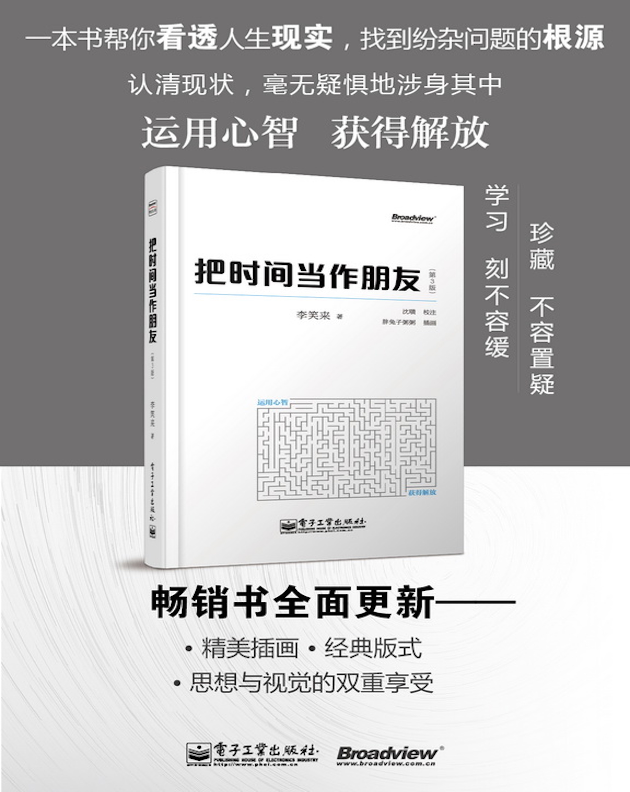

# 把时间当作朋友
##### 版次：第三版
##### 作者：李笑来

## 印刷版购买链接

* [当当网](http://product.dangdang.com/23355941.html)
* [亚马逊](http://www.amazon.cn/把时间当作朋友-李笑来/dp/B00FU3CRZI)
* [京东](http://item.jd.com/11338691.html)

# 阅读说明

## 本书定位——这不是一本什么样的书？

有些时候，有些事物，从反面描述比从正面描述更为容易。如若先仔细说清楚这本书不是什么，之后对“它究竟是什么”这个问题，可能就不言自明了。

### 这本书不是时间管理书籍

尽管本书的内容也包括任务管理等与常见“时间管理技巧”相关的内容，但是，本书主张时间不可管理、一切都靠积累。

更进一步地说，本书主张一个人必须在开启心智、提高思考能力之后，才能够用正确的方法做正确的事情。也只有这样，时间才是朋友，否则，它就是敌人。很多“时间管理技巧”并非无用，但往往由于使用者心智能力低下甚至尚未开启心智，致使那些技巧只能治标，不能治本，甚至既不治标，也不治本。

### 这本书不是成功学书籍

我不赞同大多数所谓成功学书籍里的观点及其论证方式。在本书的第1版中有个专门的章节，叫“小心成功学”，但在这次修订的过程中，因结构调整，已将其内容打散分布到相应的章节。所以，这本书里没有出现“小心成功学”这个标题。虽然如此，但我的观点从未改变：成功从来都不是人人都可以做到的事情，过去不是，现在不是，将来依然不是。基于比较的成功观，是伤人的、害人的。事实上，对年轻人来说，成长比成功更重要，而且，这才是人人都可以做到的事情，才是人人都值得追求的事情。而成长其实只有一条路——积累。

### 这本书不是心灵鸡汤式的书籍

这本书里没有安慰，因为这本书不是写给脆弱的人的——只有脆弱的人才不断需要安慰。现实是残酷的，生活是艰难的，无论什么样的时代，无论对哪一个层次的人，都是如此，对大多数年轻人来说，更是如此。人的理性建立在接受现实的基础上，不能接受现实，一切成长都是虚妄。只有坚强的人才能接受现实，只有接受现实，才有可能开始运用心智作出理性的决定，进而才有可能做时间的朋友（请重点参照“[现实](Chapter2.md)”一章）。

### 这不是一本讲大道理的书

我只不过是一名从业经验丰富的教师而已，并非所谓的“成功人士”。尽管字里行间可能透露出说教的神态，但，相信我，讲大而空的道理是我从很小就憎恨的行为。我只想把一些普遍困境的最佳解决方案用朴素的论述、详尽的说明、直接的方式传递出去。很多道理都非常简单，但却至关重要。现实就是这样，有用的道理往往都是简单的，甚至简单到令大多数人不由自主地忽视的地步。从另一个方面讲，这本书所传递的信息，原本只不过属于常识，可由于种种原因，并没有被真正普及、理解，实在可惜。

### 这不是一本随便翻翻就可以的书

随便翻翻就可以的书，不值得读。如果您拿到本书，只是想随便翻翻，那我还是劝您算了罢，因为那么做没什么意义。这本书里的很多文字，需要读者耐心读到最后再作判断，而非看到只言片语就进入抗拒状态，然后不由自主地断章取义——因为书中有很多观点和结论会与读者的现有看法不同，甚至相对。尽管这本书的第1版得到了非常多的好评，豆瓣上评分长期为[8.7](http://book.douban.com/subject/3609132/)，甚至被列为[中国书刊发行协会2010年度全行业优秀畅销品种](http://www.cnfaxie.org/yxpx/907.htm)，可根据读者的实际反馈来看（尽管负面的很少，但往往更重要）：读不进，进一步因为读不进而产生误解的人很多。如有兴趣，读者可先阅读“[交流](Chapter6.md)”一章。读过之后您就会明白，有效沟通在一些特定的情况下究竟有多难。

## 目录

* [简介](README.md)
* [历次出版前言](Preface.md)
* [序](Forword.md)
* [第0章 困境](Chapter0.md)
* [第1章 醒悟](Chapter1.md)
* [第2章 现实](Chapter2.md)
* [第3章 管理](Chapter3.md)
* [第4章 学习](Chapter4.md)
* [第5章 思考](Chapter5.md)
* [第6章 交流](Chapter6.md)
* [第7章 应用](Chapter7.md)

